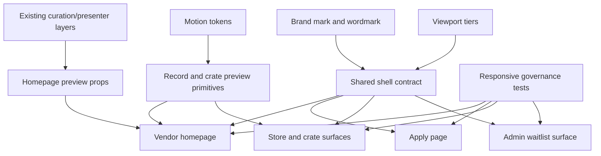
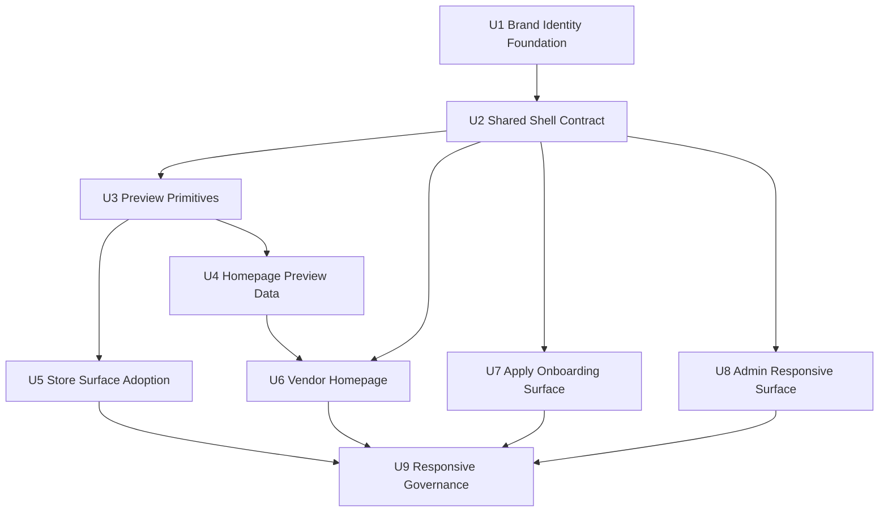

# feat: Unify vendor-facing brand and responsive surfaces

## Summary

Build the next public-facing Milkcrate pass as a system, not a one-off page: replace emoji branding with a real scalable mark, introduce a shared responsive shell and record/crate primitives, then rebuild the vendor homepage, apply page, store surfaces, and admin waitlist around those foundations. The work is phased so each layer can be tested before the next surface depends on it.

---

## Problem Frame

The latest ideation docs point at the same gap from three angles. Milkcrate needs a recognizable non-emoji identity, a vendor-facing page that makes the Discogs-to-storefront transformation tangible, and a responsive layout system that keeps marketing, store browsing, application, crate, and admin surfaces from drifting into separate products.

---

## Assumptions

- "Latest three ideation docs" means the three newest files in `docs/ideation/` by filesystem timestamp on 2026-05-14: logo, vendor-facing marketing page, and unified responsive layout system.
- This plan uses the ideation docs as source inputs even though they are not `docs/brainstorms/*-requirements.md` files.
- The first logo implementation should choose the lowest-risk, highest-confidence direction from the logo ideation: a simple crate-plus-record mark. Later visual iteration can refine the exact SVG geometry.
- The vendor homepage should stay honest about current product capability: early access/application, live demo, and near-zero effort framing are in scope; pricing, testimonials, QR generation, and fully self-serve API onboarding are not.
- Admin should be brought into the responsive design language without requiring a full admin rewrite or auth change in this plan.

---

## Requirements

- R1. Replace emoji-based Milkcrate wordmarks on public React layouts and legacy Rails layout surfaces with a reusable non-emoji brand mark and wordmark.
- R2. Provide brand assets that scale across header, favicon/icon, PWA manifest, social/avatar-like surfaces, and future merch without requiring different conceptual marks.
- R3. Establish a shared responsive composition contract that can be used by marketing, store, crate, apply, and admin surfaces without creating a large generic layout framework.
- R4. Keep the existing `compact`, `comfy`, and `wide` viewport vocabulary as the responsive source of truth; do not add new breakpoints unless implementation proves the current tiers cannot express a surface.
- R5. Promote record/crate display into small composable primitives that can be reused by StoreFloor and marketing proof modules while preserving specialized CrateView/RecordCard behavior where it already works.
- R6. Rebuild the homepage around the vendor promise: existing Discogs inventory becomes a browsable storefront with store character.
- R7. Make a real storefront preview or stable demo-shaped preview the homepage proof point, not decorative placeholder crates.
- R8. Explain seller onboarding as lightweight early access: Discogs username/store details first, Milkcrate handles curation and storefront setup.
- R9. Add a record-fair-oriented conversion section that makes the scanned-card/bag/signage use case concrete without narrowing the whole product to fairs.
- R10. Bring `/apply` into the same frontstage onboarding story and shared shell/form language without changing backend waitlist behavior.
- R11. Bring `/admin` into the shared token and responsive language while preserving existing HTTP Basic auth, request flow, and most-recent-first operational table behavior.
- R12. Preserve existing store browsing behavior, pile behavior, Discogs links, curation data shape, and CrateView history semantics unless a unit explicitly scopes a presentation-only adaptation.
- R13. Add tier-aware tests for every feature-bearing responsive branch introduced by this plan, including compact/comfy/wide rendering where branches differ.
- R14. Keep the plan layered: Rails controllers stay thin, presentation formatting stays in presenters/components, and domain curation logic remains in existing services/models.

---

## Scope Boundaries

- No pricing tables, paid-tier gating, subscription handling, or freemium entitlement logic.
- No testimonial, metrics, analytics dashboard, or conversion-lift claims that are not grounded in current product data.
- No QR code generator, card designer, or merch production workflow.
- No self-serve Discogs API key onboarding; `/apply` remains the entry point for this pass.
- No new curation algorithm or backend record recommendation changes.
- No route-per-breakpoint design and no separate mobile/desktop app.
- No off-the-shelf component library replacement for the existing tactile/motion system.
- No full admin application rewrite; admin keeps its current route and authentication boundary.
- No broad PWA/offline implementation beyond keeping icons/manifest assets aligned with the new brand mark.

### Deferred to Follow-Up Work

- Self-serve Discogs connection flow: plan separately when the API-key onboarding product requirements are defined.
- Pricing and paid-tier marketing: defer until the freemium/paid boundary exists in product and backend terms.
- QR/card/bag asset generator: defer until after the vendor page validates the record-fair acquisition message.
- Inertia admin migration: consider after the ERB admin surface has shared tokens, responsive cards, and current tests.
- Full desktop side-bench crate redesign: treat as a later store-browsing product pass if the shell/primitives work exposes a clean path.

---

## Context & Research

### Relevant Code and Patterns

- `app/frontend/layouts/marketing_layout.tsx` and `app/frontend/layouts/app_layout.tsx` duplicate header, wordmark, theme toggle, skip link, and content-width concerns.
- `app/views/layouts/application.html.erb` and `app/views/admin/waitlists/index.html.erb` still use independent Rails/ERB presentation with emoji branding or inline styling.
- `app/frontend/contexts/viewport_context.tsx`, `app/frontend/hooks/use_viewport.ts`, and `app/frontend/test/viewport-test-utils.tsx` already provide the compact/comfy/wide responsive foundation and test seam.
- `app/frontend/components/storefront_motion_config.tsx`, `app/frontend/lib/motion_tokens.ts`, `app/frontend/hooks/use_tactile_hover.ts`, and `app/frontend/components/tactile_card.tsx` establish the token/provider/hook/component pattern for tactile interactions.
- `app/frontend/components/store_floor.tsx`, `app/frontend/components/featured_crates_row.tsx`, `app/frontend/components/genre_grid.tsx`, `app/frontend/components/crate_card.tsx`, and `app/frontend/components/record_card.tsx` are the current product browsing primitives. The plan should extract only the shared cover/crate preview pieces needed for reuse, not flatten these specialized components into one mega-component.
- `app/frontend/pages/home.tsx` currently uses local decorative crate thumbnails and generic buyer-facing copy.
- `app/frontend/pages/apply.tsx` already has the waitlist form, Turnstile handling, errors, and confirmation state, but no vendor journey context.
- `app/controllers/pages_controller.rb`, `app/controllers/stores_controller.rb`, `app/presenters/crate_presenter.rb`, and `app/services/storefront_curation.rb` provide the right Rails layer seams for a homepage demo preview.
- `spec/requests/pages_spec.rb`, `spec/requests/admin/waitlists_spec.rb`, and existing Vitest page/component tests are the right test homes for request props, admin markup, and frontend behavior.

### Institutional Learnings

- `docs/solutions/architecture-patterns/viewport-context-responsive-architecture-2026-05-09.md` establishes the viewport provider/test-helper pattern and warns that responsive refactors must audit every tier branch.
- `docs/solutions/logic-errors/responsive-branching-guard-condition-drift-2026-05-13.md` documents a real bug class where responsive branch refactors dropped guard conditions. This plan carries guard-parity tests into each tiered unit.
- `docs/solutions/architecture-patterns/storefront-animation-token-system-2026-05-08.md` establishes that tactile interaction values should come from tokens and shared wrappers, not local inline animation values.
- `docs/solutions/architecture-patterns/crate-strategies-pattern-2026-05-07.md` confirms that curation belongs in existing strategy/service layers. This plan should not make homepage marketing changes by changing selection logic.

### External References

- External responsive and market-positioning references are already summarized in the source ideation docs. No additional external developer documentation is needed for this plan because the implementation should follow existing local Rails, Inertia, React, viewport, and Framer Motion patterns.

---

## Key Technical Decisions

| Decision | Rationale |
|---|---|
| Start with brand mark and shell foundations before homepage rebuild | The homepage, apply page, admin, and store header all need the same non-emoji identity and layout vocabulary. Doing the page first would bake old duplication into the new marketing surface. |
| Implement one reusable brand mark component and update static assets from the same concept | The logo ideation prioritizes scalability. A component-only logo would leave favicon/manifest/social surfaces behind; static-only assets would leave React/ERB wordmarks duplicated. |
| Choose the crate-plus-record logo direction for v1 | The "Crate-Sun Record" direction best satisfies concept fusion, small-size legibility, and implementation fit. More subtle directions can be explored after there is a working non-emoji baseline. |
| Add a thin shell contract, not a mega layout component | The unified responsive ideation explicitly rejects a giant `ResponsiveLayout`. The useful abstraction is shared regions and tokens; each surface still owns its content. |
| Keep admin ERB for this pass | Admin is part of the surface-area drift, but moving it to Inertia would turn a design-system pass into an admin rewrite. Tokenized ERB plus responsive cards solves the current drift with lower risk. |
| Use real demo-store data when available, with stable fallback preview data | A live proof module is strongest when it can reflect the demo store, but homepage rendering must not depend on a synced local database in every environment. |
| Introduce cover/crate preview primitives below StoreFloor rather than replacing StoreFloor | Marketing needs product-real visuals. StoreFloor already owns product browsing behavior. A small shared preview layer lets both use the same visual language without coupling marketing to all interactive store behavior. |
| Preserve existing curation and CrateView contracts | The ideation asks for surface cohesion, not new recommendation behavior or route semantics. Changes should be presentation and serialization only unless a unit states otherwise. |
| Put tier and guard coverage next to each changed surface | Responsive drift is an existing known failure mode. Each unit that branches by tier must add tests for the branch and for the guard conditions that protect it. |

---

## Open Questions

### Resolved During Planning

- Which logo direction should v1 implement? Use crate-plus-record as the first non-emoji brand mark because it is the highest-confidence, lowest-complexity direction in the latest logo ideation.
- Should the homepage depend directly on `/philadelphiamusic` route data? No. It should use a bounded homepage preview prop, sourced from demo-store data when available and from typed fallback data otherwise.
- Should admin move to React/Inertia now? No. Preserve the current admin route/auth boundary and make the ERB surface responsive/tokenized first.
- Should this include full desktop side-bench crate browsing? No. The plan lays the shell and primitive groundwork, then limits active store changes to parity and shared presentation. A larger desktop browsing redesign should be a follow-up product pass.

### Deferred to Implementation

- Exact SVG geometry and proportions for the crate-plus-record mark: implement the first pass and verify at header and favicon sizes before tuning.
- Exact homepage copy strings: keep the structure and message from the plan, but finalize strings while updating `config/locales/en.yml`.
- Final demo preview fallback data: choose representative crate names/records during implementation, keeping the shape compatible with `StorefrontSection`.
- Whether homepage preview data should be cached: defer until implementation measures the cost of sourcing from the demo store in development/test/production contexts.

---

## High-Level Technical Design

> *This illustrates the intended approach and is directional guidance for review, not implementation specification. The implementing agent should treat it as context, not code to reproduce.*



---

## Implementation Units



### U1. Brand Identity Foundation

**Goal:** Replace emoji-based Milkcrate identity with a scalable crate-plus-record mark, reusable React/ERB wordmark surfaces, and aligned favicon/manifest assets.

**Requirements:** R1, R2

**Dependencies:** None

**Files:**
- Create: `app/frontend/components/brand_mark.tsx`
- Create: `app/frontend/components/brand_mark.test.tsx`
- Modify: `app/frontend/layouts/marketing_layout.tsx`
- Modify: `app/frontend/layouts/app_layout.tsx`
- Modify: `app/views/layouts/application.html.erb`
- Modify: `app/views/layouts/inertia_application.html.erb`
- Modify: `public/icon.svg`
- Modify: `public/icon.png`
- Modify: `public/manifest.json`
- Test: `app/frontend/test/pages/page_smoke.test.tsx`
- Test: `spec/requests/pages_spec.rb`

**Approach:**
- Implement a reusable React brand mark/wordmark component based on a simple crate-plus-record silhouette, using existing design tokens for warm dark/light palettes.
- Replace emoji wordmark usages in React layouts and the legacy Rails layout with the non-emoji mark plus text treatment.
- Update static icon assets and manifest metadata so the browser, PWA, and favicon surfaces no longer point at the current placeholder icon.
- Keep the mark simple enough for small-size recognition; avoid adding multiple alternate brand concepts in this unit.

**Execution note:** Implement this unit test-first around rendered text/accessible names and asset references, because later layout units will depend on the brand component being stable.

**Patterns to follow:**
- `app/frontend/layouts/marketing_layout.tsx` and `app/frontend/layouts/app_layout.tsx` for existing header/focus treatment.
- `app/assets/tailwind/application.css` for brand tokens.
- `public/manifest.json` for current PWA metadata.

**Test scenarios:**
- Happy path: rendering `BrandMark` with default props exposes an accessible brand name and no emoji glyphs in the output.
- Happy path: `MarketingLayout` header links home and renders the new brand mark/wordmark.
- Happy path: `AppLayout` renders store-specific header text when store props exist and renders the new Milkcrate brand mark when they do not.
- Edge case: compact AppLayout still shows a shortened store attribution without reintroducing emoji branding.
- Integration: `GET /` and `GET /apply` include the same icon/manifest references expected by the updated inertia layout.
- Regression: frontend page smoke tests do not find the old milk emoji wordmark in rendered public layouts.

**Verification:**
- Public headers, footer attribution, favicon, and manifest assets all use one non-emoji brand concept.
- Existing layout focus, skip-link, theme toggle, and store attribution behavior remain intact.

---

### U2. Shared Responsive Shell Contract

**Goal:** Define a thin shell contract that unifies skip link, header, content width, footer/attribution, theme toggle, and surface regions across marketing and app layouts without hiding each surface's content decisions.

**Requirements:** R3, R4, R12, R14

**Dependencies:** U1

**Files:**
- Create: `app/frontend/layouts/milkcrate_shell.tsx`
- Create: `app/frontend/layouts/milkcrate_shell.test.tsx`
- Modify: `app/frontend/layouts/marketing_layout.tsx`
- Modify: `app/frontend/layouts/app_layout.tsx`
- Modify: `app/frontend/test/pages/page_smoke.test.tsx`
- Test: `app/frontend/components/accessibility.test.tsx`

**Approach:**
- Extract shared shell responsibilities into a small compositional layout component with named regions for brand/header actions, main content, optional footer, and surface-specific max width.
- Keep `MarketingLayout` and `AppLayout` as semantic wrappers over the shared shell so existing page imports do not need a broad rename.
- Preserve provider ordering in `AppLayout`: motion config, viewport provider, and pile provider remain available to store surfaces that need them.
- Let each surface choose its layout density/content width through props or slots; avoid a single generic component that decides all responsive behavior.
- Ensure shell behavior is tier-aware through existing `useViewport`, not new breakpoint logic.

**Patterns to follow:**
- `app/frontend/contexts/viewport_context.tsx` for provider/hook shape.
- `app/frontend/test/viewport-test-utils.tsx` for tier tests.
- Existing skip-link/focus ring classes in both layouts.

**Test scenarios:**
- Happy path: `MarketingLayout` and `AppLayout` both render children inside the shared shell without changing page-level content.
- Happy path: compact, comfy, and wide tier renders preserve header actions and content containers without throwing missing-provider errors.
- Integration: AppLayout with store props still renders Discogs link, pile button behavior, theme toggle, and pile sheet as before.
- Edge case: AppLayout without store props renders the Milkcrate brand path and no Discogs store link.
- Accessibility: the skip link targets `#main-content` exactly once and remains keyboard focusable.
- Regression: provider-dependent children using `useViewport` and `usePileContext` still render inside AppLayout.

**Verification:**
- Layout duplication is reduced without changing public routes.
- Marketing and app pages share brand/header behavior while preserving store-specific affordances.

---

### U3. Container-Aware Record and Crate Preview Primitives

**Goal:** Create small shared visual primitives for record covers, crate shelves/rails, and storefront preview slices that can be used by both product browsing and marketing proof modules.

**Requirements:** R5, R7, R12, R13

**Dependencies:** U2

**Files:**
- Create: `app/frontend/components/record_tile.tsx`
- Create: `app/frontend/components/record_tile.test.tsx`
- Create: `app/frontend/components/crate_shelf.tsx`
- Create: `app/frontend/components/crate_shelf.test.tsx`
- Create: `app/frontend/components/storefront_preview.tsx`
- Create: `app/frontend/components/storefront_preview.test.tsx`
- Modify: `app/frontend/components/store_floor.tsx`
- Modify: `app/frontend/components/featured_crates_row.tsx`
- Modify: `app/frontend/components/genre_grid.tsx`
- Test: `app/frontend/components/storefront_shell.test.tsx`

**Approach:**
- Extract the reusable cover/placeholder/tile concern below `RecordCard`. `RecordCard` remains the flip/detail component for CrateView and pile interactions.
- Introduce crate shelf/preview components that accept existing `Crate` and `Listing` shapes from `app/frontend/types/inertia.ts`.
- Keep action slots explicit: product surfaces can pass click/select behavior, while marketing preview can render links or non-interactive proof modules.
- Use existing motion tokens and `TactileCard` where interaction is real; avoid hover-only animation on non-interactive proof elements.
- Replace local decorative homepage-only crate thumbnail concepts with primitives that can also back product surfaces.

**Execution note:** Add primitive tests before replacing StoreFloor internals so product behavior regressions are isolated from extraction mistakes.

**Patterns to follow:**
- `app/frontend/components/tactile_card.tsx` for reusable tactile wrappers.
- `app/frontend/components/record_card.tsx` for image fallback and accessible cover behavior.
- `app/frontend/components/store_floor.tsx` for current section ordering and crate selection callbacks.

**Test scenarios:**
- Happy path: `RecordTile` renders cover art when `cover_image_url` exists and falls back to the record placeholder when no image exists.
- Edge case: `RecordTile` handles null title/artist without rendering broken accessible names.
- Happy path: interactive `CrateShelf` invokes the supplied crate-selection callback with slug and optional record index.
- Happy path: non-interactive `CrateShelf` renders the same visual record grid without button roles.
- Integration: StoreFloor still opens Milkcrate Picks, featured crates, and genre crates with the same callback arguments after adopting preview primitives.
- Compact/comfy/wide: preview primitives maintain stable aspect ratios and do not introduce horizontal overflow at compact width.
- Accessibility: interactive wrappers do not nest buttons around links or other buttons.

**Verification:**
- StoreFloor uses shared preview primitives for visual crate/record surfaces without changing curation data or CrateView behavior.
- The marketing homepage can use the same primitive family without importing StoreFloor's full interaction model.

---

### U4. Homepage Storefront Preview Data

**Goal:** Give the vendor homepage a stable proof module data source that can use real demo-store data when present and typed fallback data when not.

**Requirements:** R6, R7, R12, R14

**Dependencies:** U3

**Files:**
- Create: `app/presenters/marketing_preview_presenter.rb`
- Create: `spec/presenters/marketing_preview_presenter_spec.rb`
- Modify: `app/controllers/pages_controller.rb`
- Modify: `spec/requests/pages_spec.rb`
- Modify: `app/frontend/types/inertia.ts`
- Test: `app/frontend/test/pages/page_smoke.test.tsx`

**Approach:**
- Add a presentation-layer object that produces a bounded homepage preview shape from the existing demo store when available.
- Reuse `StorefrontCuration` and `CratePresenter` rather than adding new curation logic or duplicating listing serialization.
- Cap homepage preview data to what the homepage needs so it does not become a full hidden store page payload.
- Provide typed fallback preview data for development/test/empty-store environments so the marketing page remains stable.
- Keep `PagesController#home` thin: it should assemble copy plus preview props, not calculate crate contents inline.

**Patterns to follow:**
- `app/presenters/crate_presenter.rb` for Rails presentation serialization.
- `app/controllers/stores_controller.rb` for existing curation/presenter composition.
- `spec/presenters/crate_presenter_spec.rb` and `spec/requests/pages_spec.rb` for request/presenter test style.

**Test scenarios:**
- Happy path: when the configured demo store exists with eligible listings, the presenter returns a preview store name and bounded sections shaped for the frontend.
- Edge case: when no demo store exists, the presenter returns fallback preview props instead of raising.
- Edge case: when the demo store has no viable crates, the presenter returns fallback preview props or an empty proof state with a live-demo CTA.
- Integration: `GET /` includes homepage preview props and continues rendering the `home` Inertia page.
- Regression: homepage preview generation does not change store page curation props or `StoresController#featured`.

**Verification:**
- The homepage has a reliable proof data path in all environments.
- Backend curation and presenter responsibilities stay in their current layers.

---

### U5. Store Surface Adoption of Shared Primitives

**Goal:** Adopt the shared record/crate preview primitives in the live store floor where they reduce duplication, while preserving store browsing, crate navigation, pile, and history behavior.

**Requirements:** R3, R4, R5, R12, R13

**Dependencies:** U3

**Files:**
- Modify: `app/frontend/components/store_floor.tsx`
- Modify: `app/frontend/components/featured_crates_row.tsx`
- Modify: `app/frontend/components/genre_grid.tsx`
- Modify: `app/frontend/components/crate_card.tsx`
- Modify: `app/frontend/pages/stores/featured.tsx`
- Test: `app/frontend/components/storefront_shell.test.tsx`
- Test: `app/frontend/test/pages/page_smoke.test.tsx`
- Test: `app/frontend/components/crate_view.test.tsx`

**Approach:**
- Replace duplicated cover-grid and placeholder rendering with shared preview primitives where the behavior is equivalent.
- Keep `CrateCard` and `RecordCard` specialized where they provide richer product interactions such as coordinated crate hover or record flip.
- Ensure store entry/exit, `activeSlug`, `startIndex`, `history.pushState`, `history.replaceState`, and `popstate` semantics remain unchanged.
- Audit tier branches for guard parity after any responsive refactor, especially empty crates and hidden tabs.
- Avoid expanding into a full desktop side-bench redesign in this unit; the goal is shared visual language and safer primitives.

**Patterns to follow:**
- Existing `Featured` page state handling in `app/frontend/pages/stores/featured.tsx`.
- Guard-parity checklist from `docs/solutions/logic-errors/responsive-branching-guard-condition-drift-2026-05-13.md`.
- Existing compact/wide tests in `app/frontend/components/crate_view.test.tsx`.

**Test scenarios:**
- Happy path: clicking picks header still opens the picks crate without a start index.
- Happy path: clicking a record preview in picks still opens picks at the selected record index.
- Happy path: featured and genre crates still call `onSelectCrate` with the expected slug and record index behavior.
- Compact/comfy/wide: StoreFloor renders picks, featured crates, and genre grid without horizontal overflow or missing section labels.
- Edge case: empty picks, no featured crates, and empty genre grids preserve current "do not render empty section" behavior.
- Integration: entering a crate still hides store description, and browser back returns to the store floor.
- Regression: CrateView hidden-tab and empty-crate branch tests remain green after any shared primitive adoption.

**Verification:**
- Live store surfaces look and behave consistently with the new shared visual primitive family.
- No backend payload, curation order, route, or browser-history contract changes.

---

### U6. Vendor-Facing Homepage Rebuild

**Goal:** Rebuild `/` around the vendor outcome: a Discogs inventory becomes a warm, browsable storefront that a record-fair vendor can share immediately.

**Requirements:** R6, R7, R8, R9, R13

**Dependencies:** U1, U2, U3, U4

**Files:**
- Modify: `app/frontend/pages/home.tsx`
- Modify: `app/frontend/test/pages/page_smoke.test.tsx`
- Create: `app/frontend/test/pages/home.test.tsx`
- Modify: `config/locales/en.yml`
- Modify: `spec/requests/pages_spec.rb`

**Approach:**
- Replace the emoji-first buyer-oriented hero with a vendor-first hero that states the transformation from existing Discogs inventory to a storefront.
- Replace decorative crate thumbnails with `StorefrontPreview` using homepage preview props from U4.
- Add compact onboarding steps: connect/share Discogs identity, Milkcrate syncs/curates, vendor shares a Milkcrate URL.
- Add a store-character section that uses actual product concepts: picks, featured crates, genre bins, pile/digging.
- Add a record-fair callout near the primary CTA, framed as one concrete use case among broader storefront sharing.
- Keep CTAs honest: live demo and early storefront/application. Avoid unsupported "claim instantly" or pricing claims until the backend supports them.
- Use existing motion tokens for subtle section entrances and respect reduced-motion behavior.

**Execution note:** Start with page tests around headings, CTAs, preview rendering, and no emoji-branding regression before tuning visual layout.

**Patterns to follow:**
- Source direction from `docs/ideation/2026-05-14-vendor-facing-marketing-page-ideation.md`.
- Shared shell from U2 and preview primitives from U3.
- Existing Inertia copy prop pattern in `app/controllers/pages_controller.rb` and `config/locales/en.yml`.

**Test scenarios:**
- Happy path: homepage renders a vendor-first H1 and primary CTA to the apply flow.
- Happy path: homepage renders a live/demo storefront preview using preview props and includes a link to `/philadelphiamusic`.
- Happy path: onboarding section communicates the three-step early access path without implying self-serve completion.
- Happy path: record-fair callout appears near the final CTA and links back to the application path.
- Edge case: fallback preview props render when no demo store exists.
- Compact/comfy/wide: homepage hero, preview, onboarding, and CTA sections render without overlapping text or horizontal overflow.
- Regression: homepage no longer renders decorative emoji feature icons as the main explanatory system.
- Accessibility: all CTA links have discernible text, sections have meaningful headings, and focus order follows visual order.

**Verification:**
- `/` sells the vendor outcome before the buyer browsing mechanics.
- The page shows product-real proof rather than a generic SaaS dashboard or decorative thumbnails.

---

### U7. Apply Page as Frontstage Onboarding

**Goal:** Bring `/apply` into the same vendor story and shell system while preserving waitlist submission, Turnstile, validation errors, and confirmation behavior.

**Requirements:** R8, R10, R13

**Dependencies:** U2, U6

**Files:**
- Modify: `app/frontend/pages/apply.tsx`
- Modify: `app/frontend/test/pages/apply.test.tsx`
- Modify: `app/frontend/test/pages/page_smoke.test.tsx`
- Modify: `config/locales/en.yml`
- Test: `spec/requests/pages_spec.rb`
- Test: `spec/requests/waitlists_spec.rb`

**Approach:**
- Add a compact vendor-context panel around the existing form: what the seller is asking for, why Discogs username matters, and what happens next.
- Reuse shared shell and brand surfaces from U2.
- Keep the form fields, `useForm` shape, Turnstile script handling, backend endpoint, and error rendering intact.
- Improve mobile ergonomics only where the current form proves cramped: field spacing, submit affordance, confirmation state, and Turnstile containment.
- Keep copy aligned with "early storefront" and "we handle setup" without implying immediate automated provisioning.

**Patterns to follow:**
- Current `Apply` component Turnstile handling and error summary.
- Existing request specs for Turnstile config and waitlist submission.
- Shared shell and form token classes from `app/assets/tailwind/application.css`.

**Test scenarios:**
- Happy path: apply page renders vendor-context text plus all existing form fields.
- Happy path: submitting the form still posts to `/waitlist` through the existing Inertia form path.
- Happy path: submitted confirmation state renders new brand treatment and confirmation copy.
- Error path: validation errors still render summary and field-level messages.
- Error path: Turnstile failure still renders the configured Turnstile error.
- Compact/comfy/wide: form, context panel, and Turnstile widget fit without horizontal overflow.
- Regression: no field names, request params, or backend waitlist behavior change.

**Verification:**
- `/apply` feels like the continuation of the vendor homepage rather than an isolated form.
- All current waitlist and Turnstile coverage remains valid.

---

### U8. Admin Waitlist Responsive Surface

**Goal:** Bring `/admin` into Milkcrate's tokenized responsive language while preserving its operational table, ordering, empty state, and HTTP Basic auth boundary.

**Requirements:** R3, R11, R13

**Dependencies:** U1, U2

**Files:**
- Modify: `app/views/admin/waitlists/index.html.erb`
- Modify: `spec/requests/admin/waitlists_spec.rb`
- Modify: `app/assets/tailwind/application.css`

**Approach:**
- Replace inline hard-coded dark styles with shared Milkcrate CSS tokens where possible.
- Keep the desktop table as the dense operational view.
- Add a compact stacked-card presentation for waitlist entries using the same data and ordering as the table.
- Include the new brand mark/wordmark concept in a restrained admin header without pulling the whole admin route into Inertia.
- Preserve current auth handling and request specs; this is presentation only.

**Patterns to follow:**
- Existing admin request specs for auth, ordering, field rendering, and empty state.
- Token variables in `app/assets/tailwind/application.css`.
- Layered Rails rule: no new business logic in the view beyond presentation of existing `@waitlists`.

**Test scenarios:**
- Happy path: authenticated admin response still includes all fields for each waitlist entry.
- Happy path: entries remain ordered most recent first in both table and compact card markup.
- Edge case: empty state still renders when there are no applications.
- Security regression: unauthenticated and wrong-credential requests still return unauthorized.
- Responsive markup: response contains compact-card structure and desktop table structure without duplicating or dropping data fields.
- Regression: admin view includes shared token references and no longer depends on the prior fully inline color palette.

**Verification:**
- `/admin` no longer feels like an unrelated app surface.
- Operational behavior and security boundary remain unchanged.

---

### U9. Responsive Governance and Cross-Surface Verification

**Goal:** Add enough test and review guardrails that future work cannot easily reintroduce emoji branding, one-off responsive branches, or surface drift.

**Requirements:** R1, R3, R4, R13

**Dependencies:** U5, U6, U7, U8

**Files:**
- Modify: `app/frontend/components/accessibility.test.tsx`
- Modify: `app/frontend/test/pages/page_smoke.test.tsx`
- Create: `app/frontend/test/pages/responsive_surface_matrix.test.tsx`
- Modify: `docs/solutions/architecture-patterns/viewport-context-responsive-architecture-2026-05-09.md`
- Create: `docs/solutions/architecture-patterns/vendor-brand-responsive-surface-system-2026-05-14.md`

**Approach:**
- Add a compact/comfy/wide smoke matrix for home, apply, and store surfaces using existing `renderWithTier`.
- Add targeted assertions that the public React layouts do not render emoji wordmarks.
- Add high-signal accessibility checks for shell landmarks, focusable CTAs, and non-nested interactive wrappers on shared primitives.
- Document the new brand/shell/primitive pattern under `docs/solutions/architecture-patterns/` so future work extends the system instead of copying local page code.
- Keep governance focused on behavior and structure rather than brittle visual snapshots.

**Execution note:** This unit should be the final gate, but individual units should still add their own focused tests before it.

**Patterns to follow:**
- Existing `renderWithTier` test helper.
- Existing solution-doc frontmatter conventions under `docs/solutions/`.
- Responsive guard-condition learning from `docs/solutions/logic-errors/responsive-branching-guard-condition-drift-2026-05-13.md`.

**Test scenarios:**
- Happy path: home, apply, and store page smoke tests render in compact, comfy, and wide tiers.
- Regression: public React layouts do not render the old Milkcrate emoji wordmark.
- Regression: shared preview primitives do not create nested interactive controls.
- Accessibility: each public page render has one main landmark and a working skip-link target.
- Edge case: store page with empty crates still renders correctly in each tier.
- Documentation: solution doc frontmatter includes `module`, `tags`, and `problem_type` fields matching repository conventions.

**Verification:**
- Cross-surface responsive behavior has a reusable test matrix.
- Future implementers have a documented pattern for extending the brand/shell/primitive system.

---

## System-Wide Impact

- **Interaction graph:** `MarketingLayout`, `AppLayout`, StoreFloor, homepage, apply page, and admin all become consumers of shared brand/shell decisions. Store interactions continue flowing through existing `Featured` state and curation props.
- **Layer boundaries:** Homepage preview data is assembled in presentation/controller-facing layers and reuses existing curation services. Domain curation and scoring remain unchanged.
- **Error propagation:** Homepage preview sourcing must fail soft into fallback preview data; it should not make `/` error because demo data is absent or unsynced.
- **State lifecycle risks:** Store page `activeSlug`, `startIndex`, pile state, theme state, and CrateView history behavior must remain unchanged through visual primitive adoption.
- **API surface parity:** Inertia props for existing store pages should not be renamed. Any new homepage preview prop should be additive to `Home` only.
- **Security boundary:** Admin auth must remain request-level HTTP Basic; no public route should expose waitlist data.
- **Performance:** Homepage live preview data must be bounded so the marketing page does not ship a full store payload or expensive unbounded curation result.
- **Accessibility:** Replacing emoji and adding preview interactions must preserve accessible names, focus states, non-nested interactive elements, and reduced-motion behavior.
- **Unchanged invariants:** Discogs links, waitlist params, Turnstile verification, curation ordering, pile behavior, theme toggle behavior, and public route paths stay stable.

```mermaid
flowchart TB
  Home[/ route] --> Preview[bounded preview props]
  Preview --> Presenter[marketing preview presenter]
  Presenter --> ExistingCuration[existing StorefrontCuration and CratePresenter]
  Store[/:discogs_username route] --> ExistingCuration
  Apply[/apply route] --> Waitlist[/waitlist create]
  Admin[/admin route] --> BasicAuth[HTTP Basic auth]
  BasicAuth --> WaitlistData[waitlist entries]
```

---

## Risks & Dependencies

| Risk | Mitigation |
|---|---|
| Brand mark lands but looks weak at favicon size | Keep v1 geometry simple, test header/favicon/manifest surfaces, and leave visual refinement as follow-up rather than blocking the structural pass. |
| Shared shell becomes too generic and hard to reason about | Keep shell limited to regions and layout chrome. Leave page-specific content and behavior in page components. |
| Homepage live preview causes slow or fragile root rendering | Bound preview data, soft-fallback when no demo store exists, and keep curation reuse behind a presenter. |
| Primitive extraction regresses StoreFloor selection behavior | Add callback argument tests before and after extraction; keep `RecordCard`/`CrateCard` specialized where behavior is not shared. |
| Responsive branch refactor drops a guard condition | Add compact/comfy/wide tests and explicit empty/hidden-section cases for changed components. |
| Vendor copy overpromises current onboarding | Keep "early access" and "apply" framing until self-serve onboarding exists. |
| Admin tokenization accidentally weakens auth or data ordering | Keep auth and ordering request specs unchanged and modify only presentation markup/styles. |
| Tests become visual snapshots that are too brittle | Assert structural behavior, accessibility, branch presence, and absence of regressions rather than exact pixels. |

---

## Alternative Approaches Considered

- Homepage-only rebuild first: rejected because it would preserve emoji branding, duplicated headers, and decorative preview code that the responsive system then has to undo.
- Full responsive framework upfront: rejected because it would become the "mega ResponsiveLayout" explicitly rejected by the ideation doc.
- Inertia admin rewrite now: rejected because it expands a surface-cohesion pass into an admin architecture migration.
- Static-only marketing preview: rejected as the only path because it undercuts the "live proof" point. Static fallback remains necessary for stability.
- Full desktop side-bench browsing in this pass: deferred because it is a larger product interaction decision, while the current ask is to lay groundwork and cover surface cohesion.

---

## Success Metrics

- Public Milkcrate headers and static browser assets no longer rely on emoji or placeholder iconography.
- Homepage first viewport communicates the vendor outcome and shows product-real storefront proof.
- Home, apply, store, crate, and admin surfaces share brand tokens and responsive vocabulary.
- StoreFloor selection behavior, CrateView history behavior, waitlist submission, and admin auth all remain unchanged.
- Compact/comfy/wide test coverage exists for the responsive surfaces changed by this plan.
- Future frontend work has a documented brand/shell/primitive pattern to follow.

---

## Phased Delivery

### Phase 1: Brand and Shell Groundwork

- U1 establishes the non-emoji brand asset and wordmark.
- U2 introduces the shared shell contract after the brand component exists.

### Phase 2: Shared Product-Real Primitives

- U3 extracts the reusable record/crate preview layer.
- U5 adopts the primitives in live store surfaces where behavior is equivalent.

### Phase 3: Vendor Marketing Proof

- U4 adds bounded homepage preview data.
- U6 rebuilds the homepage around vendor transformation, live proof, onboarding, and record-fair conversion.

### Phase 4: Onboarding and Operations Surfaces

- U7 brings `/apply` into the same frontstage story.
- U8 tokenizes and responsively adapts `/admin` without changing auth or workflow.

### Phase 5: Governance and Documentation

- U9 adds the cross-surface responsive matrix and solution documentation after the surfaces have landed.

---

## Documentation Plan

- Add `docs/solutions/architecture-patterns/vendor-brand-responsive-surface-system-2026-05-14.md` after implementation to capture the new brand/shell/primitive pattern and when to use it.
- Update `docs/solutions/architecture-patterns/viewport-context-responsive-architecture-2026-05-09.md` with any new testing conventions from the cross-surface matrix.
- Do not update user-facing docs until the vendor homepage copy and visual direction have shipped; README changes can follow if the public positioning materially changes.

---

## Operational / Rollout Notes

- This can ship as a normal frontend/presentation change with no database migration.
- The homepage preview must tolerate absent demo-store data before production rollout.
- Static icon updates should be checked in alongside the brand component so favicon/manifest references never point at a missing asset.
- Because the homepage is public acquisition surface, perform browser verification at compact phone, tablet/comfy, and wide desktop widths after implementation.
- Admin changes should be verified with and without waitlist entries under the existing HTTP Basic auth.

---

## Sources & References

- Source ideation: `docs/ideation/2026-05-14-milkcrate-logo-ideation.md`
- Source ideation: `docs/ideation/2026-05-14-vendor-facing-marketing-page-ideation.md`
- Source ideation: `docs/ideation/2026-05-14-unified-responsive-layout-system-ideation.md`
- Product strategy: `STRATEGY.md`
- Design direction: `DESIGN.md`
- Existing responsive learning: `docs/solutions/architecture-patterns/viewport-context-responsive-architecture-2026-05-09.md`
- Existing motion-token learning: `docs/solutions/architecture-patterns/storefront-animation-token-system-2026-05-08.md`
- Existing responsive bug learning: `docs/solutions/logic-errors/responsive-branching-guard-condition-drift-2026-05-13.md`
- Existing curation pattern: `docs/solutions/architecture-patterns/crate-strategies-pattern-2026-05-07.md`
- Related frontend code: `app/frontend/layouts/marketing_layout.tsx`, `app/frontend/layouts/app_layout.tsx`, `app/frontend/pages/home.tsx`, `app/frontend/pages/apply.tsx`, `app/frontend/pages/stores/featured.tsx`, `app/frontend/components/store_floor.tsx`, `app/frontend/components/crate_view.tsx`
- Related Rails code: `app/controllers/pages_controller.rb`, `app/controllers/stores_controller.rb`, `app/presenters/crate_presenter.rb`, `app/services/storefront_curation.rb`, `app/views/admin/waitlists/index.html.erb`
