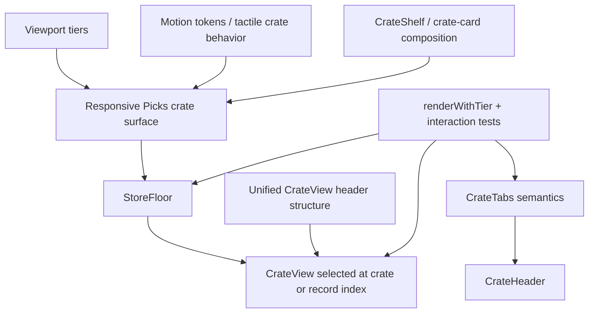

# feat: Polish Picks crate surface and CrateView header

## Summary

Replace the split Milkcrate Picks presentation with a responsive crate/shelf surface that avoids the compact horizontal carousel and softens the desktop wall. Promote the stronger compact CrateView header structure across viewport tiers, while reusing the existing viewport, motion-token, and crate composition patterns instead of adding a broad new layout framework.

---

## Problem Frame

Milkcrate's strategy depends on online browsing feeling like a record shop, but the current Picks section breaks that metaphor: compact view is a hidden-scroll horizontal row, while desktop is a rigid cover wall. CrateView has the opposite problem: the compact header already communicates crate identity well, but desktop still uses a separate toolbar that feels more like generic UI chrome than a crate-browsing surface.

---

## Requirements

- R1. Compact Milkcrate Picks no longer renders as a horizontal scrolling carousel/strip.
- R2. Milkcrate Picks renders as a bounded crate-like surface with title, count/date context, record preview, and a clear way to open the full Picks crate.
- R3. Desktop/wide Picks remains visually abundant but avoids a uniform wall/contact-sheet treatment.
- R4. Picks record preview interactions open CrateView at the selected record index, preserving current navigation behavior.
- R5. Picks surface behavior uses existing viewport tiers (`compact`, `comfy`, `wide`) rather than adding new breakpoint logic.
- R6. Picks tactile behavior reuses existing motion tokens/primitives and avoids hover-only affordances as the only cue on touch devices.
- R7. CrateView uses one shared header structure across viewport tiers: back control when available, active crate name, record count, and tabs when not hidden.
- R8. CrateView preserves existing tab selection, keyboard navigation, back behavior, empty state behavior, record stack, desktop details panel, and `hideTabs` contract.
- R9. The implementation keeps scope local to frontend presentation; no backend, presenter, curation, routing, pile, or Discogs-link behavior changes.
- R10. Responsive branch changes include guard-condition coverage for compact and wide paths.

---

## Scope Boundaries

- No backend, curation, presenter, Inertia prop, or route changes.
- No new recommendation logic, record metadata captions, or personalized Picks behavior.
- No cover-flow, 3D carousel, auto-scrolling attract mode, or haptic feedback.
- No full masonry system or broad storefront redesign.
- No CrateView detail-tray, bottom-sheet crate switcher, or RecordCard redesign.
- No new responsive breakpoint vocabulary beyond the existing viewport tiers.

### Deferred to Follow-Up Work

- Full desktop storefront composition pass: if the simplified Picks shelf still feels too flat, plan a broader store-floor visual hierarchy pass separately.
- Crate switcher redesign: if the unified CrateView tabs still dominate on compact screens, revisit a sheet/switcher pattern separately.
- Shared `CrateHeader` extraction: create only if implementation naturally repeats the same header API in multiple components after this pass; do not force it up front.

---

## Context & Research

### Relevant Code and Patterns

- `app/frontend/components/store_floor.tsx` owns the current Picks special case: desktop grid branch and compact horizontal strip branch.
- `app/frontend/components/crate_shelf.tsx` is the closest existing crate-like composition primitive: title/count header, bounded card surface, and record thumbnail grid.
- `app/frontend/components/crate_card.tsx` contains the strongest existing crate-container motion language: lid lift, grouped thumbnail scale, press feedback, and `DIG ->` affordance.
- `app/frontend/components/crate_view.tsx` already contains both the preferred compact header and the weaker desktop toolbar; this plan unifies those paths instead of changing record-stack mechanics.
- `app/frontend/components/crate_tabs.tsx` owns tab semantics, selected-state behavior, scrolling active tab into view, and keyboard left/right navigation.
- `app/frontend/test/viewport-test-utils.tsx` provides `renderWithTier` for tier-specific component coverage.
- `app/frontend/components/storefront_shell.test.tsx`, `app/frontend/components/crate_shelf.test.tsx`, `app/frontend/components/crate_view.test.tsx`, and `app/frontend/components/crate_tabs.test.tsx` already cover nearby interaction and responsive behavior.

### Institutional Learnings

- `docs/solutions/architecture-patterns/viewport-context-responsive-architecture-2026-05-09.md` establishes viewport tiers and `renderWithTier` as the right responsive testing pattern.
- `docs/solutions/architecture-patterns/storefront-animation-token-system-2026-05-08.md` establishes motion tokens, `TactileCard`, and direct `useTactileHover` usage for coordinated crate-container motion.
- `docs/solutions/logic-errors/responsive-branching-guard-condition-drift-2026-05-13.md` documents a real CrateView regression class: responsive branch refactors can silently drop guards such as `hideTabs`, especially in empty-state branches.

### External References

- External developer documentation is not needed for this plan. The work uses established local React, Framer Motion, Tailwind, viewport, and Vitest patterns.
- Product/UX context from the origin ideation cites Apple HIG motion guidance and Baymard carousel/product-list research; the plan carries the practical implication forward by removing the primary compact carousel and keeping motion purposeful.

---

## Key Technical Decisions

- **Extend existing crate composition before inventing a new component family:** Start from `CrateShelf`/`CrateCard` behavior and only extract a tiny shared header if duplication remains after implementation.
- **Make Picks one responsive object:** Remove the separate compact carousel and desktop grid branches from `StoreFloor`; tier differences should be variations of one crate-like surface, not separate product experiences.
- **Keep touch feedback explicit:** Mobile affordance cannot depend on hover-only `DIG ->` reveal. Press feedback, visible text, and a clear open action must carry the interaction on compact/touch devices.
- **Promote the compact CrateView information architecture:** Desktop can use roomier spacing, but it should not use a separate toolbar that omits active crate identity.
- **Test guard parity deliberately:** Any branch that renders tabs/header/empty states must be tested for `hideTabs`, compact, and wide paths because this exact failure mode has already occurred.

---

## Open Questions

### Resolved During Planning

- Should Picks stay a horizontal strip with stronger affordances? No. The origin ideation rejects that as preserving the boring carousel model.
- Should this include the full curated front-wall idea? Only in simplified form. The plan softens desktop Picks through the same crate/shelf surface, not a custom masonry/editorial layout.
- Should a new `CrateHeader` component be created first? No. Defer extraction until implementation shows repeated header structure that cannot stay local without duplication.
- Should external research drive the technical plan? No. Existing codebase patterns are strong and current for the exact layers being changed.

### Deferred to Implementation

- Final preview density per tier: choose exact record counts and grid shape while implementing and verifying visual balance.
- Final label copy for the Picks open action: choose wording that fits the current UI voice while preserving accessible names.
- Exact CrateView desktop header spacing: tune in implementation while preserving the shared structure and desktop detail panel.

---

## High-Level Technical Design

> *This illustrates the intended approach and is directional guidance for review, not implementation specification. The implementing agent should treat it as context, not code to reproduce.*

---

## Implementation Units

### U1. Make CrateShelf Suitable for Product Picks

**Goal:** Evolve `CrateShelf` from a static/preview primitive into a product-browsing crate surface that can represent Milkcrate Picks across tiers without becoming a new mega-component.

**Requirements:** R2, R4, R5, R6, R9

**Dependencies:** None

**Files:**
- Modify: `app/frontend/components/crate_shelf.tsx`
- Test: `app/frontend/components/crate_shelf.test.tsx`
- Test: `app/frontend/components/accessibility.test.tsx`

**Approach:**
- Add narrowly scoped presentation options that `StoreFloor` needs for Picks: preview density, optional meta text/date, optional open action label, and a product-browsing variant that can show more than the current 2x2 marketing preview when appropriate.
- Preserve existing non-interactive preview behavior for marketing surfaces and existing interactive header/thumbnail selection semantics.
- Reuse existing crate-card tactile patterns where they can be applied without nesting buttons or making hover-only UI necessary on touch devices.
- Keep the outer container valid HTML when it contains record thumbnail buttons: use the existing `role="button"` pattern for clickable containers that have interactive children, not nested `<button>` elements.
- Avoid absorbing all of `CrateCard`; `CrateShelf` should stay a small compositional primitive, not replace featured/genre crate cards.

**Execution note:** Start with characterization tests around existing `CrateShelf` interactive and non-interactive behavior before adding new presentation options.

**Patterns to follow:**
- `app/frontend/components/crate_card.tsx` for crate-container motion language and nested-interactive safeguards.
- `docs/solutions/architecture-patterns/viewport-context-responsive-architecture-2026-05-09.md` for the clickable-wrapper-with-interactive-children pattern.
- `docs/solutions/architecture-patterns/storefront-animation-token-system-2026-05-08.md` for tokenized press/hover behavior.

**Test scenarios:**
- Happy path: default non-interactive `CrateShelf` still renders crate name, count, and at most four record tiles for marketing preview use.
- Happy path: interactive `CrateShelf` header still calls `onSelectCrate` with the crate slug on click, Enter, and Space.
- Happy path: interactive record thumbnail still calls `onSelectCrate` with crate slug and selected record index.
- Happy path: product-browsing variant renders supplied meta/open-action context and exposes a clear accessible action to open the crate.
- Edge case: product-browsing variant with fewer records than its preview capacity renders only available records without empty interactive tiles.
- Edge case: crate with zero records renders the existing empty state and does not expose record thumbnail actions.
- Accessibility: no `<button>` is nested inside another `<button>` when interactive mode and record thumbnail actions are both present.

**Verification:**
- Existing marketing preview and store preview tests continue to pass.
- `CrateShelf` can express a Picks surface without StoreFloor reintroducing a separate mobile carousel.

---

### U2. Replace StoreFloor Picks Branches with One Responsive Crate Surface

**Goal:** Replace the current split Picks implementation in `StoreFloor` with the product-ready crate/shelf surface so compact no longer scrolls horizontally and desktop no longer renders a rigid wall branch.

**Requirements:** R1, R2, R3, R4, R5, R6, R9, R10

**Dependencies:** U1

**Files:**
- Modify: `app/frontend/components/store_floor.tsx`
- Test: `app/frontend/components/storefront_shell.test.tsx`
- Test: `app/frontend/test/pages/responsive_surface_matrix.test.tsx`

**Approach:**
- Remove the compact horizontal scroll branch and the desktop-only grid branch for Picks.
- Render one responsive Picks crate surface with tier-specific density/layout decisions expressed through `CrateShelf` options and existing `useViewport` tier vocabulary.
- Preserve all current selection behavior: clicking/opening the Picks container opens `picks`; selecting a preview record opens `picks` at that record index.
- Keep the date/count context that currently appears in the Picks header, but make it part of the crate surface rather than a separate special header.
- Keep featured crates and genre grid behavior untouched.
- Ensure the result is visually bounded like a crate/front display, with an explicit open/dig action so reducing visible compact records does not hide the path into the full crate.

**Execution note:** Implement this unit test-first at the StoreFloor level because the behavioral contract is route/selection behavior, not just markup shape.

**Patterns to follow:**
- Existing `StoreFloor` callback contract: `onSelectCrate(slug, startIndex?)`.
- Existing `renderWithTier` tests in `app/frontend/components/storefront_shell.test.tsx` and the responsive surface matrix.
- Current `FeaturedCratesRow` / `GenreGrid` separation: this unit should not collapse unrelated sections into the Picks component.

**Test scenarios:**
- Happy path: compact tier renders Milkcrate Picks without a horizontally scrollable row of individual cover buttons.
- Happy path: compact tier exposes a clear action to open Milkcrate Picks and clicking it calls `onSelectCrate("picks")`.
- Happy path: compact tier preview record selection calls `onSelectCrate("picks", index)` for the selected preview record.
- Happy path: wide tier renders the same Picks crate-surface contract rather than the old five-column wall branch, while still showing multiple records.
- Happy path: featured crates and genre grid still render and call their existing crate-selection callbacks.
- Edge case: when Picks has no records, StoreFloor does not render an empty Picks surface unless existing behavior already would have shown it.
- Integration: responsive surface matrix renders populated store data at compact, comfy, and wide tiers without missing provider or branch crashes.

**Verification:**
- StoreFloor no longer contains separate compact carousel and non-compact wall implementations for Picks.
- Current pile, featured crate, genre crate, and crate-opening behavior remains intact.

---

### U3. Unify CrateView Around the Compact Header Structure

**Goal:** Replace the separate desktop toolbar with a shared CrateView header structure that works across viewport tiers while preserving tabs, back behavior, `hideTabs`, empty states, and desktop details.

**Requirements:** R7, R8, R9, R10

**Dependencies:** None

**Files:**
- Modify: `app/frontend/components/crate_view.tsx`
- Modify: `app/frontend/components/crate_tabs.tsx`
- Test: `app/frontend/components/crate_view.test.tsx`
- Test: `app/frontend/components/crate_tabs.test.tsx`

**Approach:**
- Collapse `compactHeader` and `desktopToolbar` into one header composition that always has active crate identity as the primary information.
- Let tier-specific styling adjust density, spacing, and back-control treatment without changing the header's information architecture.
- Preserve `hideTabs` in all render paths, including empty-crate and wide/desktop states.
- Keep CrateTabs' role/tab semantics and active-tab scrolling behavior intact; add only presentation options that the unified header needs.
- Preserve desktop detail panel rendering and record stack layout; this unit changes header/navigation chrome, not the record browsing mechanics.

**Execution note:** Add guard-parity tests before refactoring the branches, especially for wide `hideTabs` and empty-crate states.

**Patterns to follow:**
- Existing compact header in `app/frontend/components/crate_view.tsx` as the information architecture source.
- `docs/solutions/logic-errors/responsive-branching-guard-condition-drift-2026-05-13.md` for branch guard audit and tests.
- `app/frontend/components/crate_tabs.tsx` for tab keyboard behavior and active tab scrolling.

**Test scenarios:**
- Happy path: compact tier renders back control when provided, active crate heading, record count, and tabs when `hideTabs` is false.
- Happy path: wide tier also renders active crate heading and record count in the header, not only back/tabs toolbar chrome.
- Happy path: wide tier still renders the desktop details panel for the active record.
- Happy path: clicking back in compact and wide tiers calls `onBack` exactly once when provided.
- Happy path: selecting a tab in compact and wide tiers calls `onSelectCrate` with the selected crate slug.
- Edge case: `hideTabs={true}` hides the tablist in compact, wide, populated, and empty-crate states.
- Edge case: an empty crate still renders the unified header context and the empty message without trying to render record details.
- Accessibility: header back control keeps a stable accessible name; `CrateTabs` preserves `role="tablist"`, `role="tab"`, `aria-selected`, and arrow-key navigation.

**Verification:**
- There is no separate weaker desktop toolbar path with missing crate title/count.
- Existing CrateView stack navigation, progress bar, gesture hint, and desktop details remain behaviorally unchanged.

---

### U4. Responsive Regression Coverage and Visual Verification Notes

**Goal:** Add focused regression coverage for the responsive branch risks introduced by U1-U3 and document the manual/browser checks needed because this is visual UI polish.

**Requirements:** R5, R6, R8, R10

**Dependencies:** U1, U2, U3

**Files:**
- Modify: `app/frontend/components/storefront_shell.test.tsx`
- Modify: `app/frontend/components/crate_view.test.tsx`
- Modify: `app/frontend/components/crate_shelf.test.tsx`
- Modify: `app/frontend/components/accessibility.test.tsx`
- Modify: `app/frontend/test/pages/responsive_surface_matrix.test.tsx`

**Approach:**
- Strengthen tests around the two known risk classes: responsive branch drift and nested interactive elements.
- Prefer component-level assertions for behavior and accessibility; avoid brittle pixel or snapshot assertions.
- Add or update responsive matrix coverage only where it catches missing providers/branch crashes for full store pages.
- Treat visual judgment as a manual verification requirement after implementation, not as a brittle automated screenshot requirement in this plan.
- Capture any newly discovered design follow-up in the implementation summary rather than expanding the active scope.

**Patterns to follow:**
- Existing responsive matrix style in `app/frontend/test/pages/responsive_surface_matrix.test.tsx`.
- Existing accessibility tests for nested buttons in `app/frontend/components/accessibility.test.tsx`.
- Existing CrateView tests that assert compact stack/header behavior and hint dismissal.

**Test scenarios:**
- Happy path: populated store page renders in compact, comfy, and wide tiers after the Picks surface replacement.
- Happy path: CrateView renders in compact and wide tiers with unified header context and no tab guard regression.
- Edge case: wide empty-crate state with `hideTabs={true}` does not render the tablist.
- Edge case: interactive Picks crate surface does not introduce nested button violations.
- Integration: selecting a preview record from Picks and entering CrateView still starts at the selected record index through existing page state behavior.
- Visual/manual: verify compact phone width, large phone width, comfy/tablet width, and wide desktop width for Picks density and CrateView header balance.

**Verification:**
- Tests protect the behavior that would regress silently in future responsive refactors.
- The plan's manual verification notes are available to the implementing agent without turning the plan into screenshot-test choreography.

---

## System-Wide Impact

- **Interaction graph:** StoreFloor still calls `onSelectCrate`; `pages/stores/featured.tsx` still owns history state and selected crate/start index; CrateView still owns record browsing once opened.
- **Error propagation:** No new error paths, network requests, or async operations are introduced.
- **State lifecycle risks:** Existing CrateView state reset on `activeSlug`/`startIndex` should remain unchanged. Picks selection must keep passing the correct start index for preview records.
- **API surface parity:** No backend, presenter, Inertia prop, or route contract changes.
- **Integration coverage:** StoreFloor selection tests plus page-level responsive matrix coverage should catch branch and provider regressions that unit tests alone might miss.
- **Unchanged invariants:** Featured crates, genre grid, pile behavior, Discogs links, RecordCard details, crate ordering, curation data, and desktop detail panel behavior stay unchanged.

---

## Risks & Dependencies

| Risk | Mitigation |
|------|------------|
| `CrateShelf` becomes too generic or starts replacing unrelated crate components | Keep options narrowly scoped to Picks needs; defer broad header extraction unless duplication remains after implementation. |
| Compact Picks shows fewer records and feels less explorable | Add an explicit open/dig action and preserve record-index selection from preview covers. |
| Desktop Picks becomes too sparse while avoiding the wall | Use tier-specific preview density in the same crate surface; verify visually on wide desktop before finalizing. |
| Responsive branch refactor drops `hideTabs` or empty-state behavior | Add compact and wide tests for populated and empty CrateView states with `hideTabs`. |
| Touch devices miss hover-only tactile affordances | Ensure press feedback and visible action text carry the primary cue; hover-only `DIG ->` can be additive, not required. |
| Nested interactive elements return during crate-surface work | Follow the established `role="button"` wrapper pattern and keep accessibility nested-button tests passing. |

---

## Documentation / Operational Notes

- No production rollout, migration, or backend operational work is required.
- After implementation, use browser/mobile verification for visual balance because jsdom tests can prove behavior but not whether the Picks surface feels fun and crate-like.
- If implementation discovers that desktop needs a larger design rethink, capture it as a follow-up instead of expanding this plan.

---

## Sources & References

- **Origin ideation:** [docs/ideation/2026-05-14-milkcrate-picks-mobile-polish-ideation.md](../ideation/2026-05-14-milkcrate-picks-mobile-polish-ideation.md)
- Related plan: [docs/plans/2026-05-13-001-feat-crate-view-mobile-space-plan.md](2026-05-13-001-feat-crate-view-mobile-space-plan.md)
- Related plan: [docs/plans/2026-05-14-001-feat-vendor-brand-responsive-surfaces-plan.md](2026-05-14-001-feat-vendor-brand-responsive-surfaces-plan.md)
- Related learning: [docs/solutions/architecture-patterns/viewport-context-responsive-architecture-2026-05-09.md](../solutions/architecture-patterns/viewport-context-responsive-architecture-2026-05-09.md)
- Related learning: [docs/solutions/architecture-patterns/storefront-animation-token-system-2026-05-08.md](../solutions/architecture-patterns/storefront-animation-token-system-2026-05-08.md)
- Related learning: [docs/solutions/logic-errors/responsive-branching-guard-condition-drift-2026-05-13.md](../solutions/logic-errors/responsive-branching-guard-condition-drift-2026-05-13.md)
