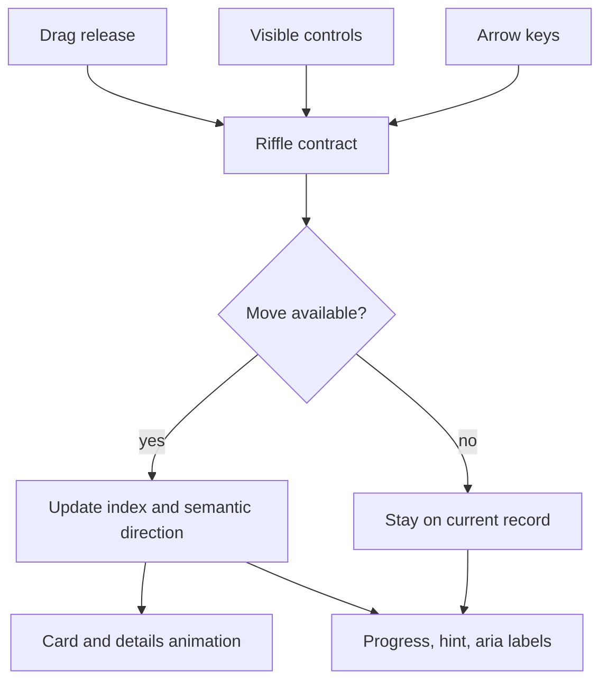

# feat: Introduce record riffle engine

## Summary

Extract the crate browsing direction, threshold, bounds, and language rules into a small pure frontend riffle contract, then make `CrateView` consume that contract across drag, buttons, keyboard, progress, and reduced-motion paths. The implementation keeps the existing crate surface and animation foundation, but makes "down means deeper" and "up means front" the single source of truth.

---

## Problem Frame

`CrateView` already has the right physical metaphor, but its interaction rules still sit inside the rendering component. That makes the contract harder to tune, harder to test without Framer Motion, and easier for drag, controls, keyboard, and accessibility language to drift away from the intended crate-riffle model.

---

## Requirements

- R1. Define semantic riffle directions as `deeper` and `front`, with a one-record delta for each direction. (Origin R1, R9)
- R2. A committed downward drag moves one record deeper when another record exists. (Origin R2, R4, R9; F1; AE1)
- R3. A committed upward drag moves one record toward the front when a previous record exists. (Origin R3, R4, R9; F2; AE2, AE3)
- R4. Horizontal drag must not navigate or teach a competing browse model; it may remain only as forgiving visual tolerance. (Origin R5; AE4)
- R5. Drag, buttons, keyboard, hint dismissal, direction state, and record-change animation all consume the same contract. (Origin R6; F3)
- R6. Commitment thresholds are centralized, velocity-aware, and unit-testable without rendering the full crate surface. (Origin R8, R13)
- R7. Reduced-motion behavior preserves the same direction, threshold, and bounds semantics while simplifying movement. (Origin R7; AE5)
- R8. Visible guidance, accessible labels, progress language, and active record count use the same front/deeper vocabulary. (Origin R10, R11, R12; AE6)
- R9. Compact, comfy, and wide crate branches preserve guard parity for populated, empty, and `hideTabs` states. (Origin R14)

**Origin actors:** A1 mobile crate browser, A2 keyboard or assistive-tech browser, A3 frontend implementer

**Origin flows:** F1 mobile user riffles forward, F2 mobile user riffles backward or hits an edge, F3 alternate controls follow the same contract

**Origin acceptance examples:** AE1 downward drag moves deeper, AE2 upward drag moves front, AE3 front edge blocks backward movement, AE4 horizontal drag is not primary, AE5 reduced motion preserves semantics, AE6 assistive labels and progress use shared language

---

## Scope Boundaries

- First-swipe ghost animations, failed-gesture coaching, and mastery-based hint hiding remain deferred to the First Swipe Lesson idea.
- Rich sleeve physics, detents, pressure shadows, and commit pulses remain deferred to the Soundless Sleeve Physics idea.
- A vertical crate spine or replacement progress rail remains deferred to a separate orientation/progress pass.
- Backend crate selection, ranking, payload shape, and `CratePresenter` behavior are unchanged.
- Search, filtering, sorting, and detail-card behavior are unchanged.
- The plan does not introduce a new gesture library, global state provider, or app-wide navigation abstraction.

### Deferred to Follow-Up Work

- Stronger blocked-edge coaching: if snap-back, disabled controls, and the short edge status do not communicate crate edges clearly enough after implementation, plan a separate edge-feedback pass.
- Card-relative thresholds: if manual tuning shows fixed thresholds feel inconsistent across card sizes, revisit threshold scaling as a follow-up instead of adding DOM measurement to this pass.

---

## Context & Research

### Relevant Code and Patterns

- `app/frontend/components/crate_view.tsx` is the current crate browsing surface. It owns index state, direction state, drag thresholds, drag release handling, keyboard listeners, progress labels, visible controls, and reduced-motion branches.
- `app/frontend/components/crate_view.test.tsx` already covers compact and wide rendering, empty states, `hideTabs` guard parity, button navigation, hint dismissal, and limited drag intent.
- `app/frontend/lib/motion_tokens.ts` provides `transitionCrate`, `springPress`, `SCALE_PRESS`, and `reducedMotionTransition`. The riffle work should extend this tokenized motion posture rather than adding inline animation constants.
- `app/frontend/components/storefront_motion_config.tsx` exposes `useReducedMotionContext()` and wraps app surfaces through `AppLayout` and `MarketingLayout`.
- `app/frontend/test/viewport-test-utils.tsx` provides `renderWithTier`, the established way to test compact/comfy/wide behavior without mocking `matchMedia`.
- `app/frontend/lib/crate_window.ts` remains the windowing helper for nearby record rendering; the riffle contract should not take over visual window selection.

### Institutional Learnings

- `docs/solutions/architecture-patterns/storefront-animation-token-system-2026-05-08.md` established the token/provider/hook pattern for animation consistency and reduced-motion handling.
- `docs/solutions/architecture-patterns/viewport-context-responsive-architecture-2026-05-09.md` established viewport tier vocabulary and `renderWithTier` matrix testing for responsive branches.
- `docs/solutions/logic-errors/responsive-branching-guard-condition-drift-2026-05-13.md` documents how responsive refactors can silently drop guards like `hideTabs`; this plan keeps guard parity explicit in tests.
- The layered architecture specification test points away from keeping direction, thresholds, bounds, and copy rules embedded in a presentation component. Extracting a pure frontend library keeps `CrateView` focused on rendering and wiring.

### External References

- External research was skipped. The repo already has direct local patterns for Framer Motion, reduced motion, viewport test utilities, and pure frontend helper tests.

---

## Key Technical Decisions

- Extract a pure riffle contract instead of another component hook: the behavior must be testable without rendering `CrateView`, Framer Motion, or a browser gesture surface.
- Use semantic directions in component state and labels, while mapping to numeric deltas only at the crate index boundary. This keeps "deeper/front" readable while preserving the existing one-record index model.
- Make vertical movement the only committed drag axis. Horizontal movement can continue to exist as visual tolerance, but it should return "no navigation" from the shared gesture resolver.
- Use fixed pixel thresholds with velocity assist for this pass. This matches the current implementation shape, avoids DOM measurement, and keeps tuning centralized.
- Keep blocked-edge behavior conservative: no index change, no hint dismissal caused by failed navigation, disabled controls at bounds, drag snap-back on release, and a short front/deeper edge status for attempted blocked moves.
- Keep the engine small and local to the frontend. It should not reach into Rails presenters, pile behavior, crate selection, or record detail behavior.

---

## Open Questions

### Resolved During Planning

- Should horizontal drag be removed entirely or retained as tolerance? Resolve as vertical-only navigation with optional visual tolerance. Horizontal movement must not commit navigation.
- Should thresholds be absolute pixels, card-relative distance, velocity-assisted, or a combination? Resolve as centralized fixed pixel thresholds with velocity assist. Card-relative measurement is deferred unless tuning proves fixed values inadequate.
- What is the shortest guidance copy? Start with "Pull down to dig deeper. Push up to the front." It directly teaches the unusual rule without adding a long instruction block.

### Deferred to Implementation

- Exact helper names and exported type names: settle while implementing the pure riffle contract, as long as the public shape stays small and readable.
- Final microcopy length in compact layout: use the planned copy as the starting point, then trim only if it causes wrapping or crowding in the existing compact footer.
- Exact blocked-edge visual feel: keep snap-back plus a short edge status for this pass; only add richer coaching if the interaction still feels ambiguous during implementation review.

---

## High-Level Technical Design

> *This illustrates the intended approach and is directional guidance for review, not implementation specification. The implementing agent should treat it as context, not code to reproduce.*

The contract decides semantic direction, threshold commitment, and bounds. `CrateView` remains responsible for rendering, animation variants, layout branches, and event wiring.

---

## Implementation Units

### U1. Extract Pure Riffle Contract

**Goal:** Create a pure frontend module that defines riffle directions, deltas, threshold defaults, drag commitment, bounds checks, and shared copy in one testable place.

**Requirements:** R1, R2, R3, R4, R6, R8; F1, F2; AE1, AE2, AE3, AE4

**Dependencies:** None

**Files:**
- Create: `app/frontend/lib/riffle_navigation.ts`
- Test: `app/frontend/lib/riffle_navigation.test.ts`

**Approach:**
- Model `deeper` as the forward direction and `front` as the backward direction, with one-record deltas.
- Centralize threshold values for committed distance, minimum distance for velocity-assisted commit, and release velocity.
- Resolve drag commitment from vertical offset and vertical velocity only; horizontal-only movement returns no committed direction.
- Resolve bounds from current index, record count, and semantic direction so blocked movement returns a valid "stay put" result.
- Include the shared short guidance, edge-status, and accessible label vocabulary as plain constants or small helpers, not JSX.

**Execution note:** Implement this unit test-first so the contract is pinned before `CrateView` rewiring begins.

**Patterns to follow:**
- `app/frontend/lib/crate_window.ts` and `app/frontend/lib/crate_window.test.ts` for small pure frontend helper shape and Node test style.
- `app/frontend/lib/motion_tokens.ts` for centralized constants named by intent rather than by raw numbers.

**Test scenarios:**
- Covers AE1. Happy path: downward offset past distance threshold resolves to `deeper` and a one-record forward delta.
- Covers AE2. Happy path: upward offset past distance threshold resolves to `front` and a one-record backward delta.
- Happy path: downward offset below distance threshold but above minimum distance with sufficient downward velocity resolves to `deeper`.
- Edge case: tiny downward flick below minimum distance does not commit even with high velocity.
- Covers AE4. Edge case: mostly horizontal movement with little vertical movement returns no committed direction.
- Covers AE3. Edge case: `front` at index 0 returns blocked/stay-put without producing an invalid index.
- Edge case: `deeper` at the last index returns blocked/stay-put without producing an invalid index.
- Happy path: successful navigation advances exactly one record and never skips.

**Verification:**
- The pure helper tests cover direction, threshold, velocity, horizontal tolerance, and bounds without rendering React.

---

### U2. Rewire CrateView Navigation Through the Contract

**Goal:** Make button navigation, keyboard navigation, direction state, hint dismissal, and animation direction consume the shared riffle contract instead of local ad hoc delta rules.

**Requirements:** R1, R3, R5, R8, R9; F2, F3; AE2, AE3, AE6

**Dependencies:** U1

**Files:**
- Modify: `app/frontend/components/crate_view.tsx`
- Test: `app/frontend/components/crate_view.test.tsx`

**Approach:**
- Replace local "previous/next" mental-model wiring with semantic `front` and `deeper` navigation at the component boundary.
- Keep the existing `indexRef` protection for rapid keyboard or button navigation.
- Update the animation direction bridge so semantic directions still map to the existing positive/negative animation variants.
- Keep hint dismissal tied to successful navigation only; blocked navigation at the first or last record should leave the hint behavior valid.
- Avoid reintroducing an unused boolean return from navigation. If a success signal is needed, consume it at the call site; otherwise keep the side effect inside the successful branch.

**Patterns to follow:**
- Current `CrateView` ref-based navigation pattern for rapid sequential clicks.
- `docs/solutions/logic-errors/responsive-branching-guard-condition-drift-2026-05-13.md` for guarding against unused return contracts.

**Test scenarios:**
- Happy path: clicking the deeper control from the first record advances to record 2 and dismisses the hint.
- Happy path: clicking the front control from record 2 returns to record 1 and updates the progress state.
- Edge case: clicking the front control at record 1 does not change the active record and does not dismiss the hint.
- Happy path: pressing ArrowDown advances deeper and pressing ArrowUp returns toward the front.
- Edge case: rapid ArrowDown or button activation still lands on the correct one-record-at-a-time index sequence.
- Integration: desktop details panel receives the same semantic direction as the card animation after button or keyboard navigation.

**Verification:**
- `CrateView` no longer owns direction and bounds semantics beyond calling the shared contract.
- Existing compact and wide navigation behavior remains intact, with updated direction vocabulary.

---

### U3. Apply Vertical Drag Commitment and Bounds Semantics

**Goal:** Route drag release through the riffle contract so down/up gestures commit according to the shared thresholds, horizontal movement never navigates, and edges remain bounded.

**Requirements:** R2, R3, R4, R5, R6, R7; F1, F2; AE1, AE2, AE3, AE4, AE5

**Dependencies:** U1, U2

**Files:**
- Modify: `app/frontend/components/crate_view.tsx`
- Test: `app/frontend/components/crate_view.test.tsx`

**Approach:**
- Replace the local dominant-axis decision with the contract's vertical-only gesture resolution.
- Keep the existing vertical drag constraints and snap-to-origin behavior unless implementation review shows they conflict with the contract.
- Preserve horizontal drag as non-navigating tolerance only; if horizontal offset still drives minor visual rotation, it must not feed the navigation resolver.
- Use the same bounds result as buttons and keyboard so edge drags do not change index, direction state, or hint state.
- Route blocked drag attempts through the same short edge status used by blocked button or keyboard attempts.
- Keep reduced-motion as a visual simplification only. It should not change gesture commitment or bounds logic.

**Patterns to follow:**
- Current `CrateView` drag structure with `dragSnapToOrigin`, `dragMomentum={false}`, and `transitionCrate`.
- `docs/solutions/architecture-patterns/storefront-animation-token-system-2026-05-08.md` for reduced-motion preserving behavior while collapsing motion.

**Test scenarios:**
- Covers AE1. Contract-level happy path: a downward committed drag resolves to deeper navigation and a one-record progress change.
- Covers AE2. Contract-level happy path: an upward committed drag resolves to front navigation and a one-record progress change.
- Covers AE3. Contract-level edge case: an upward committed drag at the first record leaves the active record unchanged.
- Covers AE4. Contract-level edge case: a mostly horizontal drag with little vertical movement leaves the active record unchanged.
- Covers AE5. Reduced motion: with reduced motion active, the same drag decisions occur while visual movement uses reduced transitions.
- Integration: component wiring passes drag release offset and velocity into the contract; use a Framer Motion mock or focused drag-end harness rather than depending on smooth pointer simulation in jsdom.
- Integration: drag, button, and keyboard paths all produce the same direction state for the same semantic move.

**Verification:**
- The component delegates drag commitment to the pure helper.
- Framer Motion or jsdom limitations do not become the only proof of gesture semantics; pure helper tests own the core contract and component tests cover wiring.

---

### U4. Unify Riffle Language and Accessibility

**Goal:** Update visible guidance, button labels, progress language, and live count text so touch, keyboard, and assistive-tech users receive the same front/deeper model.

**Requirements:** R5, R8; F3; AE6

**Dependencies:** U1, U2

**Files:**
- Modify: `app/frontend/components/crate_view.tsx`
- Test: `app/frontend/components/crate_view.test.tsx`
- Test: `app/frontend/components/accessibility.test.tsx`

**Approach:**
- Replace "Previous record" and "Next record" accessible labels with front/deeper language.
- Update compact guidance to teach "pull down to dig deeper" and "push up to the front" without adding a long instruction block.
- Keep the existing compact icon button shape, but make surrounding visible labels and aria labels carry the same vocabulary.
- Add or update progress accessible text so the active record count remains available and communicates position from front toward deeper in the crate.
- Add a brief polite edge status for blocked attempts such as trying to move front from the first record or deeper from the last record.
- Keep visible progress endpoints aligned with the contract, using "front" and "deeper/back" consistently instead of mixing previous/next terminology.

**Patterns to follow:**
- Existing `aria-live="polite"` count in `CrateView`.
- Existing component accessibility tests in `app/frontend/components/accessibility.test.tsx`.
- Existing button size and focus-ring patterns in `CrateView`.

**Test scenarios:**
- Covers AE6. Happy path: screen-reader queries can find controls labeled with front/deeper movement language.
- Covers AE6. Happy path: after active record changes, progress accessible text reports the updated record count.
- Happy path: compact guidance uses the shared short guidance copy.
- Edge case: front control is disabled at index 0 and deeper control is disabled at the last index, with labels still describing the unavailable move.
- Edge case: a blocked attempt announces or displays the matching front/deeper edge status without changing the active record.
- Integration: visible progress endpoints and aria labels do not disagree on direction language.

**Verification:**
- No user-facing crate navigation copy in `CrateView` uses "previous" or "next" where front/deeper language is more precise.
- Keyboard and assistive-tech users receive the same browsing model as touch users.

---

### U5. Add Responsive and Reduced-Motion Parity Coverage

**Goal:** Protect the shared contract across compact, comfy, and wide branches, including empty states, hidden tabs, and reduced-motion rendering.

**Requirements:** R7, R9, R13, R14; AE5, AE6

**Dependencies:** U2, U3, U4

**Files:**
- Modify: `app/frontend/components/crate_view.tsx`
- Test: `app/frontend/components/crate_view.test.tsx`
- Test: `app/frontend/test/pages/responsive_surface_matrix.test.tsx` (only if the existing page matrix needs an added crate assertion)

**Approach:**
- Keep `CrateView` using the existing viewport context and provider hierarchy; do not create a separate responsive mechanism.
- Prefer `useReducedMotionContext()` over direct Framer Motion reduced-motion reads if the component can stay within the existing `StorefrontMotionConfig` contract.
- Add focused matrix coverage for compact, comfy, and wide crate rendering where the riffle labels and guards matter.
- Preserve empty crate and `hideTabs` behavior while changing navigation language.
- Only extend the broader responsive surface matrix if the change reveals a page-level provider or rendering gap; otherwise keep coverage local to `crate_view.test.tsx`.

**Patterns to follow:**
- `renderWithTier` from `app/frontend/test/viewport-test-utils.tsx`.
- `docs/solutions/architecture-patterns/viewport-context-responsive-architecture-2026-05-09.md` for tier-based test matrices.
- Current `CrateView` empty-state and `hideTabs` tests.

**Test scenarios:**
- Happy path: compact, comfy, and wide tiers render riffle controls and progress without crashing.
- Edge case: compact populated state with `hideTabs` true still hides tabs and keeps riffle controls usable.
- Edge case: wide populated state with `hideTabs` true still hides tabs and keeps the desktop details panel valid.
- Edge case: compact and wide empty crate states render no riffle controls that imply unavailable records.
- Covers AE5. Reduced motion: progress and navigation decisions remain the same while transitions collapse to reduced-motion tokens.
- Integration: app and marketing layouts still provide the motion and viewport contexts required by `CrateView`.

**Verification:**
- Responsive guard parity remains covered after copy and contract rewiring.
- Reduced-motion tests prove behavior parity rather than only checking animation values.

---

## System-Wide Impact

- **Interaction graph:** `CrateView` remains the only production surface changed. It receives events from drag release, visible buttons, document-level arrow keys, and crate tab changes, then renders `RecordCard`, progress, details, and controls.
- **Error propagation:** There are no backend or persistence errors. Invalid movement resolves to "stay on current record" instead of throwing or producing an invalid index.
- **State lifecycle risks:** The key state risks are stale index reads during rapid input, direction state drifting from the active index, and hint dismissal on blocked movement. U2 and U3 keep these paths centralized.
- **API surface parity:** Drag, buttons, keyboard, visible guidance, aria labels, and progress all need the same direction vocabulary. No Rails presenter or Inertia payload shape changes are planned.
- **Integration coverage:** Pure helper tests prove the contract; component tests prove React wiring, responsive branches, labels, and reduced-motion parity.
- **Unchanged invariants:** `buildCrateWindow`, crate payload shape, record details, pile behavior, Discogs links, and crate tab selection remain unchanged.

---

## Risks & Dependencies

| Risk | Mitigation |
|------|------------|
| The extracted contract becomes too broad and turns into a UI abstraction. | Keep it pure, small, and limited to directions, thresholds, bounds, and copy constants. Leave rendering in `CrateView`. |
| Framer Motion drag is hard to assert in jsdom. | Put gesture semantics in pure tests and keep component tests focused on wiring and reachable UI state. |
| Changing "previous/next" copy breaks existing tests or user expectations. | Update tests to query by the intended front/deeper language and keep arrows as familiar visual controls. |
| Horizontal drag no longer navigating may feel like a regression to anyone who discovered it accidentally. | The origin explicitly rejects horizontal as the teaching model; compact guidance and snap-back clarify down/up as the supported path. |
| Reduced-motion context usage can throw when a test or page omits the provider. | Use existing layout wrappers and test wrappers; add provider coverage only where a gap appears. |

---

## Documentation / Operational Notes

- No customer-facing documentation is required.
- If implementation changes the exact guidance copy materially, update this plan or the origin requirements before executing further riffle-polish work so later planners inherit the final language.
- No migration, rollout flag, analytics change, or backend deploy coordination is required.

---

## Sources & References

- **Origin document:** [docs/brainstorms/2026-05-15-record-riffle-engine-requirements.md](../brainstorms/2026-05-15-record-riffle-engine-requirements.md)
- Related code: `app/frontend/components/crate_view.tsx`
- Related tests: `app/frontend/components/crate_view.test.tsx`
- Related helper pattern: `app/frontend/lib/crate_window.ts`
- Related motion tokens: `app/frontend/lib/motion_tokens.ts`
- Related learning: [docs/solutions/architecture-patterns/storefront-animation-token-system-2026-05-08.md](../solutions/architecture-patterns/storefront-animation-token-system-2026-05-08.md)
- Related learning: [docs/solutions/architecture-patterns/viewport-context-responsive-architecture-2026-05-09.md](../solutions/architecture-patterns/viewport-context-responsive-architecture-2026-05-09.md)
- Related learning: [docs/solutions/logic-errors/responsive-branching-guard-condition-drift-2026-05-13.md](../solutions/logic-errors/responsive-branching-guard-condition-drift-2026-05-13.md)
