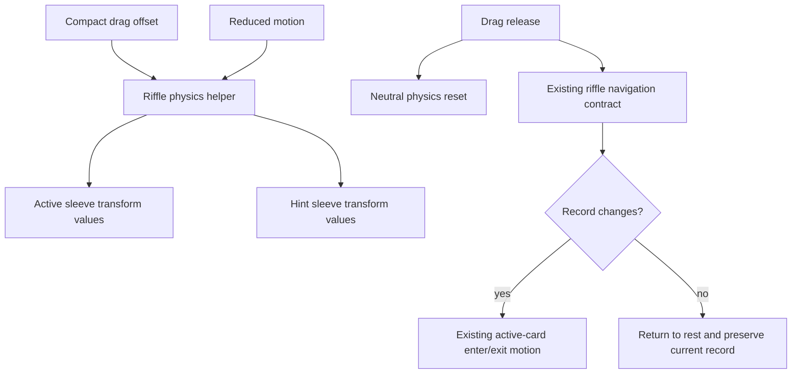

# feat: Add compact riffle sleeve physics

## Summary

Add a compact-only visual physics layer to the existing crate stack so the active sleeve and nearby hint sleeves respond during drag. The implementation keeps `resolveRiffleDrag` and `resolveRiffleMove` as the navigation source of truth, isolates transform tuning in a pure helper, and collapses the extra flourish for reduced-motion users.

---

## Problem Frame

The riffle engine has already unified the crate browsing contract, but compact dragging still feels mostly like a post-release animation. The next improvement is tactile visual response under the user's thumb without changing direction semantics, controls, labels, desktop layout, or backend behavior.

---

## Requirements

- R1. Add compact-only active-sleeve visual physics during drag: vertical pitch, slight scale compression, bounded pressure/shadow, and neutral reset on release. (Origin Goals, Interaction Model)
- R2. Add subtle compact-only hint-sleeve response using the existing non-active stack elements; the adjacent sleeve in the drag direction may peek more, but no new visible UI layer is introduced. (Origin Interaction Model, Constraints)
- R3. Keep navigation semantics unchanged: `resolveRiffleDrag`, `resolveRiffleMove`, thresholds, bounds, and one-record-per-gesture behavior remain authoritative. (Origin Non-Goals, Current Context)
- R4. Keep wide/comfy rendering on the existing static stack behavior; sleeve physics is compact-only. (Origin Summary, Constraints)
- R5. Respect reduced motion by preserving navigation while returning neutral or near-neutral visual physics and using existing reduced-motion transition patterns. (Origin Reduced Motion)
- R6. Use transform and opacity only during drag; do not animate layout, sizing, or paint-heavy properties. (Origin Constraints)
- R7. Keep the DOM shape stable and avoid new gesture libraries, persistent preferences, analytics, sound, vibration, or haptic dependencies. (Origin Non-Goals, Constraints)
- R8. Cover the visual physics helper with pure tests and `CrateView` wiring with focused component tests that do not depend on pixel-perfect Framer Motion animation in jsdom. (Origin Testing)

**Origin actors:** compact mobile crate browser, reduced-motion user, frontend implementer

**Origin flows:** compact drag response, successful detent/snap release, blocked-edge return to rest, reduced-motion drag without flourish

---

## Scope Boundaries

- No changes to `resolveRiffleDrag`, `resolveRiffleMove`, direction thresholds, bounds, or one-record-per-gesture behavior.
- No new visible UI elements, rails, overlays, tutorials, labels, progress affordances, sound, vibration, or hardware haptics.
- No desktop animation redesign; non-compact stack behavior remains as-is.
- No backend, presenter, payload, crate selection, search, filtering, sorting, or record detail behavior changes.
- No gesture library, persistent preference, or analytics tracking is introduced.

### Deferred to Follow-Up Work

- Rich sleeve physics such as detents, pressure shadows beyond transform/opacity-safe styling, commit pulses, or first-swipe coaching remain separate follow-up ideas.
- Card-relative thresholds or DOM-measured physics tuning are deferred unless fixed transform constants feel inconsistent after implementation review.
- A vertical crate spine or replacement progress rail remains a separate orientation/progress pass.

---

## Context & Research

### Relevant Code and Patterns

- `app/frontend/components/crate_view.tsx` owns the compact stack, active drag surface, hint-card rendering, `handleDragEnd`, reduced-motion branch, and existing `dragRotationRef` CSS variable.
- `app/frontend/lib/riffle_navigation.ts` owns semantic directions, thresholds, move bounds, language, and active-card entry/exit motion. This plan should not blur visual physics into that contract.
- `app/frontend/lib/riffle_navigation.test.ts` uses `node:test` and `assert` for pure helper coverage; the physics helper should follow this small-library test shape.
- `app/frontend/components/crate_view.test.tsx` already covers compact/wide rendering, hidden tabs, empty states, controls, progress, edge status, and riffle language.
- `app/frontend/lib/motion_tokens.ts` and `app/frontend/components/storefront_motion_config.tsx` provide the existing animation token and reduced-motion patterns.
- `app/frontend/test/viewport-test-utils.tsx` provides `renderWithTier`, the established path for compact/comfy/wide component coverage.

### Institutional Learnings

- `docs/solutions/architecture-patterns/storefront-animation-token-system-2026-05-08.md` established centralized motion tokens, reduced-motion provider usage, and avoiding scattered inline spring values.
- `docs/solutions/architecture-patterns/viewport-context-responsive-architecture-2026-05-09.md` established compact/comfy/wide tier vocabulary and tier-injected tests.
- `docs/solutions/logic-errors/responsive-branching-guard-condition-drift-2026-05-13.md` warns that responsive refactors silently drop guard parity; compact-only physics needs explicit wide and hidden-tab regression coverage.
- The layered Rails specification-test lens supports keeping visual physics as a pure frontend helper and leaving `CrateView` responsible for rendering and wiring rather than embedding tunable physics rules in presentation markup.

### External References

- External research was skipped. The repo has direct local patterns for Framer Motion usage, transform-token governance, reduced-motion handling, responsive tier testing, and pure frontend helper tests. Context7 developer-doc access is not available in this harness.

---

## Key Technical Decisions

- Create `app/frontend/lib/riffle_physics.ts` as a separate pure visual helper rather than expanding `riffle_navigation.ts`. Navigation contract tests should remain about semantics and bounds; physics tests should be about visual response.
- Use compact-only wiring in `CrateView` and preserve the existing wide stack path. This keeps the feature aligned with the approved spec and avoids accidental desktop redesign.
- Prefer CSS variables or ref-applied style updates for per-drag visual values if React state updates introduce avoidable churn. The pure helper remains the testable source of calculations either way.
- Keep horizontal movement as minor wobble only. It must not dominate the active sleeve feel or influence navigation.
- Treat successful detent feel as transition tuning around existing active-card entry/exit motion, not as a new navigation phase.
- Keep reduced-motion neutral at the helper boundary so component code can ask for physics values without duplicating reduced-motion conditionals across every visual surface.

---

## Open Questions

### Resolved During Planning

- Should this modify the riffle navigation contract? No. The completed riffle engine stays authoritative; this plan only adds compact visual response.
- Should visual physics live in `riffle_navigation.ts` or a new helper? Use a new `riffle_physics.ts` module so animation tuning and navigation semantics remain independently testable.
- Should the implementation add a new visible layer for sleeve physics? No. Reuse the active card and existing hint-card elements to keep DOM shape stable.

### Deferred to Implementation

- Exact physics constants: tune pitch, wobble, compression, pressure, and adjacent reveal during implementation while keeping them named and centralized.
- Exact CSS-variable versus state wiring: choose based on drag-time render behavior in `CrateView`; preserve pure helper tests regardless.
- Final detent snap feel: start by tuning existing motion-token patterns and only add a named transition if the current token set cannot express the release feel.

---

## High-Level Technical Design

> *This illustrates the intended approach and is directional guidance for review, not implementation specification. The implementing agent should treat it as context, not code to reproduce.*

The physics helper maps transient drag offset to visual values. The existing riffle navigation contract still decides whether the release changes records.

---

## Implementation Units

### U1. Add Pure Compact Riffle Physics Helper

**Goal:** Create a pure helper module that converts drag offset, direction, progress, and reduced-motion state into bounded active-sleeve and hint-sleeve visual values.

**Requirements:** R1, R2, R5, R6, R8

**Dependencies:** None

**Files:**
- Create: `app/frontend/lib/riffle_physics.ts`
- Test: `app/frontend/lib/riffle_physics.test.ts`

**Approach:**
- Export named constants for maximum pitch, horizontal wobble, compression, pressure, adjacent reveal, and clamp inputs.
- Resolve drag progress from vertical offset as `0` to `1`, with downward visual state mapping to `deeper` and upward visual state mapping to `front`.
- Return neutral values for idle, after release, and reduced-motion cases.
- Keep the helper independent of React, Framer Motion, DOM APIs, and viewport hooks.
- Return plain numbers and strings that are easy to assert; avoid embedding component-specific markup concerns.

**Execution note:** Implement this unit test-first so the physics math is stable before `CrateView` wiring begins.

**Patterns to follow:**
- `app/frontend/lib/riffle_navigation.ts` and `app/frontend/lib/riffle_navigation.test.ts` for pure helper structure and Node tests.
- `app/frontend/lib/motion_tokens.ts` for named constants that describe feel rather than raw implementation details.

**Test scenarios:**
- Happy path: zero vertical offset returns neutral progress, neutral direction, no pitch, no compression, and no pressure.
- Happy path: downward offset approaching the commit threshold returns `deeper` visual direction and increasing progress clamped at `1`.
- Happy path: upward offset approaching the commit threshold returns `front` visual direction and increasing progress clamped at `1`.
- Edge case: offsets beyond the commit threshold remain clamped and do not produce unbounded pitch, scale, wobble, or reveal values.
- Edge case: horizontal offset contributes only bounded minor wobble and does not change visual direction when vertical offset is meaningful.
- Reduced motion: any offset returns neutral or near-neutral active physics and neutral hint transforms.
- Hint cards: only existing adjacent slots in the drag direction gain additional reveal; unrelated slots remain near their base transform.

**Verification:**
- Pure tests prove progress, direction, clamp, reduced-motion, and hint-slot behavior without rendering React.

---

### U2. Wire Active Sleeve Drag Physics Into Compact CrateView

**Goal:** Apply active-sleeve visual physics during compact dragging while preserving the existing release navigation path and neutral reset.

**Requirements:** R1, R3, R4, R5, R6, R7, R8

**Dependencies:** U1

**Files:**
- Modify: `app/frontend/components/crate_view.tsx`
- Test: `app/frontend/components/crate_view.test.tsx`

**Approach:**
- Compute active physics from `onDrag` offset only when `isCompact` is true.
- Apply pitch, minor wobble, compression, and pressure through transform-safe style values on the existing active drag surface.
- Reset active physics to neutral on `onDragEnd` before delegating release to `handleDragEnd`.
- Keep `handleDragEnd` calling `resolveRiffleDrag` and `navigate` exactly as the navigation source of truth.
- Keep the existing wide path free of active-sleeve physics.
- Prefer ref/CSS-variable updates during drag if state updates cause unnecessary render churn; keep the calculation path pure and covered.

**Patterns to follow:**
- Existing `dragRotationRef` CSS-variable pattern in `app/frontend/components/crate_view.tsx`.
- Existing `dragSnapToOrigin`, `dragMomentum={false}`, and `transitionCrate` usage in the active card.
- `docs/solutions/architecture-patterns/storefront-animation-token-system-2026-05-08.md` for transform-only animation discipline and reduced-motion handling.

**Test scenarios:**
- Happy path: compact render exposes the drag surface and applies the neutral physics baseline before drag.
- Happy path: compact drag wiring calls the physics path without changing progress or active record before release.
- Integration: drag release still delegates to the existing riffle navigation path so a committed downward release advances one record.
- Edge case: failed or blocked release resets visual physics to neutral and leaves the active record unchanged.
- Reduced motion: compact reduced-motion render does not apply playful scale, pressure, or fan values during drag.
- Wide parity: wide render keeps the existing active card behavior and does not attach compact-only physics markers or styles.

**Verification:**
- Active drag feel changes only in compact rendering.
- Existing navigation tests still own direction, thresholds, bounds, and one-record movement.

---

### U3. Add Hint-Sleeve Reactive Physics

**Goal:** Make existing non-active hint cards subtly respond to compact drag direction and progress without adding DOM layers or exposing extra records.

**Requirements:** R2, R4, R5, R6, R7, R8

**Dependencies:** U1, U2

**Files:**
- Modify: `app/frontend/components/crate_view.tsx`
- Test: `app/frontend/components/crate_view.test.tsx`

**Approach:**
- Route each existing non-active `visibleRecords` slot through the physics helper when `isCompact` is true.
- Preserve the current base transform formula for wide rendering and for compact idle state.
- Let only the adjacent sleeve in the drag direction separate or peek slightly more as progress increases.
- Keep opacity and transform changes compositor-friendly and bounded.
- Under reduced motion, return the current static hint-card transforms with no reactive fan or separation.

**Patterns to follow:**
- Current hint-card mapping in `app/frontend/components/crate_view.tsx`.
- `app/frontend/lib/crate_window.ts` for preserving the existing window of nearby records instead of exposing additional slots.
- Viewport-tier tests in `app/frontend/test/viewport-test-utils.tsx`.

**Test scenarios:**
- Happy path: compact hint cards render the same slot count before and after physics wiring.
- Happy path: compact deeper drag visually affects the adjacent deeper slot more than unrelated slots.
- Happy path: compact front drag visually affects the adjacent front slot more than unrelated slots.
- Edge case: first-record and last-record states do not attempt to reveal missing adjacent slots.
- Reduced motion: hint-card reactive transforms remain neutral or static when reduced motion is active.
- Wide parity: wide hint cards keep the existing transform behavior.

**Verification:**
- The stack feels more alive on compact drag while the DOM shape, slot count, and crate window remain unchanged.

---

### U4. Tune Release Detent and Motion Tokens

**Goal:** Give successful compact commits a light detent/snap feel while keeping blocked releases conservative and reduced-motion simple.

**Requirements:** R1, R3, R5, R6, R7

**Dependencies:** U1, U2, U3

**Files:**
- Modify: `app/frontend/lib/riffle_navigation.ts`
- Modify: `app/frontend/lib/motion_tokens.ts` (only if a new named transition is needed)
- Test: `app/frontend/lib/riffle_navigation.test.ts`
- Test: `app/frontend/lib/motion_tokens.test.ts` (only if motion tokens change)
- Test: `app/frontend/components/crate_view.test.tsx`

**Approach:**
- Start by tuning the existing `riffleActiveCardMotion()` entry/exit values for a more tactile compact commit, while preserving semantic direction and reduced-motion variants.
- If transition tuning cannot be expressed with the existing tokens, add one named token by feel and use it from `CrateView` rather than scattering inline spring values.
- Keep blocked-edge release as snap-back plus current edge status; do not add coaching, pulses, or new UI in this pass.
- Ensure reduced-motion commit behavior keeps direction semantics but avoids playful detent movement.

**Patterns to follow:**
- `riffleActiveCardMotion()` in `app/frontend/lib/riffle_navigation.ts` for existing direction-aware active-card motion.
- `docs/solutions/architecture-patterns/storefront-animation-token-system-2026-05-08.md` for tokenized motion governance.

**Test scenarios:**
- Happy path: active-card motion still differentiates `deeper` and `front` directions.
- Reduced motion: active-card reduced-motion values remain simpler than full-motion values.
- Integration: successful compact commit changes records through the existing navigation path and resets transient physics.
- Edge case: blocked front/deeper attempts return to rest without changing active-card direction state or record index.
- Token governance: if a new token is added, tests cover the named export and no inline spring values are needed in `CrateView`.

**Verification:**
- Successful commits feel more tactile, but the shared navigation contract and reduced-motion behavior remain stable.

---

### U5. Add Responsive, Reduced-Motion, and Regression Coverage

**Goal:** Protect compact-only sleeve physics against responsive branch drift and ensure reduced-motion users avoid extra flourish.

**Requirements:** R3, R4, R5, R7, R8

**Dependencies:** U2, U3, U4

**Files:**
- Modify: `app/frontend/components/crate_view.test.tsx`
- Modify: `app/frontend/test/pages/responsive_surface_matrix.test.tsx` (only if page-level provider coverage needs to assert this behavior)

**Approach:**
- Add compact/comfy/wide assertions that physics behavior is compact-only and existing guard behavior remains intact.
- Preserve existing hidden-tab, empty-crate, controls, progress, and edge-status tests while adding physics-specific coverage.
- Mock or configure reduced-motion context in focused tests so physics collapse is verified directly.
- Keep Framer Motion pixel animation out of the assertion surface; assert wiring, state, data attributes, style markers, and pure helper outputs instead.

**Patterns to follow:**
- Existing `describe.each(["compact", "comfy", "wide"])` coverage in `app/frontend/components/crate_view.test.tsx`.
- `docs/solutions/logic-errors/responsive-branching-guard-condition-drift-2026-05-13.md` guard parity checklist.
- `docs/solutions/architecture-patterns/viewport-context-responsive-architecture-2026-05-09.md` for tier-injected testing.

**Test scenarios:**
- Happy path: compact populated state has sleeve physics wiring and retains riffle controls, progress, and guidance behavior.
- Edge case: compact `hideTabs` populated state keeps tabs hidden while physics wiring remains available.
- Edge case: compact empty state renders no riffle controls and no physics surfaces.
- Wide parity: wide populated and wide `hideTabs` states do not gain compact-only physics behavior.
- Reduced motion: compact reduced-motion state keeps navigation available while active and hint physics are neutral or near-neutral.
- Integration: existing responsive surface matrix still renders store surfaces without provider crashes.

**Verification:**
- Responsive and reduced-motion tests cover the branch boundaries most likely to regress during compact-only animation work.

---

## System-Wide Impact

- **Interaction graph:** `CrateView` drag rendering gains a visual physics helper, but release decisions still flow through `resolveRiffleDrag` and `navigate`.
- **Error propagation:** No new async or failure paths are introduced. Image-loading fallbacks remain unchanged.
- **State lifecycle risks:** Transient drag physics must reset on release, blocked release, reduced-motion render, crate change, and component unmount.
- **API surface parity:** No Rails, Inertia payload, route, presenter, or public API changes.
- **Integration coverage:** Component tests should prove compact wiring and wide non-adoption; pure tests should prove visual physics math.
- **Unchanged invariants:** Direction semantics, thresholds, bounds, one-record-per-gesture, controls, labels, progress, and pile/detail behavior remain unchanged.

---

## Risks & Dependencies

| Risk | Mitigation |
|------|------------|
| Drag-time React state updates cause jank on mobile. | Prefer CSS variables/ref style updates during drag if render churn appears; keep all calculations pure and bounded. |
| Visual physics accidentally changes navigation semantics. | Do not modify `resolveRiffleDrag` or `resolveRiffleMove`; keep existing riffle navigation tests authoritative. |
| Compact-only work leaks into wide rendering. | Add compact/comfy/wide regression tests and keep branch conditions explicit. |
| Reduced-motion users receive extra flourish. | Make reduced-motion neutrality part of the physics helper and component tests. |
| Inline animation constants drift from token system. | Add new named token only if needed; otherwise reuse existing motion-token exports. |

---

## Documentation / Operational Notes

- No user-facing docs or operational rollout steps are required.
- If implementation adds a reusable physics helper pattern worth preserving, document it later under `docs/solutions/architecture-patterns/` after the code lands and proves stable.

---

## Sources & References

- **Origin document:** [docs/superpowers/specs/2026-05-15-compact-riffle-sleeve-physics-design.md](../superpowers/specs/2026-05-15-compact-riffle-sleeve-physics-design.md)
- Related completed plan: [docs/plans/2026-05-15-001-feat-record-riffle-engine-plan.md](2026-05-15-001-feat-record-riffle-engine-plan.md)
- Related code: `app/frontend/components/crate_view.tsx`
- Related code: `app/frontend/lib/riffle_navigation.ts`
- Related tests: `app/frontend/components/crate_view.test.tsx`
- Related tests: `app/frontend/lib/riffle_navigation.test.ts`
- Institutional learning: `docs/solutions/architecture-patterns/storefront-animation-token-system-2026-05-08.md`
- Institutional learning: `docs/solutions/architecture-patterns/viewport-context-responsive-architecture-2026-05-09.md`
- Institutional learning: `docs/solutions/logic-errors/responsive-branching-guard-condition-drift-2026-05-13.md`
