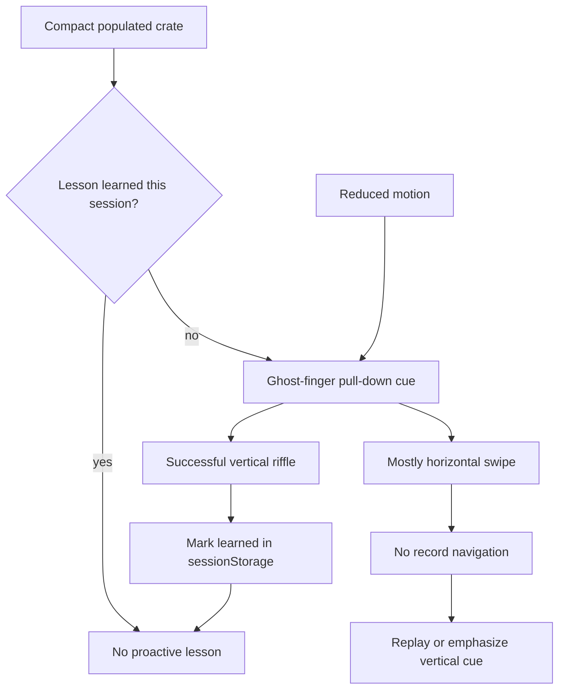

# feat: Add first-swipe crate lesson

## Summary

Add a compact-only first-use lesson to the existing crate riffle surface: a small ghost-finger pull-down cue teaches that down digs deeper, a successful vertical riffle marks the lesson learned for the browser session, and horizontal swipe attempts gently replay the vertical cue without introducing a competing navigation model.

---

## Problem Frame

The crate view now has a settled physical riffle contract, but the down/deeper gesture is unusual for mobile users who may expect left/right card swipes. The implementation should teach the existing affordance quietly inside the browsing surface, not turn the crate into a tutorial.

---

## Requirements

- R1. Show a compact-only proactive first-swipe lesson for populated crate views when the user has not learned the riffle gesture during the current browser session. (Origin R1, R12; F1; AE1, AE5)
- R2. Use a subtle ghost-finger pull-down cue that communicates downward movement first, with any text remaining minimal and secondary. (Origin R2, R3, R10; F1; AE1)
- R3. Keep the lesson unobtrusive: it must not block the active record, obscure core controls, or require dismissal before browsing. (Origin R2; AE1)
- R4. Mark the lesson learned after a successful vertical riffle and keep it hidden across later crate changes and store browsing in the same browser session. (Origin R4, R5, R6; F2; AE2)
- R5. Treat mostly horizontal swipes as non-navigation; for unlearned compact users, replay or emphasize the vertical cue instead of showing an error, modal, or long explanation. (Origin R7, R8, R9; F3; AE3)
- R6. Preserve the existing down/deeper and up/front riffle contract, language, thresholds, bounds, reduced-motion semantics, and one-record-per-gesture behavior. (Origin R10, R11; AE4)
- R7. Hide the first-swipe lesson for empty crates and non-compact layouts. (Origin R12; AE5)

**Origin actors:** A1 first-time mobile crate browser, A2 returning same-session browser, A3 horizontal-swipe browser

**Origin flows:** F1 first-time user sees the vertical cue, F2 user learns the gesture, F3 user tries a horizontal card swipe

**Origin acceptance examples:** AE1 compact first-time cue, AE2 same-session learned state, AE3 horizontal-swipe recovery, AE4 reduced-motion cue, AE5 empty/non-compact exclusion

---

## Scope Boundaries

- The down/deeper and up/front riffle direction contract remains owned by `app/frontend/lib/riffle_navigation.ts`; this plan does not reopen thresholds, deltas, edge behavior, or one-record movement.
- Rich sleeve physics, detents, pressure shadows, and commit pulses remain outside this lesson.
- A vertical crate spine, progress rail replacement, or broader orientation redesign remains outside this lesson.
- Durable cross-session preference storage is not part of this plan.
- Desktop and wide-layout gesture teaching is not part of this plan.
- Backend crate selection, inventory data, ranking, presenter payloads, store onboarding behavior, and analytics are unchanged.

### Deferred to Follow-Up Work

- Durable preference storage can be planned later if product decides the lesson should stay dismissed across browser sessions.
- Analytics for lesson impressions, horizontal attempts, or learned conversion can be planned separately if the product needs measurement beyond existing session browsing signals.

---

## Context & Research

### Relevant Code and Patterns

- `app/frontend/components/crate_view.tsx` is the compact crate browsing surface. It already owns the active drag surface, hint copy, compact/wide branch, empty-crate branch, drag release, button/keyboard navigation, reduced-motion handling, and existing hint visibility.
- `app/frontend/lib/riffle_navigation.ts` owns semantic directions, thresholds, bounds, front/deeper language, edge statuses, and active-card motion direction.
- `app/frontend/lib/riffle_physics.ts` owns compact visual drag response and should stay separate from lesson/mastery state.
- `app/frontend/components/crate_view.test.tsx` already covers compact and wide rendering, empty states, `hideTabs` guard parity, controls, keyboard navigation, progress, hint visibility, reduced motion, and physics markers.
- `app/frontend/components/accessibility.test.tsx` covers crate riffle labels and progress language in the broader interactive accessibility suite.
- `app/frontend/test/viewport-test-utils.tsx` provides `renderWithTier`, the established way to test compact/comfy/wide branch behavior.
- `app/frontend/components/storefront_motion_config.tsx` exposes reduced-motion context and should remain the source of reduced-motion state for the cue.

### Institutional Learnings

- `docs/solutions/architecture-patterns/storefront-animation-token-system-2026-05-08.md` established centralized motion tokens, reduced-motion provider usage, and avoiding scattered animation conventions.
- `docs/solutions/architecture-patterns/viewport-context-responsive-architecture-2026-05-09.md` established compact/comfy/wide tier vocabulary and tier-injected tests.
- `docs/solutions/logic-errors/responsive-branching-guard-condition-drift-2026-05-13.md` warns that responsive refactors can silently drop guards; this plan requires compact, wide, empty, and `hideTabs` coverage where lesson rendering branches.
- The layered-rails specification test keeps this work in the frontend presentation layer with pure frontend helpers for lesson state/gesture classification. Rails models, presenters, services, and controllers should not participate.

### External References

- External research was skipped. The repo has direct local patterns for the affected React, Framer Motion, reduced-motion, viewport, and pure-helper testing surfaces.

---

## Key Technical Decisions

- Use the ghost-finger pull-down cue requested during planning. It is clearer than a control pulse while still avoiding a larger tutorial overlay.
- Add a small pure helper for first-swipe lesson decisions instead of embedding session storage keys and horizontal-swipe classification directly in `CrateView`. This keeps `CrateView` focused on rendering and event wiring.
- Use `sessionStorage` as the learned-state boundary. It matches the origin requirement for same-session mastery and avoids durable cross-session preference behavior.
- Keep horizontal swipes as recovery only. They should return no navigation through the existing riffle resolver and only trigger cue emphasis for unlearned compact users.
- Reuse existing riffle language and reduced-motion context. The lesson may introduce a compact visual cue, but it must not create new direction vocabulary.
- Keep the lesson local to populated compact crate views. Empty crates and non-compact tiers should not render lesson DOM or announce lesson copy.

---

## Open Questions

### Resolved During Planning

- What visual form should teach the gesture? Use a small ghost-finger pull-down animation, per user direction during planning.
- Where should learned state live? Use browser `sessionStorage` so mastery persists across crate changes and store browsing within the same session but resets in a future browser session.
- Should horizontal swipes produce an error? No. They should not navigate, and unlearned users should get a quiet replay/emphasis of the vertical cue.
- Does this require backend or Rails-layer work? No. The layered architecture lens places this entirely in frontend presentation/helper code.

### Deferred to Implementation

- Exact cue placement and animation timing: tune during implementation so the ghost finger remains visible without covering active record art or controls.
- Exact data attributes or accessible label names: choose readable names while implementing and keep tests focused on behavior rather than fragile animation internals.
- Exact fallback when `sessionStorage` is unavailable: implement the simplest safe fallback that avoids throwing and does not accidentally become durable storage.

---

## High-Level Technical Design

> *This illustrates the intended approach and is directional guidance for review, not implementation specification. The implementing agent should treat it as context, not code to reproduce.*

The lesson helper decides eligibility, learned-state persistence, and horizontal recovery classification. `CrateView` renders the cue and wires gesture outcomes while continuing to delegate actual navigation to the existing riffle contract.

---

## Implementation Units

### U1. Add First-Swipe Lesson Helper

**Goal:** Create a small pure frontend helper that owns lesson learned-state access, cue eligibility decisions, and horizontal-swipe recovery classification without changing the riffle navigation contract.

**Requirements:** R1, R4, R5, R6, R7; F1, F2, F3; AE2, AE3, AE5

**Dependencies:** None

**Files:**
- Create: `app/frontend/lib/first_swipe_lesson.ts`
- Test: `app/frontend/lib/first_swipe_lesson.test.ts`

**Approach:**
- Export a single session-scoped storage key and small helper functions for reading learned state, marking learned state, and safely handling storage unavailability.
- Define eligibility from explicit inputs: compact tier, populated crate, and learned state. Do not let the helper import React, viewport hooks, Framer Motion, DOM layout, or Rails data types.
- Classify mostly horizontal swipe attempts from drag release offsets so `CrateView` can tell the difference between "no gesture" and "wrong familiar card swipe" without changing `resolveRiffleDrag`.
- Keep all behavior in this helper additive to `riffle_navigation.ts`; navigation remains the source of truth for committed vertical gestures.

**Execution note:** Implement this unit test-first so session and horizontal-recovery decisions are pinned before component wiring.

**Patterns to follow:**
- `app/frontend/lib/riffle_navigation.ts` and `app/frontend/lib/riffle_navigation.test.ts` for pure helper shape and Node test style.
- `app/frontend/lib/riffle_physics.ts` for keeping visual/gesture calculations outside the rendering component.

**Test scenarios:**
- Happy path: compact populated crate with no learned state is eligible to show the lesson.
- Covers AE5. Edge case: non-compact tiers are never eligible even when unlearned and populated.
- Covers AE5. Edge case: compact empty crates are never eligible.
- Covers AE2. Happy path: marking learned causes later same-session reads to report learned.
- Error path: unavailable or throwing storage does not crash eligibility checks; the lesson behaves conservatively for the current render.
- Covers AE3. Edge case: a mostly horizontal drag is classified as horizontal recovery when horizontal distance dominates vertical distance.
- Edge case: a small tap-like movement is not classified as horizontal recovery.
- Integration boundary: vertical movement that would be handled by the riffle contract is not classified as horizontal recovery.

**Verification:**
- Pure helper tests prove eligibility, session persistence, safe storage fallback, and horizontal classification without rendering React.

---

### U2. Render the Compact Ghost-Finger Lesson Cue

**Goal:** Replace the current compact text-only gesture hint with a compact, unobtrusive ghost-finger pull-down cue that teaches the vertical direction without blocking record art, controls, or browsing.

**Requirements:** R1, R2, R3, R6, R7; F1; AE1, AE4, AE5

**Dependencies:** U1

**Files:**
- Modify: `app/frontend/components/crate_view.tsx`
- Test: `app/frontend/components/crate_view.test.tsx`
- Test: `app/frontend/components/accessibility.test.tsx`

**Approach:**
- Render the lesson only when the helper says the compact populated view is eligible.
- Position the ghost-finger cue as a lightweight overlay or adjacent affordance that suggests pulling down while leaving active record art, front/deeper controls, progress, and pile/Discogs controls usable.
- Keep visible copy minimal and derived from `RIFFLE_LANGUAGE.guidance` or existing down/deeper vocabulary.
- Respect reduced motion by replacing looping movement with a static or simplified down-direction cue that still communicates the gesture.
- Avoid nested interactive elements. The cue should be decorative or status-like, not a focus trap or new control.
- Keep empty-crate and non-compact branches free of lesson DOM.

**Patterns to follow:**
- Existing `CrateView` compact stack and footer structure for where gesture guidance currently appears.
- `app/frontend/components/storefront_motion_config.tsx` and `app/frontend/lib/motion_tokens.ts` for reduced-motion and transition posture.
- `docs/solutions/architecture-patterns/viewport-context-responsive-architecture-2026-05-09.md` for tier-based branch testing.

**Test scenarios:**
- Covers AE1. Happy path: first-time compact populated render shows the ghost-finger lesson cue and still renders active record, progress, and front/deeper controls.
- Covers AE5. Edge case: wide and comfy renders do not show the first-swipe lesson cue.
- Covers AE5. Edge case: compact empty-crate render does not show lesson cue or drag lesson surfaces.
- Covers AE4. Reduced motion: when reduced motion is requested, the cue still communicates down/deeper but does not rely on looping animation.
- Accessibility: the cue does not add an unexpected interactive control, does not steal focus, and preserves existing front/deeper aria labels and progressbar language.
- Guard parity: compact `hideTabs` rendering still shows eligible lesson content, while wide `hideTabs` rendering remains lesson-free and tab-free.

**Verification:**
- Compact first-time users get a visible vertical teaching cue, and existing crate controls remain available.
- Non-compact and empty states remain unchanged except for tests proving no lesson renders there.

---

### U3. Persist Same-Session Mastery After Successful Riffle

**Goal:** Mark the first-swipe lesson learned after a successful vertical riffle and keep the proactive lesson hidden across crate changes and store browsing during the same browser session.

**Requirements:** R4, R6; F2; AE2

**Dependencies:** U1, U2

**Files:**
- Modify: `app/frontend/components/crate_view.tsx`
- Test: `app/frontend/components/crate_view.test.tsx`

**Approach:**
- Treat only successful riffle moves as mastery. A blocked front/deeper attempt, tiny drag, horizontal swipe, or edge status should not mark the lesson learned.
- Mark learned from the successful navigation branch after `resolveRiffleMove` reports movement, regardless of whether the successful move came from drag, button, or keyboard.
- Initialize lesson visibility from session learned state and keep it hidden when `activeSlug` or `startIndex` changes during the same browser session.
- Remove or revise the existing crate-change behavior that currently re-shows the hint after a crate switch; same-session mastery should now win.
- Keep failed navigation behavior conservative: blocked edges do not dismiss or learn the cue.

**Patterns to follow:**
- Existing `CrateView` `indexRef` navigation pattern for reliable sequential navigation.
- `docs/solutions/logic-errors/responsive-branching-guard-condition-drift-2026-05-13.md` for avoiding vestigial return values and preserving guard behavior during navigation refactors.

**Test scenarios:**
- Covers AE2. Happy path: when the lesson is visible and the user successfully moves deeper, the lesson is marked learned and disappears.
- Covers AE2. Integration: after learning in one crate, rerendering or switching to another crate in the same session does not re-show the lesson.
- Happy path: successful front navigation from a non-edge record also marks learned because it proves vertical riffle understanding.
- Edge case: blocked front navigation at the first record does not mark learned and leaves the lesson eligible.
- Edge case: blocked deeper navigation at the last record does not mark learned.
- Error path: if session storage write fails, successful navigation still works and the lesson does not crash the crate surface.
- Regression: rapid button or keyboard navigation still advances one record at a time after mastery marking is added.

**Verification:**
- Learned state persists for the browser session and no longer resets just because the active crate changes.
- Navigation semantics and edge behavior remain owned by the riffle contract.

---

### U4. Add Horizontal-Swipe Recovery Cue

**Goal:** Detect mostly horizontal swipe attempts from unlearned compact users, prevent navigation, and replay or emphasize the ghost-finger pull-down cue as quiet coaching.

**Requirements:** R5, R6, R7; F3; AE3

**Dependencies:** U1, U2, U3

**Files:**
- Modify: `app/frontend/components/crate_view.tsx`
- Test: `app/frontend/components/crate_view.test.tsx`

**Approach:**
- Keep `resolveRiffleDrag` as the navigation gate. If it resolves no vertical direction, separately ask the lesson helper whether the drag release looks like a mostly horizontal attempt.
- For unlearned compact users, replay or emphasize the cue without changing the active record, showing an error style, or adding modal/copy-heavy correction.
- Avoid horizontal recovery for learned users, empty crates, and non-compact tiers.
- Keep recovery state transient. It should nudge attention back to the existing cue and settle without creating a persistent warning state.
- Make sure recovery does not fight drag physics reset or edge statuses.

**Patterns to follow:**
- Existing `handleDragEnd` split between visual reset and navigation delegation in `app/frontend/components/crate_view.tsx`.
- Existing component tests that assert progressbar names before and after navigation.

**Test scenarios:**
- Covers AE3. Happy path: an unlearned compact mostly horizontal swipe leaves the progressbar on the same record and emphasizes or replays the vertical cue.
- Edge case: the same horizontal swipe after the lesson is learned does not re-show proactive lesson content.
- Edge case: non-compact horizontal drag does not render or emphasize the lesson cue.
- Edge case: compact empty crate has no horizontal recovery cue.
- Integration: committed vertical drag continues to navigate through the riffle contract and mark the lesson learned, rather than being treated as recovery.
- Regression: edge-status messages for blocked vertical moves remain distinct from horizontal recovery coaching.

**Verification:**
- Horizontal swipes do not navigate and do not create a second gesture model.
- Recovery feels like a cue replay rather than an error path.

---

## System-Wide Impact

- **Interaction graph:** `CrateView` gains first-swipe lesson rendering and recovery state, but actual record movement remains delegated to `riffle_navigation.ts`.
- **Error propagation:** Storage failures should be contained in the first-swipe helper and never block crate browsing.
- **State lifecycle risks:** Learned state must outlive `CrateView` remounts during the same browser session but reset naturally in a future session.
- **API surface parity:** Button, keyboard, and drag navigation should all be able to mark mastery after a successful vertical riffle; horizontal recovery applies only to drag release.
- **Integration coverage:** Component tests must prove the lesson survives compact/wide branching, crate switching, empty states, reduced motion, and the existing progress/controls contract.
- **Unchanged invariants:** Riffle direction, thresholds, edge bounds, progress labels, active record details, pile behavior, and backend payloads remain unchanged.

---

## Risks & Dependencies

| Risk | Mitigation |
|------|------------|
| The ghost-finger cue feels too tutorial-like or covers album art. | Keep it compact, decorative, and placement-tested against the active record, progress, and controls. |
| Session storage introduces brittle browser assumptions. | Isolate storage access in `first_swipe_lesson.ts` and test throwing/unavailable storage behavior. |
| Horizontal recovery accidentally changes navigation semantics. | Keep `resolveRiffleDrag` as the only navigation decision path and test horizontal attempts as no-record-change scenarios. |
| Responsive branch changes regress empty or wide states. | Add explicit compact, wide/comfy, empty, and `hideTabs` component tests. |
| Reduced-motion users receive a cue that depends on animation. | Render a simplified static/down-direction cue when reduced motion is requested. |

---

## Documentation / Operational Notes

- No user-facing docs, backend rollout, migration, or operational runbook changes are required.
- This is frontend-only and can ship as a normal UI change without a feature flag unless implementation review shows the cue needs product tuning before release.

---

## Sources & References

- **Origin document:** [docs/brainstorms/2026-05-15-first-swipe-lesson-requirements.md](../brainstorms/2026-05-15-first-swipe-lesson-requirements.md)
- Related plan: [docs/plans/2026-05-15-001-feat-record-riffle-engine-plan.md](2026-05-15-001-feat-record-riffle-engine-plan.md)
- Related plan: [docs/plans/2026-05-15-002-feat-compact-riffle-sleeve-physics-plan.md](2026-05-15-002-feat-compact-riffle-sleeve-physics-plan.md)
- Related code: `app/frontend/components/crate_view.tsx`
- Related code: `app/frontend/lib/riffle_navigation.ts`
- Related code: `app/frontend/lib/riffle_physics.ts`
- Related tests: `app/frontend/components/crate_view.test.tsx`
- Related tests: `app/frontend/components/accessibility.test.tsx`
- Related learning: [docs/solutions/architecture-patterns/storefront-animation-token-system-2026-05-08.md](../solutions/architecture-patterns/storefront-animation-token-system-2026-05-08.md)
- Related learning: [docs/solutions/architecture-patterns/viewport-context-responsive-architecture-2026-05-09.md](../solutions/architecture-patterns/viewport-context-responsive-architecture-2026-05-09.md)
- Related learning: [docs/solutions/logic-errors/responsive-branching-guard-condition-drift-2026-05-13.md](../solutions/logic-errors/responsive-branching-guard-condition-drift-2026-05-13.md)
