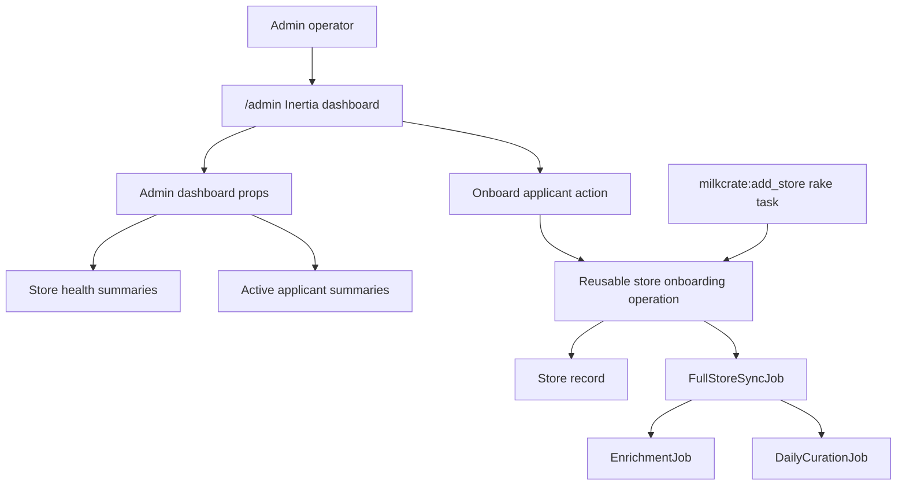

# feat: Admin Dashboard Workflow

## Summary

Build the admin overhaul as an Inertia-backed operational dashboard with a small Rails read-model boundary for store health, a reusable onboarding orchestration path shared by admin and rake, and local React dashboard primitives for a polished mobile-first layout.

---

## Problem Frame

The current `/admin` surface is an ERB waitlist table. It does not show live store health, does not distinguish applicants from stores already entering onboarding, and would force store setup through a manual rake task plus storefront/job checking. This plan turns admin into the single operational surface for reviewing applicants, starting onboarding, and watching stores move toward healthy.

---

## Requirements

- R1. `/admin` presents active stores first and current applicants second.
- R2. Active stores include every `Store`, including stores still processing their first sync or enrichment.
- R3. Each store has a visible health state: healthy, processing, stale, partial, failed, or needs attention.
- R4. Each store exposes quick health metadata: sync/enrichment recency, statuses, coverage, listing count, and recent sync error presence.
- R5. Applicants only include waitlist entries without a corresponding store.
- R6. Eligible applicants can be onboarded directly from the dashboard.
- R7. Applicant cards preserve the existing application details.
- R8. Onboarding queues background work rather than running synchronously from the admin request.
- R9. Once onboarding creates a store, the applicant leaves active applicants and the store appears as processing.
- R10. Good, processing, and bad states are visually unmistakable.
- R11. Failed sync/enrichment, stale timing, partial/low coverage, and missing readiness data count as attention-worthy.
- R12. `/admin` summarizes operational state but does not replace job/log tooling.
- R13. The dashboard is mobile-first with no horizontal scrolling.
- R14. Wider screens expand into a richer dashboard layout.
- R15. The UI uses the existing Inertia frontend and strong reusable UI primitives.

**Origin actors:** A1 (Admin operator), A2 (Applicant store), A3 (Active store)
**Origin flows:** F1 (Admin reviews dashboard), F2 (Admin onboards an applicant), F3 (Admin spots a store needing attention)
**Origin acceptance examples:** AE1-AE6

---

## Scope Boundaries

- No full applicant approval wizard.
- No applicant CRM, rejection workflow, notes workflow, or seller communication automation.
- No inline job logs or job-console replacement inside `/admin`.
- No broad store-editing surface beyond onboarding and health overview.
- No automatic retry policy.
- No full shadcn installation requirement; start with shadcn-style local primitives and add a library only if implementation makes the benefit concrete.

### Deferred to Follow-Up Work

- Job/log deep links or retry controls: useful once the first dashboard proves the health model, but not required for this version.
- Applicant communication automation: should be designed with the seller lifecycle, not attached opportunistically to onboarding.

---

## Context & Research

### Relevant Code and Patterns

- `config/routes.rb` currently routes `GET /admin` to `admin/waitlists#index`; admin auth lives in `app/controllers/admin/base_controller.rb`.
- `app/controllers/admin/waitlists_controller.rb` only loads `Waitlist.order(created_at: :desc)`.
- `app/views/admin/waitlists/index.html.erb` is the current ERB admin page; it already uses token classes and mobile card/table split.
- Inertia page patterns exist in `app/controllers/pages_controller.rb`, `app/controllers/stores_controller.rb`, and `app/frontend/pages/**/*.tsx`.
- `app/frontend/entrypoints/application.tsx` resolves Inertia pages by path from `app/frontend/pages`.
- `app/jobs/full_store_sync_job.rb` queues enrichment and curation after sync; `lib/tasks/milkcrate.rake` currently duplicates the create-store-and-queue entry point.
- `app/models/store.rb` carries sync/enrichment statuses, last sync/enrich timestamps, coverage, page count, total listings, and sync error fields.
- `app/models/waitlist.rb` normalizes `discogs_username` and exposes `with_discogs_username`, matching the `Store` lookup pattern.
- Request specs use inertia assertions in `spec/requests/stores_spec.rb`; admin auth request coverage exists in `spec/requests/admin/waitlists_spec.rb`.
- Frontend page smoke and responsive matrix coverage live in `app/frontend/test/pages/page_smoke.test.tsx` and `app/frontend/test/pages/responsive_surface_matrix.test.tsx`.

### Institutional Learnings

- `docs/solutions/architecture-patterns/viewport-context-responsive-architecture-2026-05-09.md` establishes compact/comfy/wide viewport tiers and `renderWithTier` testing.
- `docs/solutions/architecture-patterns/vendor-brand-responsive-surface-system-2026-05-14.md` establishes shared shell/primitive expectations and warns against reintroducing layout drift.
- `docs/solutions/logic-errors/responsive-branching-guard-condition-drift-2026-05-13.md` warns that responsive branches must preserve guard conditions across all tiers.

### External References

- None. Local Rails, Inertia, Active Job, and responsive React patterns are already strong enough for this feature.

---

## Key Technical Decisions

- **Use Inertia for admin dashboard:** Replace the ERB admin body with an Inertia page so the dashboard can use the same React, TypeScript, responsive, and component-testing patterns as the rest of the app.
- **Keep admin auth in Rails:** Preserve existing HTTP Basic auth in `Admin::BaseController`; do not introduce a new admin auth system.
- **Create a reusable onboarding orchestration path:** Extract the create-store-and-queue behavior out of the rake task so admin and rake share the same application-layer operation.
- **Use a read-model/presenter boundary for admin data:** Keep controller actions thin by shaping health, applicant, and dashboard props outside the controller. This follows layered Rails guidance: presentation layer formats for the UI; application/domain logic decides workflow and health semantics.
- **Health precedence:** Use failed first, then processing, then stale/missing readiness, then partial coverage, then healthy. This makes attention-worthy states win over merely informational states.
- **Start with local primitives:** Build small shadcn-style local components for badge/card/button/table/section needs instead of adopting a full component system immediately.

---

## Open Questions

### Resolved During Planning

- Health-state precedence: Failure wins over processing/stale/partial/healthy; processing wins over stale/partial until first work finishes.
- Onboarding boundary: Use a reusable onboarding operation shared by rake and admin, not controller-only duplication.
- UI primitive approach: Start with local primitives and existing Tailwind token classes; defer full shadcn setup unless implementation proves the need.

### Deferred to Implementation

- Exact health copy and labels: final microcopy should be tuned while building the dashboard and tests, as long as states remain visually and semantically distinct.
- Exact primitive file names: keep the primitives small and local; implementation can choose final names that match nearby frontend conventions.

---

## High-Level Technical Design

> *This illustrates the intended approach and is directional guidance for review, not implementation specification. The implementing agent should treat it as context, not code to reproduce.*

The core shape is one shared onboarding operation and one admin read model. Controllers route requests and render Inertia; they should not own health precedence or duplicate the rake task's store creation workflow.

---

## Implementation Units

### U1. Admin Dashboard Read Model and Health State

**Goal:** Provide a tested backend representation of active stores and current applicants for the dashboard.

**Requirements:** R1, R2, R3, R4, R5, R10, R11; F1, F3; AE1, AE2, AE3, AE6

**Dependencies:** None

**Files:**
- Create: `app/presenters/admin/dashboard_presenter.rb`
- Create: `app/presenters/admin/store_health_presenter.rb`
- Create: `spec/presenters/admin/dashboard_presenter_spec.rb`
- Create: `spec/presenters/admin/store_health_presenter_spec.rb`
- Modify: `spec/factories/stores.rb`
- Modify: `spec/factories/waitlists.rb`

**Approach:**
- Build a dashboard presenter that returns two collections: active stores and applicants.
- Active stores come from `Store` records ordered for scanning, with each item shaped into UI-ready data.
- Applicants come from `Waitlist` entries whose normalized `discogs_username` does not match an existing store.
- Build a store health presenter that maps raw store fields into a stable health key, label, severity, reasons, and display metadata.
- Keep the health presenter free of request or controller dependencies.
- Health precedence should be: failed sync/enrichment, processing sync/enrichment, stale or missing readiness, partial coverage, healthy.
- Treat stores with no `last_synced_at` or no `last_enriched_at` as processing or attention-worthy depending on current status; the dashboard must not call them healthy.

**Execution note:** Implement the health presenter test-first; it is the highest-risk logic because small precedence mistakes make the dashboard misleading.

**Patterns to follow:**
- `app/presenters/crate_presenter.rb` for presenter-shaped response data.
- `app/models/store.rb` for available store status and metadata fields.
- Layered Rails presenter guidance: view-specific formatting belongs in presentation objects, not models or controllers.

**Test scenarios:**
- Happy path: healthy store with recent sync/enrichment, near-complete coverage, and no errors returns health key `healthy`.
- Happy path: syncing store returns `processing` even if some stale fields are present.
- Error path: failed sync returns `failed` with sync error metadata visible.
- Error path: failed enrichment returns `failed` or equivalent attention state even when sync is healthy.
- Edge case: store with missing `last_synced_at` is not healthy.
- Edge case: store with missing `last_enriched_at` is not healthy after sync has completed.
- Edge case: stale `last_synced_at` or stale `last_enriched_at` returns `stale`.
- Edge case: partial catalog coverage returns `partial` when no higher-priority state exists.
- Integration: dashboard applicants exclude waitlist entries whose normalized username already exists as a store.
- Integration: dashboard includes every store, including newly created stores with processing/missing metadata.
- Covers AE1: active-store summaries include sync/enrichment recency, statuses, coverage, and listing count.
- Covers AE2: healthy, processing, and failed stores produce distinct health keys/severities.
- Covers AE3: only waitlist entries without matching stores appear as active applicants.

**Verification:**
- Presenter specs prove health precedence, applicant filtering, and store metadata shape.
- No controller spec needs to inspect raw model logic to know health status.

---

### U2. Reusable Store Onboarding Operation

**Goal:** Share the create-store-and-queue behavior between admin and the existing rake task.

**Requirements:** R6, R8, R9; F2; AE4

**Dependencies:** U1 for applicant/store state expectations

**Files:**
- Create: `app/services/store_onboarding.rb`
- Create: `spec/services/store_onboarding_spec.rb`
- Modify: `lib/tasks/milkcrate.rake`
- Modify: `spec/tasks/milkcrate_add_store_spec.rb`

**Approach:**
- Extract the current `milkcrate:add_store` behavior into a reusable application-layer operation.
- The operation accepts a Discogs username and optional source waitlist entry.
- It fetches the Discogs seller profile, creates the store with normalized username and resolved name, and queues `FullStoreSyncJob`.
- It returns a result object or store reference that callers can use for redirect/flash/output.
- The rake task should delegate to this operation and keep only CLI input/output concerns.
- For duplicate stores, surface a clear failure without queuing another sync.
- Do not delete waitlist entries; U1 filters applicants once a matching store exists. This preserves application history without adding a new waitlist state in this version.

**Execution note:** Use characterization from `spec/tasks/milkcrate_add_store_spec.rb` before modifying the rake task, then move core behavioral assertions to the service spec.

**Patterns to follow:**
- Existing rake task behavior in `lib/tasks/milkcrate.rake`.
- `app/jobs/full_store_sync_job.rb` for the existing queued background path.
- Layered Rails service-object guidance: this is an application operation orchestrating external lookup, persistence, and job enqueueing.

**Test scenarios:**
- Happy path: username with Discogs profile creates a store with the profile name.
- Happy path: onboarding queues `FullStoreSyncJob` for the created store.
- Happy path: source waitlist entry can be passed without deleting or mutating it.
- Edge case: blank username returns/raises a usage-style failure before calling Discogs.
- Error path: existing store for username does not create a duplicate and does not enqueue another sync.
- Error path: Discogs profile lookup failure does not create a store.
- Integration: rake task delegates to the operation and still prints the created store URL.
- Covers AE4: onboarding creates the store and queues work without performing full sync/enrichment inline.

**Verification:**
- Rake task behavior stays compatible.
- Service spec proves the reusable path is safe for admin and CLI callers.

---

### U3. Admin Routes, Controller, and Inertia Props

**Goal:** Route `/admin` to the new Inertia dashboard and add an authenticated onboarding action.

**Requirements:** R1, R2, R5, R6, R8, R9, R12; F1, F2; AE1, AE3, AE4, AE6

**Dependencies:** U1, U2

**Files:**
- Modify: `config/routes.rb`
- Create: `app/controllers/admin/dashboard_controller.rb`
- Create: `app/controllers/admin/onboardings_controller.rb`
- Modify or remove: `app/controllers/admin/waitlists_controller.rb`
- Modify: `spec/requests/admin/waitlists_spec.rb`
- Create: `spec/requests/admin/dashboard_spec.rb`
- Create: `spec/requests/admin/onboardings_spec.rb`

**Approach:**
- Keep `GET /admin` as the canonical admin entry point, now rendering an Inertia dashboard page.
- Continue to inherit HTTP Basic auth from `Admin::BaseController`.
- The dashboard controller should ask the dashboard presenter for props and render the admin Inertia page.
- Add a protected onboarding action that accepts a waitlist id, verifies the waitlist entry still exists and still has no matching store, calls the onboarding operation, and redirects back to `/admin` with a flash message.
- On successful onboarding, rely on the presenter filtering behavior: the applicant disappears because a matching store now exists, and the new store appears among active stores.
- Preserve fail-closed behavior when admin credentials are absent.
- Treat stale duplicate submissions defensively: if the store already exists by the time the action runs, do not create another store; redirect back with an explanatory notice/alert.

**Patterns to follow:**
- `app/controllers/admin/base_controller.rb` for admin auth.
- `app/controllers/pages_controller.rb` and `app/controllers/stores_controller.rb` for Inertia render patterns.
- Existing request specs in `spec/requests/admin/waitlists_spec.rb` for Basic auth setup.

**Test scenarios:**
- Happy path: authenticated `GET /admin` renders the admin Inertia component.
- Happy path: dashboard props include active stores and applicants.
- Happy path: authenticated onboarding action calls the onboarding operation and redirects back to `/admin`.
- Happy path: after onboarding, a matching store exists and the applicant is no longer included in dashboard applicant props.
- Error path: unauthenticated dashboard and onboarding requests return 401.
- Error path: missing admin credentials fail closed with 401.
- Error path: onboarding a waitlist entry whose store already exists does not call the operation again.
- Error path: onboarding service failure redirects/renders with an admin-visible failure message and does not hide the applicant.
- Covers AE1: `GET /admin` returns active-store health props.
- Covers AE3: `GET /admin` returns eligible applicant props.
- Covers AE4: onboarding request returns without performing sync/enrichment inline.
- Covers AE6: controller returns summaries, not inline job logs.

**Verification:**
- Request specs prove admin auth, Inertia component rendering, dashboard props, and onboarding redirect behavior.
- Existing `/admin` URL remains valid.

---

### U4. Admin Dashboard Types and Local UI Primitives

**Goal:** Add typed frontend contracts and small reusable primitives needed for the dashboard UI.

**Requirements:** R10, R13, R14, R15; AE2, AE5

**Dependencies:** U1 for final prop shape

**Files:**
- Modify: `app/frontend/types/inertia.ts`
- Create: `app/frontend/components/ui/badge.tsx`
- Create: `app/frontend/components/ui/button.tsx`
- Create: `app/frontend/components/ui/card.tsx`
- Create: `app/frontend/components/ui/section_header.tsx`
- Create: `app/frontend/components/ui/status_dot.tsx`
- Create: `app/frontend/components/ui/ui_primitives.test.tsx`

**Approach:**
- Define `AdminDashboardProps`, `AdminStoreSummary`, `AdminApplicantSummary`, and health/status types in the existing Inertia type module or a nearby admin-specific type file.
- Build local shadcn-style primitives using Tailwind classes and existing `mc-*` design tokens.
- Keep primitive APIs small: variants for health/status, button intent, and basic card/section layout.
- Do not introduce a full shadcn install, Radix dependency, or class-variance helper unless implementation shows a concrete need.
- Ensure primitives have accessible names/roles where interactive.

**Patterns to follow:**
- Existing Tailwind token classes in `app/views/admin/waitlists/index.html.erb` and React pages.
- `app/frontend/components/brand_mark.tsx` for small focused component style.
- `docs/solutions/architecture-patterns/vendor-brand-responsive-surface-system-2026-05-14.md` for shared primitives and no emoji/brand drift.

**Test scenarios:**
- Happy path: badge renders health variants with visible text and stable class hooks.
- Happy path: button renders as a native button for forms and supports disabled/processing state.
- Happy path: card and section primitives render headings/content without nested interactive elements.
- Edge case: long labels do not rely on fixed-width text containers that would force overflow.
- Accessibility: status dot/badge expose text labels, not color-only meaning.

**Verification:**
- Frontend component tests cover primitive rendering and accessibility basics.
- No new dependency is required for the primitive layer.

---

### U5. Inertia Admin Dashboard Page

**Goal:** Implement the polished mobile-first admin dashboard UI.

**Requirements:** R1-R15; F1, F2, F3; AE1-AE6

**Dependencies:** U3, U4

**Files:**
- Create: `app/frontend/pages/admin/dashboard.tsx`
- Create: `app/frontend/pages/admin/dashboard.test.tsx`
- Modify: `app/frontend/test/pages/page_smoke.test.tsx`
- Modify: `app/frontend/test/pages/responsive_surface_matrix.test.tsx`
- Modify: `app/frontend/types/inertia.ts`

**Approach:**
- Render active stores first, applicants second.
- Use compact cards on mobile and denser dashboard sections on wider screens.
- Active store cards should show store identity, health badge, sync/enrichment recency, coverage, listing count, status chips, and error presence when relevant.
- Applicants should show existing waitlist fields and an onboard form/action for eligible entries.
- Use native forms or Inertia form submission for onboarding, keeping Basic-auth-admin assumptions intact.
- Make processing state obvious for stores created but still waiting on first sync/enrichment.
- Avoid UI cards inside cards; repeated store/applicant cards are valid, page sections should be unframed bands or simple constrained layouts.
- Do not expose full job logs; provide concise reason text and optionally link to the storefront or jobs area if existing routes make that cheap without expanding scope.
- Add the admin page to smoke and responsive matrices so provider/layout regressions are caught.

**Execution note:** Build the dashboard test-first at the page/component level for state rendering before polishing visuals.

**Patterns to follow:**
- `app/frontend/pages/apply.tsx` for Inertia forms and polished page composition.
- `app/frontend/test/pages/responsive_surface_matrix.test.tsx` for tier coverage.
- `docs/solutions/logic-errors/responsive-branching-guard-condition-drift-2026-05-13.md` for guard-parity audit across compact/comfy/wide branches.

**Test scenarios:**
- Happy path: active stores render before applicants.
- Happy path: healthy, processing, stale, partial, and failed stores render distinct labels and reason text.
- Happy path: applicant cards render store name, email, Discogs username, inventory size, notes, submitted date, and onboard action.
- Happy path: onboard action submits to the admin onboarding route.
- Empty state: no stores and no applicants renders useful empty dashboard states.
- Edge case: long applicant notes and long store names wrap without overlapping actions.
- Edge case: store with error metadata shows concise attention copy without rendering full logs.
- Responsive: compact tier renders readable stacked cards with no table-only layout.
- Responsive: comfy/wide tiers render denser dashboard layout without dropping health or applicant fields.
- Covers AE1: active store metadata is visible.
- Covers AE2: health states are visually and textually distinct.
- Covers AE3: applicant details and onboard action are visible.
- Covers AE5: compact and desktop layouts both render the same actionable content.
- Covers AE6: issue summary appears without inline job logs.

**Verification:**
- Frontend tests prove state rendering, forms, and responsive tier behavior.
- The admin page is included in smoke/regression matrices.

---

### U6. Remove ERB Admin Surface and Preserve Operational Compatibility

**Goal:** Finish the transition from waitlist-only ERB admin to Inertia dashboard without breaking existing admin behavior.

**Requirements:** R1, R5, R7, R12, R13, R14

**Dependencies:** U3, U5

**Files:**
- Delete or stop using: `app/views/admin/waitlists/index.html.erb`
- Modify: `spec/requests/admin/waitlists_spec.rb`
- Modify: `spec/requests/admin/dashboard_spec.rb`
- Review: `app/views/seller_mailer/admin_notification.html.erb`
- Review: `app/views/seller_mailer/admin_notification.text.erb`

**Approach:**
- Once `/admin` renders Inertia, remove or retire the ERB-only waitlist view.
- Keep mailer links pointing to `/admin`; no email behavior change is required.
- Update old admin request specs so they assert dashboard behavior rather than ERB table markup.
- Preserve existing title/copy expectations where still useful, but avoid brittle class assertions from the retired ERB view.

**Patterns to follow:**
- Existing mailer admin links already target `/admin`; preserve that route.
- Existing admin request auth coverage remains valuable and should move forward.

**Test scenarios:**
- Happy path: admin notification email still links to `/admin`.
- Happy path: `/admin` route no longer depends on ERB template rendering.
- Regression: Basic auth behavior is unchanged after retiring the waitlist controller/view.
- Regression: active applicant data still includes all fields formerly shown in the ERB table.

**Verification:**
- No request spec depends on old ERB table/card markup.
- `/admin` remains the one admin URL referenced by mailers.

---

## System-Wide Impact

- **Interaction graph:** `/admin` now crosses Rails admin auth, presenter/read-model code, Inertia props, React dashboard UI, and Active Job enqueueing.
- **Error propagation:** Onboarding failures should return admin-visible feedback without hiding the applicant or creating partial duplicate stores.
- **State lifecycle risks:** Store creation is the transition point from applicant to active store; waitlist history remains in place and is filtered out of active applicants.
- **API surface parity:** Rake task and admin action must share onboarding behavior so store creation semantics do not drift.
- **Integration coverage:** Request specs must cover admin auth, Inertia props, and onboarding enqueue behavior; frontend tests must cover health/status rendering and responsive layouts.
- **Unchanged invariants:** Public apply/storefront flows remain unchanged; `/jobs` remains the job tooling surface; store sync/enrichment job behavior remains the existing background path.

---

## Risks & Dependencies

| Risk | Mitigation |
|------|------------|
| Health precedence misclassifies a troubled store as healthy | Test the health presenter across failed, processing, stale, partial, missing-data, and healthy combinations. |
| Admin and rake onboarding drift | Route both through `StoreOnboarding` and keep rake specs as compatibility coverage. |
| Inertia admin loses existing Basic auth guarantees | Keep controllers under `Admin::BaseController` and preserve request specs for unauthenticated/wrong/missing credentials. |
| Responsive dashboard drops fields on one tier | Add compact/comfy/wide tests and follow guard-parity guidance for responsive branches. |
| UI primitive work expands into a design-system migration | Limit primitives to components needed by this dashboard; defer full shadcn setup. |

---

## Documentation / Operational Notes

- The requirements doc remains the product source of truth: `docs/brainstorms/2026-05-16-admin-dashboard-workflow-requirements.md`.
- No operator docs are required for v1, but the PR description should mention that `/admin` now starts onboarding and that the old rake task delegates to the same path.
- Manual verification should include one healthy store, one failed/stale store, one processing/new store, and one applicant.

---

## Sources & References

- **Origin document:** `docs/brainstorms/2026-05-16-admin-dashboard-workflow-requirements.md`
- Related code: `app/controllers/admin/base_controller.rb`
- Related code: `app/controllers/admin/waitlists_controller.rb`
- Related code: `app/views/admin/waitlists/index.html.erb`
- Related code: `app/models/store.rb`
- Related code: `app/models/waitlist.rb`
- Related code: `lib/tasks/milkcrate.rake`
- Related code: `app/jobs/full_store_sync_job.rb`
- Related code: `app/frontend/entrypoints/application.tsx`
- Related tests: `spec/requests/admin/waitlists_spec.rb`
- Related tests: `spec/tasks/milkcrate_add_store_spec.rb`
- Related tests: `app/frontend/test/pages/responsive_surface_matrix.test.tsx`
- Institutional learning: `docs/solutions/architecture-patterns/viewport-context-responsive-architecture-2026-05-09.md`
- Institutional learning: `docs/solutions/architecture-patterns/vendor-brand-responsive-surface-system-2026-05-14.md`
- Institutional learning: `docs/solutions/logic-errors/responsive-branching-guard-condition-drift-2026-05-13.md`
