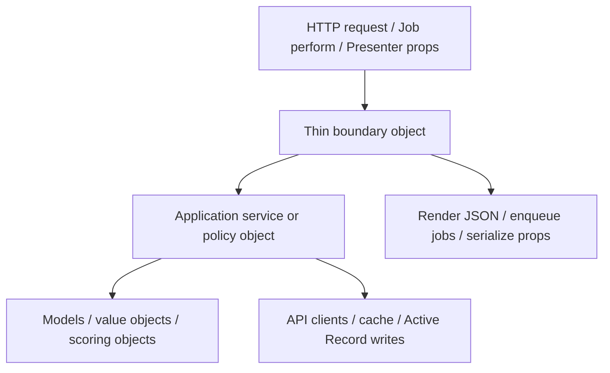

# refactor: Resolve Layered Audit Follow-Up Findings

## Summary

Follow up on the latest layered-rails audit by moving controller-owned lookup behavior, lifecycle state transitions, admin health policy, daily-selection scoring, and storefront section shaping into clearer layer-specific objects. The work is an internal refactor: preserve request/response behavior, job behavior, curation output, and frontend props while reducing presentation-to-application leakage and duplicated orchestration.

---

## Problem Frame

The May 13 layered-architecture cleanup removed several earlier violations, but the current code still has responsibility drift at active growth points. Controllers and presenters own policy decisions, jobs duplicate service lifecycle state, one selection service carries a separate scoring model, and `StorefrontCuration` mixes curation with UI section shape. These are not runtime bugs today, but they make future storefront, onboarding, and admin changes harder to reason about.

---

## Requirements

- R1. Keep all user-facing behavior unchanged for Discogs lookup, waitlist submission, store sync, enrichment, admin dashboard, daily selection, and storefront rendering.
- R2. Move Discogs lookup validation, caching, upstream lookup, and API-error mapping out of `Api::DiscogsLookupController`.
- R3. Consolidate sync and enrichment lifecycle state ownership so jobs are thin wrappers and state transitions are owned by service/domain APIs.
- R4. Move admin store-health classification rules out of presentation serialization while preserving the existing dashboard prop shape.
- R5. Align `DailySelectionService` scoring with the domain scoring model and make generated selections respect the caller-supplied date consistently.
- R6. Keep storefront curation as curation logic and move UI section-key shaping toward presentation/view-model code without changing storefront props.
- R7. Defer minor controller cleanup that is not necessary to address the audit's main architectural risks.

---

## Scope Boundaries

- No new product behavior, storefront UI changes, admin UI changes, or copy changes.
- No new architecture enforcement tooling, package boundaries, gems, or lint rules.
- No changes to `DiscogsClient`, `MusicBrainzClient`, or external API contracts beyond call-site relocation.
- No database schema changes.
- No frontend TypeScript changes unless implementation discovers a serialized prop parity issue that cannot be resolved server-side.

### Deferred to Follow-Up Work

- Waitlist submission orchestration cleanup in `WaitlistsController`: this is mild drift today and should be handled separately if waitlist behavior grows.
- Broader `StorefrontCuration` decomposition beyond section shaping: strategy extraction is already documented and should not be reopened unless new crate types require it.
- Architecture enforcement automation such as Packwerk, custom RuboCop rules, or CI checks.

---

## Context & Research

### Relevant Code and Patterns

- `app/controllers/api/discogs_lookup_controller.rb` currently combines request handling with username policy, cache policy, Discogs lookup, and upstream error mapping.
- `spec/requests/discogs_lookup_spec.rb` already captures valid lookup, missing seller, rate limit, invalid slug, reserved slug, and cache behavior.
- `app/services/store_sync_service.rb` owns sync status updates, while `app/jobs/full_store_sync_job.rb` currently writes overlapping sync metadata after the service returns.
- `app/jobs/enrichment_job.rb` owns enrichment status transitions directly while delegating release/image work to `app/services/enrichment_service.rb`.
- `app/presenters/admin/store_health_presenter.rb` serializes dashboard props and also classifies health states; `spec/presenters/admin/store_health_presenter_spec.rb` documents the priority order.
- `app/services/daily_selection_service.rb` has its own scoring weights and uses `Date.current` internally even when `#generate(date:)` receives another date.
- `app/services/storefront_curation.rb` follows the documented crate strategy pattern but still emits UI section keys through `#storefront_sections`.
- `app/presenters/crate_presenter.rb` already serializes crate and listing props, making it the natural presentation boundary for storefront section props.

### Institutional Learnings

- `docs/solutions/architecture-patterns/crate-strategies-pattern-2026-05-07.md` says curation strategies should stay pure, share `RecordScorer`, and let callers wrap/cap strategy output. The follow-up should preserve this pattern rather than reworking strategy internals.
- `docs/solutions/logic-errors/responsive-branching-guard-condition-drift-2026-05-13.md` highlights that refactors which split branches can silently drop guards. This plan should use characterization tests before moving branching/classification logic.

### External References

- External research is not required for this plan. The repo has direct local patterns for Rails request specs, service specs, presenters, background jobs, and curation strategy objects.

---

## Key Technical Decisions

- Use characterization-first refactoring for behavior-preserving moves: each boundary change should first pin the existing response, prop, or state-transition behavior it will preserve.
- Keep new abstractions small and named after the responsibility they own: lookup, lifecycle, health classification, daily selection scoring, and storefront section presentation.
- Prefer application/service objects for orchestration and policy that crosses models or infrastructure; keep presenters focused on serialization and view-specific formatting.
- Treat the May 13 layered architecture requirements and plan as historical context, not the origin document, because the current code already implements most of that plan.

---

## Open Questions

### Resolved During Planning

- Should the older May 13 layered plan be updated in place? No. The current code has already moved past much of that plan, so this follow-up gets a new plan file scoped to the latest audit.
- Should waitlist submission cleanup be in scope? No. It is noted as mild drift, but the main plan should address higher-risk architecture seams first.

### Deferred to Implementation

- Exact class names for extracted objects may be adjusted to fit Rails autoloading and surrounding naming conventions.
- Final method names for the storefront curation grouping API may adjust during implementation, but the planned boundary is fixed: curation returns crate groups, presentation assigns section keys.
- Exact helper names inside `RecordScorer` may adjust during implementation, but the planned sharing point is fixed: `DailySelectionService` should consume scorer-derived signals instead of duplicating condition/desirability logic.

---

## High-Level Technical Design

> *This illustrates the intended approach and is directional guidance for review, not implementation specification. The implementing agent should treat it as context, not code to reproduce.*

The refactor should make the boundary object responsible for framework concerns only: params, render, job lookup, or prop serialization. Application objects own orchestration, policy decisions, and lifecycle transitions. Domain objects own scoring and state semantics. Infrastructure remains behind existing clients, cache, and Active Record calls.

---

## Implementation Units

### U1. Extract Discogs Seller Lookup

**Goal:** Move username validation, reserved-slug policy, caching, Discogs profile lookup, and API-error mapping out of `Api::DiscogsLookupController`.

**Requirements:** R1, R2

**Dependencies:** None

**Files:**
- Create: `app/services/discogs_seller_lookup.rb`
- Modify: `app/controllers/api/discogs_lookup_controller.rb`
- Test: `spec/services/discogs_seller_lookup_spec.rb`
- Test: `spec/requests/discogs_lookup_spec.rb`

**Approach:**
- Add a lookup object that accepts the username string plus injectable collaborators for the Discogs client and cache.
- Move the validation constants, reserved slug list, cache key, TTL policy, and upstream error mapping into that object.
- Keep the controller responsible for extracting `params[:username]`, calling the lookup object, and rendering the returned response hash/status.
- Preserve the current JSON shape for found, invalid, and API-error responses.

**Execution note:** Start with service specs that mirror the current request-spec scenarios, then keep request specs as integration coverage for route/controller parity.

**Patterns to follow:**
- `TurnstileVerifier` for a small external-service boundary with explicit upstream failure handling.
- `spec/requests/discogs_lookup_spec.rb` for existing public request contract coverage.

**Test scenarios:**
- Happy path: username with whitespace/case variations is normalized, looked up once, and returns `found: true` with seller name and avatar URL.
- Happy path: successful lookup is cached; a second lookup for the same normalized username does not call the Discogs client again.
- Edge case: usernames shorter than the minimum, longer than the maximum, containing invalid characters, starting/ending with separators, or matching reserved slugs return `found: false` with `reason: "invalid_slug"`.
- Error path: Discogs API errors, rate limit errors, and Faraday errors return `found: false` with `reason: "api_error"` and do not cache the error result.
- Integration: `GET /api/discogs/lookup/:username` returns the same status and JSON body as before the extraction.

**Verification:**
- The controller has no Discogs client, cache, regex, TTL, or reserved-slug policy logic left.
- Request specs and service specs prove identical valid, invalid, cache, and upstream-error behavior.

---

### U2. Consolidate Sync and Enrichment Lifecycle Ownership

**Goal:** Make background jobs thin wrappers by moving duplicated sync metadata writes and enrichment status transitions into service/domain-owned APIs.

**Requirements:** R1, R3

**Dependencies:** None

**Files:**
- Modify: `app/jobs/full_store_sync_job.rb`
- Modify: `app/jobs/enrichment_job.rb`
- Modify: `app/models/store.rb`
- Modify: `app/services/store_sync_service.rb`
- Modify: `app/services/enrichment_service.rb`
- Test: `spec/jobs/full_store_sync_job_spec.rb`
- Test: `spec/jobs/enrichment_job_spec.rb`
- Test: `spec/models/store_spec.rb`
- Test: `spec/services/store_sync_service_spec.rb`
- Test: `spec/services/enrichment_service_spec.rb`

**Approach:**
- Remove the second success metadata write from `FullStoreSyncJob`; `StoreSyncService#sync` should remain the owner of sync start time, sync status, catalog coverage, page count, and total listing count.
- Add model-level enrichment lifecycle helpers or an `EnrichmentService` orchestration entry point so `EnrichmentJob` does not directly manage `enrichment_status` and `last_enriched_at`.
- Keep `FullStoreSyncJob` responsible for finding the store, invoking sync, enqueueing follow-up jobs, and logging.
- Keep `EnrichmentJob` responsible for finding the store and invoking one service entry point.

**Execution note:** Characterize current sync watermark and enrichment status transitions before removing duplicated writes.

**Patterns to follow:**
- `Store#mark_sync_succeeded!` and `Store#mark_sync_failed!` for model-owned lifecycle transitions.
- Existing service specs around `StoreSyncService#sync` and job specs around job enqueue behavior.

**Test scenarios:**
- Happy path: successful `StoreSyncService#sync` sets `sync_status` to idle, clears sync errors, persists `last_synced_at`, `catalog_coverage`, `inventory_page_count`, and `total_listings`.
- Happy path: `FullStoreSyncJob` enqueues `EnrichmentJob` and `DailyCurationJob` after sync without rewriting sync metadata.
- Edge case: sync availability watermark still uses sync start time, not completion time, so `Listing.available` behavior is unchanged.
- Error path: sync failure records `sync_status: "failed"`, error summary, and error timestamp through the same store lifecycle API.
- Happy path: enrichment orchestration sets status to enriching, then idle with `last_enriched_at` after both enrichment phases finish.
- Error path: hard enrichment failure marks status failed and re-raises; individual API errors handled inside `EnrichmentService` still allow the job to finish idle.

**Verification:**
- Jobs no longer contain direct lifecycle metadata writes beyond framework-level orchestration.
- Existing job/service specs pass with added assertions that state ownership lives in the service/domain layer.

---

### U3. Extract Admin Store Health Classification

**Goal:** Move health-state policy out of `Admin::StoreHealthPresenter` while preserving the dashboard prop shape.

**Requirements:** R1, R4

**Dependencies:** None

**Files:**
- Create: `app/services/admin/store_health.rb`
- Modify: `app/presenters/admin/store_health_presenter.rb`
- Test: `spec/services/admin/store_health_spec.rb`
- Test: `spec/presenters/admin/store_health_presenter_spec.rb`
- Test: `spec/presenters/admin/dashboard_presenter_spec.rb`

**Approach:**
- Extract the status priority rules into a small object that receives a store and returns classification data: key, label, severity, reasons, sync-error presence, and sync-error summary.
- Keep the presenter responsible for assembling serialized store fields and embedding the health object's data.
- Preserve the current priority order: failed, processing, missing readiness, stale, partial, healthy.
- Keep time-dependent staleness behavior explicit and testable.

**Execution note:** Move the existing presenter health examples into service-level characterization tests before trimming the presenter.

**Patterns to follow:**
- `Admin::DashboardPresenter` delegating store-specific serialization to `Admin::StoreHealthPresenter`.
- Existing presenter specs that pin dashboard prop shapes.

**Test scenarios:**
- Happy path: recently synced and enriched near-complete store classifies as healthy.
- Happy path: failed sync or failed enrichment wins over processing, stale, and partial signals.
- Happy path: syncing or enriching stores classify as processing even when timestamps are stale.
- Edge case: missing sync/enrichment timestamps classify as processing/readiness, preserving the existing label and severity.
- Edge case: partial catalog coverage classifies as partial only when no higher-priority signal exists.
- Integration: `Admin::StoreHealthPresenter#props` still returns the same top-level keys and nested `health` hash used by `Admin::DashboardPresenter`.

**Verification:**
- Health policy methods no longer live in the presenter.
- Service specs cover classification priority; presenter specs cover serialization shape.

---

### U4. Align Daily Selection Scoring and Date Semantics

**Goal:** Make `DailySelectionService` use a shared domain scoring concept and honor the `date:` argument throughout selection generation.

**Requirements:** R1, R5

**Dependencies:** None

**Files:**
- Modify: `app/services/daily_selection_service.rb`
- Modify: `app/models/record_scorer.rb`
- Test: `spec/services/daily_selection_service_spec.rb`
- Test: `spec/models/record_scorer_spec.rb`

**Approach:**
- Add characterization tests for current daily-selection behaviors: idempotence, carry-over, cap, recent-listing boost, condition/desirability boost, and unseen boost.
- Pass the requested generation date through the whole service, including carry-over, fresh scoring, and recent-selection lookup; remove internal `Date.current` dependencies except the default argument boundary.
- Use `RecordScorer` as the source of record-quality signals for condition and desirability. Keep daily-selection-specific concerns, such as weighted sampling and unseen boost, in `DailySelectionService`.
- Preserve weighted sampling behavior and `DailySelection` persistence semantics.

**Execution note:** This unit should be test-first because the current date drift is subtle and easy to preserve accidentally.

**Patterns to follow:**
- `RecordScorer#score_breakdown` as the existing domain scoring surface.
- `docs/solutions/architecture-patterns/crate-strategies-pattern-2026-05-07.md` for keeping selection strategies aligned around one scoring model.

**Test scenarios:**
- Happy path: generating for a date creates or updates one `DailySelection` for that exact date.
- Happy path: yesterday carry-over uses the day before the supplied date, not the system date.
- Happy path: recent-selection boost exclusion uses a window relative to the supplied date, not `Date.current`.
- Happy path: good condition and strong want/have signals influence daily-selection weight through scorer-derived signals rather than duplicated constant checks.
- Edge case: generating a historical date while the system date differs produces scoring relative to the requested date.
- Edge case: selection cap is still enforced after scoring changes.
- Integration: a listing with stronger shared scorer signals receives a higher selection weight than a weaker listing, while unseen boost remains applied.

**Verification:**
- `DailySelectionService` no longer calls `Date.current` outside the default argument boundary.
- Daily-selection and record-scorer specs document which signals are shared and which remain daily-selection-specific.

---

### U5. Separate Storefront Section Presentation from Curation

**Goal:** Keep `StorefrontCuration` focused on selecting crates and move UI section-key shaping toward presentation/view-model code.

**Requirements:** R1, R6

**Dependencies:** U4 is conceptually related but not required.

**Files:**
- Modify: `app/services/storefront_curation.rb`
- Modify: `app/presenters/crate_presenter.rb`
- Modify: `app/controllers/stores_controller.rb`
- Modify: `app/presenters/marketing_preview_presenter.rb`
- Test: `spec/services/storefront_curation_spec.rb`
- Test: `spec/presenters/crate_presenter_spec.rb`
- Test: `spec/presenters/marketing_preview_presenter_spec.rb`
- Test: `spec/requests/stores_spec.rb`
- Test: `spec/requests/pages_spec.rb`

**Approach:**
- Preserve the current crate selection and top-down dedupe behavior.
- Add a curation grouping API on `StorefrontCuration` that returns crate groups without final UI section keys: one picks crate, zero or more featured crates, and zero or more genre crates.
- Move final section assembly into `CratePresenter`, where group names become the existing `picks_wall`, `featured_crates`, and `genre_grid` section keys and crate/listing props are serialized.
- Keep `#surfaced_listings` derived from the same grouped curation result so daily curation marks exactly the displayed records.
- Avoid reworking the documented strategy classes unless implementation reveals duplication that cannot be avoided otherwise.

**Execution note:** Characterize `storefront_sections` output order and dedupe behavior before changing the boundary.

**Patterns to follow:**
- `CratePresenter#build_storefront_sections` already owns serialization of section hashes.
- `docs/solutions/architecture-patterns/crate-strategies-pattern-2026-05-07.md` for preserving the strategy interface and shared scoring.

**Test scenarios:**
- Happy path: storefront response still serializes sections in `picks_wall`, `featured_crates`, `genre_grid` order when featured crates exist.
- Happy path: storefront response still omits the featured row when featured crates underfill.
- Edge case: top-down dedupe across picks, featured crates, and genre crates remains unchanged.
- Edge case: `#surfaced_listings` still returns unique listings from all displayed crates for daily curation.
- Integration: store show and homepage preview request specs still receive the same prop shape after the section boundary moves.

**Verification:**
- `StorefrontCuration` no longer owns final UI section-key hashes.
- `CratePresenter` owns section key assignment and serialization.
- Storefront service, presenter, and request specs prove output parity.

---

## System-Wide Impact

- **Interaction graph:** Requests still enter through controllers; jobs still enter through Active Job; presenters still produce Inertia props. The plan changes which object owns policy and orchestration behind those entry points.
- **Error propagation:** Discogs lookup API errors remain converted into non-error JSON responses. Sync/enrichment hard failures still re-raise through jobs after state is recorded. Individual enrichment API errors remain logged and skipped.
- **State lifecycle risks:** Removing duplicate sync writes can expose tests that depended on job-side metadata updates. U2 explicitly pins watermark and status behavior before the removal.
- **API surface parity:** Public HTTP JSON and Inertia prop shapes should not change. Request specs remain the parity guard.
- **Integration coverage:** Discogs lookup, full sync job, enrichment job, admin dashboard props, daily selection persistence, and storefront props all need cross-layer coverage because mocks alone will not prove behavior preservation.
- **Unchanged invariants:** No external API client contracts, database schema, frontend component props, route names, or background job queue names should change.

---

## Risks & Dependencies

| Risk | Mitigation |
|------|------------|
| Behavior changes hide inside "pure refactor" work | Add characterization specs before moving each boundary, especially for lookup JSON, health priority, sync watermark, and storefront section shape |
| New service objects become another bag of services | Keep each extraction scoped to one policy/orchestration responsibility and name it after the business behavior it owns |
| Storefront curation refactor accidentally reorders or duplicates records | Preserve existing service specs for section order, featured omission, dedupe, and surfaced listings |
| Daily selection scoring changes selection feel unintentionally | Preserve weighted sampling semantics and test relative weight behavior rather than exact random output |
| Lifecycle consolidation obscures job failure behavior | Keep job specs focused on orchestration and service/model specs focused on state transitions |

---

## Documentation / Operational Notes

- No user-facing documentation changes are expected.
- If implementation significantly changes the crate section boundary, update `docs/solutions/architecture-patterns/crate-strategies-pattern-2026-05-07.md` only after the new pattern is proven by tests.
- Before PR review, run the repository's layered review extensions from `compound-engineering.local.md`, especially `layered-rails`, Rails reviewer, and security sentinel.

---

## Sources & References

- Latest layered-rails audit from the current session
- Historical plan: `docs/plans/2026-05-13-002-refactor-layered-architecture-plan.md`
- Historical requirements: `docs/brainstorms/layered-architecture-fixes-requirements.md`
- Product strategy: `STRATEGY.md`
- Local guidance: `AGENTS.md`, `compound-engineering.local.md`
- Institutional learning: `docs/solutions/architecture-patterns/crate-strategies-pattern-2026-05-07.md`
- Institutional learning: `docs/solutions/logic-errors/responsive-branching-guard-condition-drift-2026-05-13.md`
