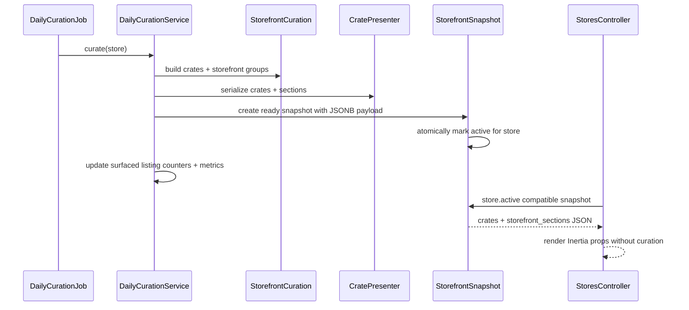

# feat: Persist Daily Storefront Curation Snapshots

## Summary

Persist each store's daily storefront curation as a store-owned, versioned JSONB snapshot generated by the daily curation job. Public store requests should read the active compatible snapshot and return presenter-shaped Inertia props without running `StorefrontCuration`, while daily generation keeps the existing strategy boundaries and records enough freshness, failure, and metric data to operate stale-while-good.

---

## Problem Frame

Public store pages currently run expensive Ruby curation during the request path. The origin ideation measured `philadelphiamusic` taking roughly 3.8s to compute `crates` plus `storefront_groups`, while the daily curation job already exists but only updates listing surfacing counters. This plan turns daily curation into a durable artifact that supports fast storefront render without changing the storefront browsing product shape.

---

## Requirements

- R1. Public store render must avoid request-time `StorefrontCuration` when an active compatible snapshot exists.
- R2. A store must own its curation history through `Store has_many :storefront_snapshots`, with one active snapshot per store.
- R3. Snapshot payloads must be persisted as primitive JSONB props shaped by `CratePresenter`, not as cached Active Record or `CuratedCrate` objects.
- R4. Snapshots must carry a schema/version boundary so old payload shapes can remain for audit while readers reject incompatible active data.
- R5. Daily generation must keep curation strategy objects pure and preserve existing surfacing bookkeeping.
- R6. Missing, failed, stale, or incompatible snapshots must have explicit stale-while-good fallback behavior and observable failure metadata.
- R7. The implementation must include instrumentation for generation duration, surfaced counts, crate counts, and serialized payload size.

---

## Scope Boundaries

- No frontend lazy crate-detail loading in this pass. The snapshot should persist both `crates` and `storefront_sections` for current page compatibility.
- No cache layer as source of truth. `Rails.cache`/Solid Cache may be layered later over active snapshot props, keyed by snapshot ID and schema version.
- No PostgreSQL materialized view for curation. Ruby strategy orchestration remains the curation engine.
- No redesign of crate selection, scoring, featured crate ordering, or storefront section semantics.
- No admin health UI changes beyond storing status/failure data that a later admin surface can consume.

### Deferred to Follow-Up Work

- Split initial store floor payload from crate detail payload, with crate detail fetched by `snapshot_id` and crate slug.
- Cache serialized active snapshot props after the durable snapshot path is in production.
- Add admin dashboard health indicators for stale or failed storefront curation.
- Consider SQL/materialized helper tables only if daily snapshot generation itself becomes too slow.

---

## Context & Research

### Relevant Code and Patterns

- `StoresController#render_store` currently instantiates `StorefrontCuration`, calls both `crates` and `storefront_groups`, and passes both through `CratePresenter`.
- `StorefrontCuration` already exposes the two domain outputs needed for compatibility: full crate list and grouped storefront sections.
- `CratePresenter` converts stores, crates, and listings into primitive hashes matching `app/frontend/types/inertia.ts`.
- `DailyCurationJob` is already scheduled by `config/recurring.yml` at 1am and delegates each store to `DailyCurationService`.
- `DailyCurationService` currently updates `last_surfaced_at` and `surface_count`, so snapshot writing should extend that application operation rather than move persistence into strategies.
- `DailySelection` demonstrates the existing store-owned daily artifact pattern: `belongs_to :store` and array storage for selected listing IDs. Snapshot retry semantics differ from `DailySelection`, so this plan should not copy its store/date uniqueness rule directly.
- `db/schema.rb` already uses Postgres JSONB and array columns, including `listings.tracklist` and `daily_selections.listing_ids`.

### Institutional Learnings

- `docs/solutions/architecture-patterns/crate-strategies-pattern-2026-05-07.md` says selection strategies stay pure, share `RecordScorer`, and let callers cap/wrap output. Snapshot persistence should sit around `StorefrontCuration`, not inside strategy classes.
- The same learning documents that `crates` and `storefront_sections` are separate payload shapes for different storefront surfaces. This plan preserves both initially to avoid coupling snapshot persistence to a frontend payload split.
- `STRATEGY.md` frames milkcrate around fast, characterful, algorithmic storefront browsing. Persisted curation supports that by making the digger's algorithm happen off the buyer request path.

### External References

- The origin ideation already captured the relevant external guidance: Rails low-level caching is appropriate for serializable values but not Active Record instances, and PostgreSQL materialized views are not the right first move for Ruby strategy orchestration.
- Context7 documentation tools were requested by repo instructions but are not available in this Codex harness; this plan relies on local Rails/Postgres patterns and the origin document's cited external research.

---

## Key Technical Decisions

- Store snapshots as a separate `StorefrontSnapshot` model, not columns on `stores`: snapshots have their own lifecycle, history, status, schema version, metrics, and failure data.
- Store presenter-shaped JSONB, not normalized per-record snapshot rows: request-time render should not rebuild nested section/crate props, and schema versioning gives a clearer compatibility boundary than trying to migrate many columns for every frontend prop change.
- Keep `CratePresenter` as the single serialization path: daily generation should call the same presenter methods the controller uses today so snapshot payloads and live props do not drift.
- Introduce a snapshot schema version constant on the model or a small writer object: the reader should only serve active snapshots matching the current props contract.
- Use stale-while-good fallback: a failed daily run records failure metadata but does not deactivate the last successful compatible snapshot.
- Keep first-load payload splitting deferred: persisting both `crates` and `storefront_sections` removes request-time curation first, then a later plan can reduce payload size safely.
- Respect Rails layering: controllers read prepared presentation artifacts; `DailyCurationService` orchestrates application work; curation strategies remain domain selection logic; snapshot persistence stays in the model/application boundary.

---

## Open Questions

### Resolved During Planning

- Should the snapshot belong to a store? Yes. Use `Store has_many :storefront_snapshots` and `StorefrontSnapshot belongs_to :store`.
- Should snapshot data be model attributes or raw JSON? Use JSONB for the nested presenter-shaped artifact, plus normal columns for lifecycle/query metadata.
- Should snapshots replace existing surfacing counters? No. Preserve `last_surfaced_at` and `surface_count` updates as daily curation bookkeeping.
- Should request-time rendering compute curation as fallback? Only as an explicit compatibility fallback for missing first snapshots in development or bootstrapping; production should prefer stale compatible snapshots and observable failure.

### Deferred to Implementation

- Exact enum values for snapshot status can be finalized while implementing, but the model must represent at least ready/success, generating, and failed states.
- Exact metric names can be tuned during implementation, but duration, surfaced count, crate count, and serialized payload size must be recorded.
- Whether the active snapshot invariant is enforced by a partial unique index alone or paired with model methods is an implementation detail; the plan requires database-level protection.

---

## High-Level Technical Design

> *This illustrates the intended approach and is directional guidance for review, not implementation specification. The implementing agent should treat it as context, not code to reproduce.*

---

## Implementation Units

### U1. Add StorefrontSnapshot Persistence Model

**Goal:** Add a store-owned persistence model for daily storefront artifacts with JSONB payload columns, lifecycle metadata, schema versioning, and database-enforced active-snapshot uniqueness.

**Requirements:** R2, R3, R4, R6

**Dependencies:** None

**Files:**
- Create: `db/migrate/*_create_storefront_snapshots.rb`
- Create: `app/models/storefront_snapshot.rb`
- Modify: `app/models/store.rb`
- Create: `spec/models/storefront_snapshot_spec.rb`
- Modify: `spec/models/store_spec.rb`
- Create: `spec/factories/storefront_snapshots.rb`

**Approach:**
- Create `storefront_snapshots` with `store_id`, `curation_date`, `status`, `active`, `props_schema_version`, `crates`, `storefront_sections`, `surfaced_listing_ids`, `generated_at`, `failed_at`, `failure_message`, `metrics`, and timestamps.
- Use JSONB defaults for `crates`, `storefront_sections`, and `metrics`; use an integer array or JSONB array for `surfaced_listing_ids`, following existing Postgres array usage where practical.
- Add indexes for store lookup, store/date history lookup, compatible active lookup, and exactly one active ready snapshot per store via a partial unique index. Do not enforce global store/date uniqueness; same-day failed attempts and successful retries must be able to coexist.
- Add `Store has_many :storefront_snapshots, dependent: :destroy` and a small query method for the active compatible snapshot.
- Add validations for store, curation date, status, schema version, and presence of ready payloads.

**Execution note:** Implement the model behavior test-first before wiring generation or controller reads.

**Patterns to follow:**
- `app/models/daily_selection.rb` and `spec/models/daily_selection_spec.rb` for a store-owned daily artifact.
- Existing store enum style in `app/models/store.rb` for string-backed status values.
- Existing JSONB and array migrations in `db/migrate/20260319170840_create_listings.rb` and `db/migrate/20260319190703_create_daily_selections.rb`.

**Test scenarios:**
- Happy path: a ready snapshot with store, date, current schema version, crates, storefront sections, and generated timestamp is valid.
- Happy path: `store.active_storefront_snapshot` returns the active snapshot matching the current schema version.
- Edge case: two active ready snapshots for the same store are rejected by the database invariant.
- Edge case: snapshots for different stores can both be active.
- Edge case: a failed attempt and a later ready retry for the same store/date can both exist, with only the ready retry active.
- Edge case: an active snapshot with an old schema version is not returned by the compatible active lookup.
- Error path: a ready snapshot without required payload JSON is invalid.
- Error path: a failed snapshot may store `failure_message` and `failed_at` without becoming active.
- Integration: destroying a store removes its snapshots.

**Verification:**
- The schema exposes the snapshot table, indexes, and store foreign key.
- Model specs prove ownership, compatibility lookup, and active uniqueness.

---

### U2. Extract Snapshot Serialization Through Existing Presenter

**Goal:** Add a focused serialization boundary that turns `StorefrontCuration` output into immutable, presenter-shaped snapshot payloads without duplicating prop assembly logic.

**Requirements:** R3, R4, R5

**Dependencies:** U1

**Files:**
- Create: `app/services/storefront_snapshot_builder.rb`
- Create: `spec/services/storefront_snapshot_builder_spec.rb`
- Modify: `spec/presenters/crate_presenter_spec.rb` if any presenter contract gaps are discovered

**Approach:**
- Build a small application service that accepts a store, a curation object, and the current schema version.
- Call `curation.crates` and `curation.storefront_groups` once, then serialize via `CratePresenter#build_crates` and `#build_storefront_sections`.
- Return a value suitable for `StorefrontSnapshot.create!`: crates JSON, storefront sections JSON, surfaced listing IDs, crate/record counts, payload size estimate, and generated timestamp.
- Keep the builder free of database activation logic; it prepares the artifact, while `DailyCurationService` owns transactional persistence.
- Avoid new curation rules or alternate presenter paths.

**Execution note:** Characterize the current presenter payload shape before adding any snapshot-specific builder behavior.

**Patterns to follow:**
- `app/presenters/crate_presenter.rb` for the only JSON prop contract.
- `spec/presenters/crate_presenter_spec.rb` fake listing/store setup for deterministic payload assertions.
- `docs/solutions/architecture-patterns/crate-strategies-pattern-2026-05-07.md` strategy boundary guidance.

**Test scenarios:**
- Happy path: builder returns `crates` and `storefront_sections` matching `CratePresenter` output for the same curation results.
- Happy path: surfaced listing IDs are deduped and ordered consistently from curation output.
- Happy path: metrics include crate count, surfaced record count, and serialized payload byte size.
- Edge case: no featured crates still produces `picks_wall` and `genre_grid` sections with the current presenter semantics.
- Edge case: an empty curation result preserves the existing empty-payload shape rather than inventing a new one.
- Error path: builder does not persist partial snapshots when curation raises; errors are left for the caller to record.

**Verification:**
- Snapshot serialization tests prove the JSON shape is presenter-owned and compatible with `app/frontend/types/inertia.ts`.
- `StorefrontCuration` and strategy classes remain persistence-free.

---

### U3. Persist and Activate Snapshots in DailyCurationService

**Goal:** Extend daily curation so each successful run writes a ready snapshot, atomically marks it active for the store, preserves stale compatible snapshots on failure, and keeps existing listing surfacing bookkeeping.

**Requirements:** R1, R2, R4, R5, R6, R7

**Dependencies:** U1, U2

**Files:**
- Modify: `app/services/daily_curation_service.rb`
- Modify: `spec/services/daily_curation_service_spec.rb`
- Modify: `app/jobs/daily_curation_job.rb` only if job-level error isolation is needed
- Modify: `spec/jobs/daily_curation_job_spec.rb` only if job behavior changes

**Approach:**
- Wrap successful snapshot creation, activation, and surfaced listing counter updates in a transaction.
- On success, create a ready snapshot for `Date.current`, deactivate the previous active ready snapshot for that store, and activate the new snapshot only after payload creation succeeds. This must work even when an earlier failed attempt exists for the same date.
- Preserve existing `last_surfaced_at` and `surface_count` behavior using the surfaced IDs from the snapshot/builder path.
- On failure, record a failed snapshot or failure metadata for the attempted run without deactivating the last ready compatible snapshot.
- Add structured logging with store ID/name, schema version, surfaced count, crate count, duration, payload bytes, and status.
- Keep `DailyCurationJob` iterating stores as today unless tests show one failing store stops all remaining stores; if so, isolate failures per store while recording failed snapshot state.

**Execution note:** Add service specs that prove the old surfaced-counter behavior before changing the service, then extend those specs for snapshot activation.

**Patterns to follow:**
- Existing `DailyCurationService` specs for surfaced listing updates and duplicate-listing increment behavior.
- Existing `DailyCurationJob` spec shape for store iteration.
- Rails layered guidance: orchestration belongs in the service; strategy objects stay pure.

**Test scenarios:**
- Happy path: daily curation creates a ready active snapshot with current schema version and presenter-shaped JSON.
- Happy path: creating a new successful snapshot deactivates the previous active snapshot for the same store.
- Happy path: surfaced listings receive `last_surfaced_at` and one `surface_count` increment, matching current behavior.
- Edge case: duplicated surfaced listings increment once per run.
- Edge case: snapshots are scoped per store, so activating one store's snapshot does not affect another store.
- Error path: when curation or serialization raises, the previous active ready snapshot remains active.
- Error path: failed generation records failure status, timestamp, and a summarized error without exposing a partial ready payload.
- Edge case: a same-day retry after a failed attempt creates a new ready snapshot and makes it active without overwriting the failure record.
- Integration: a job run for all stores does not leave a store with no active snapshot because another store failed.

**Verification:**
- Daily curation specs cover both old bookkeeping and new snapshot persistence.
- Logs/metrics identify successful and failed generation outcomes without requiring manual `rails runner` timing.

---

### U4. Render Public Stores from Active Compatible Snapshots

**Goal:** Change public store rendering to use the active compatible snapshot for curation props, avoiding request-time curation on the hot path while preserving current Inertia prop compatibility.

**Requirements:** R1, R3, R4, R6

**Dependencies:** U1, U3

**Files:**
- Modify: `app/controllers/stores_controller.rb`
- Modify: `spec/requests/stores_spec.rb`
- Optionally create: `app/controllers/concerns/storefront_snapshot_fallback.rb` only if fallback branching becomes too large for the controller

**Approach:**
- Keep `CratePresenter#store_props` request-time because store metadata can change independently from curation.
- Read `store.active_storefront_snapshot` and render its `crates` and `storefront_sections` JSON directly into the existing `stores/featured` Inertia component.
- Do not instantiate `StorefrontCuration` when a compatible active snapshot exists.
- For missing/incompatible snapshots, use explicit fallback behavior: serve the latest compatible ready snapshot if available; otherwise render existing setup/syncing state or a temporary development/bootstrap fallback as a deliberate branch.
- Keep `active_crate_slug: "picks"` unchanged.
- Ensure frontend types remain compatible by returning the same keys and nested shape as today.

**Execution note:** Write request specs that fail if `StorefrontCuration` is called when an active snapshot exists.

**Patterns to follow:**
- Existing `spec/requests/stores_spec.rb` Inertia assertions.
- `CratePresenter#store_props` for live store metadata.
- Existing invitation rendering branch for unknown stores, which should remain untouched.

**Test scenarios:**
- Happy path: `/teststore` renders `stores/featured` using active snapshot crates and storefront sections.
- Happy path: request props include live `store` metadata and snapshot curation payload.
- Happy path: `StorefrontCuration` is not instantiated when an active compatible snapshot exists.
- Edge case: active snapshot has an old schema version, so the reader rejects it and uses fallback behavior.
- Edge case: no active snapshot exists for a newly onboarded store; request does not crash and follows the planned bootstrap/setup state.
- Edge case: failed latest snapshot exists but an older ready compatible snapshot is active; request serves the ready snapshot.
- Error path: malformed snapshot JSON is not silently served as successful curation; the request falls back or surfaces an observable failure path.
- Integration: unknown slug invitation behavior is unchanged.

**Verification:**
- Request specs prove curation no longer runs on the active-snapshot path.
- Existing frontend component tests continue to pass because prop shape is unchanged.

---

### U5. Add Snapshot Freshness and Operational Observability

**Goal:** Make snapshot freshness, stale-while-good behavior, and generation cost visible enough to operate without manual performance probes.

**Requirements:** R4, R6, R7

**Dependencies:** U1, U3, U4

**Files:**
- Modify: `app/models/storefront_snapshot.rb`
- Modify: `app/services/daily_curation_service.rb`
- Modify: `app/controllers/stores_controller.rb`
- Modify: `spec/models/storefront_snapshot_spec.rb`
- Modify: `spec/services/daily_curation_service_spec.rb`
- Modify: `spec/requests/stores_spec.rb`

**Approach:**
- Add model predicates/scopes for compatible, ready, failed, active, stale, and latest successful snapshots.
- Store generation metrics in snapshot JSONB and log the same high-signal fields.
- Define freshness in terms of `curation_date`, `generated_at`, and schema version rather than listing timestamps; inventory-triggered regeneration can be a follow-up.
- When a request serves a stale but compatible snapshot, log enough context to make stale-while-good visible.
- Keep failure summaries bounded so exception backtraces do not bloat the snapshot row.

**Patterns to follow:**
- `Store#stale?` for simple time-based state predicates.
- Existing `Store#mark_sync_failed!` summarized error behavior for bounded failure text.
- Existing request specs for CSP and Inertia props as low-cost regression coverage.

**Test scenarios:**
- Happy path: a snapshot generated today with current schema version is fresh and compatible.
- Edge case: yesterday's ready snapshot is stale but still serviceable.
- Edge case: old schema snapshots are incompatible even if active.
- Error path: failure summaries are bounded and do not include unbounded backtrace data.
- Integration: controller serving stale-compatible snapshot logs or exposes an observable stale hit without recomputing curation.
- Integration: daily generation metrics include duration, payload bytes, crate count, and surfaced count.

**Verification:**
- Specs cover freshness predicates and stale-compatible request behavior.
- Logs/metrics make it possible to compare daily generation cost and request snapshot hit behavior after deployment.

---

## System-Wide Impact

- **Interaction graph:** `DailyCurationJob` continues to invoke `DailyCurationService`; the service now writes `StorefrontSnapshot` records after calling `StorefrontCuration` and `CratePresenter`. `StoresController` changes from compute-and-render to read-and-render.
- **Error propagation:** Curation failures should be captured as failed snapshot attempts and logs. Public requests should not fail solely because today's daily generation failed if an older compatible snapshot exists.
- **State lifecycle risks:** The active snapshot handoff must be atomic so a store never has two active snapshots or no active snapshot after a failed replacement.
- **API surface parity:** Inertia props for `stores/featured` stay compatible: `store`, `crates`, `storefront_sections`, and `active_crate_slug` remain present.
- **Integration coverage:** Request specs must prove the hot path skips `StorefrontCuration`; service specs must prove activation and listing surfacing remain consistent.
- **Unchanged invariants:** Curation strategies still return domain selections, `CratePresenter` still owns prop serialization, and listing availability/LP filtering remain unchanged.

---

## Risks & Dependencies

| Risk | Mitigation |
|------|------------|
| Snapshot JSON shape drifts from frontend expectations | Use `CratePresenter` as the only writer path and gate readers by `props_schema_version`. |
| Failed daily generation hides a store | Preserve the last ready compatible active snapshot and record failed attempts separately. |
| Active snapshot race creates two active rows | Enforce one active snapshot per store with a database partial unique index and transactional activation. |
| JSONB payload becomes large | Keep payload split as follow-up; record payload bytes now so the next optimization has baseline data. |
| Service object grows into mixed responsibilities | Keep serialization in a builder, activation in the model/service boundary, and selection in existing strategy objects. |

---

## Documentation / Operational Notes

- Add a short comment or model documentation around `props_schema_version` explaining how to bump it when `CratePresenter` changes the snapshot contract.
- The rollout should tolerate stores without snapshots by using the explicit bootstrap fallback until the next daily job or manual generation creates the first artifact.
- After implementation, compare public request logs for snapshot hits against the origin measurements to confirm request-time curation is gone.

---

## Sources & References

- Origin document: `docs/ideation/2026-05-14-crate-view-mobile-performance-ideation.md`
- Product strategy: `STRATEGY.md`
- Related code: `app/controllers/stores_controller.rb`
- Related code: `app/services/daily_curation_service.rb`
- Related code: `app/services/storefront_curation.rb`
- Related code: `app/presenters/crate_presenter.rb`
- Related code: `app/models/daily_selection.rb`
- Related tests: `spec/requests/stores_spec.rb`
- Related tests: `spec/services/daily_curation_service_spec.rb`
- Related tests: `spec/presenters/crate_presenter_spec.rb`
- Institutional learning: `docs/solutions/architecture-patterns/crate-strategies-pattern-2026-05-07.md`
