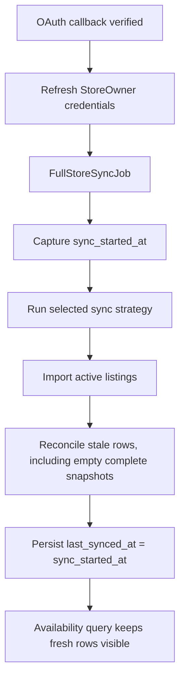
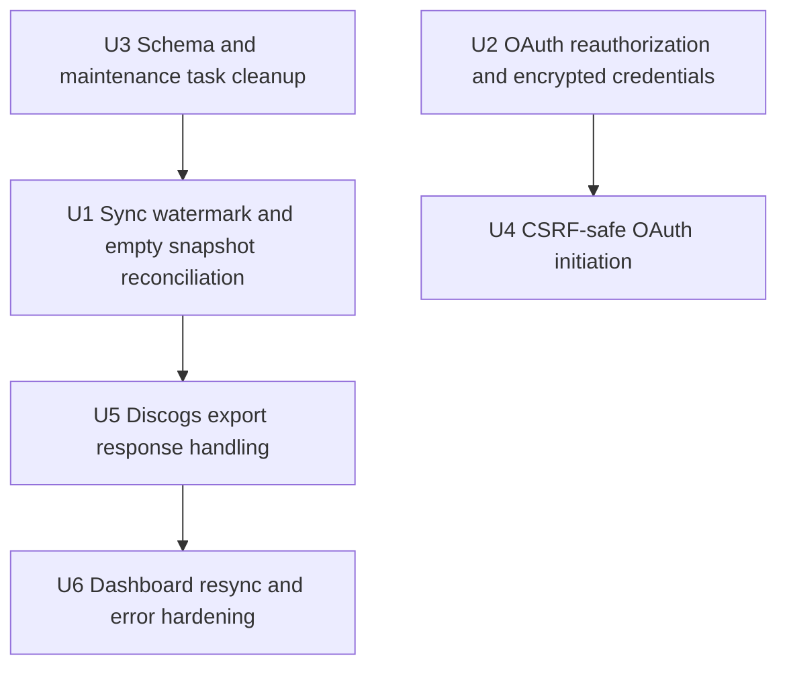

# Fix: Resolve Discogs OAuth Review Blockers

## Summary

Resolve the merge-blocking code review findings from the Discogs OAuth PR by hardening sync correctness, OAuth credential handling, schema consistency, CSRF protection, and maintenance entry points. The plan preserves the existing OAuth partnership shape and focuses on making the current implementation safe to merge and demo.

---

## Problem Frame

The Discogs OAuth branch implements the product direction in `STRATEGY.md`: full-inventory sync through seller OAuth and CSV export. The review found several issues that would make the feature unreliable or unsafe in production: newly synced listings can disappear from availability queries, complete empty exports can leave sold inventory visible, reauthorization can keep stale tokens, schema contains tables without migrations, and OAuth initiation currently bypasses CSRF protection.

---

## Requirements

- R1. Successful public API and CSV syncs must leave freshly imported listings visible to availability queries.
- R2. Complete CSV snapshots that contain zero active records must clear stale listings for that store.
- R3. Reauthorizing an existing store owner must persist the newly exchanged Discogs OAuth credentials.
- R4. The database schema must match migrations in this branch; no schema-only tables or foreign keys may remain.
- R5. Maintenance tasks must call existing sync APIs and continue to support dev/operator workflows.
- R6. OAuth initiation must keep Rails CSRF protection intact while preserving the invitation and storefront claim UX.
- R7. Long-lived Discogs OAuth credentials must be protected at rest and kept out of accidental serialization.
- R8. Discogs inventory export response handling must support documented and observed export trigger/status response shapes.
- R9. Dashboard owner actions must avoid avoidable duplicate long-running syncs and avoid exposing raw internal failure details.

---

## Scope Boundaries

- Do not redesign the Discogs OAuth product flow, dashboard information architecture, or storefront buyer experience.
- Do not implement order polling or sold-item detection beyond making the current CSV snapshot reconciliation correct.
- Do not replace the strategy-object sync architecture introduced by this branch.
- Do not introduce a new authentication framework or password-based store-owner accounts.
- Do not start or stop local servers as part of verification; use focused specs and static inspection.

### Deferred to Follow-Up Work

- Broader dashboard analytics, pricing, or subscription features remain outside this fix plan.
- Full production credential rotation for any tokens already captured outside this branch should be handled as an operational follow-up if applicable.
- More advanced per-store sync scheduling or queue observability can follow after duplicate resync prevention lands.

---

## Context & Research

### Relevant Code and Patterns

- `app/jobs/full_store_sync_job.rb` is now the universal sync entry point and owns import, stale reconciliation, status updates, enrichment, and curation enqueueing.
- `app/queries/listings/available_query.rb` treats non-partial stores as available only when `listings.last_seen_at >= stores.last_synced_at`.
- `app/services/store_sync_service.rb` keeps `#full_sync`; `lib/tasks/milkcrate.rake` still calls the removed `#sync` API.
- `app/services/auth_callback_service.rb` exchanges fresh OAuth credentials and links `StoreOwner`/`Store`, but currently only writes credentials when creating a new owner.
- `app/controllers/stores_controller.rb` starts OAuth from plain HTML forms and currently disables CSRF on `#authorize`.
- `app/services/discogs_client.rb` and `app/services/csv_export_sync/export_requester.rb` split export trigger/status response handling.
- `app/services/store_sync/status_manager.rb` stores summarized sync failures including backtrace lines; `app/frontend/pages/dashboard/index.tsx` renders that raw text.

### Institutional Learnings

- `docs/solutions/integration-issues/discogs-oauth-csv-export-2026-05-22.md` documents the OAuth 1.0a flow, inventory export trigger -> poll -> download pipeline, 409 conflict handling, 304 status handling, CSV column mapping, and filtering rules.
- `docs/solutions/integration-issues/discogs-rate-limit-middleware-2026-05-19.md` documents why Discogs API consumers are serialized behind the shared `"discogs_api"` concurrency key and why retry/pacing should remain centralized.
- `docs/plans/2026-05-22-004-refactor-store-sync-strategies-plan.md` establishes the current sync strategy architecture: strategies fetch/normalize, while `FullStoreSyncJob` owns persistence and reconciliation.

### External References

- No new external documentation was required for this fix plan. The relevant Discogs behavior was taken from the existing project solution document above.

---

## Key Technical Decisions

- Fix sync availability by restoring a start-of-sync watermark: `FullStoreSyncJob` should capture a sync start time before strategy execution and pass that value into sync status success, rather than using a later post-import timestamp.
- Treat complete CSV syncs as authoritative snapshots even when the active listing set is empty: empty complete snapshots mean "clear this store's listings", not "skip reconciliation".
- Refresh OAuth credentials on every identity-verified callback: a successful reauthorization is the user's explicit credential refresh path.
- Use Rails-native encryption for OAuth token columns if available in this app; avoid custom crypto. The token API should remain model-level so sync strategies keep reading through `StoreOwner`.
- Keep CSRF enabled and make frontend forms submit authenticity tokens rather than weakening controller protection.
- Normalize Discogs export response handling in the client/requester boundary so 304, 409, accepted responses, empty bodies, and `Location` headers each have one clear owner.
- Keep the current strategy architecture intact. Fix stale parallel APIs only where they break real entry points; do not expand into a broad sync-service refactor.

---

## Open Questions

### Resolved During Planning

- Should token encryption be in scope? Yes. It is a security-sensitive review finding and small enough to include with model/migration/spec changes.
- Should schema-only `leads` and `storefront_snapshots` be preserved? No, unless missing migrations are intentionally added. The review evidence found no matching migration or app references in this checkout, so the default fix is to regenerate schema from this branch's migrations.

### Deferred to Implementation

- Exact Rails encryption configuration details: confirm the app's Active Record encryption setup and credentials during implementation.
- Exact accepted response status set from Discogs live behavior: implement against the documented/observed shapes in project docs and specs; live verification can happen separately if credentials are available.

---

## High-Level Technical Design

> *This illustrates the intended approach and is directional guidance for review, not implementation specification. The implementing agent should treat it as context, not code to reproduce.*

---

## Implementation Units

### U1. Fix Sync Watermark and Empty Snapshot Reconciliation

**Goal:** Ensure successful syncs keep fresh listings visible and complete empty CSV snapshots remove stale listings for the store.

**Requirements:** R1, R2

**Dependencies:** None

**Files:**
- Modify: `app/jobs/full_store_sync_job.rb`
- Test: `spec/jobs/full_store_sync_job_spec.rb`
- Test: `spec/integration/csv_export_sync_integration_spec.rb`

**Approach:**
- Capture `sync_started_at` before `store.sync_strategy.call`.
- Pass `sync_started_at` to `StoreSync::StatusManager#mark_succeeded!` as `last_synced_at`.
- Change `remove_stale_listings` so complete snapshots delete store listings not present in the current snapshot, including the case where the current snapshot has no active listing IDs.
- Keep the deletion scoped to the current store through `store.listings`.
- Preserve public API behavior by only reconciling stale rows when the strategy result is complete.

**Execution note:** Start with failing specs for availability after sync and zero-active complete snapshots before changing the job.

**Patterns to follow:**
- `app/services/store_sync_service.rb` already captures a pre-fetch watermark for `#full_sync`.
- `app/queries/listings/available_query.rb` defines the availability contract this unit must satisfy.

**Test scenarios:**
- Happy path: A CSV sync inserts listings whose `last_seen_at` is set during parsing; after sync succeeds, those listings are returned by `Listing.available`.
- Happy path: A complete CSV sync with active listing IDs removes only stale listings for that store.
- Edge case: A complete CSV sync whose filtered result is empty deletes all existing listings for that store.
- Edge case: An incomplete public API sync with empty listings does not clear existing listings.
- Integration: `FullStoreSyncJob.perform_now(store.id)` with CSV strategy updates `last_synced_at` to a timestamp at or before imported `last_seen_at`.

**Verification:**
- Freshly synced listings remain visible through `Listings::AvailableQuery`.
- Sold/expired/deleted inventory does not remain visible after an authoritative empty CSV snapshot.
- Existing public API incomplete-sync semantics are unchanged.

---

### U2. Refresh and Encrypt StoreOwner OAuth Credentials

**Goal:** Make reauthorization a real credential refresh path and protect long-lived Discogs OAuth secrets at rest.

**Requirements:** R3, R7

**Dependencies:** None

**Files:**
- Modify: `app/models/store_owner.rb`
- Modify: `app/services/auth_callback_service.rb`
- Modify: `db/migrate/20260523003636_create_store_owners.rb`
- Modify: `db/schema.rb`
- Test: `spec/models/store_owner_spec.rb`
- Test: `spec/requests/oauth_flow_spec.rb`

**Approach:**
- Add Rails encrypted attributes for `discogs_oauth_token` and `discogs_oauth_token_secret` on `StoreOwner`, using the app's existing Active Record encryption setup.
- Update `AuthCallbackService#find_or_create_owner!` so an existing owner is updated with the fresh token, secret, and `oauth_authorized_at` after identity verification.
- Keep credential writes after identity match to avoid storing tokens for a mismatched Discogs user.
- Prefer an atomic owner/store update path if implementation exposes partial-write risk.
- Ensure token fields are not included in any dashboard/storefront props or accidental JSON serialization.

**Execution note:** Add a failing request spec for reauthorizing an existing owner with new token values before changing callback behavior.

**Patterns to follow:**
- `StoreOwner#oauth_authorized?` remains the domain predicate for credential presence.
- `AuthCallbackService::Result` remains the callback orchestration result object.

**Test scenarios:**
- Happy path: First-time OAuth callback creates a `StoreOwner` and stores usable credentials.
- Happy path: OAuth callback for an existing `StoreOwner` replaces old token and secret with the newly exchanged values and updates `oauth_authorized_at`.
- Edge case: Identity mismatch does not create or update a store owner.
- Error path: Token exchange failure does not modify existing owner credentials.
- Security: Persisted token columns are encrypted at rest when read through raw database attributes, while model access returns the plaintext values for API use.
- Security: Store/dashboard Inertia props do not expose token or token secret fields.

**Verification:**
- Reclaiming a store after token revocation can queue CSV sync with the refreshed credentials.
- Token values are encrypted in the database and remain usable through `DiscogsClient`.

---

### U3. Repair Schema Drift, Stray File, and Maintenance Tasks

**Goal:** Remove accidental artifacts and make operator/dev sync tasks call valid APIs.

**Requirements:** R4, R5

**Dependencies:** None

**Files:**
- Delete: `--`
- Modify: `db/schema.rb`
- Modify: `lib/tasks/milkcrate.rake`
- Test: `spec/lib/tasks/milkcrate_rake_spec.rb` or existing task spec location if one exists
- Test: `spec/services/store_sync_service_spec.rb`

**Approach:**
- Remove the accidental root-level `--` file containing a local temp credentials path.
- Regenerate or manually correct `db/schema.rb` so it contains only schema changes backed by migrations in this branch: `store_owners`, `stores.store_owner_id`, and `stores.sync_source`.
- Remove schema-only `leads` and `storefront_snapshots` tables/foreign keys unless implementation discovers intentional migrations that should be restored.
- Update `milkcrate:sync`, `milkcrate:sync:quick`, and `milkcrate:setup` to call valid sync behavior.
- For task behavior, either call `StoreSyncService#full_sync` and adapt output to its return shape, or delegate to `FullStoreSyncJob` when asynchronous behavior is intended. Keep quick/setup semantics explicit.

**Patterns to follow:**
- Existing `StoreSyncService#full_sync(max_pages:, sort_order:)` is the current dev-console helper API.
- Existing task output should remain developer-readable and avoid changing unrelated task behavior.

**Test scenarios:**
- Happy path: `milkcrate:sync` invokes an existing sync API and does not raise `NoMethodError`.
- Happy path: `milkcrate:sync:quick` passes `max_pages: 1` or equivalent quick-sync behavior.
- Happy path: `milkcrate:setup` still syncs, enriches when needed, and curates synchronously where intended.
- Schema: `db/schema.rb` includes `store_owners` and `stores.store_owner_id` but not schema-only `leads` or `storefront_snapshots`.
- Safety: No tracked file contains local temp credential paths.

**Verification:**
- Rake task specs or task invocations prove the renamed sync API is no longer broken.
- Schema diff matches the migration files in the branch.

---

### U4. Restore CSRF Protection for OAuth Initiation

**Goal:** Keep OAuth initiation safe from cross-site POSTs while preserving the claim buttons on invitation and storefront pages.

**Requirements:** R6

**Dependencies:** U2

**Files:**
- Modify: `app/controllers/stores_controller.rb`
- Modify: `app/frontend/pages/stores/invitation.tsx`
- Modify: `app/frontend/layouts/app_layout.tsx`
- Test: `spec/requests/oauth_flow_spec.rb`
- Test: frontend test file if existing coverage for these components is present

**Approach:**
- Remove `skip_forgery_protection only: :authorize`.
- Add authenticity token submission for plain HTML claim forms, using the token already emitted by Rails layout metadata.
- Keep the form POST flow if it is still preferred for OAuth redirects; do not switch to XHR if that would reintroduce redirect handling problems.
- Confirm both invitation-page and existing-store "Is this your store?" entry points submit the token.

**Patterns to follow:**
- `app/frontend/pages/admin/dashboard.tsx` reads `meta[name='csrf-token']` and includes hidden `authenticity_token` fields in plain forms.
- Rails request forgery protection remains enabled outside test.

**Test scenarios:**
- Happy path: Invitation-page claim form includes an authenticity token when rendered.
- Happy path: Existing storefront claim form includes an authenticity token when rendered.
- Security: With forgery protection enabled in request specs, POST `/:slug/authorize` without token is rejected.
- Security: POST `/:slug/authorize` with a valid token starts OAuth and stores request-token session state.
- Error path: Invalid or blank slug still redirects safely without storing OAuth session state.

**Verification:**
- OAuth initiation works through both UI entry points.
- Cross-site form posts cannot overwrite OAuth request-token session state.

---

### U5. Normalize Discogs Export Response Handling

**Goal:** Make the CSV export trigger and status polling robust for accepted responses, empty bodies, `Location` headers, 304 statuses, and 409 conflicts.

**Requirements:** R8

**Dependencies:** U1

**Files:**
- Modify: `app/services/discogs_client.rb`
- Modify: `app/services/csv_export_sync/export_requester.rb`
- Test: `spec/services/discogs_client_spec.rb`
- Test: `spec/services/csv_export_sync/export_requester_spec.rb`

**Approach:**
- Decide a single boundary contract:
  - `DiscogsClient` should normalize OAuth HTTP responses into simple Ruby hashes or raise typed errors.
  - `ExportRequester` should own export workflow decisions: conflict fallback, status retry, timeout, and download.
- Handle export trigger success statuses and `Location` header extraction before JSON parsing when the response body is empty.
- Make 304 behavior consistent. Either return a normalized status that the requester treats as "keep polling" or raise a typed retryable signal; do not support both partially.
- Keep 409 conflict fallback to `recent_exports`, but validate blank or unparseable recent export lists.
- Avoid duplicating rate-limit/backoff logic already owned by middleware and job concurrency.

**Execution note:** Add focused unit coverage for every response shape before changing the client/requester boundary.

**Patterns to follow:**
- `docs/solutions/integration-issues/discogs-oauth-csv-export-2026-05-22.md` documents the expected 409 and 304 handling.
- `DiscogsClient::ApiError` and `DiscogsClient::RateLimitError` remain the public error types unless a narrower internal error improves clarity.

**Test scenarios:**
- Happy path: `POST /inventory/export` returns JSON with `id` and requester polls/downloads it.
- Happy path: `POST /inventory/export` returns empty accepted response with `Location` header and requester extracts the export ID.
- Edge case: Trigger returns 409 and recent exports contains an ID; requester uses the existing export.
- Edge case: Trigger returns 409 and recent exports is blank or lacks an ID; requester raises `ExportError`.
- Edge case: Status returns 304 or normalized "not modified"; requester waits and retries until completion or timeout.
- Error path: Status returns failed/error; requester raises `ExportError`.
- Error path: Timeout after max polling attempts raises `ExportError`.
- Error path: Download non-200 raises `ApiError`.

**Verification:**
- CSV sync can start from JSON-body and Location-header export trigger responses.
- Polling behavior is deterministic and covered without sleeping in specs.

---

### U6. Harden Dashboard Resync and Owner-Facing Sync Errors

**Goal:** Prevent duplicate long-polling sync backlogs from owner actions and avoid exposing raw internal exception details to store owners.

**Requirements:** R9

**Dependencies:** U5

**Files:**
- Modify: `app/controllers/dashboard_controller.rb`
- Modify: `app/presenters/dashboard_presenter.rb`
- Modify: `app/frontend/pages/dashboard/index.tsx`
- Test: `spec/requests/dashboard_spec.rb` or nearest request spec location
- Test: frontend dashboard component test if existing frontend test patterns cover pages

**Approach:**
- In `DashboardController#resync`, ignore or reject resync when `current_store.sync_status == "syncing"` and return a clear flash message.
- Keep owner-triggered resync scoped to the current store owner and current store.
- Expose an owner-facing sync error summary rather than raw stored exception/backtrace text.
- Preserve full internal error detail in `stores.last_sync_error` for admin/debugging unless a broader logging change is chosen.
- Render dashboard errors as concise prose rather than a raw `<pre>` backtrace block.

**Patterns to follow:**
- `app/services/admin/store_health.rb` already derives `last_sync_error_summary` for admin surfaces.
- `StoreSync::StatusManager#summarized_error` remains the internal persistence point for failed sync details.

**Test scenarios:**
- Happy path: POST `/dashboard/resync` for an idle store enqueues exactly one `FullStoreSyncJob`.
- Edge case: POST `/dashboard/resync` for a syncing store does not enqueue another job and flashes a clear message.
- Security: A store owner session can only enqueue sync for their own current store.
- Error display: Dashboard props contain sanitized owner-facing error text, not raw backtrace lines.
- Frontend: Dashboard renders sanitized sync error without showing stack path/backtrace content.

**Verification:**
- Repeated owner clicks do not build a duplicate long-polling job backlog.
- Store owners see useful failure context without internal stack traces or raw upstream response bodies.

---

## System-Wide Impact

- **Interaction graph:** OAuth callback -> `StoreOwner` credentials -> `FullStoreSyncJob` -> strategy -> listing reconciliation -> availability query. Fixes must preserve this chain.
- **Error propagation:** Sync strategy/client errors should still mark the store failed through `StoreSync::StatusManager`, but owner-facing dashboard output should be sanitized.
- **State lifecycle risks:** Credential refresh and store linking should not partially update one model while leaving the other inconsistent. Complete empty snapshots are authoritative cleanup events.
- **API surface parity:** Invitation-page claim and existing-store claim must both submit CSRF tokens. Operator rake tasks must use the same valid sync APIs.
- **Integration coverage:** Request/job specs are required because unit tests alone will not prove session, CSRF, queueing, and availability-query behavior.
- **Unchanged invariants:** Free-demo public API sync remains incomplete/non-authoritative; only complete CSV snapshots may clear all stale rows.

---

## Risks & Dependencies

| Risk | Mitigation |
|------|------------|
| Token encryption requires missing Rails credentials/configuration | Confirm Active Record encryption setup before migration/model changes; fail fast with explicit setup guidance if absent |
| Empty CSV snapshot deletion could delete valid listings after a parser/filter bug | Only apply empty deletion when `result.complete?` is true and parsing/filtering completed successfully; cover malformed CSV failure separately |
| CSRF fix could break OAuth redirect UX | Keep plain form POST flow and add hidden authenticity tokens rather than switching to XHR redirects |
| Discogs response shapes differ from documented examples | Encode known JSON, `Location`, 304, and 409 shapes in specs; keep live verification as rollout check |
| Schema correction could accidentally remove intentional tables | Verify no migrations/app references exist before removing schema-only tables; if intentional, add missing migrations instead |

---

## Documentation / Operational Notes

- Update `docs/solutions/integration-issues/discogs-oauth-csv-export-2026-05-22.md` if implementation confirms additional Discogs export response shapes.
- Note any required Active Record encryption setup in README or environment docs if not already present.
- During deployment, verify migrations create only intended OAuth/store-owner schema changes and no schema-only tables.
- After rollout, monitor failed sync counts and dashboard resync attempts for repeated duplicate-prevention messages.

---

## Sources & References

- Code review findings from PR #188 against `development`
- Strategy context: `STRATEGY.md`
- Related plan: `docs/plans/2026-05-22-002-feat-discogs-oauth-partnership-plan.md`
- Related plan: `docs/plans/2026-05-22-004-refactor-store-sync-strategies-plan.md`
- Related solution: `docs/solutions/integration-issues/discogs-oauth-csv-export-2026-05-22.md`
- Related solution: `docs/solutions/integration-issues/discogs-rate-limit-middleware-2026-05-19.md`
- Related code: `app/jobs/full_store_sync_job.rb`
- Related code: `app/services/auth_callback_service.rb`
- Related code: `app/controllers/stores_controller.rb`
- Related code: `app/services/discogs_client.rb`
- Related code: `app/services/csv_export_sync/export_requester.rb`
