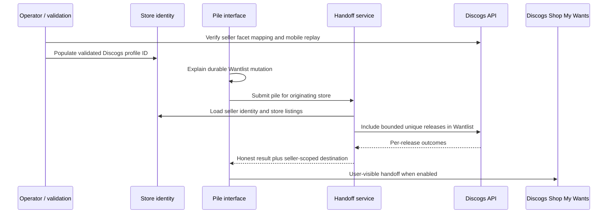
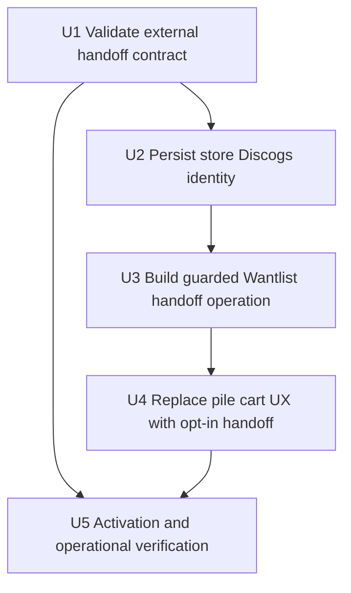
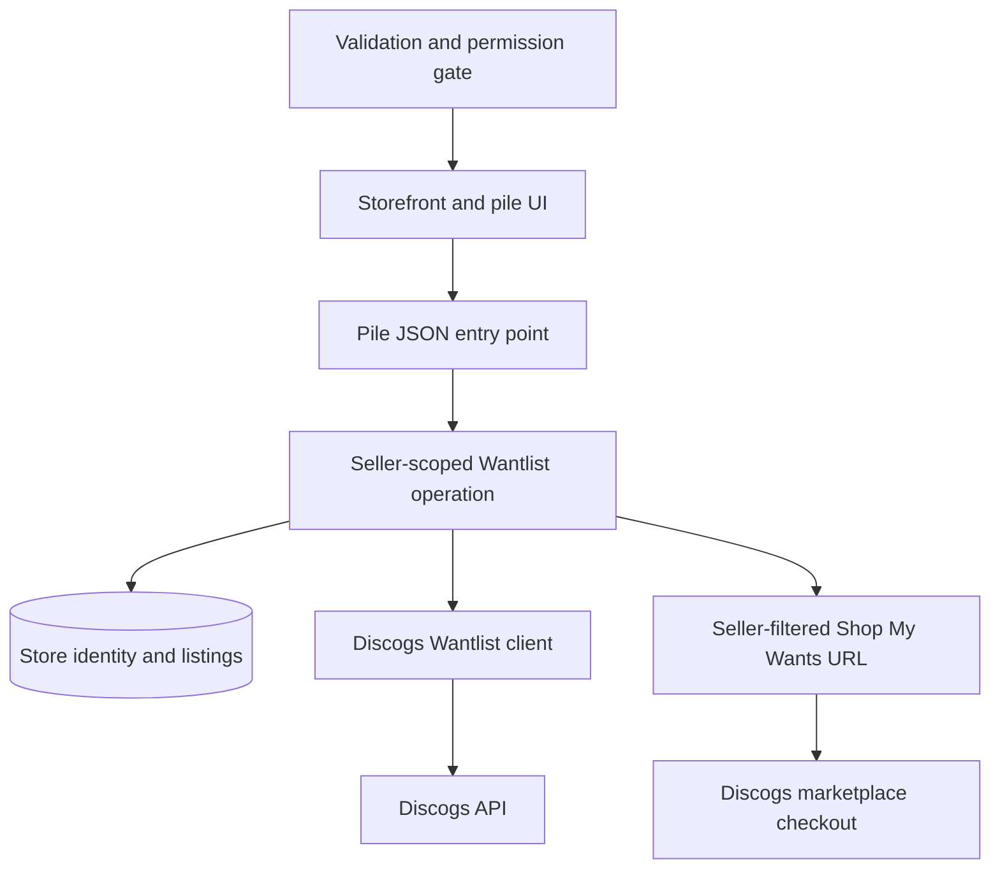

# feat: Add Seller-Scoped Discogs Wantlist Handoff

## Summary

Replace the unverified browser-cart experiment with an opt-in Discogs
handoff: an authenticated shopper sends the releases in their pile to their
Wantlist, then continues to the originating store's seller-filtered Shop My
Wants view. Persist the store's Discogs profile ID ahead of the click so the
handoff can use the observed `seller={id}` route without making a live profile
lookup part of the shopper action.

This is intentionally not cart transfer. It preserves seller intent while
acknowledging that Discogs may show a different copy of a release or additional
wanted releases sold by the same store.

---

## Problem Frame

Milkcrate currently presents an "Add all to Discogs cart" action implemented
through hidden requests to an undocumented Discogs cart URL. The application
cannot observe that a cart was actually populated, and the behavior is
especially unreliable on mobile when the Discogs app handles links.

The branch also contains a documented-API alternative: shopper OAuth and
Wantlist writes by release ID. Discogs' seller filter makes that alternative
more useful than a generic Wantlist landing page, but the URL contract,
identifier mapping, mobile arrival, lasting Wantlist mutation, and commercial
permission requirements must be handled explicitly.

---

## Requirements

- R1. Before user-visible activation, verify that a real Shop My Wants
  `seller` facet value equals the numeric `id` returned by the documented
  Discogs seller profile lookup, and record desktop and mobile replay outcomes.
- R2. Store each Milkcrate store's stable Discogs profile ID when it is
  available from the existing profile lookup path, and provide a controlled
  way to populate it for already-onboarded stores without making a shopper
  click wait on a new Discogs read.
- R3. An authenticated shopper can intentionally submit the current store's
  pile for Wantlist inclusion; only listings belonging to that originating
  store are processed, and release-level deduplication, unsupported records,
  partial upstream failures, and bounded request volume are reported honestly.
- R4. When at least one pile release is successfully represented in Wantlist
  and the store has a validated Discogs profile ID, Milkcrate provides the
  seller-filtered Shop My Wants handoff URL. It never describes the result as
  a cart, reservation, exact copy, or completed purchase.
- R5. The pile interface removes the hidden cart automation and presents the
  Wantlist mutation as explicit opt-in behavior, including the facts that
  Wantlist is durable and the Discogs results can include substitute copies or
  other existing wants sold by that store.
- R6. The seller-scoped handoff remains off by default until the route/device
  validation gate passes, and it must not be made available commercially
  without written confirmation that the intended Discogs API/data use is
  permitted.
- R7. Existing shopper OAuth connectivity, store-owner OAuth and store sync
  behavior, exact per-listing Discogs links, and client-side pile persistence
  continue to function without exposing credentials or falsely attributing
  purchases.

### Traceability

| Source | Carried Into This Plan |
|---|---|
| `docs/ideation/2026-05-24-discogs-checkout-handoff-strategy-ideation.md` | Seller-scoped Wantlist candidate, truth-in-labeling constraints, seller-ID hypothesis, device and permission gates |
| `docs/brainstorms/2026-05-24-shopper-discogs-oauth-lists-requirements.md` | Shopper actor, OAuth connection flow, pile entry point, persistent tokens, non-destructive pile behavior |
| `docs/plans/2026-05-24-002-feat-shopper-discogs-oauth-lists-plan.md` | Existing implementation precedent only; the prior Lists destination is not retained |
| User-confirmed scope on 2026-05-24 | New follow-on plan, replaces cart behavior, durable opt-in Wantlist writes, no automatic cleanup |

**Origin actors:** Shopper; Discogs API and marketplace; originating Milkcrate
store.

**Origin flows retained or revised:** Shopper OAuth connection is retained;
the original "Send to Discogs" pile flow is revised from private Lists/cart
experiments to seller-scoped Wantlist handoff.

**Historical origin acceptance treatment:** The connected-shopper status and
unauthenticated OAuth entry behavior from F1, AE1, and AE3 remain constraints
for this plan. F2 and AE2 are deliberately superseded because their private
Discogs List destination was replaced after the original requirements were
written; this plan supplies the new Wantlist/store-scoped destination and its
more limited success claim.

---

## Scope Boundaries

- No mutation of the Discogs cart through browser URLs, hidden frames,
  popups, prefetching, headless sessions, or undocumented endpoints.
- No promise that a Wantlist release resolves to the precise listing,
  condition, or price the shopper selected on Milkcrate.
- No promise that seller-filtered Shop My Wants contains only the pile; the
  shopper's existing wants may also match the seller.
- No automatic deletion of Wantlist entries after handoff. A pre-existing
  want is not distinguishable from a temporary purchase intent without more
  product design.
- No Milkcrate payment, order placement, reservation, or alternate seller
  checkout.
- No sales attribution or conversion reporting based on this flow; outbound
  handoff and explicit user action are the only defensible signals in scope.

### Deferred to Follow-Up Work

- Discogs-authorized order attribution or supported cart handoff: pursue only
  through a partnership/permission path.
- A shopper-managed cleanup experience for newly created wants: reconsider
  only after user research establishes that Wantlist mutation is accepted but
  cleanup is necessary.
- Additional marketplace filters that isolate only the newly sent pile:
  investigate only if Discogs exposes a documented mechanism.

---

## Context & Research

### Relevant Code and Patterns

- `app/services/create_pile_wantlist_service.rb` already maps listing IDs to
  unique release IDs and invokes shopper-authenticated Wantlist writes, but it
  is not store-scoped and returns a generic Wantlist URL.
- `app/services/discogs/shopper_wantlist_client.rb` is the infrastructure
  boundary for the existing OAuth `PUT` writes. It bypasses
  `DiscogsRateLimitMiddleware`, so shopper batch behavior requires its own
  bounded/failure-aware treatment.
- `app/controllers/pile_controller.rb` is currently a thin JSON entry point,
  but it must bind a submitted pile to the originating store before delegating
  to application behavior.
- `app/frontend/contexts/shopper_context.tsx` contains unused Wantlist request
  state; `app/frontend/components/pile_sheet.tsx` instead ships hidden cart
  requests and an unverifiable success assertion.
- `app/frontend/layouts/app_layout.tsx` and
  `app/frontend/components/discogs_auth_icon.tsx` already expose connected
  shopper state and the OAuth initiation surface.
- `app/services/store_onboarding.rb` and
  `app/services/auth_callback_service.rb` already receive seller profile
  payloads during store creation. `app/services/discogs/public_client.rb`
  returns the numeric profile `id`, while `stores` currently persists only
  `discogs_username`.
- `lib/tasks/stores.rake` provides explicit per-store operational actions,
  which is the appropriate precedent for populating identity data on existing
  stores without network calls during shopper interaction.

### Layered Architecture Analysis

- Presentation layer: `PileController` should authenticate the session,
  resolve request/store context, and serialize the service result; it should
  not construct marketplace rules or perform API orchestration.
- Application layer: the pile-to-Wantlist handoff service should scope
  listings to the store, enforce operation limits, orchestrate the Wantlist
  client, and decide whether a handoff result is representable.
- Domain/data layer: `Store` should hold and validate a nullable stable
  Discogs profile identifier; it should not fetch external identity data.
- Infrastructure layer: Discogs profile and Wantlist clients should remain
  responsible for HTTP/OAuth request behavior and upstream error
  classification.

This follows the specification test: controller coverage should assert HTTP
and session behavior, service coverage should assert orchestration and partial
outcomes, model coverage should assert persisted identity rules, and client
coverage should assert Discogs response handling.

### Institutional Learnings

- `docs/solutions/integration-issues/discogs-oauth-csv-export-2026-05-22.md`
  establishes the existing OAuth consumer, identity verification, and the rule
  that tokens remain server-side.
- `docs/solutions/integration-issues/discogs-rate-limit-middleware-2026-05-19.md`
  establishes that Discogs requests must account for the shared external quota;
  the shopper OAuth client is an adjacent path that does not currently inherit
  the Faraday middleware.
- `docs/solutions/integration-issues/upsert-all-duplicate-discogs-listing-ids-2026-05-24.md`
  reinforces treating Discogs identity/listing inputs as unstable external
  data and deduplicating at application boundaries.

### External References

- Discogs documents a Seller filter within Shop Your Wantlist:
  https://support.discogs.com/hc/en-us/articles/26355982507149-Using-Filters-Saved-Searches
- Discogs documents the Wantlist/Shop My Wants customer journey:
  https://support.discogs.com/hc/en-us/articles/360007331594-How-Does-The-Wantlist-Feature-Work
- Discogs Buyer Policy requires Discogs transactions to complete through
  Discogs checkout:
  https://support.discogs.com/hc/en-us/articles/14587773391501-Buyer-Policy
- Discogs API Terms classify wantlists and marketplace information as
  restricted data and constrain commercial use:
  https://support.discogs.com/hc/en-us/articles/360009334593-API-Terms-of-Use
- Observed authenticated browser behavior on 2026-05-24 produced
  `https://www.discogs.com/shop/mywants/?seller=4616786`; that URL behavior is
  evidence to validate, not a documented contract.

---

## Key Technical Decisions

| Decision | Rationale |
|---|---|
| Treat this as a new handoff plan, not a revision of the Lists plan | Shopper OAuth is reusable foundation, but the destination and user promise have materially changed. |
| Replace the iframe cart experiment rather than offering both flows | Retaining an unverifiable "cart" path creates contradictory product truth and preserves the mobile failure being addressed. |
| Persist a nullable `discogs_user_id` on each store from profile data obtained before handoff | The seller-filter URL requires a numeric identity; the shopper action should not depend on a synchronous profile lookup. |
| Populate existing-store identity through an explicit operational refresh path | It is controlled, observable, and matches existing per-store task conventions without introducing network calls into page rendering. |
| Extend the existing Wantlist endpoint/service with originating-store context | It reuses working OAuth infrastructure while preventing a client from submitting unrelated listing IDs under a store handoff. |
| Describe successful writes as releases included/prepared for Wantlist shopping, not newly added items | A `PUT` may represent an already-wanted release; Milkcrate should not claim knowledge it does not possess. |
| Select the final browser transition behavior from the validated mobile probe | Automatic same-window handoff is appropriate only if it preserves the seller scope on target devices; otherwise a clear post-write link is the truthful fallback. |
| Gate availability off by default | The route is observed web behavior and the commercial permission question is unresolved; accidental production exposure is avoidable. |

---

## Open Questions

### Resolved During Planning

- Is seller scope recoverable after Wantlist transfer? Yes at the UI level:
  Discogs officially documents a Seller filter, and an authenticated session
  produced a seller-filtered Shop My Wants URL.
- Can Milkcrate retrieve a candidate numeric seller/profile ID without
  scraping? Yes: the existing seller profile API response includes a numeric
  `id`, verified through `Discogs::PublicClient` on 2026-05-24.
- Should this be labeled cart or checkout? No. It is a store-scoped Wantlist
  shopping handoff with release-level fidelity only.

### Must Be Resolved Before Activation

- Does the observed seller facet value for the target store equal that store's
  API profile ID?
- Does replaying the constructed seller-filter URL remain useful in mobile
  browsers with the Discogs app installed?
- Has Discogs confirmed in writing that this commercial use of Wantlist and
  marketplace/store data is permitted?

### Deferred to Implementation

- What bounded maximum pile size keeps the shopper write path within practical
  Discogs request limits? Establish from the client behavior and upstream
  quota evidence while implementing request coverage; the UI must surface the
  resulting boundary.
- Does a successful Wantlist `PUT` distinguish already-present wants? If it
  does not, retain neutral completion language rather than adding an extra
  read solely to improve wording.

---

## High-Level Technical Design

> *This illustrates the intended approach and is directional guidance for
> review, not implementation specification. The implementing agent should
> treat it as context, not code to reproduce.*

The handoff is enabled only after the prerequisite validation has established
that the `seller` route maps to stored profile identity and behaves acceptably
on supported mobile entry points.

---

## Implementation Units

### U1. Validate the seller-filter handoff contract

**Goal:** Establish whether the observed seller-filter route is sound enough
to support implementation and define the activation result before user-facing
behavior changes.

**Requirements:** R1, R6

**Dependencies:** Access to an authenticated Discogs shopper session, a known
originating store, and a phone/browser combination representative of the
mobile problem.

**Files:**
- Modify: `docs/ideation/2026-05-24-discogs-checkout-handoff-strategy-ideation.md`

**Approach:**
- Use one real participating store to compare the numeric ID returned from the
  existing seller profile API lookup with the ID shown in a selected Seller
  facet URL.
- Replay the constructed seller-filtered Shop My Wants URL in an authenticated
  desktop session and on mobile with the Discogs app installed, recording
  whether seller scope is retained and whether arrival is browser- or
  app-based.
- Record whether results include the original pile listings, substitutions, or
  pre-existing wanted releases from that store; these outcomes calibrate UI
  wording but do not convert the handoff into exact-listing transfer.
- Record Discogs permission status separately from technical validation. A
  successful URL/device probe permits implementation behind the disabled
  availability gate; it does not by itself authorize commercial enablement.
  Perform this technical validation manually in Discogs or with a non-public
  test account rather than exposing an unapproved shopper feature.

**Execution note:** This is a validation-first prerequisite. Do not expose the
new shopper action before its mapping and mobile acceptance outcomes are
recorded.

**Patterns to follow:**
- `docs/ideation/2026-05-24-discogs-checkout-handoff-strategy-ideation.md`
  gate matrix and device test protocol.

**Test scenarios:**
- Test expectation: none - this unit gathers authenticated third-party
  behavior and written authorization evidence that cannot be proven by
  automated local tests.

**Verification:**
- The recorded target seller's profile ID equals or does not equal the
  `seller` URL value, with a clear pass/fail consequence.
- The desktop and mobile arrival outcomes are recorded with an activation
  decision for automatic navigation versus visible link fallback.
- Commercial activation remains explicitly blocked until permission evidence
  exists.

---

### U2. Persist store Discogs identity before shopper handoff

**Goal:** Give each eligible store a stable, validated numeric Discogs profile
identifier that can be used to build a seller-scoped destination without
fetching Discogs profile data during checkout intent.

**Requirements:** R2, R6, R7

**Dependencies:** U1 must confirm that Discogs profile ID is the seller facet
identifier before the field is treated as an activation prerequisite.

**Files:**
- Create: `db/migrate/YYYYMMDDHHMMSS_add_discogs_user_id_to_stores.rb`
- Modify: `app/models/store.rb`
- Modify: `app/services/store_onboarding.rb`
- Modify: `app/services/auth_callback_service.rb`
- Create: `app/services/store_discogs_identity_refresh.rb`
- Modify: `lib/tasks/stores.rake`
- Modify: `spec/factories/stores.rb`
- Test: `spec/models/store_spec.rb`
- Test: `spec/services/store_onboarding_spec.rb`
- Test: `spec/services/store_discogs_identity_refresh_spec.rb`
- Test: `spec/requests/oauth_flow_spec.rb`
- Test: `spec/tasks/stores_identity_spec.rb`

**Approach:**
- Add a nullable positive numeric Discogs profile identity to `Store`, with a
  uniqueness constraint for populated values. Existing stores remain valid
  until explicitly refreshed.
- When a new store is created from a Discogs profile response, persist the
  profile identity together with its username/name data. When owner OAuth
  creates or upgrades a store, ensure the store identity is populated through
  the same profile-data boundary.
- Introduce one application operation for refreshing a store's Discogs
  identity from its stored username. Expose it through an explicit per-store
  operational task for existing records, following the current `stores:*`
  convention.
- Do not fetch profile identity during storefront render or during the
  shopper's Wantlist write. Missing identity makes the handoff unavailable
  until refreshed.

**Execution note:** Implement the persisted-data behavior test-first,
including existing-store/null compatibility before changing handoff
availability.

**Patterns to follow:**
- `app/models/store.rb` for normalized external identity fields and enums.
- `app/services/store_onboarding.rb` for seller profile ingestion.
- `lib/tasks/stores.rake` for explicit per-store operational commands.
- `app/services/admin/discogs_signup_availability.rb` for service result
  boundary patterns where applicable.

**Test scenarios:**
- Happy path: onboarding with a profile containing an ID persists that ID on
  the created store and still queues its existing sync behavior.
- Happy path: refreshing an existing store with a matching Discogs profile
  records its numeric ID without altering listings or OAuth state.
- Integration: a store-owner OAuth upgrade populates the store identity when
  it was previously absent while preserving the existing sync-source upgrade
  and owner credential behavior.
- Edge case: existing stores with no profile ID remain valid and renderable;
  they simply are not eligible for the new handoff.
- Edge case: a profile response lacks a usable numeric ID; the refresh fails
  visibly and leaves the store ineligible rather than saving invalid identity.
- Error path: Discogs profile lookup fails during explicit refresh; the task
  reports failure and the persisted store identity is not overwritten.
- Domain constraint: two populated stores cannot claim the same Discogs
  profile ID, while multiple legacy nil values are allowed.

**Verification:**
- Newly onboarded and explicitly refreshed stores expose a validated numeric
  identity for use by the handoff.
- Existing stores without the field continue all prior storefront and sync
  behavior.
- No OAuth token or profile ID acquisition is added to the shopper-click
  request lifecycle.

---

### U3. Build a guarded, store-scoped Wantlist handoff operation

**Goal:** Turn the existing Wantlist write foundation into a truthful
store-scoped application operation with a bounded upstream request surface and
a seller-filtered result.

**Requirements:** R3, R4, R6, R7

**Dependencies:** U1, U2

**Files:**
- Modify: `config/settings.yml`
- Modify: `app/controllers/pile_controller.rb`
- Modify: `app/services/create_pile_wantlist_service.rb`
- Modify: `app/services/discogs/shopper_wantlist_client.rb`
- Test: `spec/services/create_pile_wantlist_service_spec.rb`
- Test: `spec/services/discogs/shopper_wantlist_client_spec.rb`
- Test: `spec/requests/pile_wantlist_handoffs_spec.rb`

**Approach:**
- Add an off-by-default product availability setting for the seller-scoped
  Wantlist handoff. The JSON action refuses to perform writes while disabled,
  even if a client attempts to call it directly.
- Keep the existing authenticated pile endpoint as the HTTP surface, but
  require originating store context and load the store server-side. Delegate
  release handling and destination generation to the service.
- Change the application service to operate on the store's own listings, not
  globally submitted listing IDs. Deduplicate releases, reject empty or
  entirely unresolvable submissions, require a stored store identity for a
  seller-scoped result, and enforce a bounded per-action item limit.
- Construct only a fixed Discogs Shop My Wants destination with a validated
  numeric seller identity; never accept a destination URL from the client.
- Treat each Wantlist write outcome explicitly. Successful upstream inclusion
  can produce a handoff; partial failures must preserve correct counts and
  messaging; total failure must not send a shopper to a page while claiming
  the pile was transferred.
- Extend the shopper OAuth client so rate limiting/authentication failures
  remain distinguishable and can be surfaced through a recoverable application
  result. Do not assume the Faraday middleware covers this OAuth client.

**Execution note:** Start with failing service and request tests that
characterize the current write endpoint, then revise the contract to require
store scope and truthful partial results.

**Patterns to follow:**
- `app/services/create_pile_wantlist_service.rb` for the existing operation
  boundary and result object.
- `app/services/discogs/shopper_wantlist_client.rb` and
  `app/services/discogs/marketplace.rb` for OAuth infrastructure error
  classification.
- `app/controllers/pile_controller.rb` for thin JSON/controller
  responsibilities.
- `app/services/turnstile_verifier.rb` for an off-by-default externally
  configured availability posture.

**Test scenarios:**
- Happy path: enabled feature, authenticated shopper, eligible store, and two
  valid store listings -> two release inclusions are attempted and the result
  contains the seller-filtered Shop My Wants destination and neutral success
  counts.
- Integration: the request action loads the store context and returns the
  service result without exposing shopper OAuth credentials or accepting an
  arbitrary redirect URL.
- Security boundary: an item ID belonging to another store is omitted from the
  operation even if submitted by the browser.
- Edge case: duplicate release IDs from multiple selected listings produce one
  Wantlist write and an accurately represented result.
- Edge case: missing store profile ID returns an unavailable result without
  any Wantlist writes or generic unscoped destination.
- Edge case: a pile exceeding the operation limit is rejected or explicitly
  bounded with user-visible outcome; it never silently issues an unbounded
  series of upstream writes.
- Error path: unauthenticated session returns an authorization failure before
  calling Discogs.
- Error path: feature availability is disabled -> endpoint performs no writes
  and returns an unavailable response.
- Security boundary: a forged or CSRF-invalid mutation request cannot cause
  Wantlist writes through the authenticated shopper session.
- Error path: some Discogs writes fail or are throttled -> successful releases
  remain acknowledged, failures are reported, and copy does not claim all
  selections arrived.
- Error path: all Discogs writes fail -> no successful handoff is reported.

**Verification:**
- The endpoint is inert when the product gate is disabled.
- When enabled for an eligible test store, its destination is seller-scoped
  and derives only from server-held identity.
- The service tests express store scoping, limits, and partial failures rather
  than forcing controller tests to verify business orchestration.

---

### U4. Replace cart claims with an opt-in shopper handoff experience

**Goal:** Present the new behavior in the pile sheet with accurate consent,
connection handling, progress, and result messaging while removing the
unreliable cart automation.

**Requirements:** R4, R5, R6, R7

**Dependencies:** U3 and the U1 decision on automatic navigation versus a
post-write destination link.

**Files:**
- Modify: `app/controllers/stores_controller.rb`
- Modify: `app/frontend/types/inertia.ts`
- Modify: `app/frontend/contexts/shopper_context.tsx`
- Modify: `app/frontend/components/discogs_auth_icon.tsx`
- Modify: `app/frontend/components/pile_sheet.tsx`
- Test: `spec/requests/stores_spec.rb`
- Create: `app/frontend/contexts/shopper_context.test.tsx`
- Create: `app/frontend/components/discogs_auth_icon.test.tsx`
- Test: `app/frontend/components/pile_sheet.test.tsx`
- Test: `app/frontend/components/accessibility.test.tsx`

**Approach:**
- Expose only shopper-facing handoff availability for the rendered store; the
  UI should not infer eligibility from username or build seller URLs itself.
- Consolidate shopper connection initiation and Wantlist action state within
  the existing shopper context so the header icon and pile action do not
  maintain divergent form/connection behavior.
- Remove the hidden iframe/form sequence, its timers, and every assertion that
  items were added to a Discogs cart.
- For an eligible connected shopper, use copy that declares the durable
  Wantlist action and seller-scoped destination before mutation. Keep existing
  exact listing links visible as the copy-specific route.
- For a disconnected shopper, route through the existing shopper OAuth path
  without destroying the locally stored pile; after return, the shopper can
  explicitly perform the Wantlist action.
- Present partial outcomes honestly. The result may state that releases are
  ready to shop from this store, but not that newly created wants, exact
  listings, or cart contents are known.
- Implement the transition selected by U1: navigate to Discogs only where the
  validated mobile behavior supports it; otherwise present a clear user-tapped
  external link after the write result.
- If the gate is disabled or the store lacks identity, omit the new mutation
  action and retain non-mutating exact listing links; do not fall back to the
  cart experiment.

**Execution note:** Add component/context tests for disclosure and outcome
states before removing the existing cart-state tests.

**Patterns to follow:**
- `app/frontend/contexts/pile_context.tsx` for local pile persistence.
- `app/frontend/contexts/shopper_context.tsx` for connected shopper request
  state.
- `app/frontend/components/pile_sheet.tsx` for responsive sheet and focus
  behavior that must be preserved.
- `app/frontend/components/accessibility.test.tsx` for interaction semantics.

**Test scenarios:**
- Happy path: eligible connected shopper sees an opt-in Wantlist/store
  handoff action, acknowledges it, receives a successful seller-scoped result,
  and can continue to Discogs using the U1-selected transition.
- Happy path: disconnected shopper initiates OAuth from the pile action and
  the existing locally persisted pile remains available after returning.
- Covers historical F1 / AE1: a shopper who has completed OAuth is represented
  as connected in the storefront handoff surfaces without exposing tokens.
- Covers historical AE3: an unauthenticated shopper choosing the handoff is
  sent through the shopper OAuth entry path before any Wantlist mutation.
- UI truth: no visible state or accessibility label uses "add to cart" or
  claims exact Discogs copies were transferred.
- UI disclosure: before mutation, the shopper can see that selected releases
  will be added to their Wantlist and shopped from this seller on Discogs.
- Partial outcome: when only some releases are represented successfully, the
  result names the partial outcome and still exposes only a valid supported
  next action.
- Error path: failed or throttled Wantlist request shows a retryable error and
  does not render a success destination unless the backend reported a usable
  partial handoff.
- Availability: ineligible store or disabled gate renders no Wantlist
  mutation CTA and never renders the old iframe-cart CTA.
- Regression: removing records, clearing the pile, totals, keyboard closing,
  and compact/wide sheet behavior remain intact.

**Verification:**
- The shipped pile UI contains no hidden Discogs cart-request machinery.
- All visible handoff states match the backend's actual knowledge and the
  Wantlist/store-level fidelity contract.
- Existing OAuth connection status remains usable in the header and pile entry
  point.

---

### U5. Validate activation, regression safety, and operational posture

**Goal:** Enable the handoff only for validated, permitted use and ensure the
new buyer flow does not destabilize existing OAuth or storefront behavior.

**Requirements:** R1, R6, R7

**Dependencies:** U1, U2, U3, U4

**Files:**
- Modify: `docs/ideation/2026-05-24-discogs-checkout-handoff-strategy-ideation.md`
- Test: `spec/requests/oauth_flow_spec.rb`
- Test: `spec/requests/stores_spec.rb`
- Test: `app/frontend/components/pile_sheet.test.tsx`

**Approach:**
- Leave the repository-default availability disabled until the recorded
  validation shows the stored store profile ID maps to the seller facet and
  the chosen mobile transition preserves a useful shopper destination.
- Before any commercial enablement, attach or reference written Discogs
  permission covering the intended Wantlist and marketplace-data use. If
  permission is absent, retain the disabled setting regardless of local
  feature completeness.
- Re-run the authenticated desktop/mobile probe against the built flow using
  releases chosen to avoid accidental removal of existing wants; record the
  result and any residual Wantlist side effects.
- After all gates pass, enable only through an approved environment-specific
  settings override; do not commit a globally enabled default as part of
  activation.
- Treat this as an outbound handoff in product/analytics language. Do not
  introduce sales conversion reporting as part of enablement.

**Execution note:** This is activation verification, not an opportunity to
silently broaden the integration when the external contract differs from the
plan.

**Patterns to follow:**
- `STRATEGY.md` metric boundary: outbound clicks are the current defensible
  handoff signal.
- `docs/ideation/2026-05-24-discogs-checkout-handoff-strategy-ideation.md`
  pass/fail criteria.

**Test scenarios:**
- Integration: with the feature disabled, existing storefront and OAuth flows
  render without a seller-scoped mutation action.
- Integration: with the feature enabled for a store containing a validated
  identity, shopper OAuth plus pile handoff produces the correct
  seller-filtered destination while store-owner OAuth behavior remains
  unchanged.
- Regression: the frontend no longer exposes the retired cart CTA in enabled
  or disabled feature states.
- Manual acceptance: desktop and target mobile device reach a useful
  seller-scoped Discogs surface from a real authenticated test account with
  side effects recorded.

**Verification:**
- Activation evidence, permission status, and device outcomes are documented.
- Existing store-owner OAuth regression coverage and storefront request
  coverage remain green.
- The committed availability default remains disabled; an override is enabled
  only in environments explicitly covered by the recorded validation and
  permission posture.

---

## System-Wide Impact

- **Interaction graph:** Store onboarding/OAuth creation populate seller
  identity; storefront props expose availability; the pile action delegates
  to a store-scoped service; the Discogs client performs user-authorized
  writes; the browser hands the shopper into Discogs marketplace checkout.
- **Error propagation:** Store profile refresh errors remain operational and
  leave the feature unavailable; Wantlist operation errors return truthful
  JSON outcomes; UI displays failure or partial success without asserting cart
  state.
- **State lifecycle risks:** Wantlist writes are durable and can be partial;
  existing wants are not automatically distinguished or removed. Store
  identity is nullable so deploys and legacy records remain compatible.
- **Security boundary:** The authenticated mutation remains CSRF-protected,
  trusts only server-loaded store/listing identity when choosing writes and
  destinations, and never returns or embeds OAuth secrets in frontend state.
- **API surface parity:** Existing shopper OAuth and store-owner OAuth share
  callback infrastructure; regression coverage must ensure handoff changes do
  not change owner claim or sync behavior.
- **Integration coverage:** Local unit tests cannot prove third-party web/app
  routing or commercial permission; those remain explicit activation
  evidence.
- **Unchanged invariants:** Discogs remains checkout owner; per-listing exact
  links remain available; the pile remains client-side and non-destructive;
  no credentials are sent in Inertia props or frontend API responses.

---

## Alternative Approaches Considered

| Approach | Decision |
|---|---|
| Continue hidden URL-based cart mutation | Rejected: undocumented, non-observable, and unreliable on the mobile path that matters. |
| Land on the generic Wantlist after writing releases | Rejected as primary flow: it loses deliberate store scope even when Discogs supports seller filtering. |
| Fetch seller identity during each shopper click | Rejected: adds external latency/failure at the most conversion-sensitive point and is unnecessary once profile identity is stored. |
| Automatically delete wants after shopping | Deferred: risks deleting genuine pre-existing intent and requires product semantics not yet established. |
| Seller-scoped Wantlist handoff with explicit disclosure and activation gate | Selected: uses a documented write capability and Discogs checkout while keeping fidelity limits visible. |

---

## Dependencies / Prerequisites

- Authenticated verification that the selected seller facet value equals the
  numeric profile ID for a real target store.
- Mobile/browser verification with the Discogs app installed before choosing
  an automatic redirect behavior or enabling the feature.
- Written Discogs permission before enabling the commercial product behavior
  described here.
- A configured Discogs application and functioning shopper OAuth foundation,
  which already exists on the current feature branch.

---

## Success Metrics

- The retired UI no longer claims unverified Discogs cart additions.
- In a validated environment, a connected shopper can opt in to Wantlist
  mutation and reach the originating seller's Shop My Wants results without
  manually selecting the seller facet.
- Failed, partial, ineligible, and disabled cases each degrade honestly,
  preserving exact listing links and avoiding false completion claims.
- The implementation does not change the product's metric interpretation:
  the new action is a high-intent outbound handoff, not proof of an order.

---

## Risks & Mitigations

| Risk | Mitigation |
|---|---|
| The observed `seller={id}` URL is not a stable Discogs contract | Validate before implementation activation, keep the feature off by default, and provide a non-cart fallback if the route changes. |
| Discogs profile ID is not the seller-facet ID | Treat the comparison as a hard stop; do not infer or scrape another identifier during shopper action. |
| Mobile app intercept loses the seller-filtered destination | Use U1 device results to choose a working transition or a browser-directed external link; do not enable an unproven mobile flow. |
| Wantlist writes alter a shopper's durable preferences | Make mutation opt-in and explicit, preserve neutral wording, and do not attempt unsafe automatic cleanup. |
| Partial or throttled batch writes confuse the shopper | Bound request volume, model partial outcomes in the service result, and expose only truthful UI states. |
| A client submits listing IDs from another store | Scope all processed listings through the originating server-loaded store. |
| A cross-site request attempts durable Wantlist mutation in an authenticated session | Retain Rails CSRF enforcement for the write route and cover rejection with request specs. |
| API/data use conflicts with Discogs commercial terms | Do not commercially enable without written permission; keep checkout on Discogs. |
| New handoff work regresses shared OAuth paths | Add request-level regression coverage for shopper and store-owner OAuth alongside service/component coverage. |

---

## Documentation / Operational Notes

- Record validation evidence and enablement posture in
  `docs/ideation/2026-05-24-discogs-checkout-handoff-strategy-ideation.md`;
  the existing tactical mobile-cart note remains a record of rejected browser
  experiments.
- Operationally refresh seller profile identity for existing stores before
  enabling the action for those storefronts. Do not rely on an on-demand
  shopper-triggered upstream call.
- Keep the committed handoff availability default disabled; use the existing
  environment override mechanism for any approved activation.
- Product copy, analytics event naming, and store-facing explanations must use
  "handoff," "shop wants," or equivalent wording, not "cart," "checkout
  completed," or "sale."
- Server/browser verification must use an already running developer server if
  required; the development server remains developer-managed.

---

## Sources & References

- Current ideation source:
  `docs/ideation/2026-05-24-discogs-checkout-handoff-strategy-ideation.md`
- Tactical cart experiment note:
  `docs/ideation/2026-05-24-mobile-cart-add-discogs.md`
- Historical shopper OAuth requirements:
  `docs/brainstorms/2026-05-24-shopper-discogs-oauth-lists-requirements.md`
- Superseded implementation plan:
  `docs/plans/2026-05-24-002-feat-shopper-discogs-oauth-lists-plan.md`
- Product direction: `STRATEGY.md`
- Layering guidance: `AGENTS.md`
- Relevant implementation: `app/controllers/pile_controller.rb`,
  `app/services/create_pile_wantlist_service.rb`,
  `app/services/discogs/shopper_wantlist_client.rb`,
  `app/frontend/components/pile_sheet.tsx`,
  `app/frontend/contexts/shopper_context.tsx`,
  `app/services/store_onboarding.rb`, `app/services/auth_callback_service.rb`,
  `app/services/discogs/public_client.rb`
- Relevant learnings:
  `docs/solutions/integration-issues/discogs-oauth-csv-export-2026-05-22.md`,
  `docs/solutions/integration-issues/discogs-rate-limit-middleware-2026-05-19.md`,
  `docs/solutions/integration-issues/upsert-all-duplicate-discogs-listing-ids-2026-05-24.md`
- Discogs Using Filters & Saved Searches:
  https://support.discogs.com/hc/en-us/articles/26355982507149-Using-Filters-Saved-Searches
- Discogs Wantlist Feature:
  https://support.discogs.com/hc/en-us/articles/360007331594-How-Does-The-Wantlist-Feature-Work
- Discogs Buyer Policy:
  https://support.discogs.com/hc/en-us/articles/14587773391501-Buyer-Policy
- Discogs API Terms of Use:
  https://support.discogs.com/hc/en-us/articles/360009334593-API-Terms-of-Use
