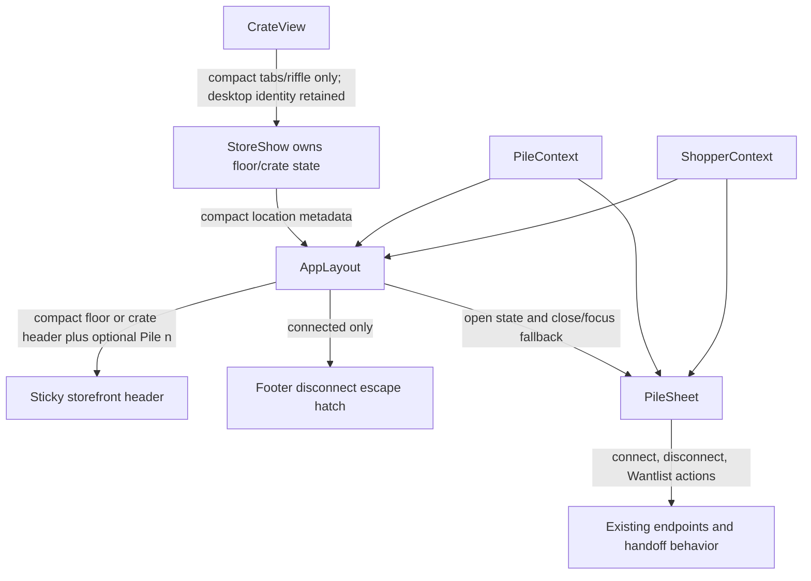
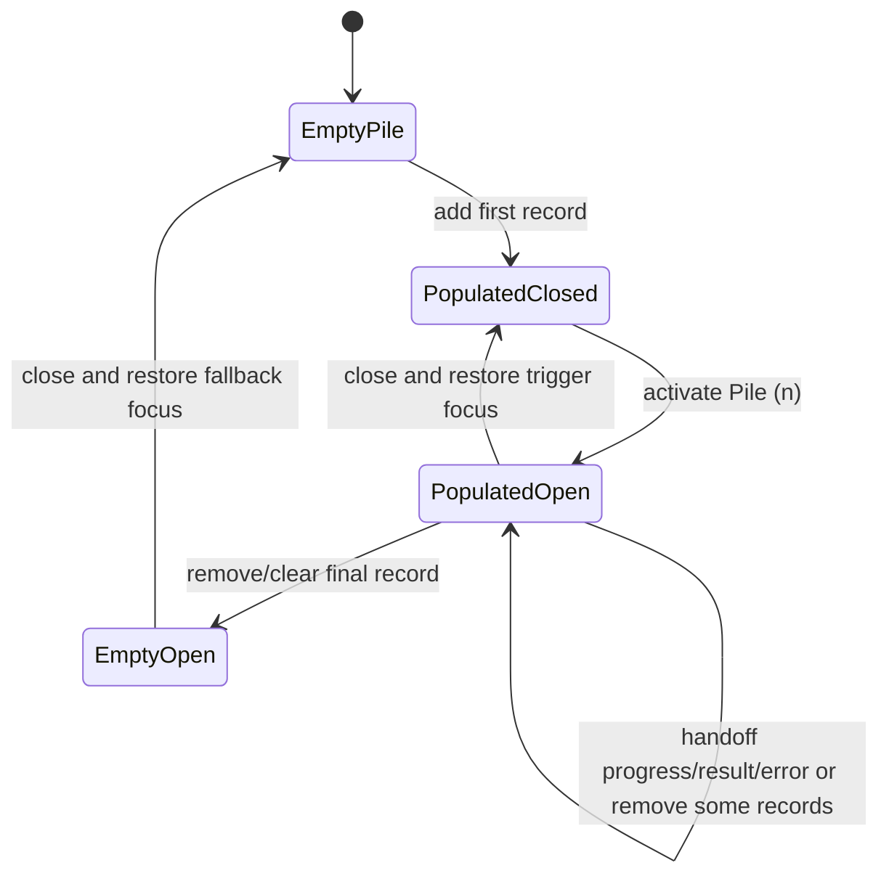
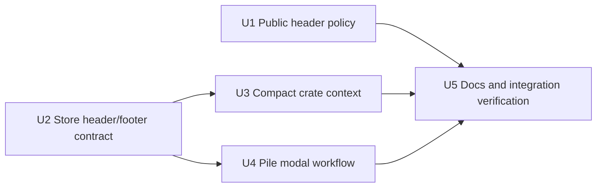

# feat: Recompose Storefront Headers and Responsive Pile Workflow

## Summary

Implement the approved buyer-facing header and pile design by making compact
chrome context-aware, moving Discogs task actions into the pile workflow, and
turning the populated compact pile into a properly modal full-screen surface.
The implementation remains in frontend presentation ownership and preserves
the existing seller-scoped Discogs Wantlist handoff and Rails endpoints.

---

## Problem Frame

The current storefront composes independently useful controls into an
inefficient compact hierarchy: a global store header persists above an
additional crate header, a Discogs connection icon appears before a shopper
has a handoff task, and the pile asserts modal semantics without containing
focus or isolating background content. The approved design establishes one
persistent compact action only after intent exists: `Pile (n)`.

---

## Requirements

- R1. Public buyer-facing pages (`home`, `apply`, and store invitation) show a
  brand-only compact header, while non-compact tiers retain their current
  public actions and theme toggle.
- R2. The storefront header is contextual: compact store-floor browsing shows
  store identity and a pile trigger only when populated; compact crate
  browsing shows back action plus crate identity and populated pile trigger;
  non-compact storefronts keep store identity, populated pile trigger, and
  theme toggle. Persistent Discogs authentication controls are removed from
  every storefront header.
- R3. Connected shoppers can disconnect through a quiet, connected-only store
  footer control even when their pile is empty; connection is initiated only
  from a non-empty eligible pile workflow.
- R4. Compact crate browsing renders exactly one sticky identity/header
  surface without losing crate tabs, record riffle navigation, empty-state
  handling, or `hideTabs` behavior; non-compact crate context remains in page
  content beneath the store header.
- R5. A populated compact pile opens as a full-screen workflow and a
  non-compact pile remains a right drawer; both variants preserve record
  review, totals, clear/remove operations, truthful Wantlist handoff states,
  connected account status, disconnect action, and existing seller-scoped
  destination behavior.
- R6. Changed interaction surfaces meet the approved accessibility and mobile
  usability contract: WCAG 2.2 AA baseline, 44 by 44 CSS pixel compact
  primary controls, modal focus entry/containment/return and fallback,
  inoperable background while `aria-modal="true"` is present, keyboard/touch
  operability without hover-only behavior, appropriate live feedback, and
  reduced-motion compatibility.
- R7. The implementation does not add backend behavior, mobile bottom
  navigation, section-jump navigation, scroll-hide chrome, crate curation
  changes, dashboard redesign, checkout claims, or homepage positioning
  changes; durable product documentation is aligned with the new
  accessibility baseline.

**Origin actors:** Public-page visitor, store-floor shopper, crate-browsing
shopper, shopper with a pile, connected Discogs shopper.

**Origin flows:** Browse before selection; add the first record; disconnect
without a pile; browse a crate on mobile; review and hand off a pile; remove
the final record.

**Origin acceptance examples:** Compact public brand-only headers; compact
floor/crate contextual header variants with populated/empty piles; connected
footer revocation; responsive pile containers and Wantlist states; modal and
touch accessibility checks.

---

## Scope Boundaries

- No homepage hero/copy or audience-positioning revision.
- No owner dashboard or administrative header redesign.
- No store-floor composition, crate curation, record-card, or riffle mechanics
  redesign beyond header ownership required to remove duplicated compact
  context.
- No changes to shopper OAuth routes, session semantics, Rails controllers,
  service objects, Discogs API calls, feature-gating, or seller-scoped
  Wantlist destination behavior unless implementation uncovers a separately
  justified defect.
- No permanent bottom navigation, section-jump action, or scroll-reactive
  header behavior from the superseded mobile navigation concept.
- No claim that the pile is a cart, reserves exact listings, or completes
  checkout on Discogs.

---

## Context & Research

### Relevant Code and Patterns

- `app/frontend/layouts/app_layout.tsx` currently owns storefront providers,
  sticky header, footer, pile-open state, and `PileSheet`; it is the correct
  composition boundary for storefront-level actions and modal/background
  coordination.
- `app/frontend/pages/stores/show.tsx` already owns active floor-versus-crate
  state and back behavior. It can supply compact location metadata without
  shifting browsing state into a layout.
- `app/frontend/components/crate_view.tsx` currently renders compact
  back/title/count as content and non-compact crate context; its compact
  identity row is the duplication to remove while preserving tabs and riffle
  controls.
- `app/frontend/layouts/marketing_layout.tsx` constructs its header outside
  the `ViewportProvider` it renders. Responsive public header policy therefore
  needs a provider-consuming inner layout/header component, not a direct
  `useViewport()` call in the current outer function.
- `app/frontend/components/pile_sheet.tsx` owns record review and Wantlist
  state presentation; it already restores previous focus and closes on
  `Escape`, but has no focus containment or background isolation despite
  `aria-modal="true"`.
- `app/frontend/components/discogs_auth_icon.tsx` is the only persistent
  header authentication presentation and exposes connected disconnection
  through a hover tooltip. Its functionality should be replaced by explicit
  pile/footer controls, then the obsolete component removed when no consumer
  remains.
- `app/frontend/contexts/shopper_context.tsx` already exposes shopper
  connection state and Wantlist request lifecycle. The display relocation
  should consume that state rather than introduce a new backend or
  application-layer operation.
- `app/frontend/test/viewport-test-utils.tsx` and existing compact/wide
  coverage establish the test pattern for tier-specific behavior.
- `spec/requests/pile_wantlist_handoffs_spec.rb` already protects the
  server-side seller scope and credential boundary; no new request behavior is
  planned.

### Layered Architecture Analysis

- Presentation ownership is sufficient for this change: React layouts and
  components decide which controls are visible and how a modal behaves using
  props already supplied by Rails.
- `StoreShow` may provide a narrow presentation model for its current compact
  location, but `AppLayout` remains responsible for the shared storefront
  header, pile trigger, footer, and modal shell coordination.
- `MilkcrateShell` remains a structural slot layout. It must not begin
  inspecting pile, shopper, viewport, or crate state.
- Existing Rails controllers/services remain unchanged because they already
  provide `shopper`, `store.handoff_available`, disconnect, and Wantlist
  operations. Moving their controls in the UI is not a reason to introduce a
  new service or data flow.

### Institutional Learnings

- `docs/solutions/architecture-patterns/viewport-context-responsive-architecture-2026-05-09.md`
  establishes `compact`, `comfy`, and `wide` as the only responsive vocabulary
  and the `renderWithTier` testing pattern.
- `docs/solutions/architecture-patterns/vendor-brand-responsive-surface-system-2026-05-14.md`
  requires `MilkcrateShell` to stay thin and assigns action policy to its
  consuming layouts.
- `docs/solutions/logic-errors/responsive-branching-guard-condition-drift-2026-05-13.md`
  requires parity coverage when refactoring `CrateView` responsive branches,
  especially around `hideTabs` and empty states.
- `docs/solutions/integration-issues/discogs-oauth-csv-export-2026-05-22.md`
  reinforces that authentication operations and tokens stay on existing
  server-owned paths; this feature changes controls, not credential handling.
- `docs/plans/2026-05-24-004-feat-seller-scoped-discogs-wantlist-handoff-plan.md`
  defines the truthful, seller-scoped Wantlist behavior that this work must
  retain. Its old header-icon placement is superseded by the approved design.
- `docs/brainstorms/2026-05-09-navigation-store-floor-requirements.md`
  documents the prior mobile-navigation direction; its persistent navigation
  proposal is explicitly rejected by the approved design and is not carried
  into this plan.

### External References

- W3C WAI-ARIA Authoring Practices, Modal Dialog Pattern:
  https://www.w3.org/WAI/ARIA/apg/patterns/dialog-modal/
- W3C WCAG 2.2, Understanding Success Criterion 2.5.8 Target Size:
  https://www.w3.org/WAI/WCAG22/Understanding/target-size-minimum
- Official React documentation retrieved through Context7
  (`/reactjs/react.dev`) confirms that state-synchronized modal lifecycle and
  focus operations belong in effects/ref-managed interaction logic; the
  existing animated pile may be retained only if it satisfies the modal
  behavior contract.

---

## Key Technical Decisions

| Decision | Rationale |
|---|---|
| Treat this as a new plan sourced from the approved design, not an edit to the completed Wantlist plan | The handoff operation is preserved; the header, responsive container, and accessibility contract are materially new work. |
| Keep `MilkcrateShell` structural and put responsive action policy in `MarketingLayout` and `AppLayout` | This matches existing layout ownership and avoids a shared shell that understands application state. |
| Split `MarketingLayout` into provider wrapper and viewport-aware presentation content | The current function cannot consume the `ViewportProvider` it instantiates; an inner consumer is the narrowest clean change. |
| Add a narrow compact location model from `StoreShow` to `AppLayout`, representing either floor/default context or active crate `{ name, count, onBack }` | `StoreShow` already owns selection and navigation; the layout must compose the single sticky compact header with its pile action rather than accepting unrelated state or inferring routes. |
| Exercise responsive layout policy through testable provider-consuming layout content, not only page tests that mock or are shadowed by layout providers | Both layouts instantiate their own `ViewportProvider`; a controlled layout test seam is required for credible compact/non-compact assertions. |
| Keep desktop crate identity rendering in `CrateView`, but move compact identity/back rendering into `AppLayout`; leave compact tabs in crate content | This removes stacked mobile chrome without weakening the existing desktop reading context or tab navigation. |
| Replace `DiscogsAuthIcon` with an explicit reusable Discogs controls component consumed by the pile and connected-only footer | It centralizes existing Rails-compatible connect/disconnect form behavior, removes hover-only access and header noise, and avoids duplicating revocation markup. |
| Coordinate modal closure and fallback focus at the layout boundary while `PileSheet` owns dialog interaction behavior | The opening trigger is in `AppLayout` and may disappear when the final record is removed, so the dialog cannot always restore focus correctly in isolation. |
| Retain the animated pile surface rather than introducing a new dialog library or native-dialog migration | The existing motion/reduced-motion structure can satisfy the approved contract through focused interaction work and tests; a dependency or rendering-mechanism rewrite is unnecessary scope. |
| Update durable product accessibility guidance from WCAG 2.1 AA to WCAG 2.2 AA as part of this feature | The approved design raises the baseline for changed work; leaving product guidance stale would create contradictory standards. |

---

## Open Questions

### Resolved During Planning

- Does relocating Discogs UI require backend work? No. Current shopper props,
  authorize/disconnect routes, and Wantlist endpoint provide all required
  operations; request/service specs are regression protection.
- Should compact crate context be inferred in `AppLayout` from browser
  history or URL? No. `StoreShow` already owns the in-page crate state and
  should pass narrowly scoped presentation metadata.
- Should compact pile semantics be weakened because focus trapping is not
  currently implemented? No. The approved design requires a genuinely modal
  full-screen workflow; focus containment and background isolation are
  implementation requirements.

### Deferred to Implementation

- Which DOM isolation mechanism is cleanest for the existing sibling layout
  and animated dialog (`inert`, equivalent guarded interaction state, or a
  narrowly encapsulated helper)? Select the simplest mechanism that proves
  the modal tests and browser verification without broad shell ownership.
- Whether modal keyboard/focus behavior belongs directly inside `PileSheet`
  or merits a small local hook after implementation begins. Extract only if
  it makes the lifecycle easier to test and understand; do not create a
  general dialog framework for one surface.

---

## High-Level Technical Design

> This diagram is directional guidance for review and sequencing, not an
> implementation specification.

| Surface / state | Compact presentation | Comfy / wide presentation |
|---|---|---|
| Public page | Brand only | Current brand, public actions, theme |
| Store floor, empty pile | Store identity | Store identity and theme |
| Store floor, populated pile | Store identity and `Pile (n)` | Store identity, `Pile (n)`, theme |
| Crate, empty pile | Back plus crate identity | Store header plus in-content crate identity |
| Crate, populated pile | Back, crate identity, `Pile (n)` | Store header with `Pile (n)` plus in-content crate identity |
| Pile open | Full-screen modal workflow | Right drawer modal workflow |

---

## Implementation Units

### U1. Make Public Header Policy Responsive Without Expanding Scope

**Goal:** Render brand-only compact public headers while preserving the
current non-compact public utility model.

**Requirements:** R1, R6, R7

**Dependencies:** None

**Files:**
- Modify: `app/frontend/layouts/marketing_layout.tsx`
- Create: `app/frontend/layouts/marketing_layout.test.tsx`
- Test: `app/frontend/test/pages/home.test.tsx`
- Test: `app/frontend/test/pages/apply.test.tsx`
- Test: `app/frontend/test/pages/page_smoke.test.tsx`
- Test: `app/frontend/test/pages/responsive_surface_matrix.test.tsx`

**Approach:**
- Refactor the layout into an outer provider composition and an inner
  viewport-aware header/content renderer so `useViewport()` reads the
  existing named tier context correctly.
- Provide a focused test seam for the provider-consuming presentation
  component so layout policy can be rendered under a controlled tier rather
  than being hidden behind the outer provider in page tests.
- At `compact`, suppress `Demo`, `Apply`, and the theme action from header
  chrome only; do not alter page-body CTAs or invitation/apply behavior.
- At `comfy` and `wide`, preserve the current header actions and theme
  behavior.

**Execution note:** Characterize current non-compact header behavior first,
then add compact variant assertions before changing layout rendering.

**Patterns to follow:**
- `app/frontend/contexts/viewport_context.tsx`
- `app/frontend/test/viewport-test-utils.tsx`
- `app/frontend/layouts/milkcrate_shell.tsx`

**Test scenarios:**
- Happy path: render the testable viewport-aware `MarketingLayout` content at
  `compact` -> Milkcrate brand is present and header contains no `Demo`,
  `Apply`, or theme control.
- Integration: render shared layout policy at `comfy` and `wide`, and smoke
  home/apply/invitation pages -> current public utilities remain available
  outside compact without changing each page's body CTA behavior.
- Accessibility: compact header still exposes a named home link and visible
  focus styling; suppressed header actions remain available only where their
  page content intentionally renders separate CTAs.

**Verification:**
- Public header policy varies through the existing viewport tiers without
  changing homepage messaging or expanding `MilkcrateShell`.

---

### U2. Recompose Storefront Header And Account Escape Hatch

**Goal:** Make `AppLayout` the single owner of contextual storefront chrome,
populated-pile access, modal/fallback coordination, and quiet connected footer
revocation.

**Requirements:** R2, R3, R6, R7

**Dependencies:** None; U3 supplies the crate variant of its new contract

**Files:**
- Modify: `app/frontend/layouts/app_layout.tsx`
- Create: `app/frontend/components/discogs_connection_controls.tsx`
- Create: `app/frontend/components/discogs_connection_controls.test.tsx`
- Delete: `app/frontend/components/discogs_auth_icon.tsx` after its final
  consumer is removed
- Create: `app/frontend/layouts/app_layout.test.tsx`
- Modify: `app/frontend/test/pages/oauth_claims.test.tsx`
- Modify: `app/frontend/test/pages/page_smoke.test.tsx`

**Approach:**
- Define a narrow optional compact-location prop for `AppLayout` representing
  the active crate identity/back behavior; absent context continues to render
  the store-floor identity derived from existing page props.
- Expose a focused viewport-aware inner layout/content seam for controlled
  `compact`, `comfy`, and `wide` tests, while the exported layout continues
  composing the production providers.
- Remove `DiscogsAuthIcon` and hide the theme toggle at `compact`; retain the
  theme toggle at non-compact tiers.
- Keep `Pile (n)` layout-owned, visible only after pile population, with a
  named and 44 CSS pixel compact activation target and no automatic focus on
  insertion.
- Extract explicit Discogs connect/disconnect form controls with their
  existing CSRF and Rails method-override mechanics so `PileSheet` and the
  connected-only footer share operation markup without restoring a global
  header entry point.
- Render account status and `Disconnect` only for connected shoppers in the
  storefront footer. Use an explicit form control backed by the existing
  disconnect route; never render a footer connection prompt.
- Own stable focus fallback targets in the layout so modal close can return to
  a pile trigger while it exists or to store/crate context when removal of the
  final item removes that trigger.
- Provide a ref or similarly bounded target around the rendered shell content
  so open-modal background isolation can be applied from `AppLayout` without
  teaching `MilkcrateShell` about shopper or pile state.

**Execution note:** Test the old header OAuth assertion away deliberately:
replace it with presence/absence tests for the new intentional entry points,
not a broad snapshot update.

**Patterns to follow:**
- `app/frontend/layouts/app_layout.tsx`
- `app/frontend/contexts/shopper_context.tsx`
- `app/frontend/components/pile_sheet.tsx` existing Rails-compatible form
  POST/CSRF pattern

**Test scenarios:**
- Happy path: compact floor with empty pile -> store identity is shown; no
  theme, Discogs, or pile action is present.
- Happy path: add the first pile item on compact floor and non-compact floor
  -> named `Pile (1)` appears; existing focused browsing control is not
  replaced as the active element.
- Responsive: non-compact floor -> store identity and theme action remain;
  persistent Discogs auth icon does not render.
- Account state: connected shopper with an empty pile -> footer identifies the
  connected account and exposes a keyboard-operable `Disconnect` control;
  disconnected shopper -> footer does not show connection or disconnection
  actions.
- Integration: submitting footer disconnect -> form targets the current
  existing disconnect endpoint with Rails method/CSRF inputs; no endpoint or
  payload contract changes.
- Unit: shared connection-control forms -> the connect form carries the
  existing store slug/CSRF fields and the disconnect form carries the
  existing CSRF plus Rails delete method override without hover interaction.
- Accessibility: compact pile trigger and footer disconnect meet target-size,
  accessible-name, and focus-visible expectations.

**Verification:**
- The storefront header no longer presents authentication outside a task, and
  an already connected shopper always has an accessible revocation path.

---

### U3. Supply Compact Crate Context From Store State Without Duplicating Headers

**Goal:** Render one sticky compact crate header while preserving `CrateView`
browsing behavior and desktop composition.

**Requirements:** R2, R4, R6, R7

**Dependencies:** U2

**Files:**
- Modify: `app/frontend/pages/stores/show.tsx`
- Modify: `app/frontend/components/crate_view.tsx`
- Modify: `app/frontend/components/crate_view.test.tsx`
- Modify: `app/frontend/test/pages/page_smoke.test.tsx`
- Modify: `app/frontend/test/pages/responsive_surface_matrix.test.tsx`
- Modify: `app/frontend/layouts/app_layout.test.tsx`

**Approach:**
- Reuse `StoreShow`'s existing `activeSlug`, selected crate, and
  `history.back()` behavior to provide active crate name, count, and back
  callback to `AppLayout`.
- At `compact`, remove the in-content identity/back row from `CrateView`
  because that presentation now belongs to the sticky storefront header;
  retain compact crate tabs below it.
- At `comfy` and `wide`, leave the in-content crate header and back control in
  `CrateView`, below the persistent desktop-style store header.
- Preserve `hideTabs`, empty-crate, riffle keyboard, record stack, progress,
  and lesson-cue branches.

**Execution note:** Use guard-parity tests before and after the header move;
the visual simplification must not collapse distinct empty/hidden-tab
conditions.

**Patterns to follow:**
- `docs/solutions/logic-errors/responsive-branching-guard-condition-drift-2026-05-13.md`
- `app/frontend/components/crate_view.test.tsx`

**Test scenarios:**
- Happy path: enter a populated crate at `compact` -> one sticky header
  exposes back, crate name, count, and optional populated pile action; content
  still renders tabs and riffle controls without a second identity heading.
- Happy path: enter a populated crate at `wide` -> persistent store header
  and existing in-content crate heading/back/tabs remain.
- Edge case: compact and wide empty crate with `hideTabs` true/false -> empty
  messaging and tab visibility remain correct without duplicated compact
  identity.
- Integration: invoke compact sticky back action -> existing browser-history
  return flow leads to store floor; invoke tab selection -> active crate
  context updates through existing `StoreShow` state.
- Accessibility: long crate titles can be visually constrained while keeping
  an accessible name; compact back and pile controls remain target-sized and
  keyboard operable.

**Verification:**
- Compact crate view uses exactly one context header; no browsing mechanics or
  responsive guards regress.

---

### U4. Turn The Pile Into A Responsive, Accessible Task Workflow

**Goal:** Make the pile the sole Discogs task surface, full-screen on compact
devices and modal-accessible at all tiers.

**Requirements:** R3, R5, R6, R7

**Dependencies:** U2

**Files:**
- Modify: `app/frontend/components/pile_sheet.tsx`
- Modify: `app/frontend/components/discogs_connection_controls.tsx`
- Modify: `app/frontend/components/pile_sheet.test.tsx`
- Modify: `app/frontend/components/accessibility.test.tsx`

**Approach:**
- Replace compact bottom-sheet sizing with a full-screen modal surface that
  provides safe-area-aware padding and a fixed workflow header plus
  scrollable review/content area; retain the non-compact right drawer.
- Align both variants to the approved information hierarchy: title/actions,
  record review, total, then Discogs handoff explanation/action.
- Render `Connect with Discogs` only in a populated eligible disconnected
  pile. For a connected shopper, display account status and explicit
  `Disconnect` alongside the existing truthful Wantlist action.
- Preserve empty, unavailable, creating, success, and failure state behavior;
  if the final record is removed while open, retain the open empty workflow
  until the shopper closes it.
- Implement actual modal interaction behavior: initial static/title focus,
  contained `Tab` and `Shift+Tab`, visible close action and `Escape`, actual
  background interaction isolation while modal, and cooperation with
  layout-owned focus return/fallback. Remove `aria-modal="true"` rather than
  ship a false claim if isolation cannot be established.
- Add scoped live status handling for asynchronous handoff results without
  causing the record list to be repeatedly announced.

**Execution note:** Treat modal semantics as test-first accessibility work.
Container styling is not completion unless interaction tests prove the
contract.

**Patterns to follow:**
- `app/frontend/components/pile_sheet.tsx`
- `app/frontend/components/storefront_motion_config.tsx`
- WAI-ARIA Modal Dialog Pattern cited above

**Test scenarios:**
- Responsive: populated pile at `compact` -> dialog is full-screen and not an
  `85vh` rounded bottom sheet; at `comfy` and `wide` -> it remains a right
  drawer with the same content order and action states.
- Handoff state: populated eligible disconnected pile -> connection
  explanation/form is present; connected pile -> account status,
  `Disconnect`, and Wantlist handoff are present; unavailable or empty pile ->
  no unsupported connection/handoff prompt appears.
- Lifecycle: creating disables duplicate handoff; success and partial-skipped
  results retain truthful outcome and seller-scoped destination; error offers
  retry/reset without clearing the pile.
- Edge case: remove or clear the last item while open -> empty-state workflow
  stays open; close removes the header trigger and focuses the contextual
  fallback supplied by the layout.
- Accessibility: opening focuses the pile title/start element; repeated Tab
  and Shift+Tab cannot leave the dialog; outside shell is inoperable while
  modal; close button and Escape dismiss; close with remaining items returns
  focus to the invoking trigger.
- Accessibility: record removal, clear confirmation, close, connect,
  disconnect, and handoff controls satisfy compact touch-target and accessible
  name checks; progress/result/error are live-announced; reduced motion keeps
  all state readable without relying on transition.

**Verification:**
- Discogs actions occur only in purposeful pile/footer locations and the
  dialog accurately meets its declared modal accessibility contract.

---

### U5. Align Durable Guidance And Run Cross-Surface Regression Verification

**Goal:** Make the new accessibility baseline durable and prove that changed
composition does not weaken existing product or integration contracts.

**Requirements:** R1, R2, R3, R4, R5, R6, R7

**Dependencies:** U1, U2, U3, U4

**Files:**
- Modify: `docs/product.md`
- Modify: `app/frontend/test/pages/responsive_surface_matrix.test.tsx`
- Modify: `app/frontend/test/pages/page_smoke.test.tsx`
- Test: `spec/requests/pile_wantlist_handoffs_spec.rb`

**Approach:**
- Update the product accessibility baseline to WCAG 2.2 AA and note the
  compact primary-control target established by the approved design.
- Consolidate cross-surface assertions that span layout/component boundaries:
  public compact header, store floor, compact crate, desktop crate, footer
  disconnect, compact pile, and desktop drawer.
- During implementation verification, run frontend component/type checks and
  existing request specs for the unchanged Wantlist boundary; inspect the
  changed paths at compact and non-compact tiers with long labels,
  connected/disconnected state, light/dark desktop presentation, and reduced
  motion.

**Execution note:** This unit verifies integration rather than creating a
second architecture for UI state.

**Patterns to follow:**
- `app/frontend/test/pages/responsive_surface_matrix.test.tsx`
- `app/frontend/test/pages/page_smoke.test.tsx`
- `spec/requests/pile_wantlist_handoffs_spec.rb`

**Test scenarios:**
- Integration: compact public, floor, crate, and open pile journeys show the
  approved header progression from orientation to task without a fixed bottom
  navigation surface.
- Integration: desktop public, floor, crate, and open pile journeys preserve
  roomier actions, store context, and drawer presentation while omitting
  persistent Discogs header UI.
- Regression: existing seller-scoped Wantlist request specs remain green and
  no frontend copy claims cart, exact-listing transfer, reservation, or
  completed checkout.
- Manual accessibility/UI: narrow viewport plus long store/crate names,
  keyboard-only modal traversal, touch-sized actions, safe-area treatment,
  connected empty-pile disconnect access, reduced motion, and desktop
  light/dark appearance all satisfy the approved acceptance criteria.

**Verification:**
- Documentation, automated coverage, and targeted UI review agree on the
  responsive/accessibility contract without altering backend handoff
  semantics.

---

## Delivery Sequence

- U1 may proceed independently because it changes public layout policy only.
- U2 establishes the storefront header/action and focus-return contract used
  by U3 and U4.
- U3 and U4 can be implemented after U2 without changing one another's
  internal browsing or handoff ownership.
- U5 closes the work only after both composition paths and modal behavior are
  verifiable together.

---

## System-Wide Impact

- **Interaction graph:** `StoreShow` sends active compact location metadata to
  `AppLayout`; `AppLayout` combines it with pile and shopper context to render
  header/footer and coordinate `PileSheet`; `PileSheet` continues to invoke
  existing auth/Wantlist operations.
- **Error propagation:** OAuth redirect/disconnect flash handling and Wantlist
  request error/success rendering remain existing behavior; only their
  presentation locations and modal announcements change.
- **State lifecycle risks:** A pile action can appear or disappear while
  browsing; most importantly, removing the final record while its dialog is
  open invalidates the normal return-focus target and requires a tested
  layout-owned fallback.
- **API surface parity:** Public pages sharing `MarketingLayout` must follow
  the same compact policy; storefront floor and crate modes sharing
  `AppLayout` must follow the same pile/account policy.
- **Integration coverage:** Component tests alone do not prove a single
  compact crate header, modal sibling isolation, or footer availability with
  an empty pile, so page/layout integration tests and UI inspection are
  required.
- **Unchanged invariants:** Rails shopper authorization/disconnect routes,
  server-side seller scoping, Wantlist mutation/destination, pile persistence,
  exact Discogs record links, store curation, and dashboard header ownership
  remain unchanged.

---

## Risk Analysis & Mitigation

| Risk | Likelihood | Impact | Mitigation |
|---|---:|---:|---|
| Compact crate location is duplicated or becomes stale | Medium | High | Pass current presentation metadata from existing `StoreShow` state; assert floor/crate transitions and back/tab updates. |
| Removing header auth strands a connected shopper with no pile | Medium | High | Land connected-only footer disconnect in the same storefront contract and test empty-pile behavior. |
| Dialog remains labeled modal while the underlying page can still be reached | Medium | High | Treat focus containment and background isolation as required test scenarios; do not retain `aria-modal` without proof. |
| Removing the final record loses focus or closes unexpectedly | High | Medium | Keep the open empty state and coordinate tested fallback focus from the layout. |
| Responsive branch changes regress `hideTabs` or empty crate state | Medium | Medium | Extend existing compact/wide guard-parity tests before modifying rendering. |
| Compact long labels or safe areas crowd essential controls | Medium | Medium | Validate truncation/accessibility naming, target size, and safe-area behavior in UI inspection. |
| Relocated handoff text accidentally weakens truthful marketplace claims | Low | High | Preserve existing Wantlist contract and run copy/request regressions against cart or exact-transfer claims. |

---

## Documentation / Operational Notes

- Update `docs/product.md` to state WCAG 2.2 AA and the compact
  primary-control target so future UI work does not reintroduce the old
  baseline.
- No migrations, route changes, service changes, feature flag changes,
  operational tasks, or production data updates are expected.
- UI implementation verification may use an already running developer server,
  but this plan does not require starting or stopping project server
  processes.

---

## Sources & References

- **Origin document:** `docs/superpowers/specs/2026-05-25-storefront-header-pile-responsive-design.md`
- Product direction: `STRATEGY.md`
- Product guidance: `docs/product.md`
- Superseded navigation input: `docs/brainstorms/2026-05-09-navigation-store-floor-requirements.md`
- Preserved handoff plan: `docs/plans/2026-05-24-004-feat-seller-scoped-discogs-wantlist-handoff-plan.md`
- Responsive architecture learning: `docs/solutions/architecture-patterns/viewport-context-responsive-architecture-2026-05-09.md`
- Shell/branding learning: `docs/solutions/architecture-patterns/vendor-brand-responsive-surface-system-2026-05-14.md`
- Responsive guard learning: `docs/solutions/logic-errors/responsive-branching-guard-condition-drift-2026-05-13.md`
- OAuth boundary learning: `docs/solutions/integration-issues/discogs-oauth-csv-export-2026-05-22.md`
- WAI-ARIA modal dialog pattern: https://www.w3.org/WAI/ARIA/apg/patterns/dialog-modal/
- WCAG 2.2 target-size guidance: https://www.w3.org/WAI/WCAG22/Understanding/target-size-minimum
- React modal lifecycle guidance: official React documentation via Context7
  library id `/reactjs/react.dev`, retrieved 2026-05-25
