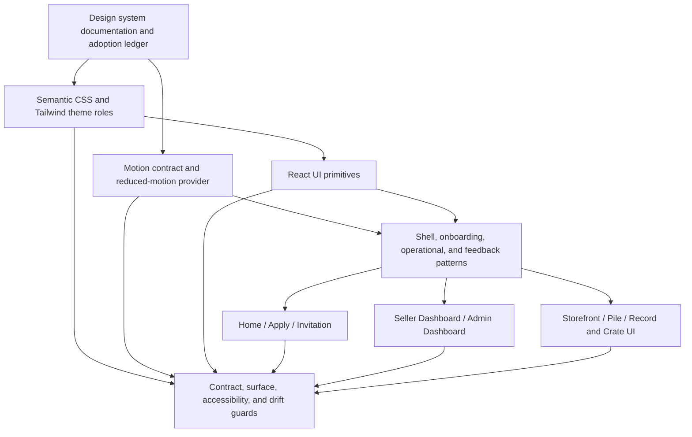
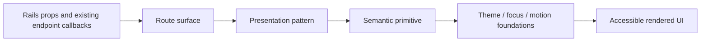

# refactor: Unify Milkcrate Presentation Through Design-System Foundations

## Summary

Build Milkcrate's internal design system as a documented presentation-layer
contract, then migrate the existing React surfaces onto it in controlled
slices. The implementation consolidates semantic tokens, actions, fields,
feedback, status, shell composition, and adoption rules while retaining the
storefront's specialized record, crate, pile, and riffle behavior.

---

## Problem Frame

Milkcrate now has several polished surfaces, but their shared presentation
rules have evolved independently: motion constants conflict, status tones are
raw palette utilities, multiple button and form recipes coexist, and the two
operational dashboards do not participate in the same shell and feedback
contracts as the public/storefront experience. New interface work will
continue to amplify that drift unless the existing assets become an explicit,
owned system.

---

## Requirements

- R1. Establish repository-resident design-system guidance covering
  foundations, components, patterns, and adoption status for every active
  Milkcrate UI surface.
- R2. Define theme-safe semantic foundation roles for surfaces, text, borders,
  actions, feedback/status, and focus, and remove disagreement between CSS and
  React motion token representations.
- R3. Provide canonical React contracts for repeated action, field,
  validation, feedback, status, progress, panel, metric, and empty-state
  presentation, including accessible interactive states.
- R4. Migrate public and onboarding surfaces (`/`, `/apply`, invitation state)
  to shared contracts without changing seller lookup, Turnstile, OAuth, or
  waitlist behavior.
- R5. Migrate seller and admin dashboard presentation to shared status,
  feedback, action, field, and shell patterns without changing administrative
  or sync behavior.
- R6. Migrate storefront and pile presentation to shared action and feedback
  contracts without flattening domain interactions or changing browsing,
  shopper connection, or Wantlist handoff behavior.
- R7. Stabilize the current Milkcrate brand-mark usage as a documented,
  theme-safe system contract; do not silently introduce an unreviewed logo
  redesign.
- R8. Preserve accessibility, `compact`/`comfy`/`wide` responsive behavior,
  keyboard and dialog behavior, and reduced-motion behavior throughout
  migration.
- R9. Add migration and drift guardrails so new presentation work consumes
  semantic contracts instead of reintroducing raw status palettes, duplicate
  component recipes, or inline motion values.
- R10. Keep the work inside presentation ownership: no change to routes,
  authorization, OAuth/session semantics, curation, sync orchestration, or
  backend domain rules.

---

## Scope Boundaries

- No publishable design-system package, external brand site, or Storybook
  application in the initial wave.
- No replacement of record, crate, pile, or riffle components with generic
  administrative components.
- No business-flow, route, controller, presenter, service, job, or persistence
  changes unless a separately justified defect is discovered.
- No redesign of the product logo or replacement of static/PWA assets without
  an approved visual brand direction.
- No mailer styling migration in this wave.
- No active styling investment in `app/views/stores/new.html.erb`: repository
  inspection found no route or `StoresController#new` action exposing it.

### Deferred to Follow-Up Work

- Final logo/static-icon art direction: run as a reviewed visual design slice
  after the system documents the current identity contract.
- Mailer and static/PWA brand alignment: assess after active in-application
  surfaces use stable contracts.
- Removal of unreachable Rails view/layout compatibility markup: pursue as
  focused cleanup after the adoption ledger records its disposition.

---

## Context & Research

### Relevant Code and Patterns

- `app/assets/tailwind/application.css` already exposes Milkcrate theme
  variables through Tailwind's `@theme` namespace, but also contains legacy
  `.mc-btn` and `.mc-input` recipes and CSS motion values that do not match
  the TypeScript motion constants.
- `app/frontend/lib/motion_tokens.ts`,
  `app/frontend/components/storefront_motion_config.tsx`, and
  `scripts/lint-motion-tokens.ts` establish a real motion ownership path and
  reduced-motion provider; the migration should repair and extend this path,
  not add a second one.
- `app/frontend/components/ui/*` supplies local React primitives already used
  by the operational dashboards, but its status variants still embed raw
  emerald/sky/amber/red classes and it lacks canonical field and feedback
  contracts.
- `app/frontend/layouts/milkcrate_shell.tsx`,
  `app/frontend/layouts/marketing_layout.tsx`, and
  `app/frontend/layouts/app_layout.tsx` establish the shared landmark,
  skip-link, theme, viewport, and storefront-provider boundaries.
  `MilkcrateShell` is intentionally structural rather than state-aware.
- `app/frontend/pages/dashboard/index.tsx` and
  `app/frontend/pages/admin/dashboard.tsx` use some shared UI pieces but each
  builds its own root framing, status/message treatment, and field recipes.
- `app/frontend/pages/home.tsx`, `app/frontend/pages/apply.tsx`,
  `app/frontend/pages/stores/invitation.tsx`, and
  `app/frontend/components/discogs_seller_lookup_input.tsx` repeat action,
  panel, validation, result, and reveal-motion treatments across the public
  seller journey.
- `app/frontend/components/pile_sheet.tsx`,
  `app/frontend/components/record_card.tsx`, and
  `app/frontend/components/record_details.tsx` still consume `.mc-btn` and
  local feedback tones inside the strongest domain-specific interaction flow.
- `app/frontend/components/accessibility.test.tsx`,
  `app/frontend/test/pages/responsive_surface_matrix.test.tsx`, layout tests,
  page tests, and component tests already form the appropriate regression
  seams for an incremental presentation migration.
- `config/routes.rb` and `app/controllers/stores_controller.rb` expose
  storefront and invitation Inertia rendering but no `new` action or route
  for `app/views/stores/new.html.erb`; that view is a legacy disposition item,
  not an active migration target.

### Institutional Learnings

- `docs/solutions/architecture-patterns/storefront-animation-token-system-2026-05-08.md`
  establishes token -> provider -> hook/wrapper ownership and requires
  reduced-motion behavior to be treated as a foundation.
- `docs/solutions/architecture-patterns/viewport-context-responsive-architecture-2026-05-09.md`
  defines the only responsive vocabulary as `compact`, `comfy`, and `wide`,
  prefers CSS for visual reflow, and requires `renderWithTier` coverage where
  topology changes.
- `docs/solutions/architecture-patterns/vendor-brand-responsive-surface-system-2026-05-14.md`
  establishes `BrandMark`, the thin `MilkcrateShell`, and the rule that domain
  storefront components should not be flattened into generic cards.
- `docs/solutions/logic-errors/responsive-branching-guard-condition-drift-2026-05-13.md`
  requires guard-parity auditing whenever responsive rendering branches are
  changed.
- `docs/plans/2026-05-25-002-feat-home-page-redesign-plan.md` has landed the
  self-serve seller path and is now current input to consolidation rather
  than a surface to rebuild.
- `docs/plans/2026-05-25-001-feat-storefront-header-pile-responsive-workflow-plan.md`
  corresponds to existing contextual header, connection controls, and modal
  pile code; this plan preserves those workflow decisions while normalizing
  their styling contracts.
- `docs/plans/2026-05-16-001-feat-admin-dashboard-workflow-plan.md` explicitly
  deferred a broader system migration after introducing the first local UI
  primitives; this plan addresses that deferred presentation work.

### External References

- Penn Libraries Design System, <https://designsystem.library.upenn.edu/>:
  informs the practical foundations/components/patterns documentation
  organization selected in the origin design.
- Nord Design System, <https://nordhealth.design/>: informs mature token,
  theme, and component-contract depth without implying Nord packages or
  branding should be adopted.
- Tailwind CSS v4 documentation retrieved through Context7
  (`/tailwindlabs/tailwindcss.com`): top-level `@theme` `--color-*`
  variables create utilities, and semantic utility values can reference
  theme-dependent CSS variables. This supports retaining CSS as the semantic
  color-role owner.
- Motion accessibility documentation retrieved through Context7
  (`/websites/motion_dev`): `MotionConfig` with `reducedMotion="user"`
  disables transform/layout motion while retaining low-risk properties. This
  confirms the existing provider is the correct reduced-motion boundary.
- W3C WAI-ARIA Authoring Practices Guide, <https://www.w3.org/WAI/ARIA/apg/>:
  remains the behavioral reference for shared interactive widget and dialog
  contracts.

---

## Key Technical Decisions

- **Treat the design system as an internal presentation architecture, not a
  package:** all active interfaces live in one application and already share
  Tailwind, React, shell, and test infrastructure. Packaging or a standalone
  docs application would increase maintenance before the contracts settle.
- **Create `docs/design-system/` as the usage-facing documentation home:**
  `docs/solutions/` explains historical problems and lessons, whereas a
  design system needs current rules, examples, adoption status, and
  replacement guidance.
- **Keep semantic visual tokens in CSS/Tailwind theme roles:** themes already
  switch through CSS variables and Tailwind v4 supports semantic utilities
  mapped to those variables. Components should use role utilities such as
  feedback/status roles rather than importing palette decisions into
  TypeScript.
- **Keep interactive motion ownership in `motion_tokens.ts` and synchronize
  CSS mirrors to it:** Motion consumers need reusable typed transition
  objects; CSS values remain mirrors for CSS-only effects. Documentation and
  checks must make the TypeScript interaction contract authoritative instead
  of permitting two editable sets of values.
- **Extend existing local React primitives rather than adopt a third-party
  component library:** admin and seller dashboard code already proves the
  local primitive direction. The missing capability is semantic state
  ownership and cross-surface adoption, not a new library.
- **Provide one action styling contract for buttons and action-like links:**
  public and storefront flows include navigation links, form posts, and
  native buttons. Forcing all of them into one element type would damage
  semantics; sharing variants/sizes/state treatment avoids duplicated CTA
  strings while retaining correct markup.
- **Keep `MilkcrateShell` structural; let surface composition own density and
  workflow policy:** dashboards should join shell/feedback contracts without
  making the shell understand admin status, store selection, pile state, or
  route-specific actions.
- **Migrate shared controls around domain components, not the domain
  behavior:** `CrateView`, `RecordCard`, `RecordDetails`, and `PileSheet`
  should consume canonical actions/feedback where applicable while retaining
  their established product language, state ownership, and interaction
  behavior.
- **Stabilize the current brand contract before any new visual mark:** the
  existing `BrandMark` is provisional but functional and tested. A system
  migration can make its usage and theme behavior consistent; creating a new
  logo without a reviewed direction would mix brand design with
  infrastructure cleanup.
- **Document the Rails store form as unreachable rather than styling it
  speculatively:** active route/controller inspection supplies no path to the
  form. The adoption ledger should record this evidence and isolate any later
  removal as cleanup, preventing dead markup from dictating active system
  APIs.

---

## Open Questions

### Resolved During Planning

- **Should this work adopt Penn or Nord implementation packages?** No. They
  are reference systems; Milkcrate already has a product-specific stack and
  identity to consolidate.
- **Does design-system migration need backend or workflow refactoring?** No.
  All identified drift is presentation-owned, and the origin design
  explicitly excludes domain/application behavior changes.
- **Should status colors remain raw Tailwind palette classes inside existing
  primitives?** No. They duplicate a semantic decision across components and
  cannot express a stable theme-safe status contract.
- **Should the retained Rails store form shape first-wave primitives?** No.
  No current route/controller action exposes it; document that finding and
  prioritize active surfaces.
- **Should a new logo be created as part of system foundations?** No. Current
  usage can be standardized; selecting a new mark requires an explicit visual
  review.

### Deferred to Implementation

- **Exact primitive API names and composition split:** decide while writing
  characterization tests, keeping each extraction bounded to repeated
  contracts and avoiding a generic component framework.
- **Whether all CSS legacy recipes can be removed after storefront migration:**
  perform a final consumer scan after active React surfaces adopt canonical
  primitives, then deprecate or remove only genuinely unused recipes.
- **Whether a dedicated operational layout merits extraction:** first migrate
  seller/admin frames onto shell and semantic contracts; extract only if the
  resulting shared composition is real rather than coincidental.

---

## Output Structure

    docs/design-system/
      README.md
      foundations.md
      components.md
      patterns.md
      adoption.md
    app/frontend/components/ui/
      existing primitives refined for semantic roles
      new action/field/feedback/supporting primitives as justified
    app/frontend/
      existing layouts, pages, and domain components migrated incrementally
    app/assets/tailwind/application.css
      semantic foundation roles and bounded compatibility recipes
    scripts/
      existing motion check plus design-system drift enforcement

---

## High-Level Technical Design

> This illustrates the intended approach and is directional guidance for
> review, not implementation specification.

Presentation data flow remains unchanged:

The arrows do not reverse into Rails decisions: primitives and patterns render
existing states such as `failed`, `working`, or `connected`; they do not
decide eligibility, synchronization, session, or curation behavior.

---

## Implementation Units

### U1. Establish Usage Documentation and an Adoption Ledger

**Goal:** Make the system's ownership, rules, active surface inventory, and
migration state durable before changing presentation behavior.

**Requirements:** R1, R7, R9, R10

**Dependencies:** None

**Files:**
- Create: `docs/design-system/README.md`
- Create: `docs/design-system/foundations.md`
- Create: `docs/design-system/components.md`
- Create: `docs/design-system/patterns.md`
- Create: `docs/design-system/adoption.md`

**Approach:**
- Translate the approved design into use-facing documentation: semantic role
  vocabulary, primitive/pattern ownership, responsive and accessibility
  rules, and the presentation-layer boundary.
- Record the active routed surfaces, their current owners, migration status,
  and the legacy Rails form reachability evidence in the adoption ledger.
- Distinguish system guidance from historical solution documentation: link to
  relevant `docs/solutions/` entries rather than copying their narrative.
- Mark current brand usage as the interim documented contract and list final
  logo/static asset work as pending separate visual approval.

**Execution note:** Documentation-first; no production markup or style changes
belong in this unit.

**Patterns to follow:**
- `docs/superpowers/specs/2026-05-25-milkcrate-design-system-foundations-design.md`
- `docs/solutions/architecture-patterns/vendor-brand-responsive-surface-system-2026-05-14.md`

**Test scenarios:**
- Test expectation: none -- this unit records implementation contracts and
  migration evidence without changing executable behavior.

**Verification:**
- A contributor can determine where a new action, field, status message,
  shell treatment, or domain pattern belongs without inspecting each route
  page.
- The adoption ledger identifies all current routed surfaces and explicitly
  records the residual Rails form as an unreachable/cleanup candidate.

---

### U2. Normalize Semantic Foundations and Motion Ownership

**Goal:** Give all later components stable theme, feedback/status, focus, and
motion roles while eliminating the confirmed token disagreement.

**Requirements:** R2, R8, R9

**Dependencies:** U1

**Files:**
- Modify: `app/assets/tailwind/application.css`
- Modify: `app/frontend/lib/motion_tokens.ts`
- Modify: `app/frontend/lib/motion_tokens.test.ts`
- Create: `app/frontend/lib/design_system_foundations.test.ts`
- Modify: `scripts/lint-motion-tokens.ts`
- Modify: `docs/design-system/foundations.md`

**Approach:**
- Expand existing CSS variable and Tailwind theme mappings from general
  surfaces/actions into named status, feedback, and focus roles usable in
  both supported themes.
- Document the distinction between semantic roles and palette choices so
  later migration does not simply rename raw colors.
- Select the existing TypeScript motion contract as the authoritative source
  for React interaction values, align CSS-only mirror values to it, and
  extend checks to detect future disagreement or new inline motion drift.
- Keep the existing `StorefrontMotionConfig` reduced-motion ownership intact;
  this unit normalizes foundations rather than changing interaction flows.

**Execution note:** Characterize existing CSS and TypeScript token values
first; then make the deliberate synchronization change visible in tests and
documentation.

**Patterns to follow:**
- `app/frontend/lib/motion_tokens.ts`
- `app/frontend/components/storefront_motion_config.tsx`
- `scripts/lint-motion-tokens.ts`
- Tailwind v4 `@theme` semantic variable guidance retrieved through Context7
- Motion reduced-motion guidance retrieved through Context7

**Test scenarios:**
- Integration: semantic status and focus roles are defined and mapped for
  both dark and light theme inputs so primitive variants do not require raw
  palette classes.
- Integration: CSS motion mirrors and exported React motion values agree on
  the documented press, hover, and lift values.
- Edge case: the motion lint/check path rejects a newly introduced inline
  motion value or unsynchronized mirror outside the owning foundation files.
- Accessibility: the reduced-motion provider contract remains covered while
  foundation values are normalized.

**Verification:**
- Future primitives can express all current status/feedback tones with
  semantic utilities.
- There is one documented source of authority for interaction motion values
  and automated protection against reintroducing the known conflict.

---

### U3. Consolidate Canonical React Primitives

**Goal:** Provide reusable, accessible primitive contracts for repeated
controls and states before migrating route surfaces.

**Requirements:** R3, R8, R9

**Dependencies:** U2

**Files:**
- Modify: `app/frontend/components/ui/button.tsx`
- Modify: `app/frontend/components/ui/badge.tsx`
- Modify: `app/frontend/components/ui/status_dot.tsx`
- Modify: `app/frontend/components/ui/job_progress_bar.tsx`
- Modify: `app/frontend/components/ui/card.tsx`
- Modify: `app/frontend/components/ui/section_header.tsx`
- Create: `app/frontend/components/ui/action.tsx`
- Create: `app/frontend/components/ui/field.tsx`
- Create: `app/frontend/components/ui/feedback_message.tsx`
- Create: `app/frontend/components/ui/metric.tsx`
- Create: `app/frontend/components/ui/empty_state.tsx`
- Modify: `app/frontend/components/ui/ui_primitives.test.tsx`
- Modify: `docs/design-system/components.md`

**Approach:**
- Make primitive variants consume semantic foundation roles for tone and
  focus, eliminating raw status palette ownership inside primitives.
- Share action variant/size/state styling across native buttons and
  correctly semantic links/form actions, rather than turning links into
  buttons or repeating long page-local CTA strings.
- Extract field composition for label, hint, error, invalid association,
  disabled/busy states, and control styling while allowing the route surface
  to own its data and submission behavior.
- Extract feedback/status composition that carries readable labels and
  announcement behavior for success, warning, danger, neutral, and progress
  states.
- Keep panels, metrics, empty states, and section structure small and
  composable; domain-specific cards and pile layouts remain outside this
  generic primitive directory.

**Execution note:** Implement primitive tests before surface replacements so
the migration changes consumers against fixed contracts.

**Patterns to follow:**
- Existing `app/frontend/components/ui/*` composition and tests
- Existing accessible field/error relationships in
  `app/frontend/pages/apply.tsx`
- Existing status text requirement in
  `app/frontend/components/ui/ui_primitives.test.tsx`

**Test scenarios:**
- Happy path: each action form (button and action-like link) exposes the same
  documented variants and focus treatment while preserving native semantics.
- Edge case: disabled and busy actions cannot appear enabled and communicate
  their state programmatically.
- Error path: an invalid field connects label, hint, and error text through
  accessible attributes while using the danger feedback role.
- Happy path: feedback, badges, dots, and progress displays render visible
  text for each semantic tone instead of relying on color.
- Integration: primitive tone variants consume semantic role utilities and no
  longer introduce raw status palette classes.

**Verification:**
- The primitive catalog satisfies the repeated presentation needs identified
  in the inventory and is usable by public, operational, and storefront
  surfaces without route-specific styling duplication.

---

### U4. Migrate Public and Seller-Onboarding Presentation

**Goal:** Bring the home, application, and invitation journeys onto canonical
actions, fields, feedback, panels, and permitted motion patterns without
changing their behavior.

**Requirements:** R4, R8, R10

**Dependencies:** U3, U7

**Files:**
- Modify: `app/frontend/layouts/marketing_layout.tsx`
- Modify: `app/frontend/pages/home.tsx`
- Modify: `app/frontend/pages/apply.tsx`
- Modify: `app/frontend/pages/stores/invitation.tsx`
- Modify: `app/frontend/components/discogs_seller_lookup_input.tsx`
- Modify: `app/frontend/layouts/marketing_layout.test.tsx`
- Modify: `app/frontend/test/pages/home.test.tsx`
- Modify: `app/frontend/test/pages/apply.test.tsx`
- Modify: `app/frontend/test/pages/oauth_claims.test.tsx`
- Modify: `app/frontend/test/pages/responsive_surface_matrix.test.tsx`
- Modify: `docs/design-system/patterns.md`
- Modify: `docs/design-system/adoption.md`

**Approach:**
- Replace flash rendering, CTA class recipes, result messages, error summary,
  and field presentation with canonical primitives while leaving form
  submission, Turnstile lifecycle, lookup requests, and OAuth POST actions in
  their existing surface owners.
- Normalize repeated entrance/result motion through permitted foundation
  patterns only where the surface already animates; do not add motion merely
  to demonstrate the system.
- Document seller onboarding and public feedback composition as patterns
  after their consumers prove the primitive contracts.

**Execution note:** Preserve flow behavior with existing page tests before
replacing styling composition; this is a presentation migration, not a
functional rewrite.

**Patterns to follow:**
- `app/frontend/layouts/marketing_layout.tsx`
- `app/frontend/components/discogs_seller_lookup_input.tsx`
- `app/frontend/test/pages/oauth_claims.test.tsx`

**Test scenarios:**
- Happy path: home seller lookup success still renders a claim action posting
  into the existing OAuth flow, using canonical action/result presentation.
- Error path: lookup failure, existing-store, and existing-applicant states
  retain their existing text/links and expose semantic feedback treatment.
- Error path: apply field and summary validation preserves accessible
  label/hint/error relationships while consuming field/feedback primitives.
- Integration: Turnstile-enabled application rendering and submission
  lifecycle remain intact after the form presentation migration.
- Responsive: home, apply, and invitation states continue rendering at
  `compact`, `comfy`, and `wide` tiers without changing previously established
  header policy.

**Verification:**
- The public/onboarding journey no longer owns duplicate action, form, or
  feedback styling recipes where canonical contracts apply.
- Existing seller workflow behavior remains unchanged by tests.

---

### U5. Align Operational Dashboard Presentation

**Goal:** Bring seller and admin dashboards into the same system for shell
structure, actions, fields, status, feedback, panels, and metrics while
retaining distinct operational density.

**Requirements:** R5, R8, R10

**Dependencies:** U3, U7

**Files:**
- Modify: `app/frontend/pages/dashboard/index.tsx`
- Modify: `app/frontend/pages/admin/dashboard.tsx`
- Modify: `app/frontend/test/pages/dashboard.test.tsx`
- Modify: `app/frontend/test/pages/admin_dashboard.test.tsx`
- Modify: `app/frontend/test/pages/responsive_surface_matrix.test.tsx`
- Modify: `app/frontend/components/accessibility.test.tsx`
- Modify: `docs/design-system/patterns.md`
- Modify: `docs/design-system/adoption.md`

**Approach:**
- Replace owner-dashboard frame, flash, status, sync error, and action
  styling with shell and semantic primitive contracts while retaining its
  resync callback and storefront navigation behavior.
- Replace admin lookup field/messages, flash messages, raw status colors,
  store-card status treatment, and supporting metric/empty-state recipes with
  primitives.
- Apply `MilkcrateShell` as structural composition where it removes page-frame
  drift, using its existing slots while keeping route-specific headers and
  density in each dashboard.
- Do not extract a general operational layout unless both migrated surfaces
  expose a genuinely shared composition after primitive adoption.

**Execution note:** Migrate the seller dashboard first because it has the
smallest operational surface and exposes missing shell/status contracts; then
use those decisions when simplifying the denser admin screen.

**Patterns to follow:**
- `app/frontend/layouts/milkcrate_shell.tsx`
- Existing admin UI primitive usage in
  `app/frontend/pages/admin/dashboard.tsx`
- `app/frontend/components/accessibility.test.tsx` landmark and interaction
  invariants

**Test scenarios:**
- Happy path: seller dashboard displays neutral/syncing/failed status and
  resync actions through shared contracts while preserving router callbacks.
- Error path: seller sync failure and admin lookup/onboarding failures use the
  semantic danger treatment with visible, accessible message text.
- Happy path: admin healthy, processing, warning, and danger operational
  states remain distinguishable by text and status semantics after raw colors
  are removed.
- Integration: shell adoption preserves exactly one primary main landmark
  and functioning skip navigation on each dashboard.
- Responsive: both dashboards remain usable without overflow or lost controls
  at the existing three viewport tiers.

**Verification:**
- Operational routes share system contracts without changing props,
  endpoint actions, polling, onboarding, or synchronization logic.

---

### U6. Adopt Canonical Controls in Storefront and Pile Patterns

**Goal:** Normalize shared actions and feedback in the expressive buyer
experience while protecting the specialized storefront interaction model.

**Requirements:** R6, R8, R10

**Dependencies:** U3, U7

**Files:**
- Modify: `app/frontend/layouts/app_layout.tsx`
- Modify: `app/frontend/pages/stores/show.tsx`
- Modify: `app/frontend/components/pile_sheet.tsx`
- Modify: `app/frontend/components/discogs_connection_controls.tsx`
- Modify: `app/frontend/components/record_card.tsx`
- Modify: `app/frontend/components/record_details.tsx`
- Modify: `app/frontend/components/score_breakdown.tsx`
- Modify: `app/frontend/layouts/app_layout.test.tsx`
- Modify: `app/frontend/components/pile_sheet.test.tsx`
- Modify: `app/frontend/components/discogs_connection_controls.test.tsx`
- Modify: `app/frontend/components/record_card.test.tsx`
- Modify: `app/frontend/components/crate_view.test.tsx`
- Modify: `app/frontend/components/accessibility.test.tsx`
- Modify: `app/frontend/test/pages/responsive_surface_matrix.test.tsx`
- Modify: `docs/design-system/patterns.md`
- Modify: `docs/design-system/adoption.md`

**Approach:**
- Replace app-layout flash notices and store sync presentation with semantic
  feedback contracts.
- Replace `.mc-btn` use in pile, record detail/card actions, and Discogs
  connection controls with canonical action treatment while preserving
  element semantics, focus management, handoff state transitions, and
  external-link behavior.
- Keep crate/riffle navigation, record flipping, pile dialog lifecycle,
  shopper context, and server handoff endpoints unchanged; the storefront is
  consuming system assets, not being redesigned.
- Bring the actively rendered score breakdown onto semantic positive/danger
  presentation; review domain-local motion in crate affordances against the
  documented permitted patterns and record justified exceptions rather than
  silently exempting them.
- Document pile and storefront feedback/action use as domain patterns that
  compose primitives around specialized behavior.

**Execution note:** Characterize populated pile success/error/progress and
record-action paths before replacing `.mc-btn`, because this is the highest
interaction-density migration.

**Patterns to follow:**
- `app/frontend/components/pile_sheet.tsx` and its modal/accessibility tests
- `app/frontend/layouts/app_layout.tsx` provider and focus-boundary ownership
- Existing storefront responsive workflow plan and guard-parity learning

**Test scenarios:**
- Happy path: adding/removing a record and opening/closing a pile continues to
  expose operable canonical actions in compact and non-compact layouts.
- Happy path: connected shopper Wantlist success and disconnect paths retain
  destination/action behavior while using semantic success/action treatment.
- Error path: handoff failure and storefront sync failure expose canonical
  danger/recovery messaging without changing state transitions or callbacks.
- Integration: the rendered crate score breakdown no longer owns a raw danger
  palette decision while keeping the same scoring information and visibility
  conditions.
- Accessibility: dialog focus containment/return, inert background behavior,
  keyboard controls, and no nested interactive markup remain protected.
- Reduced motion: pile and record interaction remains compatible with the
  existing reduced-motion provider after visual contract adoption.

**Verification:**
- Active storefront consumers no longer depend on `.mc-btn` or ad hoc
  feedback styling where canonical primitives cover the behavior.
- Store browsing, pile, Discogs connection, and Wantlist tests prove product
  interaction parity.

---

### U7. Stabilize Brand-Mark and Identity Usage

**Goal:** Make the existing identity consistently usable across active system
surfaces without conflating presentation unification with logo redesign.

**Requirements:** R1, R7, R8

**Dependencies:** U1, U2

**Files:**
- Modify: `app/frontend/components/brand_mark.tsx`
- Modify: `app/frontend/components/brand_mark.test.tsx`
- Modify: `app/frontend/test/pages/page_smoke.test.tsx`
- Modify: `app/frontend/components/accessibility.test.tsx`
- Modify: `docs/design-system/foundations.md`
- Modify: `docs/design-system/components.md`
- Modify: `docs/design-system/adoption.md`

**Approach:**
- Define and test the currently supported wordmark/icon size and
  accessible-name usage, and ensure it renders appropriately through existing
  themes and surface headers.
- Replace "temporary" undocumented usage with an explicitly interim contract
  in documentation, including where wordmark-visible and icon-only forms are
  permitted.
- Do not introduce new icon imagery or static asset replacements in this
  unit; record that decision and the future visual-approval dependency.

**Execution note:** Land the brand usage contract before the public/storefront
surface migrations so their adoption work is judged against a stable identity
contract; this unit does not need to change route-specific layout policy.

**Patterns to follow:**
- Existing `BrandMark` and its accessibility coverage
- Brand/shell learning in
  `docs/solutions/architecture-patterns/vendor-brand-responsive-surface-system-2026-05-14.md`

**Test scenarios:**
- Happy path: wordmark-visible and icon-only usages retain discernible
  accessible identity in documented placements.
- Integration: public/storefront page smoke coverage continues to reject old
  stray brand glyph/wordmark regressions.
- Theme/accessibility: brand presentation remains legible and correctly named
  without requiring a new asset.

**Verification:**
- The design-system documentation can state the identity contract truthfully,
  and active surfaces consume it consistently while final visual brand work
  remains clearly deferred.

---

### U8. Enforce Adoption and Close Migration Drift

**Goal:** Make the completed system migration durable by documenting
adoption/deprecation status and rejecting new use of obsolete presentation
recipes in active React surfaces.

**Requirements:** R1, R8, R9, R10

**Dependencies:** U4, U5, U6, U7

**Files:**
- Modify: `docs/design-system/adoption.md`
- Modify: `docs/design-system/README.md`
- Create: `scripts/lint-design-system-tokens.ts`
- Modify: `package.json`
- Modify: `app/assets/tailwind/application.css`
- Modify: `app/frontend/test/pages/page_smoke.test.tsx`
- Modify: `app/frontend/test/pages/responsive_surface_matrix.test.tsx`
- Modify: `app/frontend/components/accessibility.test.tsx`

**Approach:**
- Scan active frontend consumers after migration and identify obsolete
  `.mc-btn`, `.mc-input`, `.mc-notice`, duplicated CTA/control/feedback
  strings, raw status palette use, and remaining inline motion decisions
  outside owned foundation or documented domain exceptions.
- Add a focused enforcement check for reliably identifiable drift and
  document narrow exceptions where a domain component intentionally needs a
  distinct treatment.
- Remove or deprecate CSS compatibility recipes only after consumer scanning
  proves active code no longer needs them; do not use the unreachable Rails
  form as justification to carry active duplication indefinitely.
- Finalize the adoption ledger by marking active surfaces migrated, noting
  any accepted exceptions, and recording the residual Rails form/static asset
  follow-up disposition.

**Execution note:** Enforcement lands last so it does not fail on the known
pre-migration debt it is intended to remove.

**Patterns to follow:**
- `scripts/lint-motion-tokens.ts`
- Existing page surface and accessibility regression suites
- Adoption/deprecation rules recorded in U1

**Test scenarios:**
- Integration: all active public, storefront, seller, and admin surface smoke
  and responsive coverage remains green after canonical adoption.
- Edge case: the new drift check rejects raw semantic status styling or a
- Edge case: the new drift check rejects reintroduced legacy field/feedback
  recipes in a migrated active surface.
- Edge case: documented domain-specific or compatibility exceptions do not
  create false enforcement failures.
- Accessibility: final cross-surface regression suite protects landmarks,
  focus, dialog behavior, readable status meaning, and reduced motion.

**Verification:**
- The adoption ledger and enforcement path agree about what is canonical,
  deprecated, excepted, and deferred.
- New interface work receives an immediate failure or clear documentation
  signal if it recreates the presentation drift this plan resolves.

---

## Phased Delivery

### Phase 1: Contract and Foundations

- U1 documents current ownership, system rules, and migration evidence.
- U2 normalizes semantic tokens and motion authority.

### Phase 2: Reusable Presentation Contracts

- U3 establishes canonical React primitives.
- U7 stabilizes brand usage independently of workflow migrations.

### Phase 3: Surface Adoption

- U4 migrates public/onboarding presentation.
- U5 migrates operational dashboards.
- U6 migrates storefront/pile interaction presentation.

U4, U5, and U6 all depend on U3 but can be reviewed and shipped as bounded
slices rather than one high-risk interface rewrite.

### Phase 4: Governance

- U8 turns migration decisions into durable adoption documentation and drift
  enforcement.

---

## System-Wide Impact

- **Interaction graph:** Existing route pages continue receiving Rails props
  and invoking their current callbacks/forms/endpoints; the new system
  changes their presentation composition through shared CSS roles and React
  primitives. `MarketingLayout`, `AppLayout`, and dashboard roots are the
  primary composition boundaries affected.
- **Error propagation:** Application, lookup, onboarding, sync, and Wantlist
  failures continue originating in their current owners; canonical feedback
  components render the supplied failure state and recovery action without
  interpreting or altering backend meaning.
- **State lifecycle risks:** No persistent state or request lifecycle is
  intended to change. Risk is accidental behavior regression while replacing
  forms/actions or feedback wrappers, particularly Turnstile cleanup, OAuth
  POSTs, dashboard polling, pile dialog focus, and handoff result states.
- **API surface parity:** React is the active implementation path. The
  unexposed Rails store form is documented as a disposition candidate rather
  than creating a second supported primitive surface; mailer/static asset
  alignment is separately deferred.
- **Integration coverage:** Cross-surface responsive, accessibility, motion,
  OAuth claim, pile/handoff, and dashboard page tests are required because
  isolated primitive tests cannot prove layout/provider or workflow parity.
- **Unchanged invariants:** Route paths, Inertia prop shapes, authorization,
  seller/shopper OAuth behavior, Turnstile behavior, curation results,
  dashboard operations, pile/Wantlist semantics, and responsive tier
  definitions remain unchanged.

---

## Risk Analysis & Mitigation

| Risk | Likelihood | Impact | Mitigation |
| --- | --- | --- | --- |
| Semantic-token migration visually reduces contrast in one theme | Medium | High | Define role coverage in U2, consume it through primitive tests, and perform theme-aware browser review per surface slice. |
| Replacing action/form markup alters native semantics or an existing POST flow | Medium | High | Share styling contracts without coercing element types; retain flow-specific tests for OAuth, Turnstile, dashboard actions, and Wantlist handoff. |
| Motion synchronization changes the tactile feel unexpectedly | Medium | Medium | Make the authority decision explicit, adjust known conflicting mirrors deliberately, retain reduced-motion tests, and visually verify the expressive storefront surfaces. |
| Generic primitives flatten storefront identity | Medium | High | Restrict primitives to repeated contracts; migrate controls and messages around domain components rather than rewriting crate/record/pile behavior. |
| Shell alignment creates duplicated landmarks or provider regressions | Low | High | Keep `MilkcrateShell` structural and protect landmark/provider behavior through existing layout and accessibility suites. |
| Enforcement creates noisy false positives and is ignored | Medium | Medium | Introduce enforcement only after migration, target reliably detectable drift, and document narrowly justified exceptions. |
| Brand work expands into an unapproved identity redesign | Medium | Medium | Stabilize current `BrandMark` only; defer new marks/static assets to a separately reviewed design direction. |
| Legacy Rails markup unnecessarily broadens system support | Low | Medium | Record route/controller evidence and do not treat unreachable markup as a first-wave consumer. |

---

## Documentation / Operational Notes

- `docs/design-system/` becomes the current usage contract; continue using
  `docs/solutions/` for historical learnings discovered during implementation.
- Update `docs/design-system/adoption.md` in the same implementation slice as
  each migrated surface so it does not become a retrospective checklist.
- No server startup or background-process changes are needed for this
  presentation work. Manual visual verification should use the developer's
  already-running application when available.
- Because `development` is the integration branch for this repository,
  implementation work should branch from and target `development` under the
  repository workflow.

---

## Success Metrics

- All currently routed React surfaces are marked migrated or have a named,
  justified exception in the adoption ledger.
- Canonical action, field, feedback, status, and panel contracts cover the
  repeated needs observed in active surfaces.
- No active migrated React surface owns raw status palette decisions or
  legacy `.mc-btn`, `.mc-input`, or `.mc-notice` recipes outside documented
  exceptions.
- Motion token checks prevent the existing CSS/TypeScript mismatch from
  recurring.
- Existing accessibility, responsive, and workflow regression coverage passes
  after each surface migration slice.

---

## Sources & References

- **Origin document:** `docs/superpowers/specs/2026-05-25-milkcrate-design-system-foundations-design.md`
- Related code: `app/assets/tailwind/application.css`
- Related code: `app/frontend/lib/motion_tokens.ts`
- Related code: `app/frontend/components/ui/`
- Related code: `app/frontend/layouts/`
- Related code: `app/frontend/pages/`
- Related code: `app/frontend/components/pile_sheet.tsx`
- Related knowledge: `docs/solutions/architecture-patterns/storefront-animation-token-system-2026-05-08.md`
- Related knowledge: `docs/solutions/architecture-patterns/viewport-context-responsive-architecture-2026-05-09.md`
- Related knowledge: `docs/solutions/architecture-patterns/vendor-brand-responsive-surface-system-2026-05-14.md`
- Related knowledge: `docs/solutions/logic-errors/responsive-branching-guard-condition-drift-2026-05-13.md`
- Reference system: <https://designsystem.library.upenn.edu/>
- Reference system: <https://nordhealth.design/>
- Framework reference: Tailwind CSS documentation via Context7,
  `/tailwindlabs/tailwindcss.com`
- Framework reference: Motion accessibility documentation via Context7,
  `/websites/motion_dev`
- Accessibility reference: <https://www.w3.org/WAI/ARIA/apg/>
