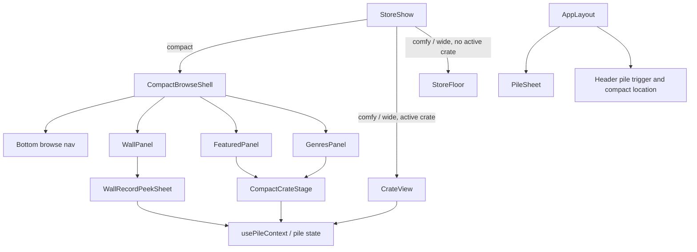

# feat: Add Compact Storefront Browse Shell

## Summary

Recompose the compact storefront on the existing store route so Wall,
Featured, and Genres become distinct mobile browse modes. Wall stays a
curated taste surface with a bottom peek sheet for record actions. Featured
and Genres become crate-digging modes with chip selection and an inline crate
stage. Comfy and wide keep the existing stacked floor and full `CrateView`
experience.

---

## Problem Frame

The current storefront has the right ingredients, but compact reading still
collapses too many jobs into the same visible structure. Wall tiles are small
enough that their action surface cannot live on the tile itself, and the wall
should not feel like a crate entry surface at all. Featured and Genres are
closer to crate digging, but they currently share the same broad floor framing
as Wall. The result is that the shopper has to infer the interaction model
instead of seeing it.

This plan keeps the existing store route, route history, pile workflow, and
Discogs handoff behavior. It changes the compact interaction model so the wall
reads as a front-wall taste view, while Featured and Genres read as crate
selection and digging.

---

## Requirements

- **Shell and navigation**
  - R1. The compact storefront on the existing store route presents Wall,
    Featured, and Genres as the primary browse modes, with bottom navigation
    for switching between them.
  - R2. The compact browse shell remains route-driven through the existing
    crate state model; no parallel `/dig` route or new backend payload is
    introduced.
  - R3. Route and history behavior continue to use the existing crate
    selection model so deep links and back navigation remain coherent across
    compact and larger tiers.

- **Wall**
  - R4. Wall remains a curated taste surface, not a crate. Tapping a wall tile
    opens a bottom peek sheet and does not enter `CrateView` or change the
    route into a crate.
  - R5. Wall tiles stay small and mostly actionless. Pile and Discogs actions
    appear only in the peek sheet.
  - R6. The wall peek sheet shows a larger cover, title, artist, metadata,
    pile state, explicit Discogs handoff, and close/dismiss behavior with
    focus return.

- **Featured and Genres**
  - R7. Featured and Genres use crate chips or equivalent crate selection
    controls to choose the active curated crate.
  - R8. The selected Featured or Genre crate renders an inline, gestures-first
    crate stage that preserves record browsing, progress, and navigation
    semantics from the existing crate experience.

- **Preservation and accessibility**
  - R9. Comfy and wide keep the current stacked sections and the existing full
    `CrateView` / `RecordDetails` split; no new large-screen product loop is
    introduced.
  - R10. Existing pile state, the header pile trigger, `PileSheet`, and
    Discogs Wantlist handoff remain behaviorally unchanged.
  - R11. New wall and compact-stage interactions use semantic buttons and
    dialog semantics, explicit labels, reduced-motion-friendly animation, and
    avoid nested interactive controls on small tiles.
  - R12. Only one overlay surface is active at a time. Wall peek state and
    `PileSheet` must not leave the user with competing focus traps or unclear
    dismissal behavior.

---

## Key Technical Decisions

| Decision | Rationale |
| --- | --- |
| Make `StoreShow` tier-aware and let it choose between the compact browse shell and the existing full crate page | The page already owns route state and is the right place to decide whether the compact shell or the larger crate experience should render. |
| Keep `StoreFloor` as the stacked non-compact floor renderer, not the owner of the new compact mode logic | This keeps the current floor composition readable and prevents compact-specific interaction state from leaking into the larger-tier layout. |
| Treat Wall as a peek-sheet surface, not a crate entry | The wall should read like a front wall in a record shop. Putting pile and Discogs actions on the tiny tiles would flatten that distinction. |
| Share one compact crate stage for Featured and Genres | Both modes are crate-digging surfaces, so they should use the same navigation model, progress semantics, and record inspection shape. |
| Reuse existing crate and record primitives for the compact crate stage rather than inventing a second record system | `CardStack`, `CrateProgress`, `RecordDetails`, and `ScoreBreakdown` already encode the product loop that Featured and Genres need. |
| Keep `PileSheet` as the single global pile workflow | Pile is persistent shopper intent, not browse navigation. Reworking it here would blur the product model and expand scope unnecessarily. |
| Reuse existing action primitives and copy for pile and Discogs actions | The wall peek sheet needs clear labels and consistent behavior without adding another variant of the same controls. |
| Preserve the existing `useCrateRouting` model as the source of truth for crate selection and back navigation | The redesign changes presentation, not the route/history contract. Keeping routing stable reduces risk and keeps deep links working. |

---

## High-Level Technical Design

The compact page becomes a shell around three browse modes. The page route
still owns crate selection state; the shell owns browse-mode state and wall
peek state. Larger tiers continue to use the existing store floor and crate
view.

---

## Scope Boundaries

- Deferred for later:
  - A larger-screen wall inspection treatment beyond the current wall grid
    and peek sheet pattern.
  - Any new sorting, filtering, or search model for Wall, Featured, or Genres.
  - Any redesign of `PileSheet` beyond keeping it behaviorally stable.
  - Any extra motion polish beyond the existing tactile and reduced-motion
    patterns already used in the app.

- Outside this product's identity:
  - A parallel `/dig` route or alternate storefront route tree.
  - Backend changes, new models, new API endpoints, or new Discogs behaviors.
  - Checkout, cart, reservation, or purchase claims.
  - Putting pile and Discogs actions directly on the small wall tiles.
  - Turning Wall into another crate browsing mode.

---

## System-Wide Impact

This is a presentation change, but it crosses several ownership boundaries.
`StoreShow` moves from a binary floor-versus-crate branch to tier-aware
orchestration. `StoreFloor` remains the non-compact floor composition. The new
compact shell introduces a second overlay surface alongside `PileSheet`, so
focus return, dismissal, and background inertness need to remain coherent.

The route/history model must continue to work for direct crate links and back
navigation. The test matrix also needs to prove compact, comfy, and wide
parity, because the same store can now present different surfaces by viewport
tier.

---

## Risks and Dependencies

- The compact crate stage may end up too close to `CrateView` if the shared
  card-stack primitives are not extracted cleanly. The plan assumes those
  primitives can be reused without duplicating header logic.
- Wall peek sheet actions can drift from the existing pile and Discogs action
  copy if they are hand-built. The plan depends on reusing the current action
  primitives or a small shared action block.
- The `StoreShow` branch change can regress deep links if viewport detection
  and route state are not wired in the right order. The plan depends on
  keeping `useCrateRouting` as the route source of truth.
- The wall peek sheet and `PileSheet` both behave like overlays. If their
  focus and dismissal behavior is not coordinated, the user can end up with
  competing traps or unclear return focus.
- The current `store_floor` tests assume wall taps open crates directly. Those
  expectations will need to change once Wall becomes a taste surface with a
  peek sheet.

---

## Acceptance Examples

- **AE1. Wall peek**
  - Given the compact storefront and a populated Wall, when the shopper taps
    a wall tile, then a bottom peek sheet opens for that listing, the wall
    tiles stay small behind it, and closing the sheet returns focus to the
    originating tile.

- **AE2. Featured crate stage**
  - Given the compact storefront and Featured mode, when the shopper selects a
    crate chip, then the shell shows the selected crate in an inline crate
    stage with the same record-navigation semantics the crate experience
    already uses.

- **AE3. Genre crate stage**
  - Given the compact storefront and Genres mode, when the shopper selects a
    different genre crate, then the stage switches to that crate without
    leaving the compact shell or switching into the full `CrateView` page.

- **AE4. Large-tier preservation**
  - Given a comfy or wide viewport, when the shopper opens a crate, then the
    current stacked store floor and existing `CrateView` behavior still render
    as they do today.

- **AE5. Pile preservation**
  - Given any viewport, when a record is added to the pile from Wall or from
    the compact crate stage, then the pile trigger and `PileSheet` behavior
    remain the same as the current product loop.

---

## Implementation Units

### U1. Compact shell orchestration

- **Goal:** Introduce the compact browse shell and make `StoreShow` tier-aware
  so compact rendering no longer depends on the current `activeSlug === null`
  split.
- **Files:**
  - Modify: `app/frontend/pages/stores/show.tsx`
  - Modify: `app/frontend/components/store_floor.tsx`
  - Create: `app/frontend/components/compact_browse_shell.tsx`
  - Update: `app/frontend/components/store_floor.test.tsx`
  - Update: `app/frontend/test/pages/responsive_surface_matrix.test.tsx`
  - Update: `app/frontend/test/pages/page_smoke.test.tsx`
- **Approach:**
  - Use the existing viewport tier inside `StoreShow` to choose the compact
    shell on small screens and preserve the current floor-versus-crate branch
    on larger screens.
  - Keep `StoreFloor` responsible for the non-compact stacked sections only.
  - Pass the routed crate state, selected index, and crate selection callback
    into the compact shell so the shell can render a stage when a crate is
    active.
  - Keep the shell itself focused on browse-mode state, wall selection state,
    and compact rendering.
- **Test scenarios:**
  - Compact renders the shell with Wall, Featured, and Genres navigation.
  - A compact crate deep link renders the shell and selected stage, not the
    full `CrateView` page.
  - Comfy and wide still render the existing stacked floor and full crate
    experience.
  - `StoreFloor` still renders the current stacked sections when used by the
    non-compact path.

### U2. Wall peek sheet

- **Goal:** Make Wall a small, mostly actionless taste surface that opens a
  bottom peek sheet for record actions.
- **Files:**
  - Create: `app/frontend/components/wall_panel.tsx`
  - Create: `app/frontend/components/wall_record_peek_sheet.tsx`
  - Modify: `app/frontend/components/record_details.tsx` if a small shared
    action cluster or compact detail fragment needs to be extracted for reuse
    across the sheet and the existing record surfaces.
  - Update: `app/frontend/components/wall_panel.test.tsx`
  - Update: `app/frontend/components/wall_record_peek_sheet.test.tsx`
  - Update: `app/frontend/components/store_floor.test.tsx`
- **Approach:**
  - Render Wall as a dense grid of `RecordTile` buttons with accessible names
    that announce inspection intent, not pile or Discogs actions.
  - Open a bottom peek sheet for the selected record. The sheet should show a
    larger cover, title, artist, metadata, pile state, explicit Discogs handoff,
    and a clear close affordance.
  - Reuse the existing pile and Discogs action primitives or a narrow shared
    action block so the copy stays consistent with the rest of the product.
  - Keep the peek sheet modal semantics aligned with the existing pile dialog
    patterns: focus entry, focus return, and a clear dismiss path.
- **Test scenarios:**
  - Tapping a wall tile opens the peek sheet for that listing.
  - The wall tiles themselves do not expose pile or Discogs actions.
  - Adding to pile from the sheet updates the global pile state and reveals
    the header pile trigger when appropriate.
  - The Discogs link is explicit, opens in a new tab, and has accessible
    labeling.
  - Closing the sheet restores focus to the originating wall tile.
  - The wall remains a small-grid surface behind the sheet rather than
    expanding into a crate view.

### U3. Featured and Genres compact crate stage

- **Goal:** Give Featured and Genres a shared inline crate-digging stage that
  reuses the existing crate interaction model without introducing a second
  record system.
- **Files:**
  - Create: `app/frontend/components/crate_chip_bar.tsx`
  - Create: `app/frontend/components/compact_crate_stage.tsx`
  - Create: `app/frontend/components/featured_panel.tsx`
  - Create: `app/frontend/components/genres_panel.tsx`
  - Update: `app/frontend/components/crate_view.tsx` if extracting shared
    stage primitives is the cleanest way to reuse `CardStack`, `CrateProgress`,
    and `RecordDetails` between the compact shell and the existing full crate
    page.
  - Update: `app/frontend/components/featured_crates_row.tsx` if the compact
    shell needs to share a selection source with the existing featured section.
  - Update: `app/frontend/components/genre_grid.tsx` if the compact shell
    needs to share a selection source with the existing genre section.
  - Update: `app/frontend/components/compact_crate_stage.test.tsx`
  - Update: `app/frontend/components/crate_chip_bar.test.tsx`
- **Approach:**
  - Render crate chips for the active Featured or Genre list and keep the
    chip bar responsible only for selecting the current crate.
  - Render one inline crate stage for the selected crate, reusing the existing
    card-stack, progress, and record-detail semantics that already define the
    crate browsing loop.
  - Keep the compact stage free of a second crate header, since `AppLayout`
    already owns the compact location and back action when a crate is active.
  - Preserve the same drag / next / previous behavior already used by the
    crate browsing experience, including reduced-motion behavior.
- **Test scenarios:**
  - Selecting a Featured or Genre chip changes the active crate inside the
    compact shell without leaving the route.
  - A selected crate starts at the correct record index when the route state
    provides one.
  - Navigation controls and drag gestures still move through records.
  - Empty crates render a clear empty state instead of crashing.
  - Reduced motion removes nonessential animation but keeps the stage usable.

### U4. Accessibility, history, and regression coverage

- **Goal:** Prove that the new surfaces preserve the current route and pile
  behaviors while meeting the interaction contract for small screens.
- **Files:**
  - Update: `app/frontend/components/accessibility.test.tsx`
  - Update: `app/frontend/test/pages/responsive_surface_matrix.test.tsx`
  - Update: `app/frontend/test/pages/page_smoke.test.tsx`
  - Update: `app/frontend/components/store_floor.test.tsx`
  - Update: `app/frontend/components/wall_panel.test.tsx`
  - Update: `app/frontend/components/compact_crate_stage.test.tsx`
- **Approach:**
  - Add responsive assertions that distinguish compact wall inspection from
    compact crate digging, and compact crate digging from the existing large
    crate page.
  - Verify that all new controls are semantic buttons or dialogs, not nested
    interactive wrappers.
  - Verify that the pile trigger still appears only after pile intent exists
    and that `PileSheet` continues to open and close correctly.
  - Prove that route history, back behavior, and deep links stay coherent
    across compact, comfy, and wide.
- **Test scenarios:**
  - Compact wall tap opens peek sheet, not a full crate page.
  - Compact featured or genre selection shows the inline crate stage.
  - Comfy and wide still use the current `CrateView` path.
  - Pile trigger visibility and `PileSheet` behavior remain unchanged.
  - Focus order and close behavior are valid for both overlay surfaces.

---

## Sources and Research

- `docs/brainstorms/2026-06-01-storefront-mobile-hierarchy-requirements.md`
  is the origin document and carries forward the mobile-first hierarchy,
  mode sequence, and the follow-up gaps this plan resolves.
- `app/frontend/pages/stores/show.tsx` is the route orchestration entry point
  that currently chooses between the store floor and `CrateView`.
- `app/frontend/components/store_floor.tsx` owns the current stacked store
  floor composition and is the place where the compact shell must diverge.
- `app/frontend/components/crate_view.tsx` defines the existing crate
  browsing loop: `CardStack`, `CrateProgress`, `RecordDetails`, and
  `ScoreBreakdown`.
- `app/frontend/components/record_tile.tsx`, `record_card.tsx`, and
  `record_details.tsx` show the current separation between compact cover
  display, flipping record interaction, and record action content.
- `app/frontend/components/pile_sheet.tsx` and
  `app/frontend/components/pile_sheet/pile_footer.tsx` define the current pile
  workflow and the Wantlist handoff that must remain stable.
- `app/frontend/layouts/app_layout.tsx` owns the sticky header, compact
  location, pile trigger, and the global `PileSheet` overlay.
- `app/frontend/hooks/use_crate_routing.ts` already preserves crate selection
  and back navigation through browser history.
- `app/frontend/types/inertia.ts` defines the `StoreShowProps`,
  `StorefrontSection`, `Crate`, and `Listing` shapes that the new shell must
  consume without changing the payload contract.
- `app/frontend/components/crate_shelf.tsx`,
  `app/frontend/components/crate_section_grid.tsx`,
  `app/frontend/components/featured_crates_row.tsx`, and
  `app/frontend/components/genre_grid.tsx` show the current crate-entry and
  preview patterns the compact shell can reuse.
- `docs/solutions/architecture-patterns/viewport-context-responsive-architecture-2026-05-09.md`
  and `docs/solutions/architecture-patterns/vendor-brand-responsive-surface-system-2026-05-14.md`
  are the relevant architecture notes for viewport-aware presentation and
  shell ownership.
