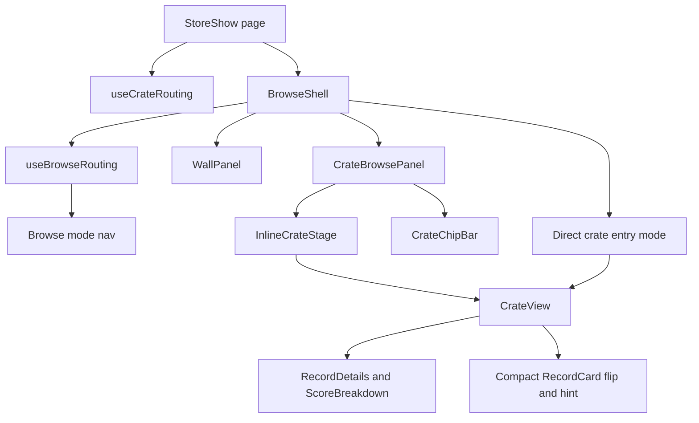
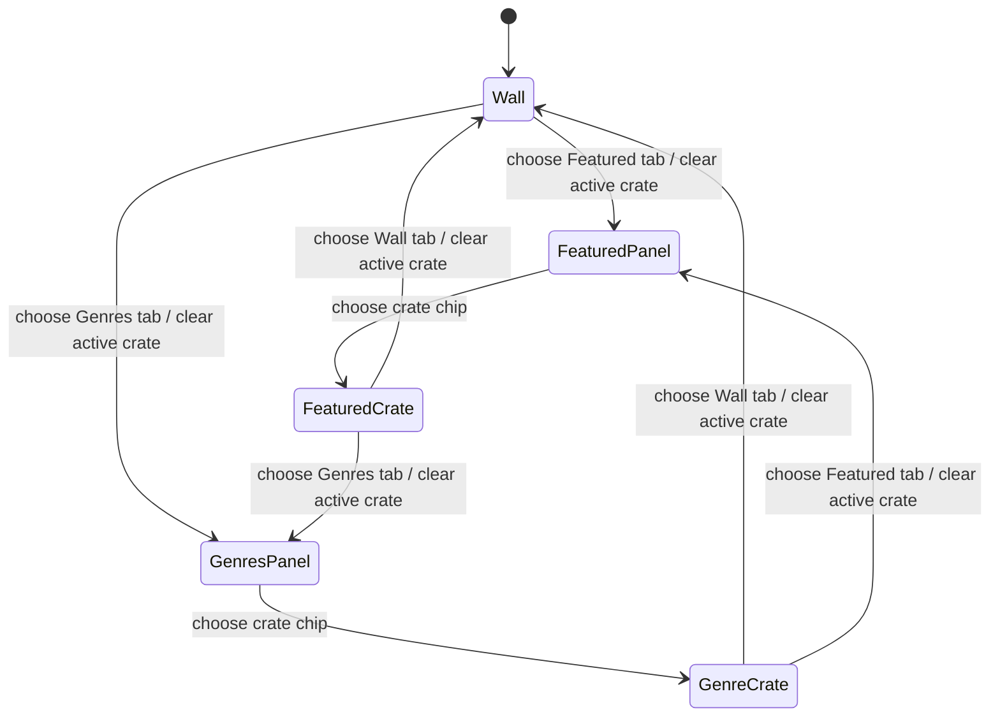
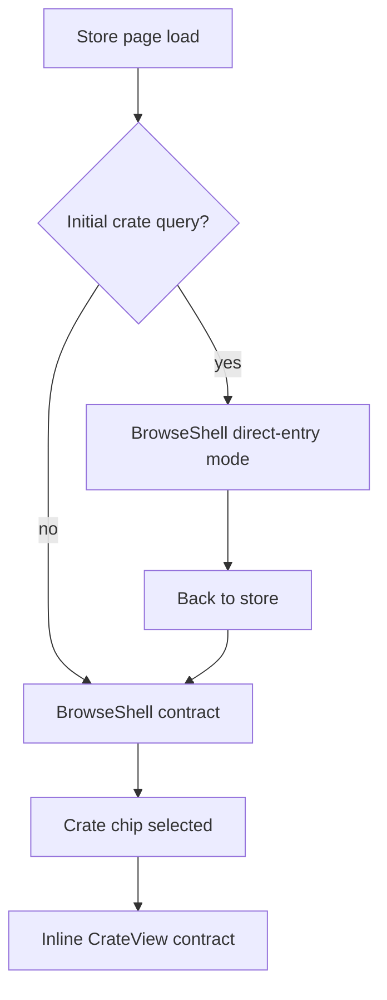

# feat: Unify Store Browsing Around BrowseShell

## Summary

Replace the compact-only browse shell and the larger-tier store floor with one `BrowseShell` that renders Wall, Featured, and Genres as the same browse modes at every viewport tier. Compact keeps bottom navigation; comfy and wide move the same navigation to a top tab strip. The old desktop-only crate-card/grid/shelf components are removed after the shared panels cover their behavior.

---

## Problem Frame

The store page currently has three separate browsing paths: compact renders `CompactBrowseShell`, larger tiers render `StoreFloor` until a crate is active, and larger active crates bypass the browse shell entirely for `CrateView`. That duplicates store-level browsing components, creates two navigation models, and makes new storefront features expensive because compact and desktop must be changed separately.

The requirements document resolves the product direction: Wall, Featured, and Genres are the store-browsing modes everywhere. The implementation plan should therefore consolidate presentation and navigation without changing the backend payload, pile flow, Discogs handoff, or the product-specific record and crate primitives.

(see origin: `docs/brainstorms/unified-store-browsing-requirements.md`)

---

## Requirements

**Unified shell and navigation**

- R1. A single `BrowseShell` replaces `CompactBrowseShell` and `StoreFloor` for store browsing at all viewport tiers.
- R2. Compact tiers render a bottom-anchored browse nav with The Wall, Featured, and Genres.
- R3. Comfy and wide tiers render the same browse modes as a horizontal top tab strip, with the selected panel below.
- R4. The browse nav remains visible when a crate is active inside the shell; choosing any browse mode clears the active crate and shows that mode's panel.
- R5. `useBrowseRouting` is the single shell navigation model; the old scroll-only store floor model is removed.

**Unified panels**

- R6. `WallPanel` becomes the only Wall/Picks surface at all tiers, adapting with responsive columns and page size.
- R7. `CrateBrowsePanel` with `CrateChipBar` and an inline crate stage becomes the only Featured and Genres surface at all tiers.
- R8. `CompactCrateStage` is renamed to `InlineCrateStage`, and the compact-only name is removed.

**Crate view contract**

- R9. `CrateView` keeps the desktop `RecordDetails` and `ScoreBreakdown` sidebar on comfy and wide tiers; compact keeps the existing detail-access pattern. Code research found this is currently the `RecordCard` flip plus inspection hint, even though the origin document calls it a peek sheet.
- R10. Crates opened from Featured or Genres inside `BrowseShell` let the shell own top-level navigation; `CrateView` hides its own crate tabs/header chrome under the existing `hideTabs` plus layout-owned contract.
- R11. True top-level crate entries, such as initial `?crate=jazz` page loads, continue to render `CrateView` with crate-switching tabs in its header.

**Deletions and compatibility**

- R12. Delete `StoreFloor`, `CrateShelf`, `CrateCard`, `CrateSectionGrid`, `FeaturedCratesRow`, `GenreGrid`, and the `PicksShelf` wrapper once their responsibilities are absorbed.
- R13. Delete `CompactBrowseShell` after the neutral `BrowseShell` replacement is in place.
- R14. Delete the old `CompactCrateStage` name after the `InlineCrateStage` rename.
- R15. Remove tests for deleted components and update tests for `WallPanel`, `CrateBrowsePanel`, `CrateView`, and `useBrowseRouting` to cover compact, comfy, and wide tiers.
- R16. Update the responsive surface matrix to assert shared components and responsive adaptation rather than tier-gated component swaps.
- R17. Keep `stores/show.tsx`'s incoming props and the `storefront_sections` data shape unchanged.
- R18. URL-based deep linking, including `?crate=jazz`, continues to open the correct crate and start index at all tiers.

---

## Acceptance Examples

- AE1. Given a 375px store page, the browse nav is bottom anchored with The Wall, Featured, and Genres. Given the same page at 1024px, the same modes render as a horizontal top tab strip.
- AE2. Given a shopper is inside a crate and swiping records, tapping The Wall clears the active crate and shows the Wall panel.
- AE3. Given 12 Wall picks, compact renders 2 columns with 6 tiles per page, while a 1024px viewport renders more columns and more tiles per page using the same `WallPanel`.
- AE4. Given Featured on compact, the chip bar scrolls horizontally and the selected crate fills the available stage. Given Featured on a larger viewport, the same components expand horizontally rather than switching to crate cards.
- AE5. Given `CrateView` on compact, no desktop sidebar is visible. Given the same crate on a 1024px viewport, `RecordDetails` and `ScoreBreakdown` are visible beside the card stack.
- AE6. Given `/stores/philadelphiamusic?crate=jazz`, the Jazz crate opens at all tiers with the expected start index and top-level crate header behavior.

---

## High-Level Technical Design

### Component Topology

`StoreShow` keeps the backend-facing page contract and delegates populated-store browsing to `BrowseShell`. `BrowseShell` owns browse-mode navigation and the direct-entry mode needed for initial crate links. `CrateView` remains the record-digging surface and is rendered with different chrome depending on whether it is embedded as an inline crate stage or reached as a top-level deep link.

### Browse State Lifecycle

Shell tabs are browse-mode controls, not crate shortcuts. Switching modes returns the shopper to that panel and clears any active crate. Crate chips are the only controls that open an inline crate stage.

### Entry Source Split

This preserves the origin requirement that direct crate links keep the full top-level `CrateView` header while in-session shell selections use the shell-owned inline contract. The distinction lives inside `BrowseShell`, so the store page does not reintroduce viewport-specific browse branches.

---

## Key Technical Decisions

| ID | Decision | Rationale |
| --- | --- | --- |
| KTD1. | Rename and adapt `CompactBrowseShell` into `BrowseShell`, rather than building a second shell from scratch. | The compact shell already has the correct mode vocabulary, copy, motion pattern, and `useBrowseRouting` integration. Renaming keeps the implementation anchored while removing compact-only semantics. |
| KTD2. | Browse-mode tab clicks always clear active crate state. | This matches the confirmed scope and AE2: mode tabs act as "return to this browse section" controls. Crate chips, not shell tabs, open crates. |
| KTD3. | Use CSS/Tailwind responsive utilities for nav placement and panel density where topology is the same. | Tailwind's default `md` and `lg` breakpoints match the project's compact/comfy/wide vocabulary at 768px and 1024px. React branches stay reserved for true topology changes. |
| KTD4. | Keep Wall paged at all tiers, increasing columns and page size for larger viewports. | This preserves the Wall's cover-browsing identity and avoids reintroducing a desktop-only grid component under a new name. |
| KTD5. | Let `CrateChipBar` support a no-selected-crate state. | The current compact behavior visually selects the first chip and auto-opens it. The unified shell needs Featured and Genres to be browsable panels until the shopper chooses a crate. |
| KTD6. | Treat direct URL crate entry separately from in-shell crate selection. | R10 and R11 describe two legitimate `CrateView` contracts. Entry source, not viewport, determines which contract applies. |
| KTD7. | Delete the old desktop components after parity coverage lands, not before. | The deletion list is large enough that tests should first prove `BrowseShell`, `WallPanel`, and `CrateBrowsePanel` cover the old behavior across tiers. |
| KTD8. | Keep Rails/Inertia props unchanged. | Inertia Rails renders page components from controller props; this feature changes frontend presentation only and should not create a new backend contract. |

---

## Resolved Planning Decisions

- **Wall density:** compact uses 2 columns and 6 tiles per page; comfy targets 3 columns and 9 tiles per page; wide targets 4 columns and 12 tiles per page. Implementation can tune exact aspect-ratio constraints, but it should not replace pagination with a separate desktop grid.
- **Top nav treatment:** comfy and wide use a horizontal tab strip in normal page flow near the top of the shell, not a floating pill and not a side rail.
- **Crate panel empty state:** Featured and Genres show the chip bar plus a prompt when no crate is active. They do not auto-open the first crate on tab switch.
- **Compact `CrateView` detail access:** Preserve the current card-flip and inspection-hint behavior. Do not add a new compact detail sheet in this plan just because the origin document used "peek sheet" language.

---

## Scope Boundaries

- No changes to the home page, apply page, admin dashboard, seller dashboard, or marketing layout.
- No backend changes, controller changes, model changes, or `storefront_sections` data-shape changes.
- No changes to `PileSheet`, `WallRecordPeekSheet`, `PileToast`, Discogs handoff behavior, or pile persistence.
- No redesign of `RecordTile`, `RecordCard`, `RecordDetails`, `ScoreBreakdown`, `BrandMark`, `Spinner`, `FeedbackMessage`, or shared `ui/*` primitives.
- No new compact record-detail surface inside `CrateView`; the current `RecordCard` flip and inspection hint remain the compact detail-access mechanism.
- No new visual design language. Existing copy, semantic colors, motion tokens, focus rules, and responsive vocabulary remain the source of truth.
- No checkout, cart, reservation, purchase, or seller-dashboard claims.

### Deferred to Follow-Up Work

- Broader `CrateView` API cleanup after the unified shell ships. The old `compactHeaderOwnedByLayout` prop name is awkward, but renaming the public contract in the same pass would enlarge the blast radius.
- Visual polish beyond the confirmed top-tab and responsive density changes.
- Any larger store-floor content strategy, sorting, filtering, or search model.

---

## System-Wide Impact

This is a presentation-layer consolidation in the Rails/Inertia architecture. Rails controllers and domain objects remain unchanged; `StoreShow` continues to receive the same Inertia props. The main impact is frontend topology: page branching, shell state, responsive tests, and deletion of old desktop-specific presentation components.

The change touches cross-interface parity because compact, comfy, and wide must now present the same browsing model with different responsive treatments. It also affects route/history behavior because direct deep links and in-session shell selections intentionally produce different `CrateView` chrome.

Layered Rails guidance: keep this work in the presentation layer. Do not move business rules into controllers, models, or services to support a frontend-only browse-shell consolidation.

---

## Risks and Mitigations

| Risk | Mitigation |
| --- | --- |
| Tab switching accidentally keeps or auto-opens a crate, violating AE2. | Update `useBrowseRouting` tests before or alongside implementation so each shell tab proves active crate state is cleared. |
| Direct `?crate=` links lose the top-level `CrateView` header required by R11. | Add route-source coverage in `useCrateRouting` and page tests before deleting the old larger-tier branch. |
| `WallPanel` page index becomes invalid when viewport tier changes page size. | Clamp or reset page state when tier-derived page count changes; React docs support intentional state reset with keys when preserving state would be wrong. |
| The large deletion removes accessibility coverage that only old component tests exercised. | Move relevant nested-control, tablist, focus, and region assertions to `BrowseShell`, `WallPanel`, `CrateBrowsePanel`, `InlineCrateStage`, and `CrateView` tests before deleting old tests. |
| The desktop sidebar disappears for inline wide crates. | Keep `CrateView` responsible for medium-and-up sidebar rendering even when its header/tabs are shell-owned. |
| The origin's "peek sheet" wording causes implementation to invent a new compact detail surface. | Preserve the code's current compact detail behavior: `RecordCard` flip plus inspection hint. |
| Old imports linger after component deletion. | Treat the deletion unit as incomplete until source search, typecheck, and component tests show no references to deleted names remain. |

---

## Implementation Units

### U1. BrowseShell and browse routing contract

**Goal:** Replace compact-only shell semantics with a cross-tier `BrowseShell` and make `useBrowseRouting` clear active crates on browse-mode changes.

**Requirements:** R1, R2, R3, R4, R5, R13, AE1, AE2

**Dependencies:** None

**Files:**

- Modify/rename: `app/frontend/components/compact_browse_shell.tsx` -> `app/frontend/components/browse_shell.tsx`
- Modify: `app/frontend/hooks/use_browse_routing.ts`
- Modify: `app/frontend/lib/copy.ts`
- Create: `app/frontend/components/browse_shell.test.tsx`
- Modify: `app/frontend/test/pages/responsive_surface_matrix.test.tsx`

**Approach:** Preserve the current browse-mode vocabulary and motion wrapper, then remove compact-only naming and styling assumptions. The nav renders the same three browse-mode controls at every tier. Compact positions them at the bottom with safe-area padding; comfy and wide render them as a top tab strip in normal shell flow. `handleBrowseModeSelected` should set the selected browse mode and clear any active crate through the existing store-back callback, without selecting the first crate in that mode.

**Patterns to follow:** `CompactBrowseShell` for the current mode/panel composition; `docs/design-system/foundations.md` for responsive vocabulary; `docs/solutions/logic-errors/responsive-branching-guard-condition-drift-2026-05-13.md` for guard parity during responsive refactors.

**Test scenarios:**

- Covers AE1. Render the shell at compact and assert the browse nav is bottom-positioned, exposes The Wall, Featured, and Genres, and selects The Wall by default.
- Covers AE1. Render the shell at wide and assert the same browse controls render as a top tab strip without the compact fixed-bottom treatment.
- Covers AE2. Start with an active Featured crate, click The Wall, and expect the active crate clear callback to run and the Wall panel to render.
- Click Featured from Wall and expect the Featured panel prompt to render without opening the first Featured crate.
- Click Genres from an active Featured crate and expect active crate state to clear before showing the Genres panel.
- Render with missing or empty sections and verify the shell still exposes browse navigation without throwing.

**Verification:** The shell is no longer compact-named, browse tabs are available at all tiers, mode changes clear active crate state, and the responsive matrix no longer expects a desktop-only store floor for populated stores.

### U2. Responsive WallPanel density

**Goal:** Make `WallPanel` the only Wall/Picks surface and adapt it across compact, comfy, and wide tiers with responsive columns and page sizes.

**Requirements:** R6, AE3

**Dependencies:** U1

**Files:**

- Modify: `app/frontend/components/wall_panel.tsx`
- Modify: `app/frontend/components/wall_panel.test.tsx`
- Modify: `app/frontend/components/accessibility.test.tsx`
- Modify: `app/frontend/test/pages/responsive_surface_matrix.test.tsx`

**Approach:** Use the existing `useViewport` vocabulary to derive Wall density: 6 tiles per page on compact, 9 on comfy, and 12 on wide. Keep pagination and the existing wall peek sheet contract at all tiers. Adjust grid columns and container sizing responsively so larger viewports show more records per page without becoming a separate desktop component. Guard page index when viewport tier changes so the current page cannot point past the new page count.

**Patterns to follow:** `docs/solutions/architecture-patterns/viewport-context-responsive-architecture-2026-05-09.md` for tier tests through `renderWithTier`; `WallPanel`'s current focus-return and peek-sheet behavior.

**Test scenarios:**

- Covers AE3. Compact Wall with 12 records renders 6 visible tile buttons in 2 columns and two page indicators.
- Covers AE3. Wide Wall with 12 records renders all 12 visible tile buttons in the first page with larger-tier column density.
- Comfy Wall with 13 records renders 9 visible tiles on page one and a second page indicator.
- Switching Wall pages still updates visible tile records and selected page state.
- Rerendering the same Wall at a different tier clamps or resets invalid page state rather than rendering an empty page.
- Opening a Wall tile at each tier still opens `WallRecordPeekSheet`, preserves dialog semantics, and returns focus to the originating tile on close.

**Verification:** `WallPanel` covers the old picks-wall responsibility at all tiers, old `PicksShelf` behavior is no longer needed, and Wall-specific accessibility tests continue to prove no nested interactive controls.

### U3. CrateBrowsePanel, CrateChipBar, and InlineCrateStage

**Goal:** Make Featured and Genres share `CrateBrowsePanel`, support no-active-crate browse states, and rename `CompactCrateStage` to `InlineCrateStage`.

**Requirements:** R7, R8, R10, R14, AE4

**Dependencies:** U1

**Files:**

- Modify: `app/frontend/components/crate_browse_panel.tsx`
- Modify: `app/frontend/components/crate_chip_bar.tsx`
- Modify: `app/frontend/components/crate_chip_bar.test.tsx`
- Modify/rename: `app/frontend/components/compact_crate_stage.tsx` -> `app/frontend/components/inline_crate_stage.tsx`
- Modify/rename: `app/frontend/components/compact_crate_stage.test.tsx` -> `app/frontend/components/inline_crate_stage.test.tsx`
- Modify: `app/frontend/components/accessibility.test.tsx`

**Approach:** Keep `CrateBrowsePanel` as the shared Featured/Genres surface, but stop treating `null` active slug as an implicit first crate. `CrateChipBar` should render chips without falsely marking the first crate selected when no crate is active. Selecting a chip opens that crate in `InlineCrateStage`. `InlineCrateStage` continues to delegate record navigation to `CrateView` with shell-owned tabs/header chrome.

**Patterns to follow:** Current `CrateBrowsePanel` and `CompactCrateStage` contracts; `CrateTabs` keyboard behavior for roving selection; `CrateView` tests around `hideTabs` and shell-owned layout.

**Test scenarios:**

- Covers AE4. Featured with no active crate renders the chip bar and prompt, with no progressbar or inline stage.
- Covers AE4. Selecting a Featured chip opens `InlineCrateStage`, renders riffle controls, and starts at record 1 unless a start index is supplied.
- Genres with no active crate does not auto-open the first genre crate after the Genres shell tab is selected.
- `CrateChipBar` with `activeSlug={null}` does not mark the first chip as selected unless the implementation deliberately exposes a separate "default focus" state without claiming selection.
- `InlineCrateStage` renders at compact, comfy, and wide tiers without showing a nested crate tab strip.
- Empty crate state renders inside the inline stage without crashing and without shell tabs disappearing.

**Verification:** No references to `CompactCrateStage` remain, Featured and Genres are usable browse panels before crate selection, and inline crate rendering works across all viewport tiers.

### U4. CrateView shell-owned and direct-entry contracts

**Goal:** Preserve the two required `CrateView` contracts: inline shell-owned chrome for in-session crate selections, and full top-level header/tabs for direct crate entries.

**Requirements:** R9, R10, R11, R18, AE5, AE6

**Dependencies:** U1, U3

**Files:**

- Modify: `app/frontend/components/crate_view.tsx`
- Modify: `app/frontend/components/crate_view/crate_header.tsx`
- Modify: `app/frontend/components/crate_view.test.tsx`
- Modify: `app/frontend/hooks/use_crate_routing.ts`
- Modify: `app/frontend/hooks/use_crate_routing.test.ts`
- Modify: `app/frontend/test/pages/responsive_surface_matrix.test.tsx`

**Approach:** Track whether the initial active crate came from a URL query or from in-session shell selection, then pass that entry source into `BrowseShell`. Direct-entry mode renders the full `CrateView` header and crate tabs as today. Shell selections render `CrateView` through `InlineCrateStage` with shell-owned chrome. The existing `compactHeaderOwnedByLayout` plus `hideTabs` contract should be honored consistently across tiers; if the layout mode is minimal, non-compact headers should not leak crate tabs or duplicate shell navigation. The desktop sidebar remains controlled by `CrateView`'s viewport-aware layout, not by the shell.

**Patterns to follow:** Existing `useCrateRouting` history-state tests; `docs/solutions/logic-errors/responsive-branching-guard-condition-drift-2026-05-13.md` for keeping `hideTabs` guard parity across compact and non-compact paths.

**Test scenarios:**

- Covers AE5. Compact `CrateView` hides the desktop sidebar while preserving the existing card-flip and inspection-hint detail access; wide `CrateView` shows `RecordDetails` and `ScoreBreakdown`.
- Covers AE6. Loading a store with `?crate=jazz` opens Jazz at compact, comfy, and wide tiers with the expected start index and full crate header/tabs.
- Selecting a crate inside `BrowseShell` renders inline `CrateView` without nested crate tabs at all tiers.
- The shell-owned wide inline crate still shows the desktop detail sidebar beside the card stack.
- Calling `backToStore` from a direct crate entry clears the query-derived crate state and returns to shell browsing.
- `hideTabs` remains respected in populated and empty crate states on compact, comfy, and wide tiers.

**Verification:** Direct deep links and shell selections are distinguishable, no viewport branch reintroduces the old `StoreFloor`/direct-`CrateView` split, and crate detail behavior remains responsive.

### U5. StoreShow integration and desktop component deletion

**Goal:** Integrate `BrowseShell` into the store page and remove the obsolete desktop-only browsing component tree.

**Requirements:** R1, R5, R12, R13, R15, R16, R17

**Dependencies:** U1, U2, U3, U4

**Files:**

- Modify: `app/frontend/pages/stores/show.tsx`
- Delete: `app/frontend/components/store_floor.tsx`
- Delete: `app/frontend/components/store_floor.test.tsx`
- Delete: `app/frontend/components/storefront_shell.test.tsx`
- Delete: `app/frontend/components/crate_shelf.tsx`
- Delete: `app/frontend/components/crate_shelf.test.tsx`
- Delete: `app/frontend/components/crate_card.tsx`
- Delete: `app/frontend/components/crate_card.test.tsx`
- Delete: `app/frontend/components/crate_section_grid.tsx`
- Delete: `app/frontend/components/featured_crates_row.tsx`
- Delete: `app/frontend/components/genre_grid.tsx`
- Modify: `app/frontend/components/accessibility.test.tsx`
- Modify: `app/frontend/test/pages/responsive_surface_matrix.test.tsx`

**Approach:** Collapse the page-level populated-store rendering path to the unified browse shell while preserving the existing sync, enrichment, failure, and empty-state branches. Remove imports and tests for the deleted desktop-only components after their behavioral coverage has moved to the new shared shell and panel tests. Keep `storefront_sections` flowing into the frontend exactly as it does today.

**Patterns to follow:** `StoreShowContent`'s existing status/empty-state ordering; `docs/design-system/components.md` guidance that product-specific storefront components should remain domain components rather than being flattened into generic UI primitives.

**Test scenarios:**

- Populated stores render `BrowseShell` at compact, comfy, and wide tiers using the same Wall, Featured, and Genres browse modes.
- Syncing, enriching, failed sync, and no-crates empty states still render before the shell exactly as they do today.
- The responsive surface matrix asserts shared browse-shell components across tiers and no longer expects `StoreFloor` on comfy/wide.
- Deleted component names are absent from active imports and tests.
- Accessibility coverage formerly attached to `CrateShelf`/`CrateCard` is either removed as obsolete or re-expressed against `BrowseShell`, `WallPanel`, `CrateBrowsePanel`, `InlineCrateStage`, and `CrateView`.

**Verification:** `stores/show.tsx` no longer imports `CompactBrowseShell` or `StoreFloor`, old desktop-only components are gone, and the frontend type/test surface has no dangling references to deleted names.

### U6. Cross-tier regression matrix and cleanup

**Goal:** Make the test suite express the unified architecture so future changes do not reintroduce tier-gated browsing trees.

**Requirements:** R15, R16, R18, AE1, AE2, AE3, AE4, AE5, AE6

**Dependencies:** U1, U2, U3, U4, U5

**Files:**

- Modify: `app/frontend/test/pages/responsive_surface_matrix.test.tsx`
- Modify: `app/frontend/components/browse_shell.test.tsx`
- Modify: `app/frontend/components/wall_panel.test.tsx`
- Modify: `app/frontend/components/crate_view.test.tsx`
- Modify: `app/frontend/hooks/use_browse_routing.ts`
- Modify: `app/frontend/hooks/use_crate_routing.test.ts`
- Modify: `app/frontend/components/accessibility.test.tsx`

**Approach:** Update the matrix from "compact shell versus desktop floor" to "same shell with responsive adaptations." Keep tests behavior-oriented: accessible navigation placement, mode switching, active crate clearing, Wall density, direct deep-link contract, and desktop sidebar visibility. Avoid tests that only assert implementation class names unless the class is the observable contract, such as compact fixed-bottom nav versus non-compact in-flow top nav.

**Patterns to follow:** Existing `renderWithTier` test utility; `docs/solutions/test-failures/vitest-imports-under-node-test-runner-2026-05-28.md` for keeping component tests in Vitest and pure lib tests under `node:test`.

**Test scenarios:**

- Matrix renders store page with populated sections at compact, comfy, and wide tiers and finds the same browse-mode navigation labels at each tier.
- Matrix verifies Wall, Featured, and Genres are reachable at every tier without changing component trees.
- Matrix verifies `?crate=` deep links still open the right crate and start index at every tier.
- Regression test proves shell tab switching clears active crate state and shows the selected panel prompt instead of auto-opening a crate.
- Regression test proves wide inline crate rendering still exposes desktop record details.
- Accessibility test confirms no nested buttons remain after old crate-card/shelf tests are deleted.

**Verification:** The test suite's named expectations match the unified architecture, obsolete compact-vs-desktop assumptions are removed, and every origin acceptance example has direct regression coverage.

---

## Sources and Research

- `docs/brainstorms/unified-store-browsing-requirements.md` is the origin source for the full scope, requirements, acceptance examples, and deletion list.
- `STRATEGY.md` anchors the product direction: store browsing should feel like walking into a record store, with Wall, crates, and genre sections serving one discovery loop.
- `docs/solutions/architecture-patterns/viewport-context-responsive-architecture-2026-05-09.md` establishes compact/comfy/wide tiers, `renderWithTier`, and the warning that responsive refactors must preserve guard conditions across branches.
- `docs/solutions/logic-errors/responsive-branching-guard-condition-drift-2026-05-13.md` specifically applies to `CrateView` guard parity around `hideTabs` and shell-owned layout.
- `docs/solutions/architecture-patterns/storefront-animation-token-system-2026-05-08.md` keeps motion changes scoped to existing tokens and reduced-motion handling.
- `docs/reviews/2026-06-01-storefront-cohesion-audit.md` confirms compact `CrateView` record inspection currently lives behind the flippable `RecordCard`, not a separate `CrateView` peek sheet.
- Context7 React docs for preserving/resetting state support intentional state reset with keys when a component should not preserve stale state after identity changes.
- Context7 Tailwind docs confirm the default responsive breakpoints: `md` at 768px and `lg` at 1024px, matching the project's comfy and wide tiers.
- Context7 Inertia Rails docs confirm the plan should preserve the Rails-rendered page prop contract rather than adding backend routes or prop shapes for a frontend presentation consolidation.

---

## Documentation and Operational Notes

No production rollout, migration, or server operation is required. This plan should not start or stop `bin/dev`, `bin/rails server`, `bin/vite`, or background jobs. Browser verification can use the developer's already-running server if available, but the implementation can be completed and tested through the frontend component and page test suite without changing server management.
