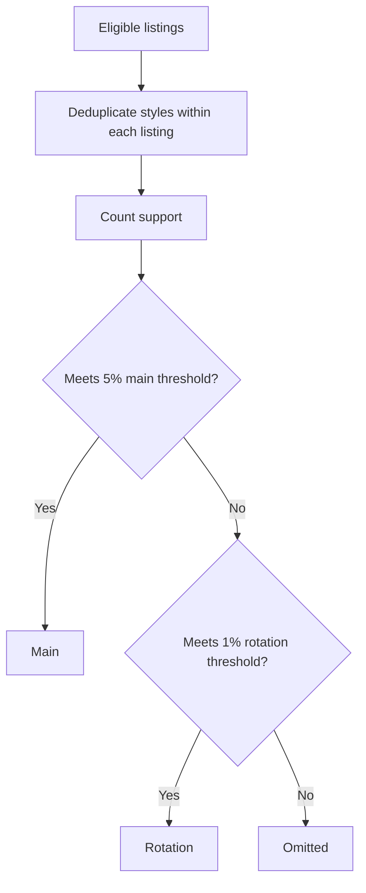
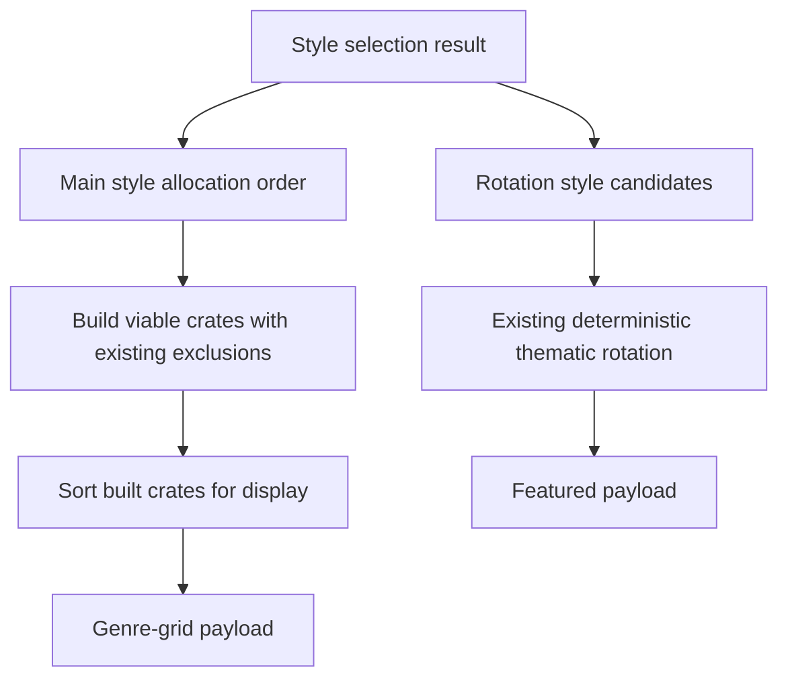

# feat: Select distinctive styles for narrow-catalog stores

## Summary

Replace raw style tallies on the styles curation axis with a store-local selection policy. The policy classifies styles as main, rotation, suppressed, or omitted using support thresholds plus co-occurrence, keeps broad Discogs labels only when they add independent coverage, and preserves current genre-axis behavior.

---

## Problem Frame

Issue [#245](https://github.com/body-clock/milkcrate/issues/245) shows that Discogs styles are useful sub-genres but not a ready-made storefront taxonomy. A 599-listing punk/metal store has strong distinctions such as Punk, Hardcore, Crust, Black Metal, Death Metal, and Grindcore alongside broad labels such as Pop Rock, Rock & Roll, and Classic Rock.

`StylesAxis#tally_from` currently returns every style count. `StorefrontCuration` then creates crates for all styles with at least four unclaimed records, ordered by raw count. Broad labels become prominent crates, thin labels crowd the grid, and high-count labels can consume overlapping records before more specific labels are considered.

The selection policy belongs below `StorefrontCuration`: classification is domain logic, while the curation service should continue orchestrating Wall, featured, and browse crates.

---

## Requirements

### Classification

- R1. Style selection applies only when `StylesAxis` is active; `GenresAxis` preserves current counts, ordering, and thematic behavior.
- R2. Each listing contributes at most once to each style count, and support ratios use the total eligible listing count as their denominator.
- R3. A style qualifies as main when its count is at least both `CuratedCrate::MIN_RECORDS` and 5% of eligible listings.
- R4. A non-main style qualifies for rotation when its count is at least both `CuratedCrate::MIN_RECORDS` and 1% of eligible listings.
- R5. Styles below the rotation threshold are omitted from main crates and thematic rotation.

### Noise suppression

- R6. Removed — the curated broad-styles suppression list (Pop Rock, Rock & Roll, etc.) was rock-specific and couldn't generalize to electronic, jazz, or hip-hop stores. Raw support-count sorting already surfaces genuinely relevant styles.
- R7. Removed — broad-style co-occurrence suppression eliminated alongside R6.
- R8. Removed — broad-only fallback no longer needed without suppression.

### Ranking and rotation

- R9. Main style crates allocate records by overlap-risk descending, support ascending, then name; viable crates are presented by support descending, then name.
- R10. Existing top-down record deduplication across Wall, featured crates, and browse crates remains intact.
- R11. On the styles axis, the thematic strategy rotates only non-suppressed rotation-tier styles; main styles and broad suppressed styles do not duplicate the featured slot.
- R12. Rotation remains deterministic for a store and date. When no rotation candidate remains viable after exclusions, no thematic crate is produced.

### Compatibility

- R13. No database migration, admin UI, frontend component, or presenter payload change is introduced.
- R14. Existing cached storefront payloads are invalidated when the selection policy ships.

---

## Scope Boundaries

### In Scope

- Store-local style support and co-occurrence calculations
- Main, rotation, suppressed, and omitted classification
- Style-axis crate allocation and display ordering
- Style-axis thematic candidate filtering
- Cache namespace invalidation and backend regression coverage

### Deferred to Follow-Up Work

- Human or seller editing of style classifications
- Experiment tooling for tuning thresholds from shopper behavior
- Per-store configuration of thresholds
- Fallback behavior for stores whose Discogs listings have sparse style metadata
- Genre-agnostic co-occurrence analysis for broad-style detection (if real-world data shows broad labels crowding distinctive sub-genres)

### Out of Scope

- Changes to the genre-versus-style axis decision from PR [#244](https://github.com/body-clock/milkcrate/pull/244)
- Discogs taxonomy normalization, aliases, or new style names
- Changes to Wall or Hidden Gems diversity keys
- Allowing duplicate listings across style crates
- Frontend labels, layouts, or navigation changes

---

## High-Level Technical Design

### Style classification

### Curation consumption

The classification is computed once per curation instance and reused by style counts, crate ordering, and thematic candidates.

---

## Key Technical Decisions

- **Plain domain object:** Add a non-persisted `StyleSelection` under `app/models/`. Rails 8.1 supports plain Ruby domain objects beside Active Record models; no Active Model behavior is needed because this object has no forms, callbacks, or persistence.
- **Scaled support thresholds:** Main uses 5% and rotation uses 1%, each floored at `CuratedCrate::MIN_RECORDS`. For the 599-listing issue example, thresholds become 30 and 6, matching the described cornerstone and fringe tiers.
- **No broad-style suppression.** The initial curated broad-styles list was dropped. Raw support-count ordering already surfaces genuinely relevant styles — a broad label with high count is meaningful to its store. A genre-agnostic co-occurrence filter could be added later if real-world data shows broad labels crowding out distinctive sub-genres.
- **Two rankings for main styles:** Allocation uses overlap risk, defined as the share of a style's listings also tagged with a higher-support main style. Higher risk allocates first, then lower support, then name. Display ranking remains support-first so shoppers see cornerstone crates in intuitive order.
- **Axis owns taxonomy differences:** Extend the polymorphic curation-axis contract to expose main counts, allocation order, display order, and thematic candidates. `StorefrontCuration` must not branch on axis class or type.
- **Thematic remains a selector:** The axis supplies eligible themes; `CrateStrategies::Thematic` keeps ownership of deterministic daily choice and record ranking.
- **No persistence:** Selection is derived from current eligible listings and memoized for one curation instance. Inventory-version cache invalidation remains the long-lived consistency mechanism.

---

## Implementation Units

### U1. Add store-local style classification

**Goal:** Compute stable style tiers and ranking metadata from eligible listings.

**Requirements:** R2, R3, R4, R5

**Dependencies:** None

**Files:**

- Create: `app/models/style_selection.rb`
- Create: `spec/models/style_selection_spec.rb`

**Approach:**

- Build a plain Ruby domain object from eligible listings.
- Normalize each listing's styles with compact, unique values before counting.
- Compute total support and classify into three tiers: main (≥5%), rotation (≥1%), omitted.
- Compute overlap risk for main styles against higher-support main styles.
- Expose immutable result data needed by the axis: main counts, main allocation order, main display order, and rotation names.
- Keep thresholds as named constants near the policy.
- Compute co-occurrence in a single pass over each listing's small style set rather than scanning every style pair across the full catalog.

**Patterns to follow:**

- `app/models/record_scorer.rb` for non-Active Record domain computation in `app/models/`
- `app/models/curated_crate.rb` for shared viability constants
- `app/services/store_sync/coverage_classifier.rb` for a small deterministic classifier with focused specs

**Test scenarios:**

- Happy path: with 599 eligible listings, counts of 367, 262, 39, 38, 38, and 36 classify as main because the computed main threshold is 30.
- Happy path: counts from 6 through 29 classify as rotation.
- Edge case: repeated identical style values on one listing contribute one count.
- Edge case: nil and empty style arrays do not create entries or raise errors.
- Boundary: exactly 5% qualifies as main; one record below does not.
- Boundary: exactly 1% qualifies as rotation; one record below is omitted unless the four-record floor controls.
- Determinism: equal support and overlap produce stable alphabetical tie-breaking.
- Ordering: a style mostly nested inside a higher-support main style allocates before an equally supported independent style.

**Verification:**

- One selection result explains each observed style as main, rotation, or omitted.
- The issue's sample distribution yields the expected tier boundaries without store-specific thresholds.

---

### U2. Extend curation-axis behavior with selection results

**Goal:** Let both axes provide curation ordering and thematic candidates without type checks in callers.

**Requirements:** R1, R9, R11, R12

**Dependencies:** U1

**Files:**

- Modify: `app/services/curation_axis.rb`
- Modify: `app/services/genres_axis.rb`
- Modify: `app/services/styles_axis.rb`
- Modify: `spec/services/genres_axis_spec.rb`
- Modify: `spec/services/styles_axis_spec.rb`

**Approach:**

- Expand the axis contract from raw tallying to a small selection-result interface consumed by curation.
- `GenresAxis` returns current genre counts and count-descending order, preserving existing behavior.
- `StylesAxis` delegates classification to `StyleSelection` and memoizes the result for the eligible listing set.
- Keep `key_for` and `matches?` unchanged so Wall, Hidden Gems, and Genre strategy filtering continue using existing polymorphism.
- Return thematic candidates in domain form suitable for `StorefrontTheme`, without making strategies aware of classification rules.

**Patterns to follow:**

- `docs/solutions/architecture-patterns/replace-type-code-with-polymorphism-2026-06-07.md`
- `app/services/styles_axis.rb` and `app/services/genres_axis.rb` for behavior encapsulated behind one axis object

**Test scenarios:**

- Genres axis returns every primary-genre count and current descending count order.
- Genres axis still provides the current thematic genre/style candidate behavior.
- Styles axis returns only main-style counts.
- Styles axis allocation order places lower-support overlapping main styles before higher-support styles.
- Styles axis display order places higher-support main styles first with stable ties.
- Styles axis exposes only rotation-tier style themes.
- Suppressed and omitted styles are absent from all style-axis outputs.
- Repeated calls for the same listing set reuse one classification result.

**Verification:**

- Axis consumers can ask for counts, allocation order, display order, and themes without checking `GenresAxis` versus `StylesAxis`.
- Existing `key_for` and `matches?` specs remain unchanged.

---

### U3. Separate browse-crate allocation order from display order

**Goal:** Preserve distinctive style crates under deduplication while showing cornerstone crates first.

**Requirements:** R9, R10

**Dependencies:** U2

**Files:**

- Modify: `app/services/storefront_curation.rb`
- Modify: `spec/services/storefront_curation_spec.rb`

**Approach:**

- Ask the active axis for allocation order instead of sorting raw counts inline.
- Build crates in allocation order using the existing `seen_ids` contract.
- Reorder only the completed viable crates using the axis display order before returning groups and crate navigation data.
- Keep genre-axis allocation and display order identical, making this change behaviorally neutral for diverse stores.
- Continue applying `CrateStrategies::Genre::MIN_RECORDS` and `CuratedCrate#viable?` after Wall and featured exclusions.

**Patterns to follow:**

- Existing top-down deduplication in `StorefrontCuration#storefront_groups`
- `docs/solutions/architecture-patterns/crate-strategies-pattern-2026-05-07.md`

**Test scenarios:**

- Integration: overlapping Punk, Hardcore, and Crust listings allocate Crust and Hardcore before Punk, leaving each representative main style viable.
- Integration: returned style crates display Punk and Hardcore ahead of lower-support main styles after allocation completes.
- Regression: a genres-axis store returns genre crates in the same count-descending order as today.
- Regression: no listing appears in more than one of Wall, featured, or browse crates.
- Edge case: a qualifying main style that falls below four unclaimed records after higher surfaces is omitted under the existing viability rule.
- Edge case: no main styles yields an empty browse-crate group without raising.

**Verification:**

- Allocation order affects record assignment only; display order controls shopper-facing crate order.
- `crates` and `storefront_groups` expose the same style ordering for the same store and date.

---

### U4. Restrict style-axis thematic rotation to fringe styles

**Goal:** Use the existing featured thematic slot to rotate interesting thin styles without resurfacing main or noisy labels.

**Requirements:** R11, R12

**Dependencies:** U2

**Files:**

- Modify: `app/services/crate_strategies/thematic.rb`
- Modify: `app/services/storefront_curation.rb`
- Modify: `spec/services/crate_strategies/thematic_spec.rb`
- Modify: `spec/services/storefront_curation_spec.rb`

**Approach:**

- Let the thematic strategy accept explicit eligible themes while preserving its scoring and deterministic store/date seed.
- Supply rotation-tier style themes on the styles axis.
- Preserve current theme discovery on the genres axis.
- Return no thematic crate when the styles axis has no viable rotation candidate after exclusions.
- Keep main style crates and suppressed broad styles out of thematic eligibility.

**Patterns to follow:**

- `app/models/storefront_theme.rb` for style matching and viability
- Existing `CrateStrategies::Thematic` seed and `RecordScorer` ranking

**Test scenarios:**

- Happy path: Oi, Doom Metal, and Noise in the rotation tier produce one deterministic thematic choice for a store/date.
- Determinism: identical store, date, listings, and exclusions choose the same fringe style and record order.
- Boundary: a rotation candidate with fewer than four records after exclusions is skipped.
- Exclusion: Punk and Hardcore main styles are not thematic candidates on the styles axis.
- Exclusion: a suppressed Pop Rock label is never selected as thematic.
- Empty path: no viable rotation candidates returns nil and the featured group remains valid.
- Regression: genres-axis thematic selection still considers the same style and genre themes as before.

**Verification:**

- Narrow stores rotate fringe styles through the existing featured surface.
- No frontend or presenter changes are required to render the selected theme.

---

### U5. Invalidate stale curation payloads and cover end-to-end behavior

**Goal:** Ensure deployment serves the new style taxonomy immediately and preserve serialized contracts.

**Requirements:** R13, R14

**Dependencies:** U3, U4

**Files:**

- Modify: `app/services/storefront_curation/cache_manager.rb`
- Modify: `spec/services/storefront_curation/cache_manager_spec.rb`
- Modify: `spec/requests/stores_spec.rb`

**Approach:**

- Advance the curation cache namespace so pre-deploy raw-style payloads cannot survive for the existing TTL.
- Keep cache dimensions, payload keys, presenter behavior, and frontend section keys unchanged.
- Add a request-level styles-axis example that asserts main style names are present while redundant broad and fringe styles are absent from the browse grid.
- Keep request fixtures explicitly on the intended axis so unrelated genre-depth changes cannot alter the expectation.
- Validate the generated crate-name tiers against the issue store fixture plus a broad-only fixture before treating the thresholds as calibrated.

**Patterns to follow:**

- Existing versioned cache key in `StorefrontCuration::CacheManager`
- Existing storefront request specs for browse-crate names and counts

**Test scenarios:**

- Cache key uses the new namespace and no longer reads a payload stored under the previous namespace.
- Styles-axis request renders main style crate names.
- Redundant broad styles do not appear in the browse grid.
- Rotation-tier styles do not appear in the browse grid.
- Serialized sections remain `wall`, optional `featured_crates`, and `genre_grid`.
- Serialized crate objects retain `slug`, `name`, `count`, and `records`.
- Genre-axis request behavior remains unchanged.

**Verification:**

- A deployment cannot serve an old raw-style crate list from cache.
- Existing frontend props remain compatible.

---

## Acceptance Examples

- AE1. Given the issue's 599-listing store, the main threshold is 30 and the rotation threshold is 6. Punk, Hardcore, Crust, Black Metal, Death Metal, and Grindcore qualify as main.
- AE2. Given Pop Rock has 30 listings in a punk/metal store, it qualifies as main alongside the other six core styles based purely on support count — the curated broad-styles suppression list has been removed; raw support determines relevance.
- AE3. Given Oi has 13 listings, it is excluded from the main browse grid and included in thematic rotation.
- AE4. Given a store carries only Classic Rock with enough support and no qualifying non-broad styles, Classic Rock remains eligible rather than leaving the store with no browse crates.
- AE5. Given Crust listings also carry Punk, allocation considers Crust before Punk; completed crates are then presented in support-first order.
- AE6. Given a store remains on the genres axis, genre crate counts, order, thematic discovery, and payload shape match current behavior.

---

## System-Wide Impact

- **Interaction graph:** eligible listings feed the active axis; `StylesAxis` delegates to `StyleSelection`; `StorefrontCuration` consumes allocation/display order; `CrateStrategies::Thematic` consumes rotation candidates.
- **Data lifecycle:** no persistent state is added. Results change only when eligible inventory, date-based thematic rotation, or deployed policy constants change.
- **Cache:** inventory version still handles catalog changes; namespace advancement handles deployment of the new policy.
- **Performance:** counting remains in memory because curation already loads eligible listings. Co-occurrence work should scale with styles per listing, not total distinct styles squared.
- **Architecture:** domain calculations leave the orchestration service, and lower-level objects do not depend on controllers, presenters, or request state.

---

## Risks and Mitigations

| Risk | Mitigation |
|---|---|
| Initial 5% and 1% thresholds misclassify another catalog shape | Keep constants isolated and cover small, broad-only, overlap-heavy, and issue-derived fixtures. |
| Specific-first allocation still cannot preserve a fully nested style under strict dedup | Preserve the existing viability rule and record this case in tests; duplicate style-crate membership remains out of scope. |
| Co-occurrence calculation adds request-time work | Build counts in one pass and memoize one result per curation instance; existing serialized cache absorbs repeated requests. |
| Thematic filtering removes a previously available featured crate | Treat no fringe candidate as a valid nil result, matching the existing optional featured-crate contract. |
| Discogs style metadata is optional for most genres, so sparse coverage can leave the styles axis with no main crates | Keep empty output safe in this plan and track metadata-coverage fallback as follow-up work rather than changing the axis decision inside #245. |

---

## Sources and Research

- GitHub issue: [#245 Styles selection](https://github.com/body-clock/milkcrate/issues/245)
- Foundation change: [PR #244](https://github.com/body-clock/milkcrate/pull/244)
- Discogs defines styles as sub-genres and notes that excess styles become confusing: [Database Guidelines 9. Genres / Styles](https://support.discogs.com/hc/en-us/articles/360005055213-Database-Guidelines-9-Genres-Styles)
- Rails 8.1 supports plain Ruby model objects when persistence is unnecessary: [Active Model Basics](https://guides.rubyonrails.org/active_model_basics.html)
- Local axis pattern: `docs/solutions/architecture-patterns/replace-type-code-with-polymorphism-2026-06-07.md`
- Local strategy pattern: `docs/solutions/architecture-patterns/crate-strategies-pattern-2026-05-07.md`
- Product strategy: `STRATEGY.md`, especially the Digger's algorithm track
