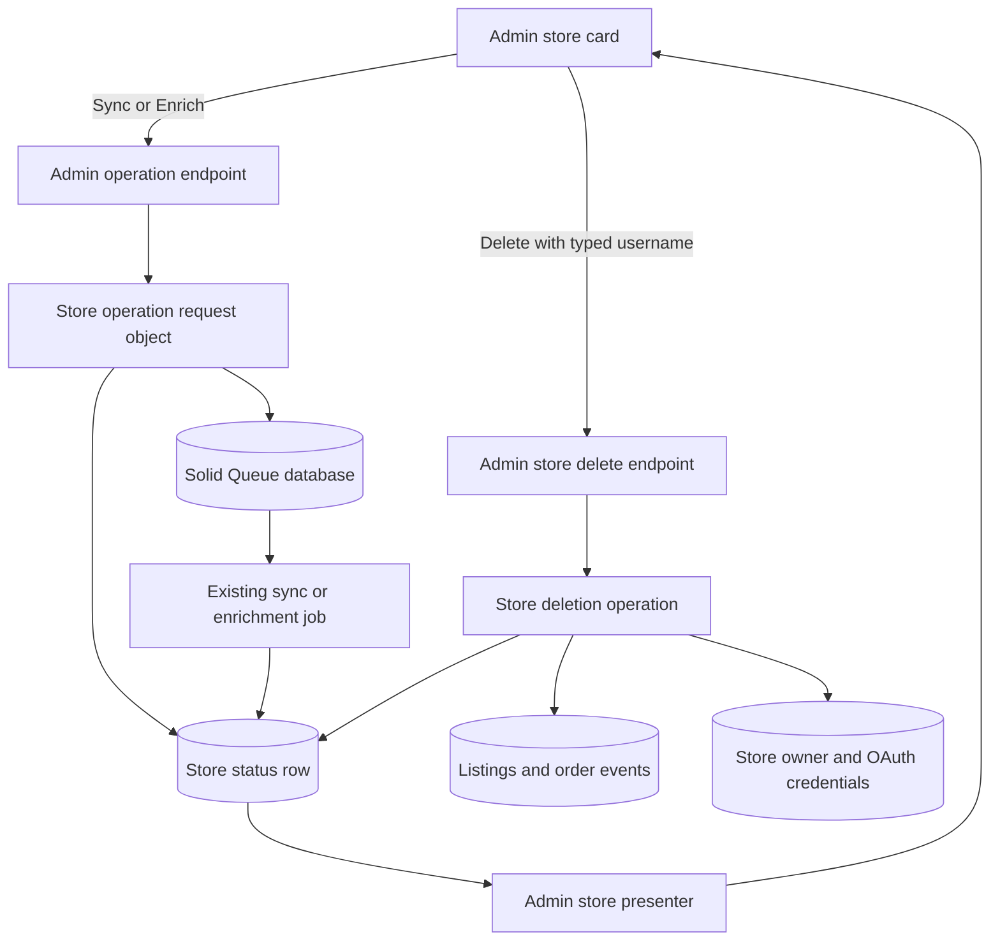
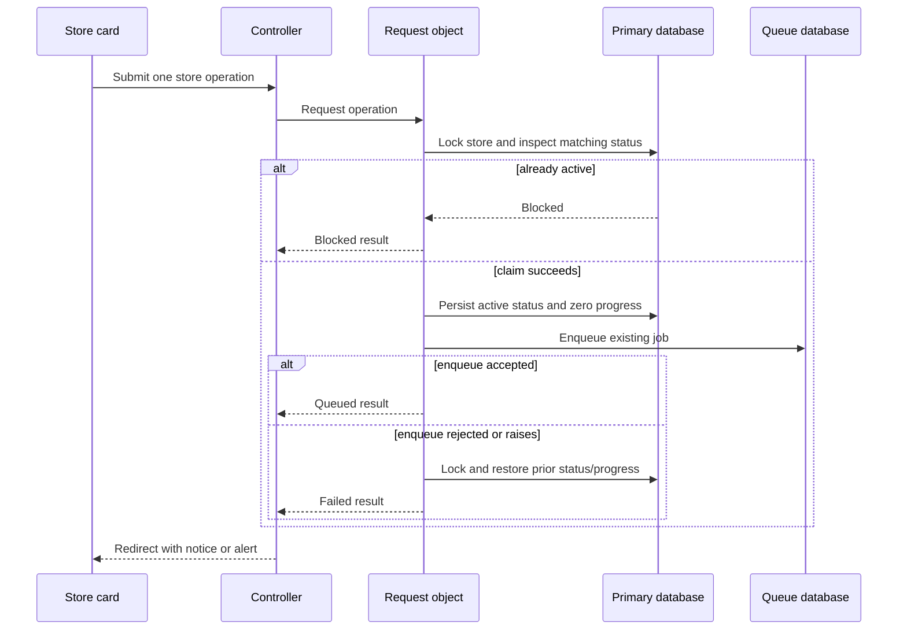
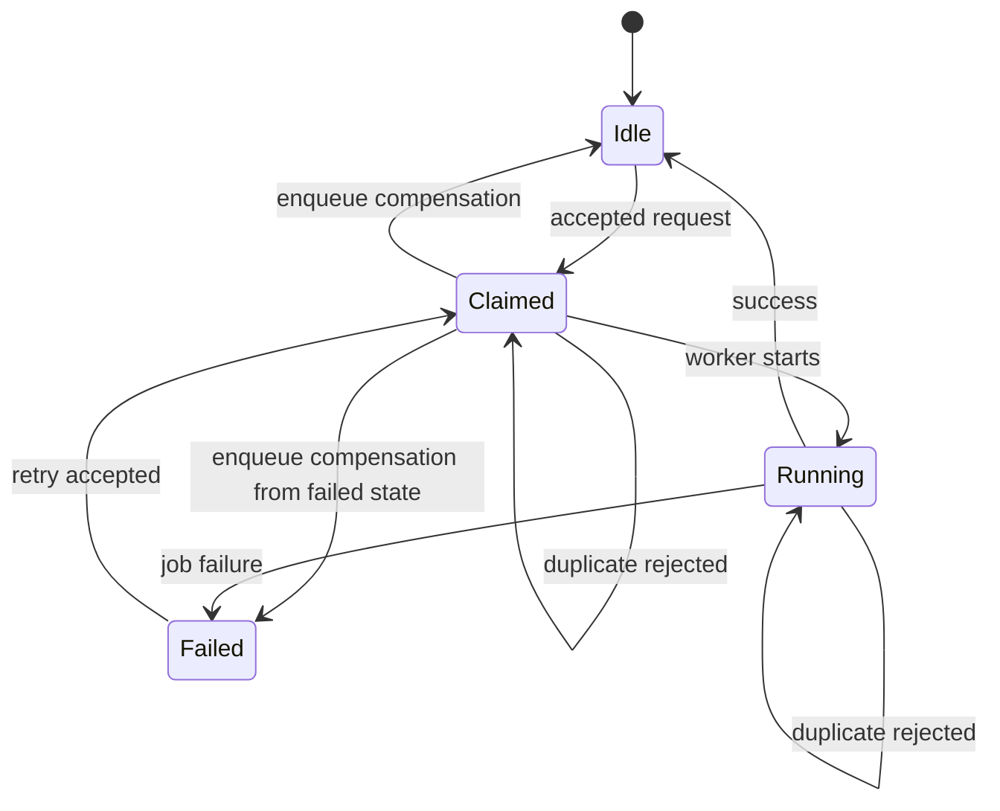
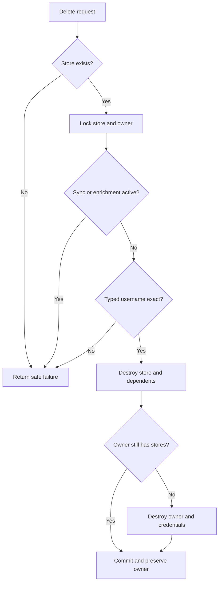

# feat: Add Admin Store Management Controls

## Summary

Extend each active-store card with effective sync/OAuth metadata, race-safe Sync and Enrich requests, and a high-friction permanent deletion flow. Reuse the existing background jobs and polling while keeping controllers thin, deletion transactional, and the owner dashboard on the same sync-request boundary.

---

## Problem Frame

The admin dashboard already explains store health but cannot act on it. Operators still need rake tasks, the console, or the jobs dashboard to refresh one store, enrich stale metadata, or remove a store and its credentials.

The current owner-dashboard sync guard checks persisted status before enqueueing, but two near-simultaneous requests can both observe an idle store. Admin controls need a database-backed claim before queueing so UI disabling is feedback, not the correctness boundary.

Deletion crosses the store, dependent inventory/history, and optional owner credentials. It must fail closed on stale input, remain unavailable during active sync or enrichment, and leave a shared owner intact.

---

## Requirements

**Operational metadata**

- R1. Each active-store card shows the effective strategy a new sync will use in operator-readable terms.
- R2. Each card separately shows whether valid OAuth credentials are connected.
- R3. Strategy and OAuth indicators derive from current authorization behavior, not the stored `sync_source`.

**Per-store maintenance**

- R4. Each card can request a sync for only that store.
- R5. Sync uses `FullStoreSyncJob` and the same universal strategy selection as existing entry points.
- R6. A store already claimed for sync cannot receive another dashboard or owner-dashboard sync request.
- R7. Each card can request normal enrichment for only that store.
- R8. Enrichment uses `EnrichmentJob` without resetting enrichment timestamps or forcing a complete rebuild.
- R9. Sync and Enrich return promptly with visible server or network feedback.
- R10. Active operation state disables the matching action and activates existing dashboard polling.

**Permanent deletion**

- R11. Delete is visually separated from routine actions.
- R12. Delete opens a confirmation that names the store and explains permanent consequences.
- R13. The submitted confirmation must exactly match the selected store's persisted Discogs username.
- R14. Deletion removes the store, dependent listings, and dependent Discogs order events.
- R15. The associated `StoreOwner` and encrypted OAuth credentials are removed only when no other store references that owner.
- R16. Missing stores, stale dialogs, username mismatches, and stale queued jobs fail without deleting another store or owner.
- R20. Confirmed during planning: Delete is unavailable in the UI and rejected by the server while sync or enrichment is active.

**Access and layout**

- R17. Every management endpoint inherits the existing password-plus-TOTP admin boundary.
- R18. Metadata, controls, and confirmation remain usable without horizontal scrolling on compact viewports.
- R19. This work adds only per-store controls; no bulk operation surface is introduced.

Actors A1 (admin operator), A2 (active store), and A3 (optional shared store owner) retain the meanings defined in the origin document.
Key flows F1 (inspect strategy and OAuth), F2 (queue one-store sync), F3 (queue one-store enrichment), and F4 (confirm permanent deletion) also retain their origin meanings.

---

## Scope Boundaries

- No bulk sync, enrichment, or deletion.
- No archive, disable, restore, undo, or cancellation workflow.
- No forced re-enrichment or enrichment reset.
- No inline job logs or replacement for Mission Control Jobs.
- No editing of identity, strategy, credentials, or other store attributes.
- No manual strategy selector; effective behavior remains derived from OAuth authorization.
- No deletion of matching `Waitlist` records.
- No migration of rake or recurring sync/enrichment entry points to the request services.

### Deferred to Follow-Up Work

- Audit cross-job Solid Queue concurrency grouping. `FullStoreSyncJob` and `EnrichmentJob` use the same key text, but current Solid Queue grouping is job-class-scoped unless an explicit shared group is configured. This deserves a separate issue because it affects all Discogs jobs, not only admin requests.
- Add stale operation-claim recovery if production usage shows stores remaining active after process termination between status claim and queue insertion.
- Add operation cancellation only with a separate lifecycle design covering queued, running, cancelled, and retrying jobs.

---

## Key Technical Decisions

- **Effective strategy is computed at read time:** Derive the card strategy from the same OAuth authorization predicate that selects `Store#sync_strategy`. A drifted `sync_source` must not change displayed operational truth.
- **Operation requests live in the application layer:** Add focused sync and enrichment request objects that claim persisted status under a store row lock, then enqueue the existing job. Controllers handle HTTP and flash only.
- **Sync request behavior is shared with the owner dashboard:** Replace its check-then-enqueue path with the same sync request object. Rake and recurring jobs continue invoking jobs directly.
- **Queue claim and enqueue use compensation, not false atomicity:** Production stores Solid Queue in a separate database, so store status and job insertion cannot share one transaction. Claim first under lock, enqueue immediately, and restore the prior status/progress under lock when enqueue returns false or raises.
- **Deletion is a separate transactional operation:** Lock the store and associated owner, recheck active state and exact confirmation, destroy the store, then destroy the owner only if no stores remain. Any failure rolls back the data changes.
- **Deleted-store jobs exit harmlessly:** Per-store sync, enrichment, and curation jobs should treat a missing store as a terminal no-op with an operational warning, matching the existing sales-poll behavior.
- **Server state remains authoritative:** Inertia submission state disables buttons immediately; persisted status controls duplicate rejection and polling after the response.
- **Reuse the existing accessible-dialog foundation:** Build the destructive confirmation on `useDialogFocusTrap`, with a labeled modal, Escape, visible Cancel, focus restoration, and a compact full-height presentation when needed.

---

## High-Level Technical Design

### Component Topology

### Operation Request Sequence

### Operation State Model

The implementation may represent `Claimed` and `Running` with the existing `syncing` or `enriching` status. The distinct states explain timing and failure handling; they do not require new persisted enums.

### Deletion Gates and Transaction

---

## Acceptance Examples

- AE1. Given a store without valid OAuth and a store with valid OAuth, the first card shows Public API and disconnected while the second shows CSV Export and connected, regardless of stored `sync_source`.
- AE2. Given an idle store, one Sync request claims the store and queues one `FullStoreSyncJob`; a concurrent or repeated request is blocked.
- AE3. Given an idle store with pending or stale metadata, Enrich queues one normal `EnrichmentJob` and does not reset existing enrichment timestamps.
- AE4. Given a claimed or running operation, polling reloads active-store props and the corresponding action remains disabled with progress visible.
- AE5. Given an open deletion confirmation, a non-exact username submits no deletion; an exact username can proceed only for the selected store ID.
- AE6. Given a store with listings, order events, and an unshared owner, confirmed deletion removes all four records within one transaction.
- AE7. Given an owner referenced by another store, deleting one store preserves the owner and OAuth credentials.
- AE8. Given a request without a fully authenticated admin session, every operation is rejected by the existing login/TOTP flow.
- AE9. Given a compact viewport, strategy, OAuth state, all three actions, and the confirmation remain readable without horizontal scrolling; no bulk controls appear.
- AE10. Given a syncing or enriching store, Delete is disabled and a stale direct delete request returns a safe failure without changing records.

---

## Success Criteria

- Operators can distinguish the effective sync strategy from OAuth connection state on every active-store card.
- Operators can queue one-store sync and normal enrichment without using rake tasks, the console, or bulk controls.
- Persisted claims prevent duplicate dashboard requests, while polling shows queued and running progress.
- Routine actions return immediate server or network feedback without replacing existing health information.
- Exact typed confirmation removes the selected inactive store and its dependent listings and order events.
- Unshared owner credentials are removed; shared owners and credentials remain intact.
- Existing onboarding, health presentation, authentication, and background-job behavior remain functional.
- Delete is unavailable and server-rejected while sync or enrichment is active.

---

## Implementation Units

### U1. Effective Strategy, OAuth, and Action Contract

**Goal:** Extend active-store props with current operational metadata and server-authored action paths.

**Requirements:** R1, R2, R3, R4, R7, R11; F1; AE1

**Dependencies:** None

**Files:**

- Modify: `app/presenters/admin/store_health_presenter.rb`
- Modify: `spec/presenters/admin/store_health_presenter_spec.rb`
- Modify: `app/frontend/types/inertia.ts`
- Modify: `app/frontend/test/pages/admin_dashboard.test.tsx`
- Modify: `app/frontend/test/pages/page_smoke.test.tsx`
- Modify: `app/frontend/test/pages/responsive_surface_matrix.test.tsx`

**Approach:**

- Add an operator-readable effective strategy value and an OAuth-connected boolean.
- Derive both from valid current authorization behavior; do not serialize credentials or trust `sync_source`.
- Add stable per-store paths for sync, enrichment, and deletion so React does not reproduce route construction.
- Keep health classification unchanged.

**Patterns to follow:**

- `Admin::StoreHealthPresenter` as the per-store read-model boundary.
- `Admin::DashboardPresenter#discogs_onboarding` for server-authored action paths.
- Existing sanitized presenter coverage that excludes OAuth secrets.

**Test scenarios:**

- Covers AE1. No owner or invalid owner credentials produce Public API plus disconnected.
- Covers AE1. Valid owner credentials produce CSV Export plus connected.
- Edge case: stored `sync_source: "csv_export"` with invalid credentials still reports Public API.
- Edge case: stored `sync_source: "public_api"` with valid credentials still reports CSV Export.
- Security: props exclude OAuth token, token secret, owner email, and raw sync error.
- Contract: each store receives paths scoped to its ID and existing health fields remain unchanged.

**Verification:**

- Backend presenter specs and TypeScript fixtures agree on one prop shape.
- Existing health and polling consumers render without branching on stored strategy.

### U2. Race-Safe Store Operation Requests

**Goal:** Add application-layer request objects that claim sync or enrichment status before queueing and compensate enqueue failure.

**Requirements:** R5, R6, R8, R9, R10; F2, F3; AE2, AE3, AE4

**Dependencies:** None

**Files:**

- Create: `app/services/store_operations/queue_sync.rb`
- Create: `app/services/store_operations/queue_enrichment.rb`
- Create: `spec/services/store_operations/queue_sync_spec.rb`
- Create: `spec/services/store_operations/queue_enrichment_spec.rb`
- Modify: `app/controllers/dashboard_controller.rb`
- Modify: `spec/requests/dashboard_spec.rb`

**Approach:**

- Each request object accepts a store, locks and reloads it, rejects the matching active status, records prior status/progress, and claims the operation.
- Queue only the existing universal job after the claim transaction commits.
- Treat a false enqueue result or adapter enqueue exception as failure, then restore prior status/progress under a new row lock if the claim is still active.
- Colocate a small `Data.define` result type in each request object, describing queued, blocked, missing, or enqueue-failed outcomes without embedding HTTP copy.
- Move owner-dashboard resync through the sync request object.
- Do not route rake tasks, scheduled fan-out, or job-to-job follow-ups through these request objects.

**Execution note:** Implement the request objects test-first because concurrent claim and compensation behavior is the primary correctness boundary.

**Patterns to follow:**

- Callable result-object convention in `StoreOnboarding`.
- `with_lock` for row-backed serialization.
- Status lifecycle objects under `StoreSync` and `StoreEnrichment`.

**Test scenarios:**

- Covers AE2. Idle sync request claims `syncing`, zeroes progress, and enqueues one job.
- Covers AE2. Failed sync may be retried while preserving previous error metadata until the worker updates the lifecycle.
- Covers AE2. Two requests serialized against the same store allow only one enqueue.
- Covers AE3. Idle or failed enrichment claims `enriching`, zeroes progress, and enqueues normal enrichment with no listing IDs.
- Blocked path: matching active status returns blocked and performs no enqueue.
- Error path: enqueue returns false and prior status/progress are restored.
- Error path: enqueue raises and prior status/progress are restored before a failed result reaches the controller.
- Missing path: store deleted before claim returns a safe missing result.
- Integration: owner-dashboard resync uses the shared sync request and preserves existing notice/alert behavior.

**Verification:**

- Service specs prove duplicate protection without relying on disabled buttons.
- Owner-dashboard request specs prove one shared sync-request contract.

### U3. Authenticated Admin Operation Endpoints

**Goal:** Add thin admin endpoints for per-store sync and enrichment with operator-visible outcomes.

**Requirements:** R4, R6, R7, R9, R10, R17, R19; F2, F3; AE2, AE3, AE4, AE8

**Dependencies:** U1, U2

**Files:**

- Modify: `config/routes.rb`
- Create: `app/controllers/admin/store_operations_controller.rb`
- Create: `spec/requests/admin/store_operations_spec.rb`
- Modify: `spec/routing/store_routes_spec.rb`

**Approach:**

- Add member-scoped POST endpoints for sync and enrichment under the admin namespace.
- Inherit `Admin::BaseController`; load only the selected store and delegate to the matching request object.
- Redirect to `/admin` with success, blocked, missing, or enqueue-failure feedback.
- Keep operation names explicit controller actions rather than accepting an arbitrary operation parameter.

**Patterns to follow:**

- `Admin::OnboardingsController` for thin delegation and redirect flash.
- `Admin::BaseController` for password and TOTP enforcement.
- Existing request-spec helper that signs in through the full admin flow.

**Test scenarios:**

- Covers AE2. Authenticated Sync delegates with the selected store and redirects promptly with success.
- Covers AE3. Authenticated Enrich delegates with the selected store and redirects promptly with success.
- Blocked result redirects with an alert and does not create another job.
- Missing store redirects safely without exposing a generic exception page.
- Enqueue-failure result is visible as an alert.
- Covers AE8. Logged-out requests redirect to login.
- Covers AE8. Password-authenticated but TOTP-unverified requests cannot invoke either action.
- Scope: one store ID is passed per request and no collection/bulk route exists.

**Verification:**

- Routes are member-scoped and request specs prove both authentication gates.
- Controllers contain no status-transition or job-selection logic.

### U4. Transactional Store Deletion and Stale-Job Safety

**Goal:** Permanently remove one confirmed inactive store, its dependents, and only an orphaned owner while making stale jobs harmless.

**Requirements:** R13, R14, R15, R16, R17, R20; F4; AE5, AE6, AE7, AE8, AE10

**Dependencies:** U1

**Files:**

- Create: `app/services/store_operations/delete_store.rb`
- Create: `spec/services/store_operations/delete_store_spec.rb`
- Create: `app/controllers/admin/stores_controller.rb`
- Create: `spec/requests/admin/stores_spec.rb`
- Modify: `config/routes.rb`
- Modify: `app/jobs/full_store_sync_job.rb`
- Modify: `app/jobs/enrichment_job.rb`
- Modify: `app/jobs/daily_curation_job.rb`
- Modify: `spec/jobs/full_store_sync_job_spec.rb`
- Modify: `spec/jobs/enrichment_job_spec.rb`
- Modify: `spec/jobs/daily_curation_job_spec.rb`

**Approach:**

- Accept store ID and raw confirmation username; do not trim or normalize the confirmation.
- Lock and reload the store, reject when either operation status is active, then compare exact persisted username.
- Lock the associated owner before mutation.
- Within one primary-database transaction, destroy the store using existing dependent associations, then destroy the owner only when its locked association has no remaining stores.
- Return explicit deleted, mismatch, active, missing, or persistence-failure results.
- Make per-store sync, enrichment, and curation jobs return safely when the store no longer exists; do not mark another record or retry a permanent absence.

**Execution note:** Write service transaction and rollback specs before the controller or UI.

**Patterns to follow:**

- Existing `dependent: :destroy` associations on `Store`.
- Transactional multi-record operations under `StoreSales::SoldListingRemover`.
- Missing-store handling in `SalesPollStoreJob`.

**Test scenarios:**

- Covers AE5. Exact confirmation deletes the selected inactive store.
- Covers AE5. Case difference, surrounding whitespace, empty input, or another store's username deletes nothing.
- Covers AE6. Store, listings, and order events are removed together.
- Covers AE6. Unshared owner and encrypted credentials are removed after the store.
- Covers AE7. Shared owner and credentials remain when another store references it.
- Covers AE10. Syncing or enriching store is rejected and no records change.
- Stale path: store deleted between dialog render and request returns missing without affecting another store.
- Failure path: dependent or owner destruction failure rolls back the store and all dependents.
- Covers AE8. Unauthenticated and TOTP-incomplete delete requests fail at the existing admin boundary.
- Integration: stale sync, enrichment, and per-store curation jobs exit without creating failed retries after deletion.

**Verification:**

- Service specs prove transaction rollback and owner retention independently of HTTP.
- Request specs prove typed confirmation reaches only the selected store.

### U5. Store Card Metadata and Routine Operation Controls

**Goal:** Render strategy/OAuth state and responsive Sync/Enrich controls with immediate and persisted feedback.

**Requirements:** R1, R2, R3, R4, R6, R7, R9, R10, R18, R19; F1, F2, F3; AE1, AE2, AE3, AE4, AE9

**Dependencies:** U1, U3

**Files:**

- Create: `app/frontend/pages/admin/dashboard/store_card/store_operations.tsx`
- Create: `app/frontend/pages/admin/dashboard/store_card/use_store_operations.ts`
- Modify: `app/frontend/pages/admin/dashboard/store_card/index.tsx`
- Modify: `app/frontend/pages/admin/dashboard/store_card/store_info.tsx`
- Modify: `app/frontend/pages/admin/dashboard/store_card/store_health_metrics.tsx`
- Modify: `app/frontend/test/pages/admin_dashboard.test.tsx`

**Approach:**

- Show effective strategy and OAuth connection as separate labeled facts.
- Add Sync and Enrich to one routine action group; keep Delete in a separate destructive region reserved for U6.
- Submit through Inertia with server-authored paths, preserved scroll, per-action busy state, and local network/HTTP-exception feedback.
- Disable Sync when submitting or `sync_status` is active; disable Enrich when submitting or `enrichment_status` is active.
- Let successful/blocked server redirects use the existing dashboard flash banner.
- Preserve `useResync`: a claimed status in returned props should begin polling before the worker starts.

**Patterns to follow:**

- `Button` busy/disabled semantics.
- `FeedbackMessage` live regions.
- Existing owner-dashboard Inertia request lifecycle.
- Compact/wide viewport tests in the admin dashboard suite.

**Test scenarios:**

- Covers AE1. Strategy and OAuth labels render independently for public and connected stores.
- Covers AE2. Sync sends the selected store path once and becomes busy immediately.
- Covers AE3. Enrich sends the selected store path once and becomes busy immediately.
- Covers AE4. Persisted active status disables only the matching routine action and renders progress.
- Error path: network or HTTP exception renders card-local danger feedback and clears busy state.
- Integration: server notice/alert remains visible in the global flash banner after Inertia response.
- Covers AE9. Compact and wide cards keep labels and controls readable without horizontal overflow.
- Regression: health badge, metrics, error summary, storefront link, applicant cards, and onboarding panel still render.

**Verification:**

- Component tests cover submission state and persisted state separately.
- Existing polling tests continue to reload only `active_stores`.

### U6. Accessible Destructive Confirmation

**Goal:** Add an adaptive modal/sheet that requires exact username entry before calling the delete endpoint.

**Requirements:** R11, R12, R13, R16, R18, R19, R20; F4; AE5, AE9, AE10

**Dependencies:** U1, U4, U5

**Files:**

- Create: `app/frontend/pages/admin/dashboard/store_card/delete_store_dialog.tsx`
- Create: `app/frontend/pages/admin/dashboard/store_card/delete_store_action.tsx`
- Modify: `app/frontend/pages/admin/dashboard/store_card/store_operations.tsx`
- Modify: `app/frontend/test/pages/admin_dashboard.test.tsx`
- Create: `app/frontend/pages/admin/dashboard/store_card/delete_store_dialog.test.tsx`

**Approach:**

- Place Delete behind a visually separated danger action.
- Disable its trigger while sync or enrichment is active, and expose a visible or `aria-describedby` reason that the operation must finish first; the server remains the final gate.
- Open a labeled `aria-modal` dialog using the existing focus-trap hook and return focus to the trigger on cancel.
- Name the store, list dependent data and orphan-credential consequences, and show the exact username to type.
- Keep confirmation state blank on open and reset it on close or store change.
- Enable permanent deletion only on exact equality; submit through Inertia DELETE with processing state so the request retains Rails/Inertia CSRF protection.
- Use a full-height compact sheet and bounded centered panel on wider viewports without changing the semantic dialog behavior.
- Keep Cancel visible and focus it or the dialog heading before any destructive control.

**Patterns to follow:**

- `PileSheet` dialog semantics and `useDialogFocusTrap`.
- `Button` danger variant and `Field` primitives.
- WAI-ARIA modal dialog keyboard and focus guidance.

**Test scenarios:**

- Covers AE5. Delete opens a dialog naming the selected store and permanent consequences.
- Covers AE5. Mismatch, case difference, whitespace, and empty input keep submit disabled.
- Covers AE5. Exact input sends the selected store's delete path and confirmation value.
- Covers AE10. Active sync or enrichment disables the trigger; stale direct request remains covered server-side.
- Accessibility: dialog has `aria-modal`, visible label, trapped Tab order, Escape close, visible Cancel, and focus return.
- Error path: network or HTTP exception keeps the dialog open, announces failure, and preserves typed input for retry.
- Success path: successful Inertia response removes the card through refreshed props and closes/reset local state.
- Covers AE9. Compact presentation fits the viewport and maintains touch-sized controls without horizontal scrolling.

**Verification:**

- Frontend tests prove confirmation friction is not the only deletion guard.
- Existing dialog-focus tests remain unchanged and the new dialog reuses that behavior.

---

## System-Wide Impact

- **Authentication:** New controllers inherit `Admin::BaseController`; no policy gem or second authorization system is introduced.
- **Data lifecycle:** Store deletion relies on existing foreign keys and dependent associations, then conditionally removes the owner. `Waitlist` and shared `Release` records remain.
- **Queue lifecycle:** Admin and owner sync requests claim status before enqueue. Existing jobs remain the workers and own success/failure transitions.
- **Database topology:** Primary data and production queue data live in separate databases. Compensation handles enqueue rejection; the plan does not claim cross-database atomicity.
- **Polling:** Existing partial reload activates from claimed statuses, so operators see queued work before execution begins.
- **Frontend contract:** Active-store props gain metadata and paths but retain existing health/progress fields.
- **Operational safety:** Deleted records cannot be resurrected by stale jobs; missing-store jobs terminate without repeated failure.
- **Strategy alignment:** Better OAuth visibility and recovery controls support the active Store onboarding & OAuth partnership track without changing buyer-facing storefront behavior.

---

## Risks & Dependencies

| Risk | Mitigation |
|---|---|
| Process exits after status claim but before queue insertion | Compensate known enqueue failures now; record stale-claim recovery as follow-up if observed. |
| Two requests race for the same operation | Serialize claims with a store row lock and check persisted status inside the lock. |
| Deletion races with an operation request | Both paths lock the store; whichever commits first determines whether the request is missing or deletion is blocked as active. |
| Owner cleanup races with another association | Lock the owner and rely on the store-owner foreign key plus transaction ordering before orphan deletion. |
| UI state drifts during partial reload | Key local submission/dialog state by store ID and treat returned persisted statuses as authoritative. |
| Stored `sync_source` contradicts authorization | Derive displayed strategy from current OAuth authorization, matching `Store#sync_strategy`. |
| Existing Discogs jobs are not globally serialized across classes | Keep this feature scoped; create a separate issue for explicit Solid Queue grouping. |

---

## Documentation / Operational Notes

- No migration is expected for this feature; existing statuses and associations carry the behavior.
- Admin operators gain destructive production capability. Deployment review should explicitly verify the fully authenticated route boundary and compact confirmation flow.
- Existing Mission Control Jobs remains the place to inspect queued or failed work.
- No buyer- or seller-facing documentation changes are required.

---

## Sources & Research

- Origin: [docs/brainstorms/2026-06-07-admin-store-management-controls-requirements.md](../brainstorms/2026-06-07-admin-store-management-controls-requirements.md)
- Existing admin architecture: `app/controllers/admin/base_controller.rb`, `app/presenters/admin/store_health_presenter.rb`, `app/frontend/pages/admin/dashboard/store_card/index.tsx`
- Existing jobs/status lifecycle: `app/jobs/full_store_sync_job.rb`, `app/jobs/enrichment_job.rb`, `app/services/store_sync/status_manager.rb`, `app/services/store_enrichment/status_manager.rb`
- Existing deletion associations: `app/models/store.rb`, `app/models/store_owner.rb`
- Institutional learning: `docs/solutions/integration-issues/discogs-rate-limit-middleware-2026-05-19.md`
- Institutional learning: `docs/solutions/integration-issues/discogs-oauth-csv-export-2026-05-22.md`
- Rails 8.1 row locking and Active Job enqueue behavior: https://api.rubyonrails.org/v8.1.3/classes/ActiveRecord/Locking/Pessimistic.html and https://api.rubyonrails.org/v8.1.3/classes/ActiveJob/Enqueuing.html
- Inertia v3 form and request lifecycle: https://inertiajs.com/docs/v3/the-basics/forms and https://inertiajs.com/docs/v3/the-basics/http-requests
- Solid Queue concurrency controls: https://github.com/rails/solid_queue#concurrency-controls
- WAI-ARIA modal dialog pattern: https://www.w3.org/WAI/ARIA/apg/patterns/dialog-modal/
